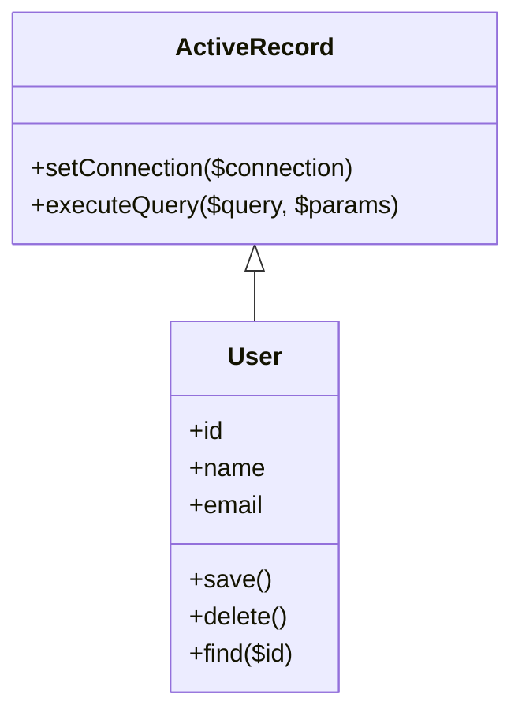

## 10.2 Active Record Pattern

The Active Record pattern is a popular design pattern used in software development to simplify database interactions. It provides a straightforward way to map database tables to objects, allowing developers to work with database records as if they were regular objects in their code. In this section, we'll explore the Active Record pattern in PHP, its implementation, and its use in popular frameworks like Laravel's Eloquent ORM.

### Intent

The primary intent of the Active Record pattern is to encapsulate database access within an object that represents a row in a database table or view. This pattern simplifies CRUD (Create, Read, Update, Delete) operations by providing methods for saving, updating, and deleting records directly on the object.

### Key Concepts

1. **Mapping Database Fields to Object Properties:** Each object in the Active Record pattern corresponds to a row in a database table, with object properties representing the columns of the table.

2. **CRUD Operations:** The pattern provides methods for common database operations, such as saving, updating, and deleting records, making it easier to interact with the database.

3. **Encapsulation:** By encapsulating database access within objects, the Active Record pattern promotes a clean separation of concerns, allowing developers to focus on business logic rather than database details.

### Implementing Active Record in PHP

To implement the Active Record pattern in PHP, follow these steps:

#### Step 1: Define a Base Active Record Class

Create a base class that provides common functionality for all Active Record objects. This class should include methods for connecting to the database, executing queries, and handling errors.

```php
<?php

class ActiveRecord
{
    protected static $connection;

    public static function setConnection($connection)
    {
        self::$connection = $connection;
    }

    protected function executeQuery($query, $params = [])
    {
        $stmt = self::$connection->prepare($query);
        $stmt->execute($params);
        return $stmt;
    }
}
```

#### Step 2: Create a Model Class for Each Table

For each database table, create a model class that extends the base Active Record class. Define properties for each column in the table and implement methods for CRUD operations.

```php
<?php

class User extends ActiveRecord
{
    public $id;
    public $name;
    public $email;

    public function save()
    {
        if ($this->id) {
            $query = "UPDATE users SET name = :name, email = :email WHERE id = :id";
            $params = ['name' => $this->name, 'email' => $this->email, 'id' => $this->id];
        } else {
            $query = "INSERT INTO users (name, email) VALUES (:name, :email)";
            $params = ['name' => $this->name, 'email' => $this->email];
        }
        $this->executeQuery($query, $params);
    }

    public function delete()
    {
        if ($this->id) {
            $query = "DELETE FROM users WHERE id = :id";
            $this->executeQuery($query, ['id' => $this->id]);
        }
    }

    public static function find($id)
    {
        $query = "SELECT * FROM users WHERE id = :id";
        $stmt = self::$connection->prepare($query);
        $stmt->execute(['id' => $id]);
        $result = $stmt->fetch(PDO::FETCH_ASSOC);
        if ($result) {
            $user = new self();
            $user->id = $result['id'];
            $user->name = $result['name'];
            $user->email = $result['email'];
            return $user;
        }
        return null;
    }
}
```

#### Step 3: Use the Model Classes

With the model classes in place, you can now interact with the database using object-oriented syntax.

```php
<?php

// Set up the database connection
$pdo = new PDO('mysql:host=localhost;dbname=testdb', 'username', 'password');
ActiveRecord::setConnection($pdo);

// Create a new user
$user = new User();
$user->name = 'John Doe';
$user->email = 'john.doe@example.com';
$user->save();

// Find a user by ID
$existingUser = User::find(1);
if ($existingUser) {
    echo "User found: " . $existingUser->name;
}

// Update a user
$existingUser->email = 'new.email@example.com';
$existingUser->save();

// Delete a user
$existingUser->delete();
```

### Framework Examples

One of the most popular implementations of the Active Record pattern in PHP is the Eloquent ORM, part of the Laravel framework. Eloquent provides a rich set of features that make working with databases in PHP both easy and enjoyable.

#### Eloquent ORM

Eloquent is an elegant and expressive ORM that allows you to interact with your database using Active Record-style syntax. It provides a simple and intuitive API for defining relationships, querying data, and performing CRUD operations.

**Link:** [Laravel Eloquent ORM](https://laravel.com/docs/eloquent)

Here's an example of how you might use Eloquent in a Laravel application:

```php
<?php

use App\Models\User;

// Create a new user
$user = new User();
$user->name = 'Jane Doe';
$user->email = 'jane.doe@example.com';
$user->save();

// Find a user by ID
$existingUser = User::find(1);
echo "User found: " . $existingUser->name;

// Update a user
$existingUser->email = 'updated.email@example.com';
$existingUser->save();

// Delete a user
$existingUser->delete();
```

### Diagrams

To better understand the Active Record pattern, let's visualize the relationship between the database and the Active Record objects using a class diagram.



### Key Participants

- **Active Record Base Class:** Provides common functionality for all Active Record objects, such as database connection and query execution.
- **Model Classes:** Represent individual database tables and encapsulate CRUD operations for each table.

### Applicability

The Active Record pattern is suitable for applications where:

- The database schema is relatively simple and stable.
- You want to quickly implement CRUD operations without writing complex SQL queries.
- You prefer a straightforward, object-oriented approach to database interaction.

### Design Considerations

When using the Active Record pattern, consider the following:

- **Performance:** The pattern may not be suitable for applications with complex queries or large datasets, as it can lead to performance issues.
- **Scalability:** As the application grows, maintaining Active Record models can become challenging, especially if the database schema changes frequently.
- **Testing:** Testing Active Record models can be more difficult compared to other patterns, as they often rely on a live database connection.

### PHP Unique Features

PHP offers several features that make implementing the Active Record pattern straightforward:

- **PDO (PHP Data Objects):** Provides a consistent interface for accessing different databases, making it easy to execute queries and handle errors.
- **Dynamic Properties:** PHP's dynamic typing allows you to easily map database fields to object properties without strict type enforcement.

### Differences and Similarities

The Active Record pattern is often compared to the Data Mapper pattern. While both patterns aim to simplify database interaction, they differ in their approach:

- **Active Record:** Encapsulates database access within the object itself, making it easy to perform CRUD operations directly on the object.
- **Data Mapper:** Separates the database access logic from the object, providing more flexibility and scalability for complex applications.

### Try It Yourself

To deepen your understanding of the Active Record pattern, try modifying the code examples provided. Here are a few suggestions:

- Add a new method to the `User` class to find users by email.
- Implement a method to retrieve all users from the database.
- Experiment with different database tables and models to see how the pattern adapts.

### Knowledge Check

Before moving on, take a moment to review what you've learned about the Active Record pattern. Consider the following questions:

- How does the Active Record pattern simplify database interaction?
- What are the key differences between the Active Record and Data Mapper patterns?
- How can you implement the Active Record pattern in a PHP application?

### Embrace the Journey

Remember, mastering design patterns like Active Record is just the beginning of your journey as a PHP developer. As you continue to learn and grow, you'll discover new patterns and techniques that will enhance your skills and make you a more effective developer. Keep experimenting, stay curious, and enjoy the journey!

## Quiz: Active Record Pattern



### What is the primary intent of the Active Record pattern?

- [x] To encapsulate database access within an object that represents a row in a database table.
- [ ] To separate database access logic from the object.
- [ ] To provide a consistent interface for accessing different databases.
- [ ] To improve performance for complex queries.

> **Explanation:** The Active Record pattern encapsulates database access within an object that represents a row in a database table, simplifying CRUD operations.

### Which PHP feature makes implementing the Active Record pattern straightforward?

- [x] PDO (PHP Data Objects)
- [ ] PHP's strict typing
- [ ] PHP's built-in ORM
- [ ] PHP's command-line interface

> **Explanation:** PDO provides a consistent interface for accessing different databases, making it easy to execute queries and handle errors.

### What is a key difference between the Active Record and Data Mapper patterns?

- [x] Active Record encapsulates database access within the object itself.
- [ ] Data Mapper encapsulates database access within the object itself.
- [ ] Active Record separates database access logic from the object.
- [ ] Data Mapper is only used in PHP.

> **Explanation:** The Active Record pattern encapsulates database access within the object itself, while the Data Mapper pattern separates the database access logic from the object.

### Which of the following is a potential drawback of the Active Record pattern?

- [x] Performance issues with complex queries or large datasets.
- [ ] Difficulty in implementing CRUD operations.
- [ ] Inability to use object-oriented syntax.
- [ ] Lack of support for dynamic properties.

> **Explanation:** The Active Record pattern can lead to performance issues with complex queries or large datasets, as it may not be optimized for such scenarios.

### How can you modify the `User` class to find users by email?

- [x] Add a new method that executes a query to find users by email.
- [ ] Modify the `save` method to include email search.
- [ ] Use a static property to store email addresses.
- [ ] Implement a new class for email search.

> **Explanation:** Adding a new method to the `User` class that executes a query to find users by email is a straightforward way to implement this functionality.

### What is a common use case for the Active Record pattern?

- [x] Applications with a simple and stable database schema.
- [ ] Applications with complex queries and large datasets.
- [ ] Applications that require strict type enforcement.
- [ ] Applications that do not use a database.

> **Explanation:** The Active Record pattern is suitable for applications with a simple and stable database schema, where quick implementation of CRUD operations is desired.

### Which framework provides an implementation of the Active Record pattern in PHP?

- [x] Laravel
- [ ] Symfony
- [ ] Zend Framework
- [ ] CodeIgniter

> **Explanation:** Laravel provides an implementation of the Active Record pattern through its Eloquent ORM.

### What is the role of the base Active Record class?

- [x] To provide common functionality for all Active Record objects.
- [ ] To define properties for each column in the table.
- [ ] To execute complex queries.
- [ ] To handle user authentication.

> **Explanation:** The base Active Record class provides common functionality for all Active Record objects, such as database connection and query execution.

### How does the Active Record pattern promote encapsulation?

- [x] By encapsulating database access within objects.
- [ ] By separating database access logic from objects.
- [ ] By enforcing strict type checking.
- [ ] By using global variables for database access.

> **Explanation:** The Active Record pattern promotes encapsulation by encapsulating database access within objects, allowing developers to focus on business logic.

### True or False: The Active Record pattern is always the best choice for database interaction in PHP.

- [ ] True
- [x] False

> **Explanation:** The Active Record pattern is not always the best choice for database interaction, especially in applications with complex queries or large datasets where performance and scalability are concerns.


