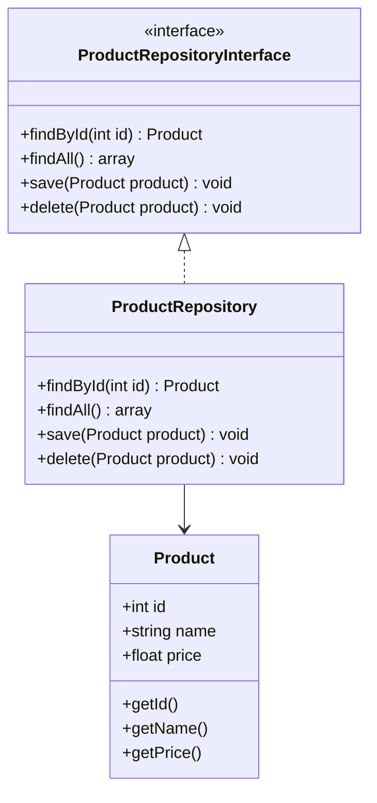

## 10.3 Repository Pattern

The Repository Pattern is a crucial design pattern in software development, particularly when dealing with data access and persistence. It acts as a mediator between the domain and data mapping layers, providing a collection-like interface for accessing domain objects. This pattern is especially beneficial in PHP applications, where it helps maintain a clean separation between business logic and data access code.

### Intent

The primary intent of the Repository Pattern is to abstract the data access layer, allowing the domain logic to remain agnostic of the underlying data source. This separation of concerns enhances the maintainability, scalability, and testability of the application.

### Key Participants

- **Repository Interface:** Defines the contract for data access operations.
- **Concrete Repository:** Implements the repository interface, handling the actual data retrieval and manipulation.
- **Domain Model:** Represents the business logic and entities of the application.
- **Data Source:** The underlying database or external data source.

### Applicability

The Repository Pattern is applicable in scenarios where:

- You need to separate domain logic from data access logic.
- The application requires a flexible data access layer that can be easily swapped or mocked.
- You want to enhance testability by isolating the domain logic from the data source.

### Implementing Repository in PHP

Let's dive into the implementation of the Repository Pattern in PHP. We'll create a simple application that manages a collection of `Product` entities. Our goal is to separate the domain logic from the data access logic using the Repository Pattern.

#### Step 1: Define the Domain Model

First, we define the `Product` class, which represents the domain model.

```php
<?php

class Product
{
    private int $id;
    private string $name;
    private float $price;

    public function __construct(int $id, string $name, float $price)
    {
        $this->id = $id;
        $this->name = $name;
        $this->price = $price;
    }

    public function getId(): int
    {
        return $this->id;
    }

    public function getName(): string
    {
        return $this->name;
    }

    public function getPrice(): float
    {
        return $this->price;
    }
}
```

#### Step 2: Create the Repository Interface

Next, we define the `ProductRepositoryInterface`, which outlines the contract for data access operations.

```php
<?php

interface ProductRepositoryInterface
{
    public function findById(int $id): ?Product;
    public function findAll(): array;
    public function save(Product $product): void;
    public function delete(Product $product): void;
}
```

#### Step 3: Implement the Concrete Repository

Now, we implement the `ProductRepositoryInterface` in a concrete class, `ProductRepository`. This class will handle the actual data retrieval and manipulation.

```php
<?php

class ProductRepository implements ProductRepositoryInterface
{
    private array $products = [];

    public function findById(int $id): ?Product
    {
        foreach ($this->products as $product) {
            if ($product->getId() === $id) {
                return $product;
            }
        }
        return null;
    }

    public function findAll(): array
    {
        return $this->products;
    }

    public function save(Product $product): void
    {
        $this->products[$product->getId()] = $product;
    }

    public function delete(Product $product): void
    {
        unset($this->products[$product->getId()]);
    }
}
```

#### Step 4: Using the Repository

With the repository in place, we can now use it to manage `Product` entities without worrying about the underlying data source.

```php
<?php

$productRepository = new ProductRepository();

// Create and save a new product
$product = new Product(1, "Laptop", 999.99);
$productRepository->save($product);

// Retrieve a product by ID
$retrievedProduct = $productRepository->findById(1);
echo $retrievedProduct->getName(); // Output: Laptop

// Delete a product
$productRepository->delete($product);
```

### Design Considerations

When implementing the Repository Pattern, consider the following:

- **Consistency:** Ensure that the repository interface provides a consistent and meaningful set of operations.
- **Performance:** Be mindful of performance implications, especially when dealing with large datasets.
- **Flexibility:** Design the repository to be flexible enough to accommodate changes in the data source or domain model.

### PHP Unique Features

PHP offers several unique features that can enhance the implementation of the Repository Pattern:

- **Type Declarations:** Use PHP's type declarations to enforce type safety in repository interfaces and implementations.
- **Anonymous Classes:** Leverage anonymous classes for quick prototyping or testing of repository implementations.
- **Traits:** Use traits to share common functionality across multiple repository implementations.

### Differences and Similarities

The Repository Pattern is often confused with the Data Access Object (DAO) pattern. While both patterns abstract data access, the Repository Pattern focuses on domain logic, whereas the DAO pattern is more concerned with the persistence mechanism.

### Use Cases and Examples

The Repository Pattern is widely used in PHP applications, particularly those that require a clean separation between domain logic and data access. Here are some common use cases:

- **Enhancing Testability:** By abstracting the data access layer, repositories can be easily mocked or stubbed in unit tests.
- **Supporting Multiple Data Sources:** Repositories can be designed to support multiple data sources, such as databases, APIs, or file systems.
- **Facilitating Domain-Driven Design (DDD):** The Repository Pattern aligns well with DDD principles, promoting a clear separation between domain and infrastructure concerns.

### Visualizing the Repository Pattern

To better understand the Repository Pattern, let's visualize its components and interactions using a class diagram.



### Try It Yourself

Now that we've covered the basics of the Repository Pattern, it's time to experiment with the code. Try modifying the `ProductRepository` to use a different data storage mechanism, such as a database or an external API. This exercise will help reinforce your understanding of the pattern and its flexibility.

### Knowledge Check

- What is the primary intent of the Repository Pattern?
- How does the Repository Pattern enhance testability?
- What are the key differences between the Repository Pattern and the DAO pattern?

### Embrace the Journey

Remember, mastering design patterns is a journey. As you continue to explore and implement the Repository Pattern in your PHP applications, you'll gain a deeper understanding of its benefits and nuances. Keep experimenting, stay curious, and enjoy the journey!

## Quiz: Repository Pattern



### What is the primary intent of the Repository Pattern?

- [x] To abstract the data access layer and separate it from domain logic.
- [ ] To provide a direct connection to the database.
- [ ] To enhance the performance of data retrieval.
- [ ] To simplify the user interface.

> **Explanation:** The Repository Pattern aims to abstract the data access layer, allowing the domain logic to remain agnostic of the underlying data source.

### How does the Repository Pattern enhance testability?

- [x] By allowing repositories to be easily mocked or stubbed in unit tests.
- [ ] By providing direct access to the database.
- [ ] By simplifying the user interface.
- [ ] By increasing the performance of data retrieval.

> **Explanation:** The Repository Pattern enhances testability by abstracting the data access layer, making it easier to mock or stub repositories in unit tests.

### What is a key difference between the Repository Pattern and the DAO pattern?

- [x] The Repository Pattern focuses on domain logic, while the DAO pattern focuses on persistence mechanisms.
- [ ] The Repository Pattern is used for user interfaces, while the DAO pattern is for databases.
- [ ] The Repository Pattern is faster than the DAO pattern.
- [ ] The Repository Pattern is simpler than the DAO pattern.

> **Explanation:** The Repository Pattern focuses on domain logic, whereas the DAO pattern is more concerned with the persistence mechanism.

### Which PHP feature can enhance the implementation of the Repository Pattern?

- [x] Type Declarations
- [ ] Global Variables
- [ ] Inline Styles
- [ ] Direct Database Connections

> **Explanation:** PHP's type declarations can enforce type safety in repository interfaces and implementations, enhancing the implementation of the Repository Pattern.

### What is a common use case for the Repository Pattern?

- [x] Enhancing testability by mocking repositories.
- [ ] Directly accessing the database.
- [ ] Simplifying the user interface.
- [ ] Increasing the performance of data retrieval.

> **Explanation:** A common use case for the Repository Pattern is enhancing testability by abstracting the data access layer, allowing repositories to be easily mocked or stubbed in unit tests.

### How can the Repository Pattern support multiple data sources?

- [x] By designing repositories to be flexible and adaptable to different data sources.
- [ ] By providing direct access to the database.
- [ ] By simplifying the user interface.
- [ ] By increasing the performance of data retrieval.

> **Explanation:** The Repository Pattern can support multiple data sources by designing repositories to be flexible and adaptable to different data sources, such as databases, APIs, or file systems.

### What is the role of the Repository Interface?

- [x] To define the contract for data access operations.
- [ ] To provide direct access to the database.
- [ ] To simplify the user interface.
- [ ] To increase the performance of data retrieval.

> **Explanation:** The Repository Interface defines the contract for data access operations, ensuring consistency and flexibility in the implementation of repositories.

### What is the benefit of using traits in PHP for the Repository Pattern?

- [x] To share common functionality across multiple repository implementations.
- [ ] To provide direct access to the database.
- [ ] To simplify the user interface.
- [ ] To increase the performance of data retrieval.

> **Explanation:** Traits in PHP can be used to share common functionality across multiple repository implementations, enhancing code reuse and maintainability.

### What is the main focus of the Repository Pattern?

- [x] Separating domain logic from data access logic.
- [ ] Simplifying the user interface.
- [ ] Increasing the performance of data retrieval.
- [ ] Providing direct access to the database.

> **Explanation:** The main focus of the Repository Pattern is to separate domain logic from data access logic, enhancing maintainability and testability.

### True or False: The Repository Pattern is only applicable to database interactions.

- [ ] True
- [x] False

> **Explanation:** False. The Repository Pattern is not limited to database interactions; it can be used with various data sources, such as APIs or file systems, to abstract data access and separate it from domain logic.




