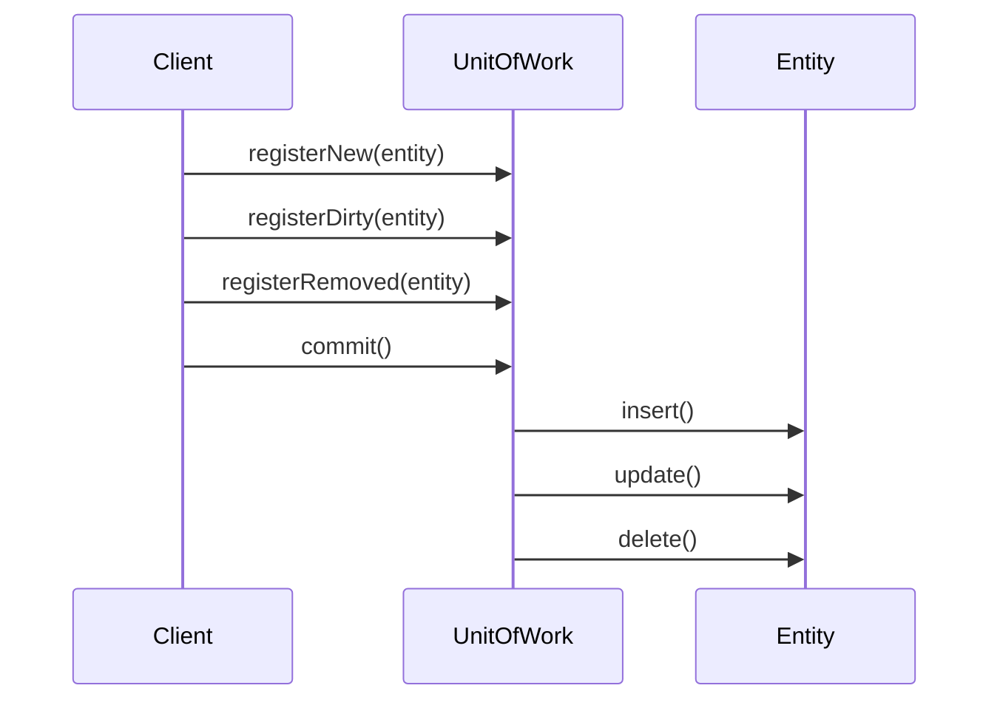

## 10.4 Unit of Work Pattern

The Unit of Work pattern is a powerful design pattern that plays a crucial role in managing business transactions and ensuring data integrity in PHP applications. By maintaining a list of objects affected by a business transaction and coordinating the writing out of changes, the Unit of Work pattern helps developers manage complex operations efficiently. In this comprehensive guide, we will explore the intent, implementation, and use cases of the Unit of Work pattern in PHP.

### Intent

The primary intent of the Unit of Work pattern is to maintain a list of objects affected by a business transaction and coordinate the writing out of changes. This pattern ensures that all changes to objects are tracked and committed in a single transaction, thereby maintaining data integrity and consistency.

### Key Concepts

- **Tracking Changes:** The Unit of Work pattern tracks changes to entities within a transaction. This includes new objects to be inserted, existing objects to be updated, and objects to be deleted.
- **Commitment of Changes:** Once the transaction is complete, the Unit of Work pattern commits all changes in a single transaction. This ensures that either all changes are applied, or none are, maintaining data consistency.
- **Rollback Mechanism:** If an error occurs during the transaction, the Unit of Work pattern provides a mechanism to rollback changes, ensuring that the database remains in a consistent state.

### Implementing Unit of Work in PHP

Implementing the Unit of Work pattern in PHP involves several steps. Let's explore these steps in detail.

#### 1. Define the Unit of Work Class

The Unit of Work class is responsible for tracking changes to entities and coordinating the commit process. It maintains lists of new, dirty (modified), and removed entities.

```php
<?php

class UnitOfWork
{
    private $newEntities = [];
    private $dirtyEntities = [];
    private $removedEntities = [];

    public function registerNew($entity)
    {
        $this->newEntities[] = $entity;
    }

    public function registerDirty($entity)
    {
        $this->dirtyEntities[] = $entity;
    }

    public function registerRemoved($entity)
    {
        $this->removedEntities[] = $entity;
    }

    public function commit()
    {
        // Begin transaction
        try {
            // Insert new entities
            foreach ($this->newEntities as $entity) {
                $entity->insert();
            }

            // Update dirty entities
            foreach ($this->dirtyEntities as $entity) {
                $entity->update();
            }

            // Delete removed entities
            foreach ($this->removedEntities as $entity) {
                $entity->delete();
            }

            // Commit transaction
        } catch (Exception $e) {
            // Rollback transaction
            throw $e;
        }
    }
}
```

#### 2. Entity Classes

Entities represent the objects that are tracked by the Unit of Work. Each entity class should implement methods for inserting, updating, and deleting records in the database.

```php
<?php

class Entity
{
    private $id;
    private $data;

    public function __construct($id, $data)
    {
        $this->id = $id;
        $this->data = $data;
    }

    public function insert()
    {
        // Insert logic
    }

    public function update()
    {
        // Update logic
    }

    public function delete()
    {
        // Delete logic
    }
}
```

#### 3. Using the Unit of Work

To use the Unit of Work pattern, create an instance of the UnitOfWork class and register entities as new, dirty, or removed. Finally, call the commit method to apply all changes.

```php
<?php

$unitOfWork = new UnitOfWork();

$newEntity = new Entity(null, 'new data');
$unitOfWork->registerNew($newEntity);

$dirtyEntity = new Entity(1, 'updated data');
$unitOfWork->registerDirty($dirtyEntity);

$removedEntity = new Entity(2, null);
$unitOfWork->registerRemoved($removedEntity);

$unitOfWork->commit();
```

### Use Cases and Examples

The Unit of Work pattern is particularly useful in scenarios where multiple changes need to be applied to a database in a single transaction. Let's explore some common use cases.

#### Ensuring Data Integrity in Complex Operations

In complex operations involving multiple entities, the Unit of Work pattern ensures that all changes are applied consistently. For example, in an e-commerce application, when a customer places an order, multiple entities such as Order, OrderItems, and Inventory need to be updated. The Unit of Work pattern ensures that all these changes are applied in a single transaction, maintaining data integrity.

#### Managing Transactions in Domain-Driven Design

In domain-driven design (DDD), the Unit of Work pattern is often used to manage transactions within an aggregate. An aggregate is a cluster of domain objects that can be treated as a single unit. The Unit of Work pattern ensures that all changes to the aggregate are applied in a single transaction.

### Visualizing the Unit of Work Pattern

To better understand the Unit of Work pattern, let's visualize its workflow using a sequence diagram.



### Design Considerations

When implementing the Unit of Work pattern, consider the following:

- **Transaction Management:** Ensure that transactions are managed correctly, with proper error handling and rollback mechanisms.
- **Performance:** Be mindful of performance implications, especially when dealing with a large number of entities.
- **Concurrency:** Consider concurrency issues and ensure that the Unit of Work pattern is thread-safe if used in a multi-threaded environment.

### PHP Unique Features

PHP offers several features that can be leveraged when implementing the Unit of Work pattern:

- **PDO (PHP Data Objects):** Use PDO for database interactions, providing a consistent interface for accessing databases.
- **Anonymous Functions and Closures:** Use closures to encapsulate transaction logic and error handling.
- **Traits:** Use traits to share common functionality across entity classes.

### Differences and Similarities

The Unit of Work pattern is often confused with the Repository pattern. While both patterns deal with data access, they serve different purposes:

- **Unit of Work:** Manages transactions and tracks changes to entities.
- **Repository:** Provides an abstraction for data access, encapsulating query logic.

### Try It Yourself

To deepen your understanding of the Unit of Work pattern, try modifying the code examples provided. Experiment with different scenarios, such as adding more entities or introducing errors to test the rollback mechanism.

### Knowledge Check

- What is the primary intent of the Unit of Work pattern?
- How does the Unit of Work pattern ensure data integrity?
- What are some common use cases for the Unit of Work pattern?
- How does the Unit of Work pattern differ from the Repository pattern?

### Embrace the Journey

Remember, mastering design patterns like the Unit of Work pattern is a journey. As you progress, you'll build more robust and maintainable PHP applications. Keep experimenting, stay curious, and enjoy the journey!

## Quiz: Unit of Work Pattern



### What is the primary intent of the Unit of Work pattern?

- [x] To maintain a list of objects affected by a business transaction and coordinate the writing out of changes.
- [ ] To provide an abstraction for data access.
- [ ] To encapsulate query logic.
- [ ] To manage database connections.

> **Explanation:** The Unit of Work pattern maintains a list of objects affected by a business transaction and coordinates the writing out of changes.

### How does the Unit of Work pattern ensure data integrity?

- [x] By committing all changes in a single transaction.
- [ ] By using multiple transactions for each change.
- [ ] By directly modifying the database.
- [ ] By using a separate transaction for each entity.

> **Explanation:** The Unit of Work pattern ensures data integrity by committing all changes in a single transaction.

### What is a common use case for the Unit of Work pattern?

- [x] Ensuring data integrity in complex operations.
- [ ] Managing database connections.
- [ ] Providing an abstraction for data access.
- [ ] Encapsulating query logic.

> **Explanation:** A common use case for the Unit of Work pattern is ensuring data integrity in complex operations.

### How does the Unit of Work pattern differ from the Repository pattern?

- [x] The Unit of Work pattern manages transactions, while the Repository pattern provides an abstraction for data access.
- [ ] The Unit of Work pattern provides an abstraction for data access, while the Repository pattern manages transactions.
- [ ] Both patterns serve the same purpose.
- [ ] The Unit of Work pattern is used for query logic, while the Repository pattern is used for transactions.

> **Explanation:** The Unit of Work pattern manages transactions, while the Repository pattern provides an abstraction for data access.

### What PHP feature can be used for database interactions in the Unit of Work pattern?

- [x] PDO (PHP Data Objects)
- [ ] mysqli
- [ ] cURL
- [ ] GD Library

> **Explanation:** PDO (PHP Data Objects) can be used for database interactions in the Unit of Work pattern.

### What mechanism does the Unit of Work pattern provide in case of an error during a transaction?

- [x] Rollback mechanism
- [ ] Retry mechanism
- [ ] Logging mechanism
- [ ] Notification mechanism

> **Explanation:** The Unit of Work pattern provides a rollback mechanism in case of an error during a transaction.

### What is the role of the UnitOfWork class in the Unit of Work pattern?

- [x] To track changes to entities and coordinate the commit process.
- [ ] To provide an abstraction for data access.
- [ ] To manage database connections.
- [ ] To encapsulate query logic.

> **Explanation:** The UnitOfWork class tracks changes to entities and coordinates the commit process.

### What type of entities does the Unit of Work pattern track?

- [x] New, dirty (modified), and removed entities.
- [ ] Only new entities.
- [ ] Only dirty (modified) entities.
- [ ] Only removed entities.

> **Explanation:** The Unit of Work pattern tracks new, dirty (modified), and removed entities.

### What is a key consideration when implementing the Unit of Work pattern?

- [x] Transaction management
- [ ] Query optimization
- [ ] Database indexing
- [ ] Connection pooling

> **Explanation:** Transaction management is a key consideration when implementing the Unit of Work pattern.

### True or False: The Unit of Work pattern is often used in domain-driven design to manage transactions within an aggregate.

- [x] True
- [ ] False

> **Explanation:** True. The Unit of Work pattern is often used in domain-driven design to manage transactions within an aggregate.


