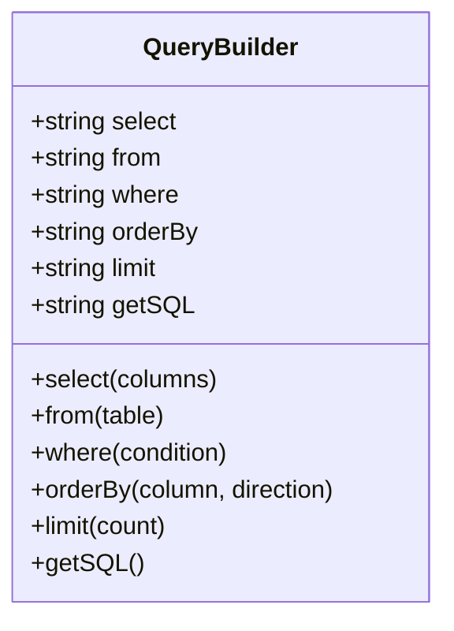

## 10.5 Query Builder Pattern

### Intent

The Query Builder Pattern provides a programmatic way to construct database queries. It abstracts the complexity of SQL syntax, allowing developers to build queries using a fluent API. This pattern enhances code readability, maintainability, and security by preventing SQL injection attacks.

### Introduction to Query Builder Pattern

In modern PHP applications, interacting with databases is a common requirement. While raw SQL queries offer flexibility, they can be error-prone and challenging to maintain. The Query Builder Pattern addresses these issues by providing a structured way to build queries programmatically.

### Implementing Query Builder in PHP

#### Method Chaining and Fluent Interfaces

The Query Builder Pattern often employs method chaining and fluent interfaces to construct queries. This approach allows developers to chain method calls in a readable and intuitive manner.

**Example:**

```php
$query = (new QueryBuilder())
    ->select('name', 'email')
    ->from('users')
    ->where('status', '=', 'active')
    ->orderBy('created_at', 'DESC')
    ->limit(10);
```

In this example, each method call returns the QueryBuilder instance, enabling a chain of calls that build the query step by step.

#### Key Components of a Query Builder

1. **Select**: Specifies the columns to retrieve.
2. **From**: Defines the table to query.
3. **Where**: Adds conditions to filter results.
4. **Order By**: Sorts the results.
5. **Limit**: Restricts the number of results.

### Framework Examples

#### Doctrine QueryBuilder

Doctrine's QueryBuilder is a powerful tool for building complex SQL queries. It supports a wide range of SQL operations and integrates seamlessly with Doctrine ORM.

**Link:** [Doctrine QueryBuilder](https://www.doctrine-project.org/projects/doctrine-dbal/en/latest/reference/query-builder.html)

**Example:**

```php
use Doctrine\DBAL\Query\QueryBuilder;

$queryBuilder = new QueryBuilder($connection);
$queryBuilder
    ->select('u.name', 'u.email')
    ->from('users', 'u')
    ->where('u.status = :status')
    ->setParameter(':status', 'active')
    ->orderBy('u.created_at', 'DESC')
    ->setMaxResults(10);

$sql = $queryBuilder->getSQL();
```

#### Laravel Query Builder

Laravel's Query Builder provides a fluent interface for building database queries. It supports a wide range of database operations and is highly expressive.

**Link:** [Laravel Query Builder](https://laravel.com/docs/queries)

**Example:**

```php
$users = DB::table('users')
    ->select('name', 'email')
    ->where('status', 'active')
    ->orderBy('created_at', 'desc')
    ->limit(10)
    ->get();
```

### Design Considerations

#### When to Use the Query Builder Pattern

- **Complex Queries**: When building complex queries with multiple conditions and joins.
- **Dynamic Queries**: When query conditions are determined at runtime.
- **Readability**: When improving code readability and maintainability is a priority.
- **Security**: To prevent SQL injection by using parameterized queries.

#### Important Considerations

- **Performance**: While query builders enhance readability, they may introduce a slight performance overhead compared to raw SQL.
- **Learning Curve**: Developers need to learn the specific API of the query builder being used.
- **Compatibility**: Ensure the query builder supports the database features required by your application.

### PHP Unique Features

PHP's dynamic nature and extensive library support make it an ideal language for implementing the Query Builder Pattern. Features like anonymous functions and closures can be leveraged to create powerful and flexible query builders.

### Differences and Similarities

The Query Builder Pattern is often compared to Object-Relational Mapping (ORM) patterns. While both abstract database interactions, query builders focus on constructing SQL queries, whereas ORMs map database tables to objects.

### Try It Yourself

Experiment with the following code example by modifying the query conditions and observing the generated SQL:

```php
$query = (new QueryBuilder())
    ->select('id', 'username')
    ->from('accounts')
    ->where('active', '=', true)
    ->orderBy('last_login', 'ASC')
    ->limit(5);

echo $query->getSQL();
```

### Visualizing the Query Builder Pattern



**Diagram Description:** This class diagram illustrates the structure of a QueryBuilder class, highlighting its methods and their return types.

### References and Links

- [Doctrine QueryBuilder Documentation](https://www.doctrine-project.org/projects/doctrine-dbal/en/latest/reference/query-builder.html)
- [Laravel Query Builder Documentation](https://laravel.com/docs/queries)
- [PHP Manual](https://www.php.net/manual/en/)

### Knowledge Check

- What are the benefits of using a query builder over raw SQL?
- How does method chaining enhance the readability of query builders?
- What are some common methods provided by query builders?

### Embrace the Journey

Remember, mastering the Query Builder Pattern is just one step in building robust PHP applications. As you continue to explore design patterns, you'll gain the skills needed to tackle complex database interactions with confidence. Keep experimenting, stay curious, and enjoy the journey!

## Quiz: Query Builder Pattern



### What is the primary intent of the Query Builder Pattern?

- [x] To provide an API to construct database queries programmatically.
- [ ] To execute raw SQL queries directly.
- [ ] To manage database connections.
- [ ] To handle database migrations.

> **Explanation:** The Query Builder Pattern is designed to provide a programmatic way to construct database queries, enhancing readability and security.

### Which PHP feature is commonly used in query builders to allow method chaining?

- [x] Fluent interfaces
- [ ] Anonymous functions
- [ ] Traits
- [ ] Namespaces

> **Explanation:** Fluent interfaces enable method chaining by returning the object itself from each method call.

### What is a key advantage of using a query builder?

- [x] Preventing SQL injection
- [ ] Faster execution than raw SQL
- [ ] Automatic database indexing
- [ ] Built-in caching

> **Explanation:** Query builders use parameterized queries, which help prevent SQL injection attacks.

### Which of the following is a popular PHP framework that includes a query builder?

- [x] Laravel
- [ ] Symfony
- [ ] Zend Framework
- [ ] CakePHP

> **Explanation:** Laravel includes a powerful query builder that provides a fluent interface for constructing database queries.

### What method is used to specify the table to query in a query builder?

- [x] from()
- [ ] select()
- [ ] where()
- [ ] limit()

> **Explanation:** The `from()` method is used to specify the table from which to retrieve data.

### How does a query builder enhance code maintainability?

- [x] By providing a structured and readable way to build queries
- [ ] By automatically optimizing queries
- [ ] By generating database schemas
- [ ] By handling database migrations

> **Explanation:** Query builders enhance maintainability by providing a clear and structured way to construct queries, making the code easier to read and modify.

### Which method is used to add conditions to a query in a query builder?

- [x] where()
- [ ] select()
- [ ] from()
- [ ] orderBy()

> **Explanation:** The `where()` method is used to add conditions to filter the results of a query.

### What is a potential drawback of using a query builder?

- [x] Slight performance overhead compared to raw SQL
- [ ] Increased risk of SQL injection
- [ ] Lack of support for complex queries
- [ ] Difficulty in learning SQL syntax

> **Explanation:** Query builders may introduce a slight performance overhead due to the abstraction layer, but they enhance security and readability.

### True or False: Query builders can only be used with relational databases.

- [ ] True
- [x] False

> **Explanation:** While query builders are commonly used with relational databases, they can also be adapted for use with other types of databases.

### Which method is used to limit the number of results returned by a query builder?

- [x] limit()
- [ ] select()
- [ ] where()
- [ ] orderBy()

> **Explanation:** The `limit()` method is used to restrict the number of results returned by a query.


