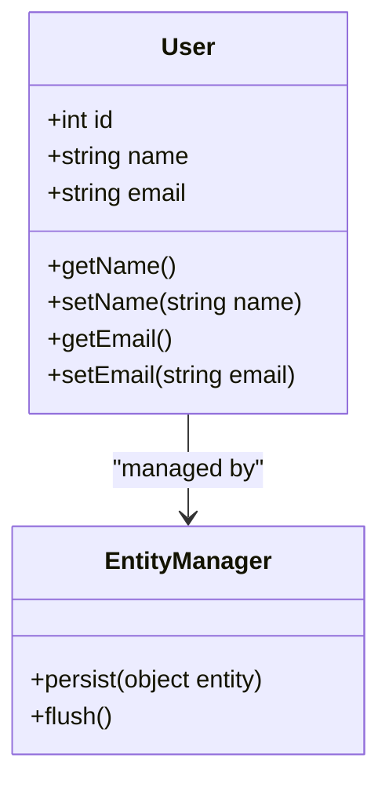

## 10.6 Object-Relational Mapping (ORM) in PHP

Object-Relational Mapping (ORM) is a programming technique used to convert data between incompatible systems, specifically between object-oriented programming languages and relational databases. In PHP, ORM provides a way to interact with database records as if they were PHP objects, abstracting the complexities of database interactions and allowing developers to work with data in a more intuitive and object-oriented manner.

### Intent of ORM

The primary intent of ORM is to bridge the gap between the object-oriented world of PHP and the relational world of databases. This is achieved by:

- **Mapping Database Tables to PHP Classes:** Each table in the database is represented as a class in PHP, with rows as instances of that class.
- **Automating CRUD Operations:** ORM tools automate the creation, retrieval, update, and deletion (CRUD) of database records.
- **Providing a Query Language:** Many ORM tools offer a query language or methods that allow developers to build database queries using PHP syntax.

### Popular PHP ORM Tools

#### Doctrine ORM

Doctrine ORM is a powerful and flexible ORM tool for PHP, widely used in enterprise applications. It provides a comprehensive set of features for managing database interactions.

- **Link:** [Doctrine ORM](https://www.doctrine-project.org/projects/orm.html)

#### Eloquent ORM

Eloquent ORM is the default ORM for the Laravel framework. It is known for its simplicity and ease of use, making it a popular choice for developers working with Laravel.

- **Link:** [Laravel Eloquent ORM](https://laravel.com/docs/eloquent)

### Features of ORM

- **Data Mapping:** Automatically maps database tables to PHP classes and vice versa.
- **Data Manipulation:** Provides methods for manipulating data, such as saving, updating, and deleting records.
- **Relationships:** Supports defining relationships between different tables, such as one-to-one, one-to-many, and many-to-many.
- **Lazy Loading:** Loads related data only when it is accessed, improving performance.
- **Eager Loading:** Allows preloading of related data to reduce the number of database queries.
- **Transactions:** Supports database transactions to ensure data integrity.

### Key Participants in ORM

- **Entity:** Represents a table in the database. Each instance of an entity corresponds to a row in the table.
- **Entity Manager:** Manages the lifecycle of entities, including persisting, retrieving, and removing them.
- **Repository:** Provides a collection-like interface for accessing entities.
- **Unit of Work:** Tracks changes to entities and coordinates the writing of changes to the database.

### Applicability of ORM

ORM is applicable in scenarios where:

- You need to interact with a relational database using an object-oriented approach.
- You want to reduce the amount of boilerplate code required for database interactions.
- You need to manage complex relationships between data entities.
- You require a consistent and maintainable way to handle database operations.

### Sample Code Snippet

Let's explore a simple example using Doctrine ORM to demonstrate how ORM works in PHP.

```php
<?php

use Doctrine\ORM\Tools\Setup;
use Doctrine\ORM\EntityManager;
use Doctrine\ORM\Mapping as ORM;

/**
 * @ORM\Entity
 * @ORM\Table(name="users")
 */
class User
{
    /** 
     * @ORM\Id 
     * @ORM\Column(type="integer") 
     * @ORM\GeneratedValue 
     */
    private $id;

    /** @ORM\Column(type="string") */
    private $name;

    /** @ORM\Column(type="string") */
    private $email;

    // Getters and setters...
}

// Bootstrap Doctrine
$config = Setup::createAnnotationMetadataConfiguration(array(__DIR__."/src"), true);
$conn = array(
    'driver' => 'pdo_mysql',
    'user' => 'root',
    'password' => '',
    'dbname' => 'mydb',
);

$entityManager = EntityManager::create($conn, $config);

// Create a new user
$user = new User();
$user->setName('John Doe');
$user->setEmail('john.doe@example.com');

// Persist the user to the database
$entityManager->persist($user);
$entityManager->flush();

echo "User created with ID " . $user->getId();
```

### Design Considerations

When using ORM, consider the following:

- **Performance:** ORM can introduce overhead, especially with complex queries. Use profiling tools to identify and optimize slow queries.
- **Complex Queries:** While ORM simplifies many database operations, complex queries may still require raw SQL for optimal performance.
- **Learning Curve:** Understanding the ORM's API and configuration can take time, especially for complex applications.

### PHP Unique Features

PHP's dynamic nature and extensive support for various database extensions make it a suitable language for implementing ORM. PHP's support for annotations and attributes (introduced in PHP 8) enhances ORM tools like Doctrine, which rely on metadata for mapping.

### Differences and Similarities

ORM is often compared to other data access patterns, such as Active Record. While both patterns aim to simplify database interactions, ORM provides a more comprehensive abstraction layer, supporting complex relationships and advanced features like lazy loading and transactions.

### Visualizing ORM in PHP

To better understand how ORM works, let's visualize the relationship between PHP objects and database tables using a class diagram.



### Try It Yourself

Experiment with the provided code example by:

- Adding new fields to the `User` class and updating the database schema.
- Implementing a `findByEmail` method in the `UserRepository` to retrieve users by email.
- Exploring the use of transactions to ensure data consistency during multiple operations.

### References and Links

- [Doctrine ORM Documentation](https://www.doctrine-project.org/projects/orm.html)
- [Laravel Eloquent ORM Documentation](https://laravel.com/docs/eloquent)
- [PHP Manual: PDO](https://www.php.net/manual/en/book.pdo.php)

### Knowledge Check

- What are the key benefits of using ORM in PHP?
- How does ORM handle relationships between tables?
- What are some potential drawbacks of using ORM?

### Embrace the Journey

Remember, mastering ORM is a journey. As you become more familiar with ORM tools and techniques, you'll be able to build more robust and maintainable applications. Keep experimenting, stay curious, and enjoy the process of learning and growing as a PHP developer!

## Quiz: Object-Relational Mapping (ORM) in PHP



### What is the primary purpose of ORM in PHP?

- [x] To map database tables to PHP classes
- [ ] To generate SQL queries automatically
- [ ] To replace the need for databases
- [ ] To enhance PHP's performance

> **Explanation:** ORM's primary purpose is to map database tables to PHP classes, allowing developers to interact with database records as objects.

### Which of the following is a popular ORM tool in PHP?

- [x] Doctrine ORM
- [ ] MySQLi
- [ ] PDO
- [ ] Redis

> **Explanation:** Doctrine ORM is a popular ORM tool in PHP, providing a comprehensive set of features for managing database interactions.

### What is lazy loading in the context of ORM?

- [x] Loading related data only when accessed
- [ ] Preloading all data at once
- [ ] Loading data in the background
- [ ] Loading data on a separate thread

> **Explanation:** Lazy loading refers to loading related data only when it is accessed, which can improve performance by reducing unnecessary data retrieval.

### Which PHP feature enhances ORM tools like Doctrine?

- [x] Annotations and attributes
- [ ] Global variables
- [ ] Magic methods
- [ ] Static functions

> **Explanation:** Annotations and attributes in PHP enhance ORM tools like Doctrine by providing a way to define metadata for mapping.

### What is a potential drawback of using ORM?

- [x] Performance overhead
- [ ] Lack of support for transactions
- [ ] Inability to handle complex queries
- [ ] Limited database compatibility

> **Explanation:** ORM can introduce performance overhead, especially with complex queries, due to the abstraction layer it provides.

### How does ORM handle CRUD operations?

- [x] Automates them through methods
- [ ] Requires manual SQL queries
- [ ] Uses stored procedures
- [ ] Delegates to a separate service

> **Explanation:** ORM automates CRUD operations through methods, allowing developers to interact with database records using PHP syntax.

### What is the role of the Entity Manager in ORM?

- [x] Manages the lifecycle of entities
- [ ] Generates SQL queries
- [ ] Handles database connections
- [ ] Provides a user interface

> **Explanation:** The Entity Manager in ORM manages the lifecycle of entities, including persisting, retrieving, and removing them.

### Which relationship type is supported by ORM?

- [x] One-to-many
- [ ] One-to-one
- [ ] Many-to-many
- [ ] All of the above

> **Explanation:** ORM supports various relationship types, including one-to-one, one-to-many, and many-to-many.

### What is eager loading in ORM?

- [x] Preloading related data
- [ ] Loading data on demand
- [ ] Loading data in the background
- [ ] Loading data on a separate thread

> **Explanation:** Eager loading refers to preloading related data to reduce the number of database queries.

### True or False: ORM eliminates the need for SQL in PHP applications.

- [ ] True
- [x] False

> **Explanation:** While ORM simplifies database interactions, it does not eliminate the need for SQL entirely, especially for complex queries.




