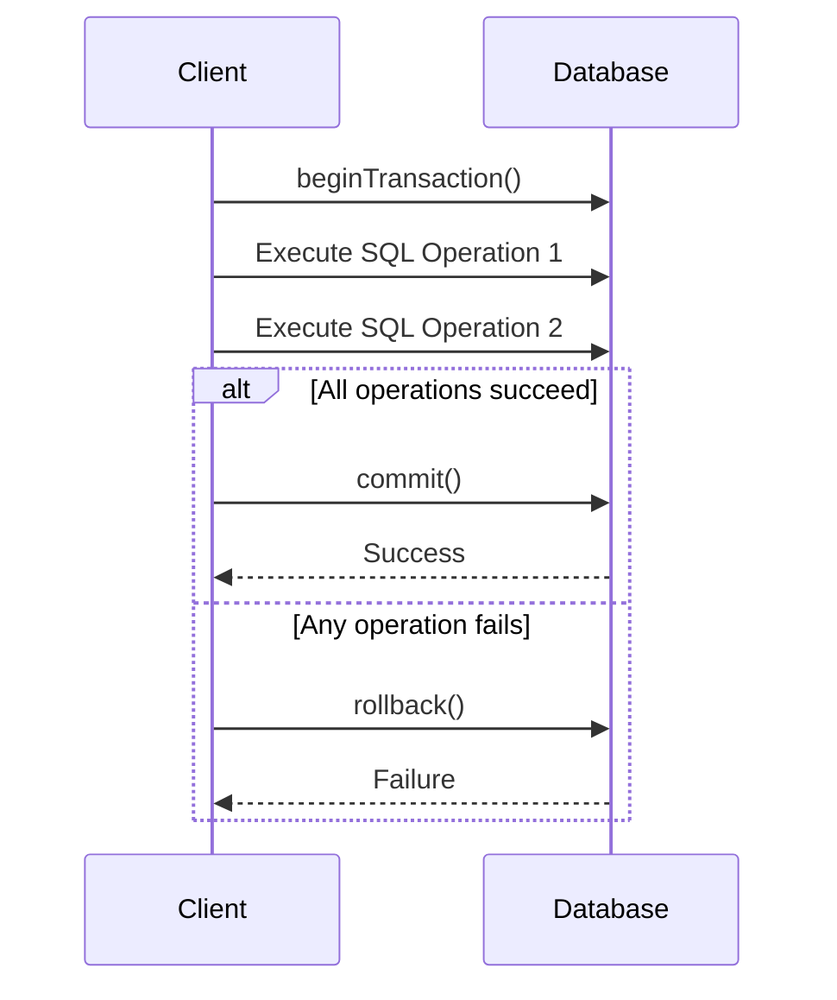

## 10.7 Managing Transactions

In the realm of database interactions, managing transactions is a crucial aspect that ensures data integrity and consistency. Transactions allow us to execute a series of operations as a single unit of work, guaranteeing that either all operations succeed or none at all. This concept is fundamental in scenarios where data consistency is paramount, such as financial applications, order processing systems, and any application where multiple related operations must be executed atomically.

### Understanding Transactions

A transaction is a sequence of one or more SQL operations that are executed as a single unit. The primary properties of transactions are encapsulated in the ACID acronym:

- **Atomicity:** Ensures that all operations within a transaction are completed successfully. If any operation fails, the entire transaction is rolled back.
- **Consistency:** Guarantees that a transaction will bring the database from one valid state to another, maintaining database invariants.
- **Isolation:** Ensures that concurrent transactions do not affect each other, providing the illusion that each transaction is the only one operating on the database.
- **Durability:** Once a transaction is committed, the changes are permanent, even in the event of a system failure.

### Implementing Transactions in PHP

PHP provides robust support for managing transactions through its PDO (PHP Data Objects) extension. PDO offers a consistent interface for accessing databases and includes methods for handling transactions. Let's explore how to implement transactions using PDO.

#### Establishing a Database Connection

Before we can manage transactions, we need to establish a connection to the database using PDO. Here's a basic example:

```php
<?php
try {
    $dsn = 'mysql:host=localhost;dbname=testdb';
    $username = 'root';
    $password = '';
    $options = [
        PDO::ATTR_ERRMODE => PDO::ERRMODE_EXCEPTION,
        PDO::ATTR_DEFAULT_FETCH_MODE => PDO::FETCH_ASSOC,
    ];

    $pdo = new PDO($dsn, $username, $password, $options);
} catch (PDOException $e) {
    echo 'Connection failed: ' . $e->getMessage();
}
?>
```

#### Starting a Transaction

To begin a transaction, we use the `beginTransaction()` method. This signals the database to start a new transaction.

```php
<?php
$pdo->beginTransaction();
```

#### Committing a Transaction

Once all operations within the transaction are successful, we commit the transaction using the `commit()` method. This makes all changes permanent.

```php
<?php
$pdo->commit();
```

#### Rolling Back a Transaction

If any operation within the transaction fails, we can roll back the transaction using the `rollback()` method. This undoes all changes made during the transaction.

```php
<?php
$pdo->rollback();
```

#### Complete Example

Let's put it all together in a complete example. Suppose we have a scenario where we need to transfer funds between two accounts. This operation involves debiting one account and crediting another, and both operations must succeed or fail together.

```php
<?php
try {
    $pdo->beginTransaction();

    // Debit from account A
    $stmt = $pdo->prepare("UPDATE accounts SET balance = balance - :amount WHERE account_id = :account_id");
    $stmt->execute(['amount' => 100, 'account_id' => 1]);

    // Credit to account B
    $stmt = $pdo->prepare("UPDATE accounts SET balance = balance + :amount WHERE account_id = :account_id");
    $stmt->execute(['amount' => 100, 'account_id' => 2]);

    // Commit the transaction
    $pdo->commit();
    echo "Transaction completed successfully.";
} catch (Exception $e) {
    // Rollback the transaction if any operation fails
    $pdo->rollback();
    echo "Transaction failed: " . $e->getMessage();
}
?>
```

### Use Cases and Examples

Transactions are indispensable in scenarios where multiple operations must be executed atomically. Here are some common use cases:

- **Financial Transactions:** Ensuring that debits and credits are processed together.
- **Order Processing:** Updating inventory, recording the order, and processing payment as a single unit.
- **Batch Processing:** Applying a series of updates or inserts that must all succeed or fail together.

### Visualizing Transaction Management

To better understand the flow of transaction management, let's visualize the process using a sequence diagram.



### Key Considerations

When managing transactions, there are several important considerations to keep in mind:

- **Error Handling:** Always include error handling to manage exceptions and ensure that transactions are rolled back in case of failure.
- **Isolation Levels:** Different databases support various isolation levels that affect how transactions interact with each other. Choose the appropriate level based on your application's requirements.
- **Performance:** Transactions can lock resources, impacting performance. Use them judiciously and keep transactions as short as possible.

### PHP Unique Features

PHP's PDO extension provides a consistent interface for managing transactions across different database systems. It abstracts the underlying database-specific transaction management, allowing developers to write database-agnostic code.

### Differences and Similarities

Transactions are a common concept across different programming languages and database systems. While the implementation details may vary, the core principles of atomicity, consistency, isolation, and durability remain the same.

### Try It Yourself

To deepen your understanding, try modifying the code example to handle different scenarios, such as:

- Introducing a deliberate error in one of the SQL operations to see how the rollback mechanism works.
- Adding additional operations within the transaction to simulate a more complex workflow.
- Experimenting with different isolation levels if your database supports them.

### Knowledge Check

- What are the four properties of a transaction encapsulated in the ACID acronym?
- How does the `rollback()` method ensure data integrity?
- Why is it important to handle exceptions when managing transactions?

### Embrace the Journey

Remember, mastering transactions is a key skill in developing robust and reliable applications. As you continue to explore PHP and database interactions, keep experimenting, stay curious, and enjoy the journey!

## Quiz: Managing Transactions



### What does the `beginTransaction()` method do in PHP?

- [x] Starts a new transaction
- [ ] Commits the current transaction
- [ ] Rolls back the current transaction
- [ ] Ends the current transaction

> **Explanation:** The `beginTransaction()` method is used to start a new transaction in PHP.

### Which method is used to make changes permanent in a transaction?

- [ ] beginTransaction()
- [x] commit()
- [ ] rollback()
- [ ] savepoint()

> **Explanation:** The `commit()` method is used to make all changes within a transaction permanent.

### What happens if an exception occurs during a transaction?

- [ ] The transaction is automatically committed
- [x] The transaction should be rolled back
- [ ] The transaction continues as normal
- [ ] The transaction is paused

> **Explanation:** If an exception occurs, the transaction should be rolled back to maintain data integrity.

### What is the primary purpose of using transactions in database operations?

- [ ] To improve performance
- [x] To ensure atomicity and consistency
- [ ] To simplify code
- [ ] To reduce database size

> **Explanation:** Transactions ensure that a series of operations are executed atomically and consistently.

### Which of the following is NOT a property of transactions?

- [ ] Atomicity
- [ ] Consistency
- [ ] Isolation
- [x] Scalability

> **Explanation:** Scalability is not a property of transactions; the properties are Atomicity, Consistency, Isolation, and Durability (ACID).

### What does the `rollback()` method do?

- [ ] Starts a new transaction
- [ ] Commits the current transaction
- [x] Reverts changes made during the transaction
- [ ] Ends the current transaction

> **Explanation:** The `rollback()` method reverts all changes made during the transaction.

### Which PHP extension is commonly used for managing transactions?

- [x] PDO
- [ ] MySQLi
- [ ] GD
- [ ] cURL

> **Explanation:** PDO (PHP Data Objects) is commonly used for managing transactions in PHP.

### What is the effect of a `commit()` operation?

- [ ] It starts a new transaction
- [x] It makes all changes permanent
- [ ] It reverts all changes
- [ ] It pauses the transaction

> **Explanation:** The `commit()` operation makes all changes within a transaction permanent.

### Why is it important to keep transactions short?

- [ ] To reduce code complexity
- [x] To minimize resource locking and improve performance
- [ ] To simplify error handling
- [ ] To ensure data integrity

> **Explanation:** Keeping transactions short minimizes resource locking and improves performance.

### True or False: Transactions can help prevent data corruption in concurrent environments.

- [x] True
- [ ] False

> **Explanation:** Transactions help prevent data corruption by ensuring atomicity and isolation in concurrent environments.




