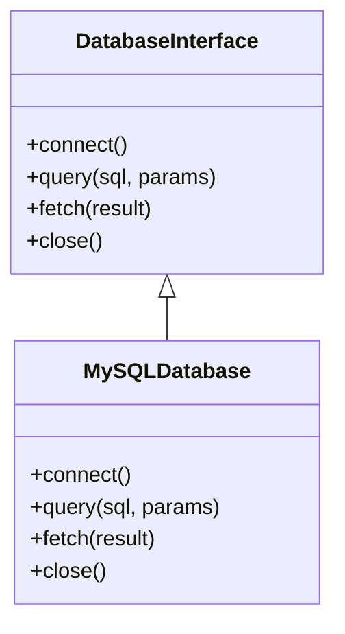

## 10.8 Database Abstraction Layers

In the world of software development, interacting with databases is a fundamental aspect of building dynamic applications. However, the diversity of database systems and their unique interfaces can pose challenges for developers seeking to create flexible and maintainable code. This is where database abstraction layers come into play. In this section, we will explore the concept of database abstraction layers in PHP, their benefits, and how to implement them effectively.

### Intent

The primary intent of a database abstraction layer is to provide a consistent API for interacting with different types of databases. This abstraction allows developers to switch between various database systems with minimal code changes, enhancing the portability and flexibility of applications.

### Understanding Database Abstraction Layers

A database abstraction layer acts as an intermediary between the application code and the database system. It abstracts the underlying database-specific details, providing a unified interface for executing queries, managing connections, and handling transactions. By doing so, it decouples the application logic from the specifics of the database, allowing for easier maintenance and scalability.

### Key Benefits of Database Abstraction Layers

1. **Portability:** By using a database abstraction layer, you can switch between different database systems (e.g., MySQL, PostgreSQL, SQLite) without rewriting significant portions of your codebase.

2. **Flexibility:** Abstraction layers provide a flexible API that can accommodate various database features and functionalities, allowing developers to leverage the strengths of different systems.

3. **Maintainability:** With a consistent interface, maintaining and updating database interactions becomes more straightforward, reducing the risk of introducing errors during changes.

4. **Security:** Abstraction layers often include built-in mechanisms for preventing SQL injection attacks and other common security vulnerabilities.

5. **Simplified Codebase:** By abstracting database interactions, the codebase becomes cleaner and more organized, making it easier to understand and extend.

### Using Abstraction Layers in PHP

PHP offers several options for implementing database abstraction layers, with PDO (PHP Data Objects) being one of the most popular choices. Let's explore PDO and other alternatives in detail.

#### PDO (PHP Data Objects)

PDO is a lightweight, consistent interface for accessing databases in PHP. It supports a wide range of database systems, including MySQL, PostgreSQL, SQLite, and more. PDO provides a unified API for executing queries, managing connections, and handling transactions.

**Key Features of PDO:**

- **Database Independence:** PDO allows you to switch between different database systems by simply changing the connection string.
- **Prepared Statements:** PDO supports prepared statements, which help prevent SQL injection attacks by separating SQL logic from data.
- **Error Handling:** PDO provides robust error handling mechanisms, allowing developers to catch and handle exceptions effectively.

**Example: Connecting to a Database Using PDO**

```php
<?php
// Database connection parameters
$dsn = 'mysql:host=localhost;dbname=testdb';
$username = 'root';
$password = '';

try {
    // Create a new PDO instance
    $pdo = new PDO($dsn, $username, $password);

    // Set error mode to exception
    $pdo->setAttribute(PDO::ATTR_ERRMODE, PDO::ERRMODE_EXCEPTION);

    echo "Connected successfully!";
} catch (PDOException $e) {
    echo "Connection failed: " . $e->getMessage();
}
?>
```

**Example: Executing a Query with PDO**

```php
<?php
// Prepare a SQL statement
$sql = 'SELECT * FROM users WHERE email = :email';

// Prepare the statement
$stmt = $pdo->prepare($sql);

// Bind parameters
$email = 'example@example.com';
$stmt->bindParam(':email', $email);

// Execute the statement
$stmt->execute();

// Fetch results
$results = $stmt->fetchAll(PDO::FETCH_ASSOC);

foreach ($results as $row) {
    echo $row['name'] . "<br>";
}
?>
```

#### Other Database Abstraction Libraries

While PDO is a powerful tool, there are other libraries and frameworks in PHP that offer database abstraction capabilities. Some of these include:

- **Doctrine DBAL:** A powerful database abstraction layer that provides additional features such as schema management and query building. [Doctrine DBAL](https://www.doctrine-project.org/projects/doctrine-dbal/en/latest/)

- **Eloquent ORM:** Part of the Laravel framework, Eloquent provides an elegant and expressive syntax for interacting with databases. [Eloquent ORM](https://laravel.com/docs/eloquent)

- **Propel ORM:** An open-source ORM for PHP that provides a powerful query builder and schema management tools. [Propel ORM](https://propelorm.org/)

### Implementing a Custom Database Abstraction Layer

In some cases, you may need to implement a custom database abstraction layer to meet specific requirements. Let's walk through the process of creating a simple abstraction layer in PHP.

**Step 1: Define an Interface**

Start by defining an interface that outlines the methods your abstraction layer will provide. This ensures consistency and allows for easy swapping of implementations.

```php
<?php
interface DatabaseInterface {
    public function connect();
    public function query($sql, $params = []);
    public function fetch($result);
    public function close();
}
?>
```

**Step 2: Implement the Interface**

Create a class that implements the interface and provides the actual database interaction logic.

```php
<?php
class MySQLDatabase implements DatabaseInterface {
    private $connection;

    public function connect() {
        $this->connection = new PDO('mysql:host=localhost;dbname=testdb', 'root', '');
        $this->connection->setAttribute(PDO::ATTR_ERRMODE, PDO::ERRMODE_EXCEPTION);
    }

    public function query($sql, $params = []) {
        $stmt = $this->connection->prepare($sql);
        $stmt->execute($params);
        return $stmt;
    }

    public function fetch($result) {
        return $result->fetchAll(PDO::FETCH_ASSOC);
    }

    public function close() {
        $this->connection = null;
    }
}
?>
```

**Step 3: Use the Abstraction Layer**

Now you can use your custom abstraction layer to interact with the database.

```php
<?php
$db = new MySQLDatabase();
$db->connect();

$result = $db->query('SELECT * FROM users WHERE email = :email', ['email' => 'example@example.com']);
$users = $db->fetch($result);

foreach ($users as $user) {
    echo $user['name'] . "<br>";
}

$db->close();
?>
```

### Design Considerations

When implementing a database abstraction layer, consider the following:

- **Performance:** Abstraction layers can introduce overhead, so ensure that your implementation is optimized for performance.
- **Complexity:** Keep the abstraction layer simple and focused on providing a consistent API. Avoid adding unnecessary complexity.
- **Extensibility:** Design your abstraction layer to be extensible, allowing for easy addition of new features or support for additional database systems.

### PHP Unique Features

PHP offers several unique features that can enhance the implementation of database abstraction layers:

- **PDO Extensions:** PHP's PDO extensions provide a robust foundation for building abstraction layers, with support for multiple database systems and advanced features like prepared statements.
- **Traits:** Use PHP traits to share common functionality across different database implementations, reducing code duplication.
- **Namespaces:** Organize your abstraction layer code using namespaces to avoid naming conflicts and improve code organization.

### Differences and Similarities

Database abstraction layers are often confused with Object-Relational Mapping (ORM) systems. While both provide a level of abstraction, they serve different purposes:

- **Database Abstraction Layers:** Focus on providing a consistent API for interacting with different database systems.
- **ORM Systems:** Provide a higher level of abstraction, mapping database tables to objects and offering additional features like relationships and lazy loading.

### Visualizing Database Abstraction Layers

To better understand the concept of database abstraction layers, let's visualize the architecture using a class diagram.



**Diagram Description:** The class diagram above illustrates the relationship between the `DatabaseInterface` and the `MySQLDatabase` class. The `MySQLDatabase` class implements the `DatabaseInterface`, providing concrete implementations for the methods defined in the interface.

### Try It Yourself

Now that we've covered the basics of database abstraction layers, it's time to experiment with the code examples provided. Try modifying the connection parameters to connect to a different database system, or extend the `DatabaseInterface` to include additional methods for handling transactions.

### Knowledge Check

- Explain the primary intent of a database abstraction layer.
- What are the benefits of using PDO in PHP?
- How does a database abstraction layer differ from an ORM system?
- Implement a custom database abstraction layer for a different database system (e.g., PostgreSQL).

### Embrace the Journey

Remember, mastering database abstraction layers is just one step in your journey as a PHP developer. As you continue to explore and experiment, you'll discover new ways to create flexible and maintainable applications. Keep learning, stay curious, and enjoy the process!

## Quiz: Database Abstraction Layers



### What is the primary intent of a database abstraction layer?

- [x] To provide a consistent API for interacting with different types of databases.
- [ ] To improve the performance of database queries.
- [ ] To replace the need for SQL in applications.
- [ ] To enforce strict data validation rules.

> **Explanation:** The primary intent of a database abstraction layer is to provide a consistent API for interacting with different types of databases, allowing for easier switching between systems.

### Which PHP extension is commonly used for database abstraction?

- [x] PDO (PHP Data Objects)
- [ ] MySQLi
- [ ] GD
- [ ] cURL

> **Explanation:** PDO (PHP Data Objects) is a popular PHP extension used for database abstraction, providing a consistent interface for accessing various database systems.

### What is a key benefit of using prepared statements in PDO?

- [x] They help prevent SQL injection attacks.
- [ ] They automatically optimize database queries.
- [ ] They eliminate the need for database connections.
- [ ] They provide a graphical interface for database management.

> **Explanation:** Prepared statements in PDO help prevent SQL injection attacks by separating SQL logic from data, ensuring that user input is safely handled.

### How does a database abstraction layer differ from an ORM system?

- [x] Abstraction layers provide a consistent API, while ORM systems map tables to objects.
- [ ] Abstraction layers are faster than ORM systems.
- [ ] ORM systems are only used for NoSQL databases.
- [ ] Abstraction layers require more code than ORM systems.

> **Explanation:** Database abstraction layers provide a consistent API for interacting with databases, while ORM systems map database tables to objects and offer additional features like relationships.

### Which of the following is a benefit of using a database abstraction layer?

- [x] Portability
- [x] Flexibility
- [ ] Increased complexity
- [ ] Reduced security

> **Explanation:** Database abstraction layers offer benefits like portability and flexibility, allowing applications to switch between different database systems with minimal changes.

### What is the role of the `DatabaseInterface` in the custom abstraction layer example?

- [x] It defines the methods that must be implemented by any database class.
- [ ] It provides a default implementation for database interactions.
- [ ] It handles all database connections automatically.
- [ ] It stores database credentials securely.

> **Explanation:** The `DatabaseInterface` defines the methods that must be implemented by any database class, ensuring consistency and allowing for easy swapping of implementations.

### Which PHP feature can be used to share common functionality across different database implementations?

- [x] Traits
- [ ] Interfaces
- [ ] Classes
- [ ] Functions

> **Explanation:** PHP traits can be used to share common functionality across different database implementations, reducing code duplication and improving maintainability.

### What is a potential drawback of using a database abstraction layer?

- [x] It can introduce performance overhead.
- [ ] It makes code more difficult to read.
- [ ] It limits the use of SQL queries.
- [ ] It requires additional hardware resources.

> **Explanation:** While database abstraction layers offer many benefits, they can introduce performance overhead due to the additional layer of abstraction.

### Which of the following is NOT a feature of PDO?

- [ ] Prepared statements
- [ ] Error handling
- [x] Automatic query optimization
- [ ] Database independence

> **Explanation:** PDO provides features like prepared statements, error handling, and database independence, but it does not automatically optimize queries.

### True or False: A database abstraction layer can help improve the security of an application.

- [x] True
- [ ] False

> **Explanation:** True. Database abstraction layers often include built-in mechanisms for preventing SQL injection attacks and other common security vulnerabilities.




