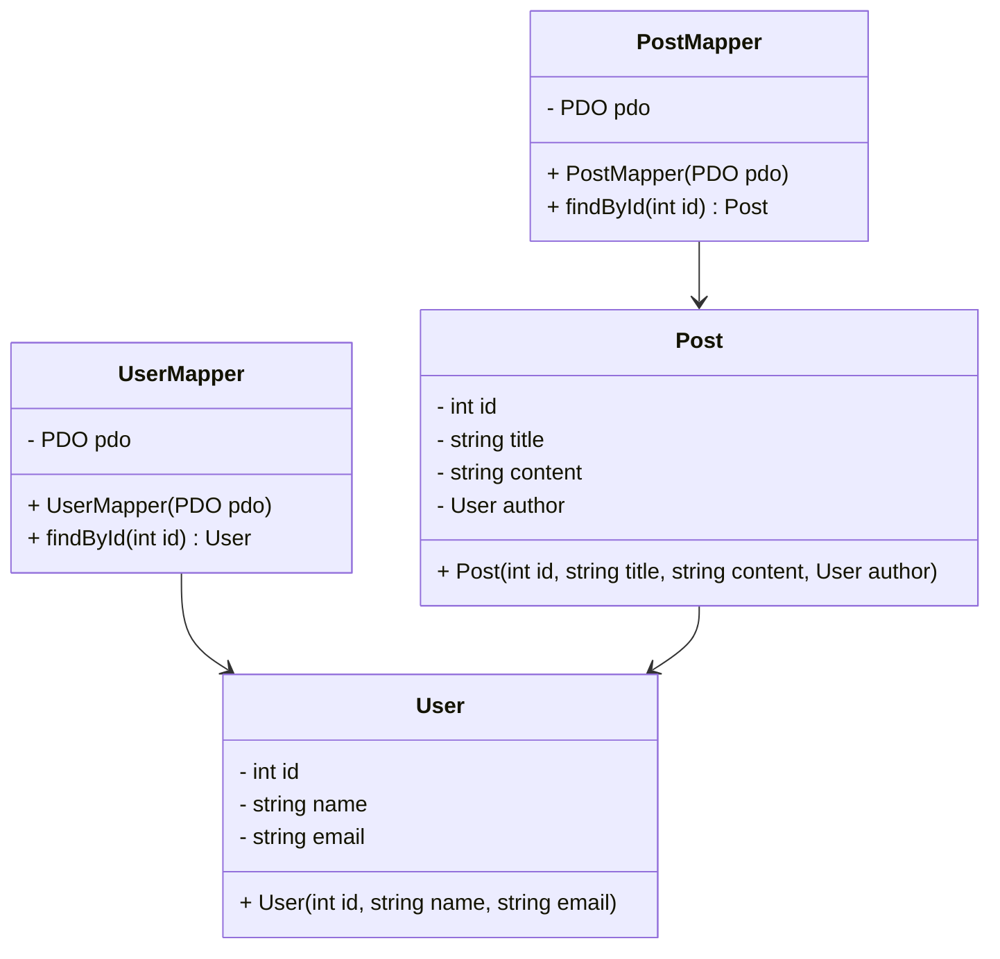

## 10.9 Data Mapping and Hydration Strategies

In the realm of PHP development, efficient interaction with databases is crucial for building robust applications. Two key concepts that facilitate this interaction are **data mapping** and **hydration**. These strategies are essential for converting data between databases and in-memory objects, ensuring that applications can seamlessly handle data retrieval and manipulation.

### Understanding Data Mapping

**Data Mapping** is the process of transforming data between two different formats. In the context of PHP applications, it typically involves converting data stored in a database into objects that can be manipulated within the application, and vice versa. This transformation is crucial for maintaining a clean separation between the database layer and the business logic layer of an application.

#### Key Concepts of Data Mapping

1. **Object-Relational Mapping (ORM):** A popular approach to data mapping that automates the conversion between database tables and PHP objects. ORMs like Doctrine and Eloquent provide a high-level abstraction over database operations, allowing developers to work with objects rather than SQL queries.

2. **Data Transfer Objects (DTOs):** These are simple objects that are used to transfer data between layers of an application. DTOs are often used in conjunction with data mappers to encapsulate data and ensure that only the necessary information is exposed to different parts of the application.

3. **Data Mappers:** These are components that handle the conversion of data between the database and application objects. Unlike Active Record patterns, data mappers do not require objects to be aware of the database, promoting a cleaner separation of concerns.

### Implementing Data Mapping in PHP

To implement data mapping in PHP, developers can choose between using an ORM or creating custom data mappers. Let's explore both approaches:

#### Using an ORM

ORMs provide a convenient way to handle data mapping by abstracting database operations. Here's a basic example using Eloquent, the ORM provided by Laravel:

```php
// Define a User model that extends Eloquent
use Illuminate\Database\Eloquent\Model;

class User extends Model
{
    // Define the table associated with the model
    protected $table = 'users';

    // Define the fillable attributes
    protected $fillable = ['name', 'email', 'password'];
}

// Retrieve a user from the database
$user = User::find(1);

// Access user properties
echo $user->name;
```

In this example, the `User` model represents a table in the database. Eloquent handles the mapping between the `users` table and the `User` object, allowing developers to interact with the database using object-oriented syntax.

#### Creating Custom Data Mappers

For applications that require more control over the data mapping process, custom data mappers can be implemented. Here's an example of a simple data mapper for a `User` entity:

```php
// Define the User entity
class User
{
    private $id;
    private $name;
    private $email;

    public function __construct($id, $name, $email)
    {
        $this->id = $id;
        $this->name = $name;
        $this->email = $email;
    }

    // Getters and setters...
}

// Define the UserMapper class
class UserMapper
{
    private $pdo;

    public function __construct(PDO $pdo)
    {
        $this->pdo = $pdo;
    }

    public function findById($id)
    {
        $stmt = $this->pdo->prepare('SELECT * FROM users WHERE id = :id');
        $stmt->execute(['id' => $id]);
        $row = $stmt->fetch();

        return new User($row['id'], $row['name'], $row['email']);
    }
}

// Usage
$pdo = new PDO('mysql:host=localhost;dbname=test', 'root', '');
$userMapper = new UserMapper($pdo);
$user = $userMapper->findById(1);
```

In this example, the `UserMapper` class is responsible for retrieving data from the database and converting it into a `User` object. This approach provides more flexibility and control over the data mapping process.

### Exploring Hydration Strategies

**Hydration** refers to the process of populating objects with data from the database. This is a crucial step in data mapping, as it ensures that objects are fully initialized with the necessary data before they are used within the application.

#### Types of Hydration

1. **Simple Hydration:** This involves populating an object with data directly from a database row. It is straightforward and suitable for simple objects with a one-to-one mapping to database tables.

2. **Complex Hydration:** This involves populating objects with data from multiple tables or complex queries. It often requires additional logic to handle relationships between objects, such as one-to-many or many-to-many associations.

3. **Lazy Hydration:** This strategy delays the loading of data until it is actually needed. It is useful for optimizing performance by reducing the amount of data loaded into memory at once.

#### Implementing Hydration in PHP

Hydration can be implemented using various techniques, depending on the complexity of the data and the application's requirements. Let's explore some common approaches:

##### Simple Hydration Example

```php
// Define a simple User entity
class User
{
    private $id;
    private $name;
    private $email;

    public function __construct($id, $name, $email)
    {
        $this->id = $id;
        $this->name = $name;
        $this->email = $email;
    }

    // Getters and setters...
}

// Hydrate a User object from a database row
function hydrateUser(array $row)
{
    return new User($row['id'], $row['name'], $row['email']);
}

// Usage
$row = ['id' => 1, 'name' => 'John Doe', 'email' => 'john@example.com'];
$user = hydrateUser($row);
```

In this example, the `hydrateUser` function takes an associative array representing a database row and returns a fully populated `User` object.

##### Complex Hydration Example

```php
// Define a Post entity with a relationship to User
class Post
{
    private $id;
    private $title;
    private $content;
    private $author;

    public function __construct($id, $title, $content, User $author)
    {
        $this->id = $id;
        $this->title = $title;
        $this->content = $content;
        $this->author = $author;
    }

    // Getters and setters...
}

// Hydrate a Post object with a related User object
function hydratePost(array $row, UserMapper $userMapper)
{
    $author = $userMapper->findById($row['user_id']);
    return new Post($row['id'], $row['title'], $row['content'], $author);
}

// Usage
$row = ['id' => 1, 'title' => 'Post Title', 'content' => 'Post content', 'user_id' => 1];
$post = hydratePost($row, $userMapper);
```

In this example, the `hydratePost` function not only populates the `Post` object with data from the database but also retrieves and associates a `User` object as the author of the post.

### Visualizing Data Mapping and Hydration

To better understand the flow of data mapping and hydration, let's visualize the process using a class diagram:



This diagram illustrates the relationships between the `User`, `Post`, `UserMapper`, and `PostMapper` classes. The mappers are responsible for retrieving data from the database and hydrating the corresponding objects.

### Use Cases and Examples

Data mapping and hydration strategies are applicable in various scenarios, including:

1. **Building CRUD Applications:** Data mapping simplifies the process of creating, reading, updating, and deleting records in a database by allowing developers to work with objects instead of raw SQL queries.

2. **Implementing Domain-Driven Design (DDD):** In DDD, entities and value objects are central to the domain model. Data mapping ensures that these objects are properly initialized with data from the database.

3. **Optimizing Performance:** By using lazy hydration, applications can reduce memory usage and improve performance by loading only the necessary data when needed.

4. **Handling Complex Relationships:** Data mapping and hydration strategies facilitate the management of complex relationships between objects, such as one-to-many and many-to-many associations.

### PHP Unique Features

PHP offers several unique features that enhance data mapping and hydration strategies:

- **PDO (PHP Data Objects):** A database access layer that provides a uniform interface for interacting with different databases. PDO supports prepared statements, which help prevent SQL injection attacks.

- **Anonymous Classes:** Introduced in PHP 7, anonymous classes can be used to create lightweight data mappers or hydrators without the need for full class definitions.

- **Type Declarations:** PHP 7 introduced scalar type declarations and return type declarations, which can be used to enforce type safety in data mapping and hydration functions.

### Differences and Similarities

Data mapping and hydration are often confused with similar concepts, such as:

- **Active Record Pattern:** Unlike data mapping, the Active Record pattern requires objects to be aware of the database, which can lead to tighter coupling between the database and application logic.

- **Repository Pattern:** While both data mapping and the repository pattern involve data retrieval, the repository pattern focuses on providing a collection-like interface for accessing domain objects.

### Design Considerations

When implementing data mapping and hydration strategies, consider the following:

- **Separation of Concerns:** Ensure that data mapping logic is separate from business logic to maintain a clean architecture.

- **Performance:** Use lazy hydration to optimize performance by loading only the necessary data.

- **Complexity:** Choose the appropriate level of complexity for your application's needs. Simple hydration may suffice for straightforward applications, while complex hydration is necessary for applications with intricate data relationships.

### Try It Yourself

To deepen your understanding of data mapping and hydration strategies, try modifying the provided code examples:

- **Experiment with Different Database Schemas:** Modify the database schema and update the data mappers to handle the changes.

- **Implement Lazy Hydration:** Add lazy hydration to the `Post` example by delaying the loading of the `User` object until it is accessed.

- **Create a Custom ORM:** Build a simple ORM that handles data mapping and hydration for multiple entities.

### Knowledge Check

- **What is the primary purpose of data mapping in PHP applications?**
- **How does hydration differ from data mapping?**
- **What are the benefits of using an ORM for data mapping?**
- **How can lazy hydration improve application performance?**
- **What are some use cases for data mapping and hydration strategies?**

### Embrace the Journey

Remember, mastering data mapping and hydration strategies is just one step in your PHP development journey. As you continue to explore these concepts, you'll gain a deeper understanding of how to build efficient and maintainable applications. Keep experimenting, stay curious, and enjoy the journey!

## Quiz: Data Mapping and Hydration Strategies



### What is the primary purpose of data mapping in PHP applications?

- [x] To convert data between databases and in-memory objects
- [ ] To handle user authentication
- [ ] To manage session data
- [ ] To optimize database queries

> **Explanation:** Data mapping is used to transform data between databases and in-memory objects, allowing applications to work with data in a structured way.

### How does hydration differ from data mapping?

- [x] Hydration populates objects with data from the database
- [ ] Hydration converts data between different formats
- [ ] Hydration handles user input validation
- [ ] Hydration manages database connections

> **Explanation:** Hydration specifically refers to the process of populating objects with data from the database, while data mapping involves transforming data between different formats.

### What are the benefits of using an ORM for data mapping?

- [x] Provides a high-level abstraction over database operations
- [x] Allows developers to work with objects instead of SQL queries
- [ ] Increases database storage capacity
- [ ] Automatically scales the application

> **Explanation:** ORMs provide a high-level abstraction over database operations, allowing developers to work with objects and simplifying the data mapping process.

### How can lazy hydration improve application performance?

- [x] By reducing memory usage
- [x] By loading only necessary data when needed
- [ ] By increasing database query speed
- [ ] By automatically optimizing code

> **Explanation:** Lazy hydration improves performance by reducing memory usage and loading only the necessary data when it is actually needed.

### What are some use cases for data mapping and hydration strategies?

- [x] Building CRUD applications
- [x] Implementing Domain-Driven Design
- [ ] Managing user sessions
- [ ] Optimizing network bandwidth

> **Explanation:** Data mapping and hydration strategies are used in building CRUD applications, implementing Domain-Driven Design, and optimizing performance.

### What is a key feature of PHP that enhances data mapping?

- [x] PDO (PHP Data Objects)
- [ ] PHP Sessions
- [ ] PHP Cookies
- [ ] PHP Mailer

> **Explanation:** PDO provides a uniform interface for interacting with different databases, enhancing data mapping capabilities in PHP.

### How do data mappers differ from the Active Record pattern?

- [x] Data mappers do not require objects to be aware of the database
- [ ] Data mappers handle user authentication
- [ ] Data mappers automatically optimize database queries
- [ ] Data mappers manage session data

> **Explanation:** Unlike the Active Record pattern, data mappers do not require objects to be aware of the database, promoting a cleaner separation of concerns.

### What is a common use case for complex hydration?

- [x] Handling relationships between objects
- [ ] Managing user authentication
- [ ] Optimizing network bandwidth
- [ ] Increasing database storage capacity

> **Explanation:** Complex hydration is used to handle relationships between objects, such as one-to-many and many-to-many associations.

### What is the role of a data mapper in PHP applications?

- [x] To handle the conversion of data between the database and application objects
- [ ] To manage user sessions
- [ ] To optimize network bandwidth
- [ ] To increase database storage capacity

> **Explanation:** Data mappers are responsible for converting data between the database and application objects, facilitating data mapping.

### True or False: Lazy hydration loads all data into memory at once.

- [ ] True
- [x] False

> **Explanation:** Lazy hydration delays the loading of data until it is actually needed, reducing memory usage and improving performance.


