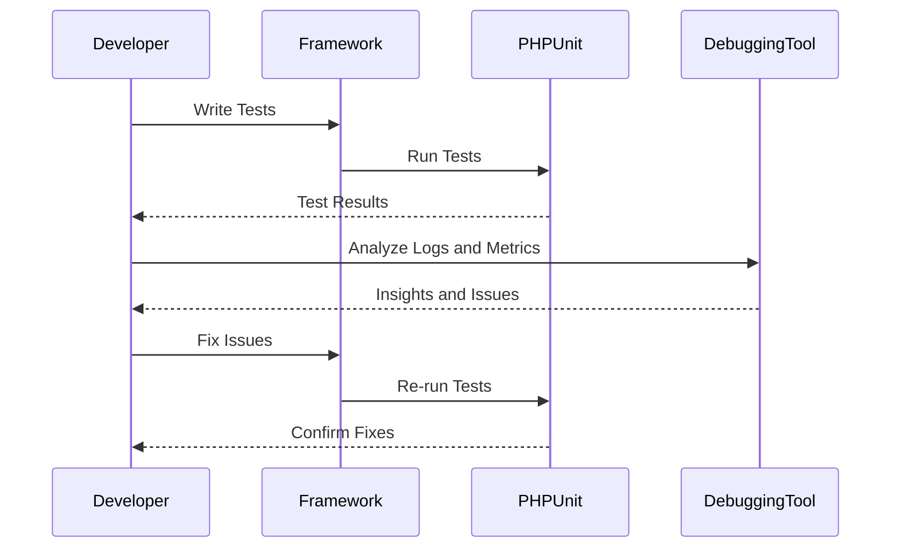

## 11.10 Testing and Debugging in Frameworks

In the realm of PHP development, frameworks like Laravel and Symfony have become indispensable tools for building robust applications. However, as applications grow in complexity, so does the need for effective testing and debugging strategies. This section delves into the intricacies of testing and debugging within PHP frameworks, providing you with the knowledge and tools to ensure your applications are both reliable and maintainable.

### Testing Strategies

Testing is a critical component of the software development lifecycle. It ensures that your application behaves as expected and helps identify bugs before they reach production. In PHP frameworks, testing can be categorized into several types:

#### Unit Testing

Unit testing focuses on testing individual components or functions in isolation. The goal is to verify that each part of the application works correctly on its own. PHP frameworks often integrate with PHPUnit, a popular testing framework, to facilitate unit testing.

```php
use PHPUnit\Framework\TestCase;

class CalculatorTest extends TestCase
{
    public function testAddition()
    {
        $calculator = new Calculator();
        $this->assertEquals(4, $calculator->add(2, 2));
    }
}
```

In this example, we test a simple `Calculator` class to ensure that the `add` method returns the correct sum.

#### Feature Testing

Feature testing, also known as integration testing, involves testing multiple components together to ensure they work as a cohesive unit. This type of testing is crucial for verifying that different parts of your application interact correctly.

```php
use Tests\TestCase;

class UserRegistrationTest extends TestCase
{
    public function testUserCanRegister()
    {
        $response = $this->post('/register', [
            'name' => 'John Doe',
            'email' => 'john@example.com',
            'password' => 'secret',
            'password_confirmation' => 'secret',
        ]);

        $response->assertStatus(302);
        $this->assertDatabaseHas('users', ['email' => 'john@example.com']);
    }
}
```

Here, we simulate a user registration process and verify that the user is correctly added to the database.

#### Browser Testing

Browser testing, or end-to-end testing, involves testing the entire application from the user's perspective. Tools like Laravel Dusk and Symfony Panther can automate browser interactions to ensure the application behaves as expected in a real-world scenario.

```php
use Laravel\Dusk\Browser;
use Tests\DuskTestCase;

class LoginTest extends DuskTestCase
{
    public function testUserCanLogin()
    {
        $this->browse(function (Browser $browser) {
            $browser->visit('/login')
                    ->type('email', 'john@example.com')
                    ->type('password', 'secret')
                    ->press('Login')
                    ->assertPathIs('/home');
        });
    }
}
```

This example uses Laravel Dusk to automate a login process and verify that the user is redirected to the home page upon successful login.

### Framework-Specific Testing Tools

Different PHP frameworks offer unique tools and helpers to streamline the testing process. Let's explore the testing capabilities of Laravel and Symfony.

#### Laravel Testing Tools

Laravel provides a rich set of testing utilities that integrate seamlessly with PHPUnit. It includes testing helpers that make it easy to simulate HTTP requests, interact with the database, and verify application behavior.

- **PHPUnit Integration:** Laravel uses PHPUnit as its testing framework, allowing you to write and run tests using PHPUnit's syntax and features.
- **Testing Helpers:** Laravel offers a variety of helper methods for making HTTP requests, asserting responses, and interacting with the database.

For more information, refer to the [Laravel Testing Documentation](https://laravel.com/docs/testing).

#### Symfony Testing Tools

Symfony also integrates with PHPUnit and provides additional tools for testing web applications.

- **WebTestCase:** Symfony's `WebTestCase` class allows you to simulate HTTP requests and test the response. It is particularly useful for testing controllers and routes.
- **BrowserKit:** Symfony's BrowserKit component provides a browser-like interface for testing web applications.

For more details, visit the [Symfony Testing Documentation](https://symfony.com/doc/current/testing.html).

### Debugging Tools

Debugging is an essential part of the development process, helping you identify and fix issues in your code. PHP frameworks offer various tools to assist with debugging.

#### Debug Bars

Debug bars provide a visual interface for inspecting application data, such as queries, requests, and responses. They are invaluable for identifying performance bottlenecks and debugging issues.

- **Laravel Debugbar:** A package that integrates with Laravel to provide a debug bar with detailed information about the application's execution.
- **Symfony Profiler:** Integrated into Symfony's debug toolbar, the profiler provides insights into the application's performance and behavior.

#### Logging

Logging is a crucial aspect of debugging, allowing you to record application events and errors for later analysis. Both Laravel and Symfony offer robust logging capabilities.

- **Monolog:** Both frameworks use Monolog as their logging library, providing a flexible and powerful logging system.

#### Profiling

Profiling tools help you analyze the performance of your application, identifying slow queries and resource-intensive operations.

- **Laravel Telescope:** A debugging assistant for Laravel applications, Telescope provides insights into requests, exceptions, and database queries.
- **Symfony Profiler:** As mentioned earlier, Symfony's profiler is integrated into the debug toolbar and provides detailed performance metrics.

### Tools

#### Laravel Telescope

Laravel Telescope is a powerful debugging assistant for Laravel applications. It provides real-time insights into your application's requests, exceptions, database queries, and more. With Telescope, you can easily identify and fix issues in your application.

For more information, visit the [Laravel Telescope Documentation](https://laravel.com/docs/telescope).

#### Symfony Profiler

The Symfony Profiler is an integral part of Symfony's debug toolbar. It provides detailed information about the application's execution, including request and response data, database queries, and performance metrics. The profiler is an invaluable tool for debugging and optimizing Symfony applications.

For more details, refer to the [Symfony Profiler Documentation](https://symfony.com/doc/current/profiler.html).

### Try It Yourself

To get hands-on experience with testing and debugging in PHP frameworks, try the following exercises:

1. **Create a Unit Test:** Write a unit test for a simple class or function in your application. Use PHPUnit to run the test and verify its behavior.

2. **Simulate a Feature Test:** Create a feature test that simulates a user interaction, such as registering or logging in. Use Laravel's testing helpers or Symfony's WebTestCase to perform the test.

3. **Automate a Browser Test:** Use Laravel Dusk or Symfony Panther to automate a browser test. Simulate a user action, such as filling out a form or navigating to a page, and verify the expected outcome.

4. **Explore Debugging Tools:** Install Laravel Telescope or enable the Symfony Profiler in your application. Use these tools to inspect requests, queries, and performance metrics.

### Visualizing Testing and Debugging Processes

To better understand the testing and debugging processes in PHP frameworks, let's visualize the flow of a typical testing and debugging cycle using a sequence diagram.



**Diagram Description:** This sequence diagram illustrates the typical flow of testing and debugging in PHP frameworks. The developer writes tests and runs them using PHPUnit. The results are analyzed using debugging tools, and any issues are fixed. The tests are re-run to confirm the fixes.

### Knowledge Check

To reinforce your understanding of testing and debugging in PHP frameworks, consider the following questions:

- What are the differences between unit testing, feature testing, and browser testing?
- How do Laravel and Symfony integrate with PHPUnit for testing?
- What are the benefits of using debug bars and logging in your application?
- How can profiling tools help optimize your application's performance?

### Embrace the Journey

Remember, testing and debugging are ongoing processes that require continuous learning and adaptation. As you become more familiar with the tools and techniques available in PHP frameworks, you'll be better equipped to build reliable and maintainable applications. Keep experimenting, stay curious, and enjoy the journey!

## Quiz: Testing and Debugging in Frameworks



### What is the primary purpose of unit testing in PHP frameworks?

- [x] To test individual components or functions in isolation
- [ ] To test the entire application from the user's perspective
- [ ] To simulate HTTP requests and test responses
- [ ] To automate browser interactions

> **Explanation:** Unit testing focuses on testing individual components or functions in isolation to ensure they work correctly on their own.

### Which tool is commonly used for browser testing in Laravel?

- [ ] PHPUnit
- [x] Laravel Dusk
- [ ] Symfony Panther
- [ ] Monolog

> **Explanation:** Laravel Dusk is a tool used for browser testing in Laravel, allowing developers to automate browser interactions.

### What is the role of the Symfony Profiler?

- [ ] To provide a debug bar with detailed information
- [x] To provide insights into the application's performance and behavior
- [ ] To automate browser interactions
- [ ] To simulate HTTP requests and test responses

> **Explanation:** The Symfony Profiler provides insights into the application's performance and behavior, helping developers identify and fix issues.

### How does Laravel integrate with PHPUnit?

- [x] By using PHPUnit as its testing framework
- [ ] By providing a browser-like interface for testing
- [ ] By offering a debug bar with detailed information
- [ ] By automating browser interactions

> **Explanation:** Laravel integrates with PHPUnit by using it as its testing framework, allowing developers to write and run tests using PHPUnit's syntax and features.

### What is the benefit of using debug bars in PHP frameworks?

- [x] To provide a visual interface for inspecting application data
- [ ] To automate browser interactions
- [ ] To simulate HTTP requests and test responses
- [ ] To provide insights into the application's performance and behavior

> **Explanation:** Debug bars provide a visual interface for inspecting application data, such as queries, requests, and responses, helping developers identify performance bottlenecks and debug issues.

### Which tool is used for logging in both Laravel and Symfony?

- [x] Monolog
- [ ] PHPUnit
- [ ] Laravel Dusk
- [ ] Symfony Panther

> **Explanation:** Monolog is the logging library used in both Laravel and Symfony, providing a flexible and powerful logging system.

### What is the purpose of feature testing?

- [ ] To test individual components or functions in isolation
- [x] To test multiple components together to ensure they work as a cohesive unit
- [ ] To automate browser interactions
- [ ] To provide insights into the application's performance and behavior

> **Explanation:** Feature testing involves testing multiple components together to ensure they work as a cohesive unit, verifying that different parts of the application interact correctly.

### How can profiling tools help in PHP frameworks?

- [x] By analyzing the performance of the application and identifying slow queries
- [ ] By automating browser interactions
- [ ] By providing a visual interface for inspecting application data
- [ ] By simulating HTTP requests and testing responses

> **Explanation:** Profiling tools help analyze the performance of the application, identifying slow queries and resource-intensive operations, which aids in optimization.

### What is the role of Laravel Telescope?

- [ ] To provide a browser-like interface for testing
- [x] To provide real-time insights into the application's requests, exceptions, and database queries
- [ ] To automate browser interactions
- [ ] To simulate HTTP requests and test responses

> **Explanation:** Laravel Telescope provides real-time insights into the application's requests, exceptions, and database queries, helping developers identify and fix issues.

### True or False: Symfony Panther is used for unit testing in Symfony.

- [ ] True
- [x] False

> **Explanation:** Symfony Panther is used for browser testing, not unit testing. It automates browser interactions to test the application from the user's perspective.



By mastering testing and debugging in PHP frameworks, you'll be well-equipped to build reliable, maintainable, and high-quality applications. Keep exploring, learning, and applying these concepts to your projects, and you'll continue to grow as a developer.
