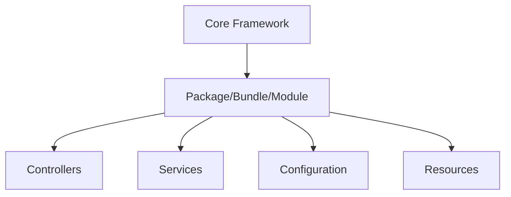

## 11.11 Plugin and Extension Architecture

In the dynamic world of PHP development, frameworks like Laravel and Symfony have become essential tools for developers. These frameworks not only provide a robust foundation for building applications but also offer extensibility through plugins and extensions. This section delves into the architecture of plugins and extensions in PHP frameworks, focusing on creating packages, bundles, and modules to extend functionality.

### Extending Frameworks

Extending frameworks is a powerful way to enhance the capabilities of your PHP applications. By creating packages, bundles, or modules, developers can add new features, integrate third-party services, and customize the behavior of their applications without altering the core framework code. This approach promotes modularity, reusability, and maintainability.

#### Creating Packages, Bundles, or Modules

1. **Packages**: In PHP, a package is a collection of related classes and resources that provide specific functionality. Packages are typically distributed via Composer, the PHP dependency manager, making them easy to install and update.

2. **Bundles**: In Symfony, a bundle is a directory that contains a set of files and resources that implement a feature. Bundles are reusable and can be shared across multiple projects.

3. **Modules**: In some frameworks, modules are used to encapsulate functionality. They are similar to packages and bundles but may have specific conventions depending on the framework.

### Laravel Packages

Laravel, one of the most popular PHP frameworks, provides a straightforward way to create and manage packages. Packages in Laravel can include routes, controllers, views, and other resources, allowing developers to encapsulate functionality and share it across projects.

#### Structure of a Laravel Package

A typical Laravel package has the following structure:

```
my-package/
├── src/
│   ├── MyPackageServiceProvider.php
│   ├── Http/
│   │   ├── Controllers/
│   │   └── Middleware/
│   ├── Models/
│   ├── Views/
│   └── routes/
├── config/
│   └── mypackage.php
├── resources/
│   ├── views/
│   └── lang/
├── tests/
├── composer.json
└── README.md
```

- **src/**: Contains the core logic of the package, including service providers, controllers, and models.
- **config/**: Holds configuration files that can be published to the application's config directory.
- **resources/**: Contains views and language files.
- **tests/**: Includes unit and feature tests for the package.
- **composer.json**: Defines the package's dependencies and metadata.

#### Publishing Configurations and Assets

Laravel provides a convenient way to publish package configurations and assets to the application's directories. This allows developers to customize the package's behavior without modifying its source code.

```php
// In MyPackageServiceProvider.php

public function boot()
{
    $this->publishes([
        __DIR__.'/../config/mypackage.php' => config_path('mypackage.php'),
    ], 'config');

    $this->publishes([
        __DIR__.'/../resources/views' => resource_path('views/vendor/mypackage'),
    ], 'views');
}
```

### Symfony Bundles

Symfony bundles are a powerful way to encapsulate functionality and share it across projects. A bundle can include controllers, services, configuration, and more, making it a versatile tool for extending Symfony applications.

#### Reusable Sets of Files and Functionality

A Symfony bundle typically includes the following components:

- **Controllers**: Handle HTTP requests and return responses.
- **Services**: Provide reusable functionality that can be injected into other parts of the application.
- **Configuration**: Define parameters and settings for the bundle.
- **Resources**: Include templates, translations, and assets.

#### Registering and Configuring Bundles

To use a bundle in a Symfony application, you need to register it in the `config/bundles.php` file:

```php
return [
    // Other bundles...
    MyBundle\MyBundle::class => ['all' => true],
];
```

Bundles can also be configured using YAML, XML, or PHP configuration files. This flexibility allows developers to tailor the bundle's behavior to their application's needs.

### Community Libraries

The PHP community is vibrant and active, with a wealth of open-source packages available for use. Leveraging these community libraries can save time and effort, allowing developers to focus on building unique features for their applications.

#### Leveraging Open-Source Packages

Open-source packages can provide a wide range of functionality, from authentication and authorization to data processing and API integration. By using well-maintained packages, developers can benefit from the collective expertise of the community.

#### Composer Integration for Dependency Management

Composer is the de facto standard for dependency management in PHP. It allows developers to declare the libraries their project depends on and manages the installation and updates of these libraries.

To add a package to your project, simply run:

```bash
composer require vendor/package-name
```

This command will download the package and its dependencies, and update the `composer.json` and `composer.lock` files.

### Code Examples

Let's explore some code examples to illustrate the concepts discussed above.

#### Laravel Package Example

Below is a simple example of a Laravel package that provides a greeting service.

```php
// src/Providers/GreetingServiceProvider.php

namespace MyPackage\Providers;

use Illuminate\Support\ServiceProvider;

class GreetingServiceProvider extends ServiceProvider
{
    public function register()
    {
        $this->app->singleton('greeting', function ($app) {
            return new \MyPackage\Services\GreetingService();
        });
    }

    public function boot()
    {
        // Publish configuration
        $this->publishes([
            __DIR__.'/../../config/greeting.php' => config_path('greeting.php'),
        ], 'config');
    }
}
```

```php
// src/Services/GreetingService.php

namespace MyPackage\Services;

class GreetingService
{
    public function greet($name)
    {
        return "Hello, $name!";
    }
}
```

#### Symfony Bundle Example

Here's a basic example of a Symfony bundle that provides a greeting service.

```php
// src/Service/GreetingService.php

namespace MyBundle\Service;

class GreetingService
{
    public function greet($name)
    {
        return "Hello, $name!";
    }
}
```

```yaml
# config/services.yaml

services:
    MyBundle\Service\GreetingService:
        public: true
```

### Visualizing Plugin and Extension Architecture

To better understand the architecture of plugins and extensions, let's visualize the relationship between the core framework and the extensions.



**Diagram Description**: This diagram illustrates how a package, bundle, or module extends the core framework by adding controllers, services, configuration, and resources.

### Knowledge Check

- **What is the primary purpose of creating packages, bundles, or modules in PHP frameworks?**
- **How does Laravel facilitate the publishing of package configurations and assets?**
- **What are some key components of a Symfony bundle?**

### Embrace the Journey

Remember, extending frameworks through plugins and extensions is just the beginning. As you progress, you'll discover more ways to customize and enhance your PHP applications. Keep experimenting, stay curious, and enjoy the journey!

### References and Links

- [Composer Documentation](https://getcomposer.org/doc/)
- [Laravel Package Development](https://laravel.com/docs/packages)
- [Symfony Bundles](https://symfony.com/doc/current/bundles.html)

## Quiz: Plugin and Extension Architecture



### What is the primary purpose of creating packages, bundles, or modules in PHP frameworks?

- [x] To extend the functionality of the framework without altering its core code.
- [ ] To replace the core framework with custom code.
- [ ] To reduce the performance of the application.
- [ ] To make the framework more complex.

> **Explanation:** Packages, bundles, and modules are created to extend the functionality of a framework in a modular and reusable way, without altering the core code.

### How does Laravel facilitate the publishing of package configurations and assets?

- [x] Through the `publishes` method in the service provider.
- [ ] By directly modifying the core framework files.
- [ ] By using a custom command-line tool.
- [ ] By creating a new configuration file in the root directory.

> **Explanation:** Laravel uses the `publishes` method in the service provider to allow developers to publish package configurations and assets to the application's directories.

### What are some key components of a Symfony bundle?

- [x] Controllers, services, configuration, and resources.
- [ ] Only controllers and views.
- [ ] Models and migrations.
- [ ] Database connections and queries.

> **Explanation:** A Symfony bundle typically includes controllers, services, configuration, and resources, making it a versatile tool for extending applications.

### What tool is commonly used for dependency management in PHP?

- [x] Composer
- [ ] NPM
- [ ] Yarn
- [ ] Maven

> **Explanation:** Composer is the de facto standard for dependency management in PHP, allowing developers to manage libraries and their dependencies.

### What is the purpose of the `composer.json` file in a PHP project?

- [x] To define the project's dependencies and metadata.
- [ ] To store application logs.
- [ ] To configure the web server.
- [ ] To manage database connections.

> **Explanation:** The `composer.json` file defines the project's dependencies and metadata, allowing Composer to manage the installation and updates of libraries.

### In Symfony, where do you register a bundle for use in an application?

- [x] In the `config/bundles.php` file.
- [ ] In the `composer.json` file.
- [ ] In the `services.yaml` file.
- [ ] In the `routes.yaml` file.

> **Explanation:** Bundles are registered in the `config/bundles.php` file in a Symfony application.

### What is the role of a service provider in a Laravel package?

- [x] To register and boot the package's services and resources.
- [ ] To handle HTTP requests.
- [ ] To manage database migrations.
- [ ] To configure the web server.

> **Explanation:** A service provider in Laravel is responsible for registering and booting the package's services and resources.

### What is a common benefit of using open-source packages in PHP development?

- [x] Saving time and effort by leveraging community expertise.
- [ ] Increasing the complexity of the application.
- [ ] Reducing the application's performance.
- [ ] Limiting the application's functionality.

> **Explanation:** Open-source packages can save time and effort by providing pre-built functionality and leveraging the expertise of the community.

### What is the purpose of the `publishes` method in a Laravel service provider?

- [x] To allow developers to publish package configurations and assets to the application's directories.
- [ ] To handle HTTP requests.
- [ ] To manage database connections.
- [ ] To configure the web server.

> **Explanation:** The `publishes` method in a Laravel service provider allows developers to publish package configurations and assets to the application's directories.

### True or False: Symfony bundles can only be configured using YAML files.

- [ ] True
- [x] False

> **Explanation:** Symfony bundles can be configured using YAML, XML, or PHP configuration files, providing flexibility in how they are tailored to the application's needs.


