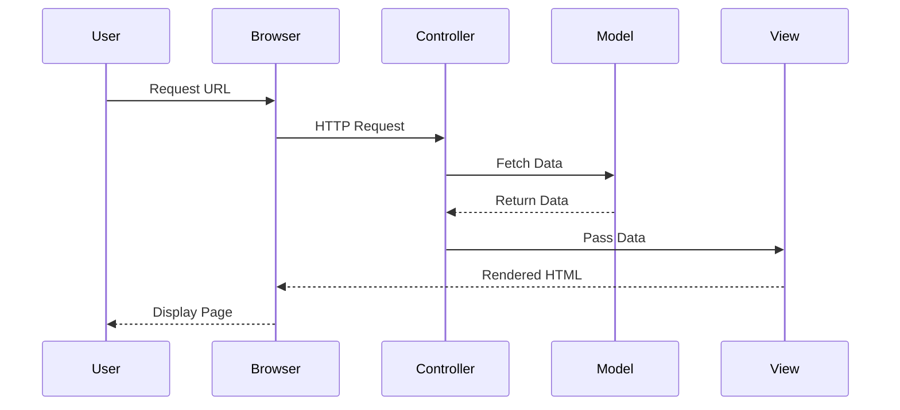

## 11.2 MVC in PHP Frameworks

The Model-View-Controller (MVC) pattern is a cornerstone of modern web development, providing a structured approach to building applications by separating concerns into three interconnected components: Model, View, and Controller. This separation enhances maintainability, scalability, and testability of applications. In this section, we will delve into the MVC pattern within PHP frameworks, exploring each component's role, how they interact, and how to implement an MVC application.

### Implementing MVC Pattern

#### How MVC Separates Concerns

The MVC pattern divides an application into three main components:

- **Model**: Manages data and business logic. It interacts with the database and encapsulates the application's data structure.
- **View**: Handles the presentation layer. It is responsible for rendering the user interface and displaying data to the user.
- **Controller**: Acts as an intermediary between Model and View. It processes user input, invokes model operations, and determines the view to display.

This separation allows developers to focus on specific aspects of the application without affecting others, promoting a clean and organized codebase.

#### Models

The Model component is the backbone of the MVC architecture, responsible for managing the data and business logic of the application. It interacts with the database, performs data validation, and applies business rules.

- **Data Management**: Models define the structure of the data and provide methods to manipulate it. They often use Object-Relational Mapping (ORM) tools like Eloquent in Laravel or Doctrine in Symfony to abstract database interactions.
- **Business Logic**: Models encapsulate business rules and logic, ensuring that data is processed correctly before being stored or retrieved.

**Example: A Simple User Model in Laravel**

```php
<?php

namespace App\Models;

use Illuminate\Database\Eloquent\Model;

class User extends Model
{
    // Define the table associated with the model
    protected $table = 'users';

    // Specify the attributes that are mass assignable
    protected $fillable = ['name', 'email', 'password'];

    // Define a method to hash the password before saving
    public function setPasswordAttribute($password)
    {
        $this->attributes['password'] = bcrypt($password);
    }
}
```

In this example, the `User` model represents a user entity, managing data related to users and encapsulating logic such as password hashing.

#### Views

Views are responsible for rendering the user interface and displaying data to the user. They separate the presentation logic from the business logic, allowing designers and developers to work independently.

- **Templating Engines**: PHP frameworks often use templating engines to simplify view creation. Laravel uses Blade, Symfony uses Twig, and native PHP can also be used.
- **Dynamic Content**: Views dynamically render content based on data provided by the controller.

**Example: A Simple Blade View in Laravel**

```blade
<!-- resources/views/user/profile.blade.php -->

<!DOCTYPE html>
<html>
<head>
    <title>User Profile</title>
</head>
<body>
    <h1>Welcome, {{ $user->name }}</h1>
    <p>Email: {{ $user->email }}</p>
</body>
</html>
```

This Blade template displays a user's profile information, using Blade's syntax to inject dynamic data.

#### Controllers

Controllers handle incoming requests, process user input, and return responses. They act as an intermediary between the Model and View, orchestrating the flow of data.

- **Request Handling**: Controllers receive HTTP requests, invoke model operations, and determine which view to render.
- **Response Generation**: After processing, controllers return a response to the client, often in the form of a rendered view or JSON data.

**Example: A Simple Controller in Laravel**

```php
<?php

namespace App\Http\Controllers;

use App\Models\User;
use Illuminate\Http\Request;

class UserController extends Controller
{
    // Show the user profile
    public function show($id)
    {
        $user = User::find($id);
        return view('user.profile', ['user' => $user]);
    }
}
```

In this example, the `UserController` handles a request to display a user's profile, retrieving the user data from the model and passing it to the view.

#### Routing Mechanisms

Routing is a crucial aspect of MVC frameworks, mapping URLs to specific controller actions. It defines how requests are handled and directs them to the appropriate controller.

- **Defining Routes**: Routes are defined in a routing file, specifying the URL pattern and the corresponding controller action.
- **Dynamic Parameters**: Routes can include dynamic parameters, allowing for flexible URL structures.

**Example: Defining a Route in Laravel**

```php
// routes/web.php

use App\Http\Controllers\UserController;

// Define a route for displaying a user profile
Route::get('/user/{id}', [UserController::class, 'show']);
```

This route maps the URL `/user/{id}` to the `show` method of the `UserController`, passing the `id` as a parameter.

### Example Implementation: Creating a Simple MVC Application

Let's walk through the process of creating a simple MVC application using Laravel, a popular PHP framework.

#### Step 1: Setting Up Laravel

1. **Install Laravel**: Use Composer to create a new Laravel project.

   ```bash
   composer create-project --prefer-dist laravel/laravel mvc-example
   ```

2. **Configure Environment**: Set up your database connection in the `.env` file.

   ```plaintext
   DB_CONNECTION=mysql
   DB_HOST=127.0.0.1
   DB_PORT=3306
   DB_DATABASE=mvc_example
   DB_USERNAME=root
   DB_PASSWORD=
   ```

#### Step 2: Creating the Model

1. **Generate the Model**: Use Artisan to create a `User` model and migration.

   ```bash
   php artisan make:model User -m
   ```

2. **Define the Migration**: Open the migration file in `database/migrations` and define the table structure.

   ```php
   public function up()
   {
       Schema::create('users', function (Blueprint $table) {
           $table->id();
           $table->string('name');
           $table->string('email')->unique();
           $table->string('password');
           $table->timestamps();
       });
   }
   ```

3. **Run the Migration**: Apply the migration to create the database table.

   ```bash
   php artisan migrate
   ```

#### Step 3: Creating the Controller

1. **Generate the Controller**: Use Artisan to create a `UserController`.

   ```bash
   php artisan make:controller UserController
   ```

2. **Define Controller Methods**: Implement the `show` method to retrieve and display user data.

   ```php
   public function show($id)
   {
       $user = User::find($id);
       return view('user.profile', ['user' => $user]);
   }
   ```

#### Step 4: Creating the View

1. **Create the View File**: In `resources/views`, create a `user` directory and a `profile.blade.php` file.

   ```blade
   <!-- resources/views/user/profile.blade.php -->

   <!DOCTYPE html>
   <html>
   <head>
       <title>User Profile</title>
   </head>
   <body>
       <h1>Welcome, {{ $user->name }}</h1>
       <p>Email: {{ $user->email }}</p>
   </body>
   </html>
   ```

#### Step 5: Defining Routes

1. **Define the Route**: In `routes/web.php`, add a route for displaying user profiles.

   ```php
   Route::get('/user/{id}', [UserController::class, 'show']);
   ```

#### Step 6: Testing the Application

1. **Start the Development Server**: Use Artisan to start the server.

   ```bash
   php artisan serve
   ```

2. **Access the Application**: Open a web browser and navigate to `http://localhost:8000/user/1` to view the user profile.

### Visualizing MVC Architecture

To better understand the flow of data and control in an MVC application, let's visualize the architecture using a sequence diagram.



This diagram illustrates the sequence of interactions in an MVC application, from the user's request to the final rendered page.

### Try It Yourself

Now that we've walked through the process of creating a simple MVC application, try experimenting with the code. Here are some suggestions:

- **Add New Features**: Implement additional features such as user registration and login.
- **Use Different Templating Engines**: Try using Twig instead of Blade for rendering views.
- **Explore Other Frameworks**: Implement a similar application using Symfony or CodeIgniter.

### Knowledge Check

- **What is the primary purpose of the Model in MVC?**
- **How do Views and Controllers interact in an MVC application?**
- **What role does routing play in MVC frameworks?**

### Summary

In this section, we've explored the MVC pattern in PHP frameworks, understanding how it separates concerns and enhances application structure. By implementing a simple MVC application, we've seen how models, views, controllers, and routing work together to create a cohesive web application. Remember, mastering MVC is just the beginning of building robust and scalable applications. Keep experimenting, stay curious, and enjoy the journey!

## Quiz: MVC in PHP Frameworks



### What does MVC stand for in the context of web development?

- [x] Model-View-Controller
- [ ] Module-View-Component
- [ ] Model-View-Configuration
- [ ] Module-View-Connector

> **Explanation:** MVC stands for Model-View-Controller, a design pattern used to separate concerns in web applications.

### Which component in MVC is responsible for managing data and business logic?

- [x] Model
- [ ] View
- [ ] Controller
- [ ] Router

> **Explanation:** The Model component manages data and business logic, interacting with the database and encapsulating application data.

### What is the primary role of the View in MVC?

- [x] Rendering the user interface
- [ ] Handling user input
- [ ] Managing data
- [ ] Defining routes

> **Explanation:** The View is responsible for rendering the user interface and displaying data to the user.

### How do Controllers function in an MVC application?

- [x] They handle requests and return responses
- [ ] They manage data and business logic
- [ ] They render the user interface
- [ ] They define routes

> **Explanation:** Controllers handle incoming requests, process user input, and return responses, acting as an intermediary between Model and View.

### What is the purpose of routing in MVC frameworks?

- [x] Mapping URLs to controller actions
- [ ] Rendering views
- [ ] Managing data
- [ ] Handling user input

> **Explanation:** Routing maps URLs to specific controller actions, defining how requests are handled in an MVC application.

### Which PHP framework uses Blade as its templating engine?

- [x] Laravel
- [ ] Symfony
- [ ] CodeIgniter
- [ ] Zend Framework

> **Explanation:** Laravel uses Blade as its templating engine, allowing for dynamic content rendering.

### In Laravel, how do you define a route that maps to a controller action?

- [x] Using the `Route::get()` method
- [ ] Using the `Route::map()` method
- [ ] Using the `Route::define()` method
- [ ] Using the `Route::link()` method

> **Explanation:** In Laravel, routes are defined using the `Route::get()` method, mapping URLs to controller actions.

### What is the benefit of using an ORM in the Model component?

- [x] It abstracts database interactions
- [ ] It renders the user interface
- [ ] It handles HTTP requests
- [ ] It defines routes

> **Explanation:** An ORM (Object-Relational Mapping) abstracts database interactions, simplifying data management in the Model component.

### True or False: In MVC, the Controller directly interacts with the database.

- [ ] True
- [x] False

> **Explanation:** False. In MVC, the Controller does not directly interact with the database; it communicates with the Model, which handles database interactions.

### Which of the following is a key advantage of using the MVC pattern?

- [x] Separation of concerns
- [ ] Increased code duplication
- [ ] Reduced scalability
- [ ] Decreased testability

> **Explanation:** The MVC pattern provides a clear separation of concerns, enhancing maintainability, scalability, and testability of applications.


