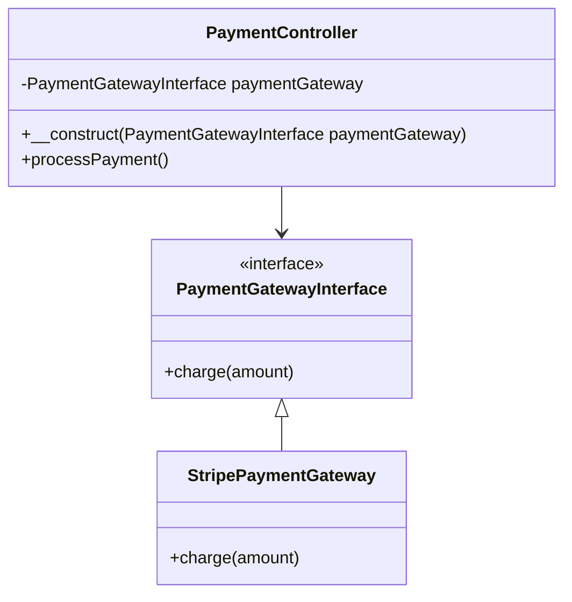

## 11.3 Service Container and Dependency Injection

In modern PHP development, Service Containers and Dependency Injection (DI) are pivotal concepts that enhance the modularity, testability, and maintainability of applications. This section delves into these concepts, focusing on their implementation in popular PHP frameworks like Laravel and Symfony.

### Understanding Service Containers

A **Service Container**, also known as a Dependency Injection Container, is a tool used to manage class dependencies and perform inversion of control (IoC). It acts as a centralized registry where objects and their dependencies are defined and resolved. This approach allows developers to decouple the creation of objects from their usage, leading to more flexible and maintainable code.

#### Key Concepts of Service Containers

- **Centralized Management**: Service Containers provide a centralized place to manage dependencies, making it easier to configure and modify them as needed.
- **Inversion of Control**: By using a Service Container, the control of object creation is inverted from the class itself to the container, allowing for greater flexibility and decoupling.
- **Dependency Resolution**: Service Containers automatically resolve dependencies, reducing boilerplate code and simplifying the process of object creation.

### Dependency Injection in Frameworks

Dependency Injection is a design pattern used to implement IoC, where dependencies are injected into a class rather than being created by the class itself. This pattern is widely used in frameworks like Laravel and Symfony to manage service objects efficiently.

#### Benefits of Dependency Injection

- **Modularity**: DI promotes modular design by decoupling classes from their dependencies, making it easier to swap out implementations.
- **Testability**: By injecting dependencies, classes can be easily tested with mock objects, improving test coverage and reliability.
- **Maintainability**: DI simplifies the management of dependencies, making the codebase easier to maintain and extend.

### Laravel's Service Container

Laravel's Service Container is a powerful tool for managing class dependencies and performing dependency injection. It allows developers to bind interfaces to implementations and resolve dependencies automatically.

#### Binding Interfaces to Implementations

In Laravel, you can bind an interface to a specific implementation using the `bind` method. This allows you to define which class should be used when a particular interface is requested.

```php
use App\Contracts\PaymentGatewayInterface;
use App\Services\StripePaymentGateway;

$app->bind(PaymentGatewayInterface::class, StripePaymentGateway::class);
```

#### Resolving Dependencies Automatically

Laravel's Service Container can automatically resolve dependencies by inspecting the type hints in a class's constructor. This feature simplifies the process of dependency injection, as you don't need to manually resolve each dependency.

```php
namespace App\Http\Controllers;

use App\Contracts\PaymentGatewayInterface;

class PaymentController extends Controller
{
    protected $paymentGateway;

    public function __construct(PaymentGatewayInterface $paymentGateway)
    {
        $this->paymentGateway = $paymentGateway;
    }

    public function processPayment()
    {
        $this->paymentGateway->charge(100);
    }
}
```

For more detailed information, refer to the [Laravel Service Container Documentation](https://laravel.com/docs/container).

### Symfony's DependencyInjection Component

Symfony's DependencyInjection Component provides a robust mechanism for configuring and managing services. It supports various configuration formats, including YAML, XML, and PHP, and offers features like autowiring and service tagging.

#### Configuring Services

In Symfony, services can be configured using YAML, XML, or PHP. This flexibility allows developers to choose the format that best suits their needs.

**YAML Configuration Example:**

```yaml
# config/services.yaml
services:
    App\Service\Mailer:
        arguments:
            $transport: '@mailer.transport'
```

**XML Configuration Example:**

```xml
<!-- config/services.xml -->
<services>
    <service id="App\Service\Mailer">
        <argument type="service" id="mailer.transport" />
    </service>
</services>
```

#### Autowiring and Service Tagging

Symfony supports autowiring, which automatically injects dependencies based on type hints. This feature reduces the need for explicit configuration and simplifies the process of managing dependencies.

**Autowiring Example:**

```php
namespace App\Service;

use Psr\Log\LoggerInterface;

class Mailer
{
    private $logger;

    public function __construct(LoggerInterface $logger)
    {
        $this->logger = $logger;
    }

    public function sendEmail($message)
    {
        $this->logger->info('Sending email: ' . $message);
    }
}
```

For more information, visit the [Symfony DependencyInjection Component](https://symfony.com/doc/current/components/dependency_injection.html).

### Benefits of Using Service Containers and Dependency Injection

Service Containers and Dependency Injection offer numerous benefits that enhance the quality and maintainability of PHP applications:

- **Decoupling**: By separating the creation of objects from their usage, these patterns promote a decoupled architecture, making it easier to modify and extend the codebase.
- **Flexibility**: Service Containers allow for easy swapping of implementations, enabling developers to change the behavior of an application without modifying its core logic.
- **Reusability**: With DI, components can be reused across different parts of an application, reducing redundancy and improving code reuse.
- **Scalability**: As applications grow, managing dependencies becomes more complex. Service Containers simplify this process, making it easier to scale applications.

### Try It Yourself

To deepen your understanding of Service Containers and Dependency Injection, try modifying the code examples provided. Experiment with different configurations, such as changing the implementation of an interface or adding new dependencies. This hands-on approach will help reinforce the concepts discussed in this section.

### Visualizing Dependency Injection

To better understand how Dependency Injection works, let's visualize the process using a class diagram:



In this diagram, the `PaymentController` depends on the `PaymentGatewayInterface`, which is implemented by the `StripePaymentGateway`. The Service Container resolves this dependency, injecting the appropriate implementation into the controller.

### Knowledge Check

- What is the primary purpose of a Service Container in PHP frameworks?
- How does Dependency Injection enhance the testability of an application?
- What are the benefits of using autowiring in Symfony?
- How can you bind an interface to an implementation in Laravel's Service Container?

### Embrace the Journey

Remember, mastering Service Containers and Dependency Injection is a journey. As you continue to explore these concepts, you'll discover new ways to enhance your PHP applications. Keep experimenting, stay curious, and enjoy the process of learning and growing as a developer.

## Quiz: Service Container and Dependency Injection



### What is the primary role of a Service Container in PHP frameworks?

- [x] To manage class dependencies and perform inversion of control
- [ ] To execute database queries
- [ ] To handle user authentication
- [ ] To render HTML templates

> **Explanation:** A Service Container manages class dependencies and performs inversion of control, centralizing the management of dependencies.

### How does Dependency Injection improve testability?

- [x] By allowing the use of mock objects for testing
- [ ] By reducing the number of lines of code
- [ ] By increasing the execution speed of tests
- [ ] By simplifying the user interface

> **Explanation:** Dependency Injection improves testability by allowing the use of mock objects, making it easier to isolate and test individual components.

### Which PHP framework uses YAML, XML, or PHP for configuring services?

- [ ] Laravel
- [x] Symfony
- [ ] CodeIgniter
- [ ] CakePHP

> **Explanation:** Symfony allows configuring services using YAML, XML, or PHP, providing flexibility in service management.

### What is autowiring in Symfony?

- [x] Automatically injecting dependencies based on type hints
- [ ] Manually configuring each service
- [ ] Writing custom scripts for dependency resolution
- [ ] Using global variables for dependency management

> **Explanation:** Autowiring in Symfony automatically injects dependencies based on type hints, reducing the need for explicit configuration.

### In Laravel, how do you bind an interface to an implementation?

- [x] Using the `bind` method
- [ ] Using the `register` method
- [ ] Using the `resolve` method
- [ ] Using the `inject` method

> **Explanation:** In Laravel, the `bind` method is used to associate an interface with a specific implementation.

### What is the main advantage of using a Service Container?

- [x] Centralized management of dependencies
- [ ] Faster execution of code
- [ ] Simplified user interface design
- [ ] Reduced memory usage

> **Explanation:** The main advantage of using a Service Container is the centralized management of dependencies, which simplifies configuration and modification.

### How does Dependency Injection promote modularity?

- [x] By decoupling classes from their dependencies
- [ ] By increasing the number of classes
- [ ] By reducing the number of methods
- [ ] By using global variables

> **Explanation:** Dependency Injection promotes modularity by decoupling classes from their dependencies, allowing for easier modification and extension.

### What is the purpose of service tagging in Symfony?

- [x] To categorize and manage services
- [ ] To execute services in parallel
- [ ] To reduce the size of the codebase
- [ ] To enhance the graphical user interface

> **Explanation:** Service tagging in Symfony is used to categorize and manage services, providing additional metadata for service configuration.

### Which of the following is a benefit of using Dependency Injection?

- [x] Improved code reusability
- [ ] Increased code complexity
- [ ] Decreased application performance
- [ ] Reduced number of classes

> **Explanation:** Dependency Injection improves code reusability by allowing components to be easily reused across different parts of an application.

### True or False: Service Containers can automatically resolve dependencies based on constructor type hints.

- [x] True
- [ ] False

> **Explanation:** True. Service Containers can automatically resolve dependencies by inspecting the type hints in a class's constructor.


