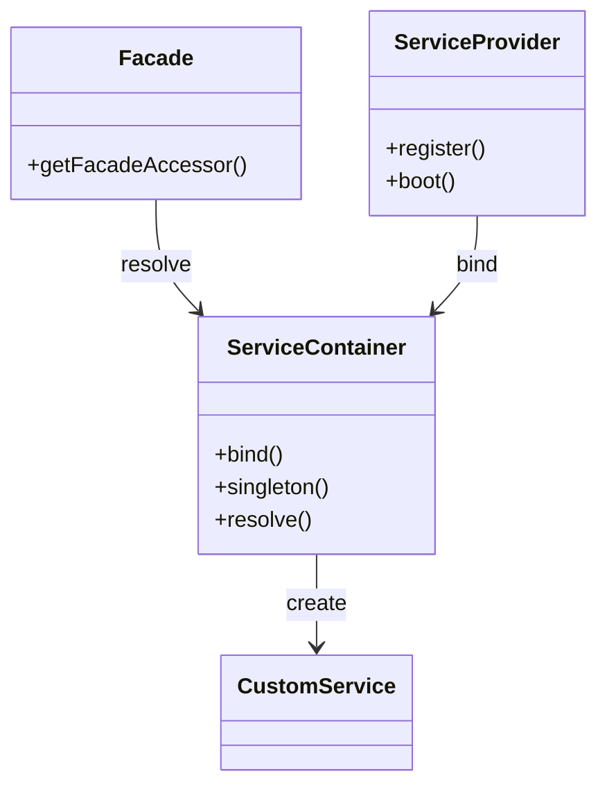

## 11.4 Facades and Service Providers

In the world of PHP frameworks, particularly Laravel, Facades and Service Providers play a crucial role in managing dependencies and simplifying access to services. This section delves into the concepts of Facades and Service Providers, explaining their purpose, how they work, and how to implement them effectively in your PHP applications.

### Facades in Laravel

Facades provide a static interface to classes that are available in the application's service container. They act as a "static proxy" to underlying classes in the service container, allowing you to access services in a more intuitive and readable manner.

#### Simplifying Access to Services

Facades are designed to simplify the way you interact with services in Laravel. Instead of manually resolving services from the container, you can use facades to access them statically. This approach makes your code cleaner and more expressive.

```php
use Illuminate\Support\Facades\Cache;

// Using a facade to access the cache service
Cache::put('key', 'value', $minutes);
```

In the example above, the `Cache` facade provides a static interface to the underlying cache service. This eliminates the need to manually resolve the cache service from the container.

#### How Facades Work Under the Hood

Under the hood, facades are essentially syntactic sugar for accessing services in the Laravel service container. When you call a method on a facade, Laravel resolves the underlying service from the container and calls the method on that service.

Here's a simplified view of how facades work:

1. **Facade Class**: Each facade extends the `Illuminate\Support\Facades\Facade` class.
2. **getFacadeAccessor Method**: This method returns the name of the binding in the service container.
3. **Service Resolution**: When a method is called on the facade, Laravel uses the facade accessor to resolve the underlying service from the container.

```php
namespace Illuminate\Support\Facades;

abstract class Facade {
    protected static function getFacadeAccessor() {
        return 'cache';
    }
}
```

In this example, the `getFacadeAccessor` method returns `'cache'`, which is the key used to resolve the cache service from the container.

### Service Providers

Service Providers are the central place for configuring and bootstrapping application services. They are responsible for binding services into the service container and performing any necessary setup.

#### Bootstrapping Application Services

Service Providers are used to bootstrap application services. This involves registering bindings in the service container and performing any necessary configuration.

```php
namespace App\Providers;

use Illuminate\Support\ServiceProvider;

class AppServiceProvider extends ServiceProvider {
    public function register() {
        // Register bindings in the service container
    }

    public function boot() {
        // Perform any necessary bootstrapping
    }
}
```

In the example above, the `register` method is used to bind services into the container, while the `boot` method is used to perform any necessary setup.

#### Registering Bindings in the Service Container

The service container is a powerful tool for managing class dependencies and performing dependency injection. Service Providers are responsible for registering bindings in the container.

```php
public function register() {
    $this->app->singleton('SomeService', function ($app) {
        return new SomeService();
    });
}
```

In this example, a singleton binding is registered in the container. This ensures that the same instance of `SomeService` is used throughout the application.

### Custom Facades and Providers

Creating custom facades and service providers allows you to extend the functionality of your application and tailor it to your specific needs.

#### Creating Custom Facades

To create a custom facade, you need to define a new facade class that extends `Illuminate\Support\Facades\Facade` and implement the `getFacadeAccessor` method.

```php
namespace App\Facades;

use Illuminate\Support\Facades\Facade;

class CustomFacade extends Facade {
    protected static function getFacadeAccessor() {
        return 'customservice';
    }
}
```

In this example, the `CustomFacade` class provides a static interface to the `customservice` binding in the service container.

#### Writing Service Providers to Configure and Boot Services

Custom service providers allow you to configure and bootstrap services specific to your application.

```php
namespace App\Providers;

use Illuminate\Support\ServiceProvider;
use App\Services\CustomService;

class CustomServiceProvider extends ServiceProvider {
    public function register() {
        $this->app->singleton('customservice', function ($app) {
            return new CustomService();
        });
    }

    public function boot() {
        // Perform any necessary bootstrapping
    }
}
```

In this example, the `CustomServiceProvider` registers a singleton binding for `CustomService` and performs any necessary bootstrapping in the `boot` method.

### Visualizing Facades and Service Providers

To better understand the relationship between facades, service providers, and the service container, let's visualize the process using a class diagram.



In this diagram, we see how the `Facade` interacts with the `ServiceContainer` to resolve services, while the `ServiceProvider` is responsible for binding services into the container.

### Try It Yourself

To solidify your understanding of facades and service providers, try creating a custom facade and service provider in a Laravel application. Experiment with different bindings and configurations to see how they affect the behavior of your application.

### References and Links

- [Laravel Facades Documentation](https://laravel.com/docs/8.x/facades)
- [Laravel Service Providers Documentation](https://laravel.com/docs/8.x/providers)

### Knowledge Check

- What is the purpose of a facade in Laravel?
- How does a facade resolve the underlying service from the container?
- What are the responsibilities of a service provider in Laravel?
- How do you register a binding in the service container?
- What is the difference between the `register` and `boot` methods in a service provider?

### Embrace the Journey

Remember, mastering facades and service providers is just the beginning. As you continue to explore Laravel and other PHP frameworks, you'll discover more powerful tools and patterns that will enhance your development skills. Keep experimenting, stay curious, and enjoy the journey!

## Quiz: Facades and Service Providers



### What is the primary purpose of a facade in Laravel?

- [x] To provide a static interface to services in the container
- [ ] To manage database migrations
- [ ] To handle HTTP requests
- [ ] To perform authentication

> **Explanation:** Facades provide a static interface to services in the Laravel service container, simplifying access to these services.

### How does a facade resolve the underlying service?

- [x] By using the getFacadeAccessor method to determine the service binding
- [ ] By directly accessing the service class
- [ ] By querying the database
- [ ] By using a configuration file

> **Explanation:** The getFacadeAccessor method returns the key used to resolve the service from the container.

### What is the role of a service provider in Laravel?

- [x] To register bindings and bootstrap services
- [ ] To manage user sessions
- [ ] To handle routing
- [ ] To perform data validation

> **Explanation:** Service providers are responsible for registering bindings in the service container and bootstrapping application services.

### Which method in a service provider is used to register bindings?

- [x] register
- [ ] boot
- [ ] resolve
- [ ] bind

> **Explanation:** The register method is used to bind services into the service container.

### What is the difference between the register and boot methods?

- [x] register is for binding services, boot is for performing setup
- [ ] register is for performing setup, boot is for binding services
- [ ] Both methods perform the same function
- [ ] Neither method is used in service providers

> **Explanation:** The register method is used for binding services, while the boot method is used for performing any necessary setup.

### Can you create custom facades in Laravel?

- [x] Yes
- [ ] No

> **Explanation:** You can create custom facades by defining a new facade class and implementing the getFacadeAccessor method.

### What is the purpose of the getFacadeAccessor method?

- [x] To return the key for resolving the service from the container
- [ ] To perform database queries
- [ ] To handle HTTP requests
- [ ] To manage user authentication

> **Explanation:** The getFacadeAccessor method returns the key used to resolve the service from the container.

### How do you register a singleton binding in the service container?

- [x] Using the singleton method
- [ ] Using the bind method
- [ ] Using the resolve method
- [ ] Using the facade method

> **Explanation:** The singleton method is used to register a singleton binding in the service container.

### What is the benefit of using facades in Laravel?

- [x] Simplified and more readable code
- [ ] Increased database performance
- [ ] Enhanced security
- [ ] Faster HTTP response times

> **Explanation:** Facades provide a simplified and more readable way to access services in the service container.

### True or False: Service providers can only be used for binding services.

- [ ] True
- [x] False

> **Explanation:** Service providers are used for both binding services and bootstrapping application services.


