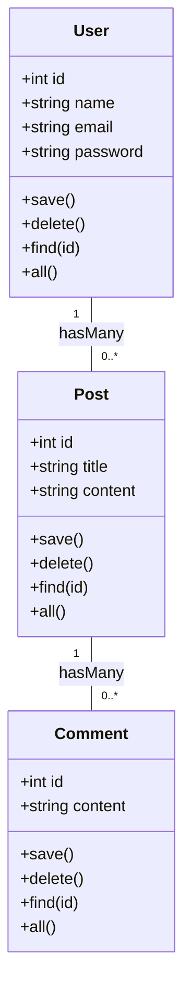

## 11.5 Eloquent ORM and Design Patterns

In the world of PHP frameworks, Eloquent ORM stands out as a powerful tool for database interaction, particularly within the Laravel ecosystem. It simplifies the process of working with databases by implementing the Active Record pattern, among others. In this section, we will delve into how Eloquent ORM leverages design patterns, its key features, and explore alternatives like Doctrine ORM.

### Active Record Pattern

The Active Record pattern is a design pattern that is commonly used in object-relational mapping (ORM) systems. It is a simple and intuitive way to map database tables to PHP classes, allowing developers to interact with the database using object-oriented syntax.

#### How Eloquent Implements the Active Record Pattern

Eloquent ORM, a part of the Laravel framework, implements the Active Record pattern by associating each database table with a corresponding model class. This model class not only represents the data but also contains methods for interacting with the database.

**Key Characteristics of Active Record in Eloquent:**

- **Direct Mapping:** Each model corresponds to a table in the database. For example, a `User` model would typically map to a `users` table.
- **CRUD Operations:** Eloquent models provide methods for creating, reading, updating, and deleting records in the database.
- **Data Encapsulation:** Models encapsulate the data and behavior related to the database table, promoting a clean separation of concerns.

**Example:**

```php
<?php

namespace App\Models;

use Illuminate\Database\Eloquent\Model;

class User extends Model
{
    // The table associated with the model.
    protected $table = 'users';

    // The attributes that are mass assignable.
    protected $fillable = ['name', 'email', 'password'];
}

// Creating a new user
$user = new User();
$user->name = 'John Doe';
$user->email = 'john@example.com';
$user->password = bcrypt('secret');
$user->save();

// Retrieving a user by ID
$user = User::find(1);

// Updating a user
$user->email = 'john.doe@example.com';
$user->save();

// Deleting a user
$user->delete();
```

### Mapping Models to Database Tables

Eloquent uses conventions to map models to database tables. By default, it assumes that the table name is the plural form of the model name. However, this can be customized by specifying the `$table` property in the model.

**Example:**

```php
<?php

namespace App\Models;

use Illuminate\Database\Eloquent\Model;

class Product extends Model
{
    // Custom table name
    protected $table = 'my_products';
}
```

### Eloquent Features

Eloquent ORM offers a rich set of features that enhance its functionality and flexibility. These features include relationships, scopes, accessors, mutators, and integration with the query builder.

#### Relationships

Eloquent makes it easy to define relationships between models. It supports one-to-one, one-to-many, many-to-many, and polymorphic relationships.

**Example: One-to-Many Relationship**

```php
<?php

namespace App\Models;

use Illuminate\Database\Eloquent\Model;

class Post extends Model
{
    public function comments()
    {
        return $this->hasMany(Comment::class);
    }
}

class Comment extends Model
{
    public function post()
    {
        return $this->belongsTo(Post::class);
    }
}

// Retrieving comments for a post
$post = Post::find(1);
$comments = $post->comments;
```

#### Scopes

Scopes allow you to define common query constraints that you can easily reuse throughout your application. There are two types of scopes: local and global.

**Example: Local Scope**

```php
<?php

namespace App\Models;

use Illuminate\Database\Eloquent\Model;

class User extends Model
{
    public function scopeActive($query)
    {
        return $query->where('active', 1);
    }
}

// Using the scope
$activeUsers = User::active()->get();
```

#### Accessors and Mutators

Accessors and mutators allow you to format Eloquent attributes when retrieving or saving them to the database.

**Example:**

```php
<?php

namespace App\Models;

use Illuminate\Database\Eloquent\Model;

class User extends Model
{
    // Accessor for the full name
    public function getFullNameAttribute()
    {
        return "{$this->first_name} {$this->last_name}";
    }

    // Mutator for the password
    public function setPasswordAttribute($value)
    {
        $this->attributes['password'] = bcrypt($value);
    }
}

// Using the accessor
$user = User::find(1);
echo $user->full_name;
```

#### Query Builder Integration

Eloquent integrates seamlessly with Laravel's query builder, allowing you to build complex queries using a fluent interface.

**Example:**

```php
<?php

use App\Models\User;

// Retrieve users with a specific role
$users = User::where('role', 'admin')
             ->orderBy('created_at', 'desc')
             ->take(10)
             ->get();
```

### Design Patterns in Eloquent

Eloquent ORM not only implements the Active Record pattern but can also be used in conjunction with other design patterns such as the Repository and Specification patterns.

#### Utilizing Repository Pattern with Eloquent

The Repository pattern is used to separate the logic that retrieves data from the database from the business logic. This pattern provides a more abstract way to access data, making your application more flexible and testable.

**Example:**

```php
<?php

namespace App\Repositories;

use App\Models\User;

class UserRepository
{
    public function find($id)
    {
        return User::find($id);
    }

    public function all()
    {
        return User::all();
    }

    public function create(array $data)
    {
        return User::create($data);
    }
}

// Using the repository
$userRepo = new UserRepository();
$users = $userRepo->all();
```

#### Utilizing Specification Pattern with Eloquent

The Specification pattern is used to encapsulate business rules and logic in a reusable and combinable way. This pattern can be particularly useful when dealing with complex query conditions.

**Example:**

```php
<?php

namespace App\Specifications;

use Illuminate\Database\Eloquent\Builder;

class ActiveUserSpecification
{
    public function isSatisfiedBy(Builder $query)
    {
        return $query->where('active', 1);
    }
}

// Applying the specification
$spec = new ActiveUserSpecification();
$activeUsers = $spec->isSatisfiedBy(User::query())->get();
```

### Alternatives

While Eloquent is a powerful ORM, there are alternatives that may be more suitable for certain applications. One such alternative is Doctrine ORM, which is commonly used with the Symfony framework.

#### Using Doctrine ORM with Symfony

Doctrine ORM is a more complex and feature-rich ORM that follows the Data Mapper pattern. It provides a higher level of abstraction and flexibility compared to Eloquent.

**Key Features of Doctrine ORM:**

- **Data Mapper Pattern:** Unlike Active Record, the Data Mapper pattern separates the database logic from the domain logic, providing a cleaner separation of concerns.
- **Advanced Query Language:** Doctrine's DQL (Doctrine Query Language) allows for complex queries and supports a wide range of database operations.
- **Caching and Performance:** Doctrine offers built-in caching mechanisms to improve performance.

**Link:** [Doctrine ORM](https://www.doctrine-project.org/projects/orm.html)

### Visualizing Eloquent ORM

To better understand how Eloquent ORM implements the Active Record pattern and interacts with the database, let's visualize the process using a class diagram.



**Diagram Description:** This class diagram illustrates the relationship between `User`, `Post`, and `Comment` models in Eloquent ORM. Each model corresponds to a database table and provides methods for CRUD operations. The `User` model has a one-to-many relationship with the `Post` model, and the `Post` model has a one-to-many relationship with the `Comment` model.

### Knowledge Check

- **Question:** What design pattern does Eloquent ORM primarily implement?
- **Question:** How can you customize the table name associated with an Eloquent model?
- **Question:** What are accessors and mutators used for in Eloquent?
- **Question:** How does the Repository pattern benefit an application using Eloquent?

### Embrace the Journey

Remember, mastering Eloquent ORM and design patterns is a journey. As you continue to explore and experiment, you'll gain a deeper understanding of how these patterns can enhance your PHP applications. Keep experimenting, stay curious, and enjoy the journey!

## Quiz: Eloquent ORM and Design Patterns



### What design pattern does Eloquent ORM primarily implement?

- [x] Active Record
- [ ] Data Mapper
- [ ] Singleton
- [ ] Factory

> **Explanation:** Eloquent ORM implements the Active Record pattern, which maps database tables to PHP classes.

### How can you customize the table name associated with an Eloquent model?

- [x] By setting the `$table` property in the model
- [ ] By using a custom query
- [ ] By modifying the database schema
- [ ] By changing the model name

> **Explanation:** The `$table` property in an Eloquent model allows you to specify a custom table name.

### What are accessors and mutators used for in Eloquent?

- [x] Formatting attributes when retrieving or saving them
- [ ] Defining relationships between models
- [ ] Creating database migrations
- [ ] Managing database transactions

> **Explanation:** Accessors and mutators in Eloquent are used to format attributes when retrieving or saving them to the database.

### How does the Repository pattern benefit an application using Eloquent?

- [x] It separates data retrieval logic from business logic
- [ ] It enhances database performance
- [ ] It simplifies database migrations
- [ ] It provides built-in caching

> **Explanation:** The Repository pattern separates data retrieval logic from business logic, making the application more flexible and testable.

### Which of the following is a feature of Doctrine ORM?

- [x] Data Mapper Pattern
- [ ] Active Record Pattern
- [ ] Singleton Pattern
- [ ] Factory Pattern

> **Explanation:** Doctrine ORM follows the Data Mapper pattern, which separates database logic from domain logic.

### What type of relationship does Eloquent support?

- [x] One-to-One
- [x] One-to-Many
- [x] Many-to-Many
- [ ] Singleton

> **Explanation:** Eloquent supports various types of relationships, including one-to-one, one-to-many, and many-to-many.

### What is the purpose of scopes in Eloquent?

- [x] To define common query constraints
- [ ] To manage database transactions
- [ ] To create database migrations
- [ ] To handle database connections

> **Explanation:** Scopes in Eloquent are used to define common query constraints that can be reused throughout the application.

### Which pattern can be used with Eloquent to encapsulate business rules?

- [x] Specification Pattern
- [ ] Singleton Pattern
- [ ] Factory Pattern
- [ ] Observer Pattern

> **Explanation:** The Specification pattern can be used with Eloquent to encapsulate business rules in a reusable and combinable way.

### What is a key advantage of using Eloquent ORM?

- [x] Simplifies database interaction with object-oriented syntax
- [ ] Provides built-in caching
- [ ] Enhances database security
- [ ] Automatically scales applications

> **Explanation:** Eloquent ORM simplifies database interaction by allowing developers to use object-oriented syntax to interact with the database.

### True or False: Eloquent ORM can only be used with the Laravel framework.

- [x] False
- [ ] True

> **Explanation:** While Eloquent ORM is a part of the Laravel framework, it can be used independently in other PHP applications.


