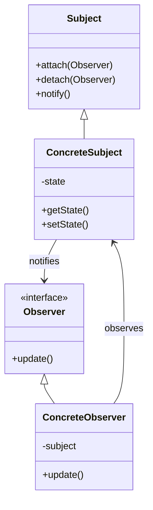

## 11.6 Event Handling and Observer Pattern

In modern PHP development, the Event Handling and Observer Pattern play a crucial role in creating decoupled and maintainable applications. This section will guide you through understanding and implementing these patterns in popular PHP frameworks like Laravel and Symfony.

### Event System in Laravel and Symfony

#### Dispatching and Listening to Events

Events are a powerful way to decouple different parts of an application. They allow you to trigger actions in response to specific occurrences within your application. Both Laravel and Symfony provide robust event systems that make it easy to dispatch and listen to events.

**Laravel Event System**

In Laravel, events are typically used to alert other parts of your application that something has happened. Laravel provides a simple API for defining, dispatching, and listening to events.

1. **Defining Events**

   To define an event in Laravel, you can use the `php artisan make:event` command:

   ```bash
   php artisan make:event UserRegistered
   ```

   This command creates a new event class in the `App\Events` directory. Here’s a simple example of an event class:

   ```php
   <?php

   namespace App\Events;

   use Illuminate\Foundation\Events\Dispatchable;
   use Illuminate\Queue\SerializesModels;

   class UserRegistered
   {
       use Dispatchable, SerializesModels;

       public $user;

       public function __construct($user)
       {
           $this->user = $user;
       }
   }
   ```

2. **Dispatching Events**

   Once an event is defined, you can dispatch it using the `event` helper function or the `Event` facade:

   ```php
   event(new UserRegistered($user));
   ```

3. **Listening to Events**

   To listen to an event, you need to define a listener. You can create a listener using the `php artisan make:listener` command:

   ```bash
   php artisan make:listener SendWelcomeEmail
   ```

   Here’s an example of a listener class:

   ```php
   <?php

   namespace App\Listeners;

   use App\Events\UserRegistered;
   use Illuminate\Contracts\Queue\ShouldQueue;
   use Illuminate\Queue\InteractsWithQueue;
   use Mail;

   class SendWelcomeEmail implements ShouldQueue
   {
       use InteractsWithQueue;

       public function handle(UserRegistered $event)
       {
           Mail::to($event->user->email)->send(new WelcomeEmail($event->user));
       }
   }
   ```

   Finally, register the event and listener in the `EventServiceProvider`:

   ```php
   protected $listen = [
       UserRegistered::class => [
           SendWelcomeEmail::class,
       ],
   ];
   ```

**Symfony Event System**

Symfony uses an event dispatcher component to manage events. It provides a flexible way to decouple different parts of an application.

1. **Defining Events**

   In Symfony, events are usually defined as classes that extend the `Event` class. Here’s an example:

   ```php
   <?php

   namespace App\Event;

   use Symfony\Contracts\EventDispatcher\Event;

   class UserRegisteredEvent extends Event
   {
       public const NAME = 'user.registered';

       protected $user;

       public function __construct($user)
       {
           $this->user = $user;
       }

       public function getUser()
       {
           return $this->user;
       }
   }
   ```

2. **Dispatching Events**

   To dispatch an event, use the `dispatch` method of the event dispatcher service:

   ```php
   $event = new UserRegisteredEvent($user);
   $dispatcher->dispatch($event, UserRegisteredEvent::NAME);
   ```

3. **Listening to Events**

   To listen to an event, create a subscriber class that implements `EventSubscriberInterface`:

   ```php
   <?php

   namespace App\EventSubscriber;

   use App\Event\UserRegisteredEvent;
   use Symfony\Component\EventDispatcher\EventSubscriberInterface;

   class UserRegisteredSubscriber implements EventSubscriberInterface
   {
       public static function getSubscribedEvents()
       {
           return [
               UserRegisteredEvent::NAME => 'onUserRegistered',
           ];
       }

       public function onUserRegistered(UserRegisteredEvent $event)
       {
           // Handle the event
       }
   }
   ```

   Register the subscriber as a service in your Symfony application.

#### Implementing Custom Events and Listeners

Both Laravel and Symfony allow you to create custom events and listeners to handle specific application logic. This flexibility enables you to extend the functionality of your application without modifying existing code.

### Observer Pattern

The Observer Pattern is a behavioral design pattern that allows an object, known as the subject, to maintain a list of its dependents, called observers, and notify them of any state changes. This pattern is particularly useful for implementing event-driven systems.

#### Attaching Observers to Models for Lifecycle Events

In PHP frameworks like Laravel, the Observer Pattern is often used to attach observers to models to handle lifecycle events such as creating, updating, and deleting.

**Laravel Model Observers**

Laravel provides a convenient way to hook into the lifecycle of a model using observers. Observers are classes that group event handlers for a model.

1. **Creating an Observer**

   You can create an observer using the `php artisan make:observer` command:

   ```bash
   php artisan make:observer UserObserver
   ```

   Here’s an example of an observer class:

   ```php
   <?php

   namespace App\Observers;

   use App\Models\User;

   class UserObserver
   {
       public function creating(User $user)
       {
           // Logic before a user is created
       }

       public function updating(User $user)
       {
           // Logic before a user is updated
       }

       public function deleting(User $user)
       {
           // Logic before a user is deleted
       }
   }
   ```

2. **Registering an Observer**

   To register an observer, use the `observe` method on the model in the `boot` method of a service provider:

   ```php
   use App\Models\User;
   use App\Observers\UserObserver;

   User::observe(UserObserver::class);
   ```

**Symfony Model Events**

In Symfony, you can achieve similar functionality using Doctrine lifecycle callbacks or event listeners. Here’s an example using Doctrine:

1. **Defining Lifecycle Callbacks**

   You can define lifecycle callbacks in your entity class using annotations:

   ```php
   <?php

   namespace App\Entity;

   use Doctrine\ORM\Mapping as ORM;

   /**
    * @ORM\Entity
    * @ORM\HasLifecycleCallbacks
    */
   class User
   {
       /**
        * @ORM\PrePersist
        */
       public function onPrePersist()
       {
           // Logic before the entity is persisted
       }

       /**
        * @ORM\PreUpdate
        */
       public function onPreUpdate()
       {
           // Logic before the entity is updated
       }
   }
   ```

2. **Using Event Listeners**

   Alternatively, you can use event listeners to handle entity events:

   ```php
   <?php

   namespace App\EventListener;

   use Doctrine\ORM\Event\LifecycleEventArgs;
   use App\Entity\User;

   class UserListener
   {
       public function prePersist(User $user, LifecycleEventArgs $args)
       {
           // Logic before the entity is persisted
       }

       public function preUpdate(User $user, LifecycleEventArgs $args)
       {
           // Logic before the entity is updated
       }
   }
   ```

   Register the listener as a service in your Symfony application.

### Use Cases

The Event Handling and Observer Pattern are widely used in various scenarios, including:

- **Logging:** Automatically log changes to models or specific actions within the application.
- **Notifications:** Send notifications to users when certain events occur, such as user registration or order completion.
- **Caching:** Invalidate or update cache entries when data changes, ensuring that users always see the most up-to-date information.

### Visualizing the Observer Pattern

To better understand the Observer Pattern, let's visualize it using a class diagram:



In this diagram, the `Subject` maintains a list of `Observer` objects and notifies them of any state changes. The `ConcreteSubject` is a specific implementation of the `Subject`, and the `ConcreteObserver` is a specific implementation of the `Observer`.

### PHP Unique Features

PHP's dynamic nature and extensive framework support make it an excellent choice for implementing the Event Handling and Observer Pattern. Features like closures, anonymous classes, and traits can be leveraged to create flexible and reusable event systems.

### Differences and Similarities

The Event Handling and Observer Pattern are often confused due to their similar purposes. However, the key difference lies in their implementation:

- **Event Handling** is typically framework-specific and involves dispatching and listening to events.
- **Observer Pattern** is a design pattern that can be implemented in any language or framework, focusing on maintaining a list of observers and notifying them of changes.

### Try It Yourself

To solidify your understanding, try modifying the code examples provided:

- Add additional events and listeners in Laravel or Symfony.
- Implement a new observer for a different model lifecycle event.
- Experiment with different use cases, such as logging or caching.

### Knowledge Check

- What are the key differences between event handling and the observer pattern?
- How can you create custom events and listeners in Laravel?
- What are some common use cases for the observer pattern?

### Embrace the Journey

Remember, mastering the Event Handling and Observer Pattern is just one step in your PHP development journey. Keep experimenting, stay curious, and enjoy the process of building robust and maintainable applications.

## Quiz: Event Handling and Observer Pattern



### What is the primary purpose of the Observer Pattern?

- [x] To allow an object to notify other objects of state changes
- [ ] To manage database connections
- [ ] To handle user authentication
- [ ] To optimize application performance

> **Explanation:** The Observer Pattern allows an object, known as the subject, to notify other objects, called observers, of any state changes.

### How do you dispatch an event in Laravel?

- [x] Using the `event` helper function
- [ ] Using the `dispatch` method on the event class
- [ ] Using the `send` method on the event class
- [ ] Using the `trigger` method on the event class

> **Explanation:** In Laravel, you can dispatch an event using the `event` helper function or the `Event` facade.

### Which interface must a Symfony event subscriber implement?

- [x] EventSubscriberInterface
- [ ] EventListenerInterface
- [ ] EventHandlerInterface
- [ ] EventObserverInterface

> **Explanation:** In Symfony, an event subscriber must implement the `EventSubscriberInterface`.

### What is a common use case for the Observer Pattern?

- [x] Logging changes to a model
- [ ] Managing user sessions
- [ ] Rendering HTML templates
- [ ] Compiling CSS files

> **Explanation:** A common use case for the Observer Pattern is logging changes to a model or specific actions within an application.

### How can you create an observer in Laravel?

- [x] Using the `php artisan make:observer` command
- [ ] Using the `php artisan make:event` command
- [ ] Using the `php artisan make:listener` command
- [ ] Using the `php artisan make:subscriber` command

> **Explanation:** In Laravel, you can create an observer using the `php artisan make:observer` command.

### What is the role of an event dispatcher in Symfony?

- [x] To manage the dispatching and handling of events
- [ ] To manage database transactions
- [ ] To handle user authentication
- [ ] To optimize application performance

> **Explanation:** In Symfony, the event dispatcher is responsible for managing the dispatching and handling of events.

### Which of the following is a lifecycle event in Laravel?

- [x] Creating
- [ ] Authenticating
- [ ] Compiling
- [ ] Rendering

> **Explanation:** In Laravel, `creating` is a lifecycle event that occurs before a model is created.

### What is the purpose of the `notify` method in the Observer Pattern?

- [x] To inform observers of changes in the subject
- [ ] To update the subject's state
- [ ] To delete the subject
- [ ] To create a new observer

> **Explanation:** The `notify` method in the Observer Pattern is used to inform observers of changes in the subject.

### How do you register an observer in Laravel?

- [x] Using the `observe` method on the model
- [ ] Using the `attach` method on the model
- [ ] Using the `register` method on the model
- [ ] Using the `add` method on the model

> **Explanation:** In Laravel, you register an observer using the `observe` method on the model.

### True or False: The Observer Pattern is only applicable in PHP.

- [ ] True
- [x] False

> **Explanation:** False. The Observer Pattern is a design pattern that can be implemented in any programming language or framework.


