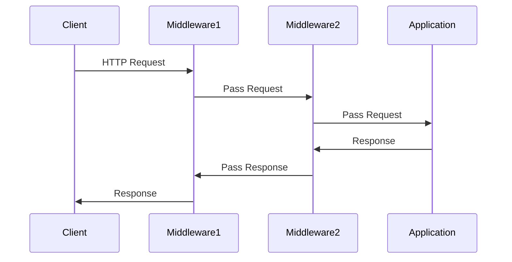

## 11.7 Middleware and Chain of Responsibility

In modern PHP frameworks, middleware and the Chain of Responsibility design pattern play a crucial role in handling HTTP requests and responses. This section delves into the concepts of middleware, its implementation in popular PHP frameworks like Laravel and Symfony, and how it embodies the Chain of Responsibility pattern.

### Middleware Concept

Middleware is a software layer that intercepts and processes HTTP requests and responses. It acts as a bridge between the client and server, allowing developers to add functionality to the request/response cycle without altering the core application logic. Middleware is often used for tasks such as authentication, logging, and request validation.

#### Key Characteristics of Middleware

- **Interception**: Middleware can intercept HTTP requests before they reach the application logic and responses before they are sent back to the client.
- **Layered Processing**: Middleware components are organized in a stack, allowing requests to pass through each layer sequentially.
- **Modularity**: Middleware promotes modularity by encapsulating specific functionalities, making it easier to manage and maintain code.

### Implementing Middleware

Middleware can be implemented in various PHP frameworks, each providing its own mechanisms for creating and managing middleware components. Let's explore how to implement middleware in Laravel and Symfony.

#### Creating Custom Middleware in Laravel

Laravel provides a simple and intuitive way to create middleware. Middleware in Laravel is essentially a class that implements the `handle` method, which receives the request and a closure representing the next middleware in the stack.

```php
<?php

namespace App\Http\Middleware;

use Closure;

class CheckAge
{
    /**
     * Handle an incoming request.
     *
     * @param  \Illuminate\Http\Request  $request
     * @param  \Closure  $next
     * @return mixed
     */
    public function handle($request, Closure $next)
    {
        if ($request->age < 18) {
            return redirect('home');
        }

        return $next($request);
    }
}
```

In this example, the `CheckAge` middleware checks if the user's age is less than 18 and redirects them to the home page if true. Otherwise, it passes the request to the next middleware.

#### Registering Middleware in Laravel

Once created, middleware must be registered in the kernel. Laravel provides two types of middleware registration: global and route-specific.

- **Global Middleware**: Registered in the `$middleware` array in `app/Http/Kernel.php`, affecting every HTTP request.
- **Route Middleware**: Registered in the `$routeMiddleware` array, allowing you to assign middleware to specific routes or route groups.

```php
protected $routeMiddleware = [
    'check.age' => \App\Http\Middleware\CheckAge::class,
];
```

#### Creating Custom Middleware in Symfony

In Symfony, middleware is implemented using event listeners or subscribers. Symfony's HTTP kernel dispatches events during the request/response cycle, allowing developers to hook into these events.

```php
<?php

namespace App\EventListener;

use Symfony\Component\HttpKernel\Event\RequestEvent;

class CheckAgeListener
{
    public function onKernelRequest(RequestEvent $event)
    {
        $request = $event->getRequest();
        if ($request->get('age') < 18) {
            $event->setResponse(new RedirectResponse('/home'));
        }
    }
}
```

In this example, the `CheckAgeListener` listens for the `kernel.request` event and redirects users under 18 to the home page.

#### Registering Middleware in Symfony

To register the event listener, you need to define it as a service and tag it with the appropriate event.

```yaml
# config/services.yaml
services:
    App\EventListener\CheckAgeListener:
        tags:
            - { name: kernel.event_listener, event: kernel.request }
```

### Ordering and Grouping Middleware

The order in which middleware is executed is crucial, as it can affect the application's behavior. Both Laravel and Symfony allow you to control the order of middleware execution.

#### Middleware Ordering in Laravel

In Laravel, middleware is executed in the order they are listed in the kernel. For route middleware, the order is determined by the order in which they are applied to routes.

```php
Route::get('profile', function () {
    // ...
})->middleware(['auth', 'check.age']);
```

In this example, the `auth` middleware is executed before `check.age`.

#### Middleware Ordering in Symfony

In Symfony, the order of event listeners is determined by their priority. Higher priority listeners are executed first.

```yaml
# config/services.yaml
services:
    App\EventListener\CheckAgeListener:
        tags:
            - { name: kernel.event_listener, event: kernel.request, priority: 10 }
```

### Chain of Responsibility Pattern

The Chain of Responsibility is a behavioral design pattern that allows an object to pass a request along a chain of handlers. Each handler decides whether to process the request or pass it to the next handler in the chain.

#### Middleware as Chain of Responsibility

Middleware follows the Chain of Responsibility pattern by allowing requests to pass through a series of middleware components. Each middleware can either handle the request or pass it to the next middleware.

#### Key Participants

- **Handler**: Each middleware component acts as a handler.
- **Request**: The HTTP request object.
- **Next Handler**: The next middleware in the chain.

#### Applicability

- **Decoupling**: Middleware decouples request processing logic from the core application.
- **Flexibility**: Easily add, remove, or reorder middleware components.
- **Reusability**: Middleware components can be reused across different applications.

### Examples of Middleware

Middleware is commonly used for tasks such as authentication, CSRF protection, and logging. Let's explore these examples in the context of Laravel and Symfony.

#### Authentication Middleware

Authentication middleware ensures that only authenticated users can access certain routes.

**Laravel Example:**

```php
<?php

namespace App\Http\Middleware;

use Closure;
use Illuminate\Support\Facades\Auth;

class Authenticate
{
    public function handle($request, Closure $next)
    {
        if (!Auth::check()) {
            return redirect('login');
        }

        return $next($request);
    }
}
```

**Symfony Example:**

```php
<?php

namespace App\EventListener;

use Symfony\Component\HttpKernel\Event\RequestEvent;
use Symfony\Component\HttpFoundation\RedirectResponse;
use Symfony\Component\Security\Core\Security;

class AuthenticateListener
{
    private $security;

    public function __construct(Security $security)
    {
        $this->security = $security;
    }

    public function onKernelRequest(RequestEvent $event)
    {
        if (!$this->security->isGranted('IS_AUTHENTICATED_FULLY')) {
            $event->setResponse(new RedirectResponse('/login'));
        }
    }
}
```

#### CSRF Protection Middleware

CSRF protection middleware prevents cross-site request forgery attacks by verifying tokens in requests.

**Laravel Example:**

Laravel provides built-in CSRF protection middleware, which is automatically applied to web routes.

**Symfony Example:**

In Symfony, CSRF protection is typically handled by form components, but custom middleware can be implemented for API requests.

#### Logging Middleware

Logging middleware records information about each request and response for auditing and debugging purposes.

**Laravel Example:**

```php
<?php

namespace App\Http\Middleware;

use Closure;
use Illuminate\Support\Facades\Log;

class LogRequests
{
    public function handle($request, Closure $next)
    {
        Log::info('Request URL: ' . $request->url());
        return $next($request);
    }
}
```

**Symfony Example:**

```php
<?php

namespace App\EventListener;

use Symfony\Component\HttpKernel\Event\RequestEvent;
use Psr\Log\LoggerInterface;

class LogRequestsListener
{
    private $logger;

    public function __construct(LoggerInterface $logger)
    {
        $this->logger = $logger;
    }

    public function onKernelRequest(RequestEvent $event)
    {
        $request = $event->getRequest();
        $this->logger->info('Request URL: ' . $request->getUri());
    }
}
```

### Visualizing Middleware and Chain of Responsibility

To better understand how middleware and the Chain of Responsibility pattern work, let's visualize the process using a sequence diagram.



This diagram illustrates how a request flows through multiple middleware components before reaching the application and how the response is passed back through the middleware stack.

### PHP Unique Features

PHP's flexibility and extensive framework support make it an ideal language for implementing middleware and the Chain of Responsibility pattern. Features like closures, traits, and interfaces enhance the modularity and reusability of middleware components.

### Differences and Similarities

Middleware and the Chain of Responsibility pattern share similarities in their approach to handling requests through a series of handlers. However, middleware is specifically designed for HTTP request/response processing, while the Chain of Responsibility pattern can be applied to various types of request handling scenarios.

### Try It Yourself

Experiment with the provided code examples by modifying the middleware logic or adding new middleware components. Try creating middleware for tasks like caching, rate limiting, or custom header processing.

### Knowledge Check

- Explain how middleware implements the Chain of Responsibility pattern.
- Describe the process of creating and registering middleware in Laravel and Symfony.
- Discuss the importance of middleware ordering and how it affects application behavior.

### Embrace the Journey

Remember, mastering middleware and the Chain of Responsibility pattern is just the beginning. As you continue to explore PHP frameworks, you'll discover more advanced techniques for building robust and scalable applications. Keep experimenting, stay curious, and enjoy the journey!

## Quiz: Middleware and Chain of Responsibility



### What is the primary role of middleware in PHP frameworks?

- [x] Intercepting and processing HTTP requests and responses
- [ ] Managing database connections
- [ ] Handling file uploads
- [ ] Rendering HTML templates

> **Explanation:** Middleware is designed to intercept and process HTTP requests and responses, allowing developers to add functionality to the request/response cycle.

### How does middleware follow the Chain of Responsibility pattern?

- [x] By passing requests through a series of handlers
- [ ] By managing database transactions
- [ ] By rendering views
- [ ] By handling file uploads

> **Explanation:** Middleware follows the Chain of Responsibility pattern by passing requests through a series of handlers, each capable of processing the request or passing it to the next handler.

### In Laravel, where is global middleware registered?

- [x] In the `$middleware` array in `app/Http/Kernel.php`
- [ ] In the `routes/web.php` file
- [ ] In the `config/app.php` file
- [ ] In the `resources/views` directory

> **Explanation:** Global middleware in Laravel is registered in the `$middleware` array in `app/Http/Kernel.php`, affecting every HTTP request.

### What is the purpose of the `handle` method in Laravel middleware?

- [x] To process the request and determine if it should be passed to the next middleware
- [ ] To render HTML templates
- [ ] To manage database connections
- [ ] To handle file uploads

> **Explanation:** The `handle` method in Laravel middleware processes the request and determines if it should be passed to the next middleware in the stack.

### How is middleware ordered in Symfony?

- [x] By setting the priority of event listeners
- [ ] By the order of registration in `routes.yaml`
- [ ] By the order of service definitions in `services.yaml`
- [ ] By the order of files in the `src` directory

> **Explanation:** In Symfony, middleware is ordered by setting the priority of event listeners, with higher priority listeners executed first.

### Which of the following is a common use case for middleware?

- [x] Authentication
- [ ] Rendering views
- [ ] Compiling assets
- [ ] Managing database migrations

> **Explanation:** Middleware is commonly used for tasks such as authentication, logging, and request validation.

### What is the role of the `next` parameter in Laravel middleware?

- [x] It represents the next middleware in the stack
- [ ] It is used to manage database transactions
- [ ] It is used to render views
- [ ] It is used to handle file uploads

> **Explanation:** The `next` parameter in Laravel middleware represents the next middleware in the stack, allowing the current middleware to pass the request along.

### How can middleware be reused across different applications?

- [x] By encapsulating specific functionalities in modular components
- [ ] By hardcoding logic into the application
- [ ] By using global variables
- [ ] By duplicating code in each application

> **Explanation:** Middleware can be reused across different applications by encapsulating specific functionalities in modular components, promoting reusability and maintainability.

### What is a key benefit of using middleware in PHP frameworks?

- [x] Modularity and separation of concerns
- [ ] Faster database queries
- [ ] Simplified HTML rendering
- [ ] Easier file uploads

> **Explanation:** Middleware promotes modularity and separation of concerns by encapsulating specific functionalities, making it easier to manage and maintain code.

### True or False: Middleware can only be used for authentication purposes.

- [ ] True
- [x] False

> **Explanation:** False. Middleware can be used for a variety of purposes, including authentication, logging, request validation, and more.




