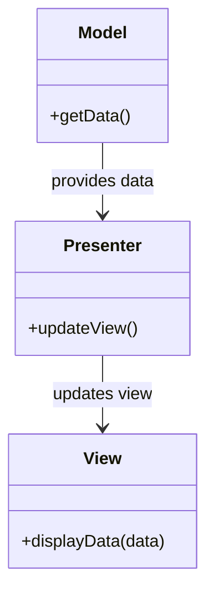

## 11.8 Templating Engines and View Patterns

In modern PHP development, templating engines play a crucial role in separating the presentation layer from the business logic. This separation not only enhances code maintainability but also allows developers to create more dynamic and reusable components. In this section, we will explore two popular templating engines in PHP: Blade and Twig. We'll also delve into view patterns, such as the Presenter and ViewModel patterns, which further enhance the functionality and maintainability of views.

### Blade Templating Engine (Laravel)

Blade is the templating engine provided by Laravel, one of the most popular PHP frameworks. It offers a simple yet powerful syntax for creating dynamic web pages. Blade templates are compiled into plain PHP code and cached until they are modified, ensuring that your application runs efficiently.

#### Key Features of Blade

1. **Template Inheritance**: Blade allows you to define a master template that can be extended by other templates. This feature is particularly useful for maintaining a consistent layout across multiple pages.

   ```php
   <!-- resources/views/layouts/app.blade.php -->
   <!DOCTYPE html>
   <html>
   <head>
       <title>App Name - @yield('title')</title>
   </head>
   <body>
       <div class="container">
           @yield('content')
       </div>
   </body>
   </html>
   ```

   ```php
   <!-- resources/views/child.blade.php -->
   @extends('layouts.app')

   @section('title', 'Page Title')

   @section('content')
       <p>This is my body content.</p>
   @endsection
   ```

2. **Sections and Components**: Blade provides a way to define sections within your templates, which can be filled by child templates. Components allow you to create reusable pieces of UI.

   ```php
   <!-- resources/views/components/alert.blade.php -->
   <div class="alert alert-{{ $type }}">
       {{ $message }}
   </div>
   ```

   ```php
   <!-- Usage in a Blade template -->
   @component('components.alert', ['type' => 'danger', 'message' => 'This is an alert!'])
   @endcomponent
   ```

3. **Control Structures**: Blade offers a clean syntax for control structures such as loops and conditionals.

   ```php
   @if ($user->isAdmin())
       <p>Welcome, Admin!</p>
   @else
       <p>Welcome, User!</p>
   @endif

   @foreach ($users as $user)
       <p>This is user {{ $user->id }}</p>
   @endforeach
   ```

4. **Data Binding**: Blade allows you to easily bind data to your views using curly braces.

   ```php
   <h1>Hello, {{ $name }}</h1>
   ```

5. **Security**: Blade automatically escapes data to prevent XSS attacks, ensuring that your application is secure by default.

#### Blade in Action

Let's create a simple Laravel application to demonstrate the use of Blade templates. We'll build a basic blog application with a homepage and a post detail page.

1. **Setting Up Laravel**: First, install Laravel using Composer.

   ```bash
   composer create-project --prefer-dist laravel/laravel blog
   ```

2. **Creating Routes**: Define routes for the homepage and post detail page in `routes/web.php`.

   ```php
   Route::get('/', function () {
       return view('welcome');
   });

   Route::get('/post/{id}', function ($id) {
       $post = App\Models\Post::find($id);
       return view('post', ['post' => $post]);
   });
   ```

3. **Creating Blade Templates**: Create Blade templates for the homepage and post detail page.

   ```php
   <!-- resources/views/welcome.blade.php -->
   @extends('layouts.app')

   @section('title', 'Home')

   @section('content')
       <h1>Welcome to the Blog</h1>
       <ul>
           @foreach ($posts as $post)
               <li><a href="/post/{{ $post->id }}">{{ $post->title }}</a></li>
           @endforeach
       </ul>
   @endsection
   ```

   ```php
   <!-- resources/views/post.blade.php -->
   @extends('layouts.app')

   @section('title', $post->title)

   @section('content')
       <h1>{{ $post->title }}</h1>
       <p>{{ $post->content }}</p>
   @endsection
   ```

4. **Running the Application**: Start the Laravel development server and visit the homepage.

   ```bash
   php artisan serve
   ```

   Open your browser and navigate to `http://localhost:8000` to see your Blade templates in action.

For more information on Blade, visit the [Blade Templates](https://laravel.com/docs/blade) documentation.

### Twig Templating Engine (Symfony)

Twig is the templating engine used by Symfony, another popular PHP framework. It is known for its flexibility, speed, and security. Twig syntax is similar to other templating engines, making it easy to learn and use.

#### Key Features of Twig

1. **Syntax**: Twig uses a simple and intuitive syntax that is easy to read and write.

   ```twig
   <h1>{{ title }}</h1>
   ```

2. **Filters**: Twig provides a wide range of filters to modify data before rendering it.

   ```twig
   <p>{{ name|upper }}</p>
   ```

3. **Extensions**: Twig can be extended with custom functions, filters, and tags.

4. **Security**: Twig automatically escapes variables to prevent XSS attacks.

5. **Inheritance**: Like Blade, Twig supports template inheritance, allowing you to define base templates and extend them in child templates.

   ```twig
   {# templates/base.html.twig #}
   <!DOCTYPE html>
   <html>
   <head>
       <title>Welcome!</title>
   </head>
   <body>
       <div class="container">
           
       </div>
   </body>
   </html>
   ```

   ```twig
   {# templates/index.html.twig #}
   

   Home

   
       <h1>Welcome to the Blog</h1>
   
   ```

#### Twig in Action

Let's create a simple Symfony application to demonstrate the use of Twig templates. We'll build a basic blog application with a homepage and a post detail page.

1. **Setting Up Symfony**: First, install Symfony using Composer.

   ```bash
   composer create-project symfony/skeleton blog
   ```

2. **Creating Routes**: Define routes for the homepage and post detail page in `config/routes.yaml`.

   ```yaml
   index:
       path: /
       controller: App\Controller\BlogController::index

   post_show:
       path: /post/{id}
       controller: App\Controller\BlogController::show
   ```

3. **Creating Twig Templates**: Create Twig templates for the homepage and post detail page.

   ```twig
   {# templates/blog/index.html.twig #}
   

   Home

   
       <h1>Welcome to the Blog</h1>
       <ul>
           
               <li><a href="{{ path('post_show', {'id': post.id}) }}">{{ post.title }}</a></li>
           
       </ul>
   
   ```

   ```twig
   {# templates/blog/show.html.twig #}
   

   {{ post.title }}

   
       <h1>{{ post.title }}</h1>
       <p>{{ post.content }}</p>
   
   ```

4. **Running the Application**: Start the Symfony development server and visit the homepage.

   ```bash
   symfony server:start
   ```

   Open your browser and navigate to `http://localhost:8000` to see your Twig templates in action.

For more information on Twig, visit the [Twig - The flexible, fast, and secure template engine](https://twig.symfony.com/) documentation.

### View Patterns

View patterns are design patterns that help manage the presentation layer of an application. They provide a way to separate the view logic from the business logic, making the code more maintainable and testable.

#### Presenter Pattern

The Presenter pattern is a variation of the Model-View-Presenter (MVP) pattern. In this pattern, the Presenter acts as an intermediary between the View and the Model. It retrieves data from the Model and formats it for display in the View.

- **Intent**: Separate the presentation logic from the business logic.
- **Key Participants**:
  - **Model**: Represents the data and business logic.
  - **View**: Displays the data to the user.
  - **Presenter**: Retrieves data from the Model and formats it for the View.

#### ViewModel Pattern

The ViewModel pattern is a variation of the Model-View-ViewModel (MVVM) pattern. In this pattern, the ViewModel acts as an abstraction of the View. It exposes data and commands to the View, allowing it to bind to them.

- **Intent**: Provide a clear separation between the UI and the business logic.
- **Key Participants**:
  - **Model**: Represents the data and business logic.
  - **View**: Displays the data to the user.
  - **ViewModel**: Exposes data and commands to the View.

### Implementing View Patterns

Let's implement a simple example of the Presenter pattern in PHP.

1. **Define the Model**: Create a simple model class to represent a blog post.

   ```php
   class Post
   {
       private $title;
       private $content;

       public function __construct($title, $content)
       {
           $this->title = $title;
           $this->content = $content;
       }

       public function getTitle()
       {
           return $this->title;
       }

       public function getContent()
       {
           return $this->content;
       }
   }
   ```

2. **Define the View**: Create a simple view class to display the blog post.

   ```php
   class PostView
   {
       public function render($title, $content)
       {
           echo "<h1>$title</h1>";
           echo "<p>$content</p>";
       }
   }
   ```

3. **Define the Presenter**: Create a presenter class to retrieve data from the model and format it for the view.

   ```php
   class PostPresenter
   {
       private $post;
       private $view;

       public function __construct($post, $view)
       {
           $this->post = $post;
           $this->view = $view;
       }

       public function present()
       {
           $title = strtoupper($this->post->getTitle());
           $content = nl2br($this->post->getContent());
           $this->view->render($title, $content);
       }
   }
   ```

4. **Using the Presenter**: Create a post, a view, and a presenter, and render the post.

   ```php
   $post = new Post("Hello World", "This is the content of the post.");
   $view = new PostView();
   $presenter = new PostPresenter($post, $view);
   $presenter->present();
   ```

### Try It Yourself

Experiment with the code examples provided in this section. Try modifying the templates, adding new features, or implementing additional view patterns. Remember, practice is key to mastering these concepts.

### Visualizing Templating Engines and View Patterns

Below is a diagram illustrating the interaction between the Model, View, and Presenter in the Presenter pattern.



### References and Links

- [Blade Templates](https://laravel.com/docs/blade)
- [Twig - The flexible, fast, and secure template engine](https://twig.symfony.com/)
- [Model-View-Presenter Pattern](https://en.wikipedia.org/wiki/Model%E2%80%93view%E2%80%93presenter)
- [Model-View-ViewModel Pattern](https://en.wikipedia.org/wiki/Model%E2%80%93view%E2%80%93viewmodel)

### Knowledge Check

- What are the key features of the Blade templating engine?
- How does Twig ensure security in templates?
- What is the role of the Presenter in the Presenter pattern?
- How can you extend a base template in Blade and Twig?

### Embrace the Journey

Remember, this is just the beginning. As you progress, you'll build more complex and interactive web applications. Keep experimenting, stay curious, and enjoy the journey!

## Quiz: Templating Engines and View Patterns



### What is the primary purpose of a templating engine in PHP?

- [x] To separate the presentation layer from the business logic
- [ ] To manage database connections
- [ ] To handle user authentication
- [ ] To optimize server performance

> **Explanation:** Templating engines are used to separate the presentation layer from the business logic, making the code more maintainable and reusable.

### Which of the following is a feature of the Blade templating engine?

- [x] Template inheritance
- [ ] Automatic database migrations
- [ ] Built-in authentication
- [ ] Real-time data synchronization

> **Explanation:** Blade supports template inheritance, allowing developers to define a master template that can be extended by other templates.

### How does Twig ensure security in templates?

- [x] By automatically escaping variables
- [ ] By encrypting all data
- [ ] By using a firewall
- [ ] By requiring user authentication

> **Explanation:** Twig automatically escapes variables to prevent XSS attacks, ensuring that the application is secure by default.

### In the Presenter pattern, what is the role of the Presenter?

- [x] To act as an intermediary between the View and the Model
- [ ] To store data in the database
- [ ] To handle user authentication
- [ ] To manage server resources

> **Explanation:** The Presenter acts as an intermediary between the View and the Model, retrieving data from the Model and formatting it for display in the View.

### What is a key difference between the Presenter and ViewModel patterns?

- [x] The ViewModel exposes data and commands to the View
- [ ] The Presenter handles database connections
- [ ] The ViewModel manages server resources
- [ ] The Presenter is used for real-time data synchronization

> **Explanation:** In the ViewModel pattern, the ViewModel acts as an abstraction of the View, exposing data and commands to the View.

### Which of the following is a common use case for the Presenter pattern?

- [x] Separating presentation logic from business logic
- [ ] Managing database connections
- [ ] Handling user authentication
- [ ] Optimizing server performance

> **Explanation:** The Presenter pattern is used to separate presentation logic from business logic, making the code more maintainable and testable.

### How can you extend a base template in Twig?

- [x] Using the `` syntax
- [ ] By creating a new PHP class
- [ ] By modifying the server configuration
- [ ] By using a database migration

> **Explanation:** In Twig, you can extend a base template using the `` syntax.

### What is the purpose of sections in Blade templates?

- [x] To define areas of a template that can be filled by child templates
- [ ] To manage database connections
- [ ] To handle user authentication
- [ ] To optimize server performance

> **Explanation:** Sections in Blade templates are used to define areas of a template that can be filled by child templates, allowing for more dynamic and reusable components.

### Which of the following is a benefit of using templating engines?

- [x] Improved code maintainability
- [ ] Faster database queries
- [ ] Enhanced server security
- [ ] Real-time data synchronization

> **Explanation:** Templating engines improve code maintainability by separating the presentation layer from the business logic.

### True or False: Blade and Twig both support template inheritance.

- [x] True
- [ ] False

> **Explanation:** Both Blade and Twig support template inheritance, allowing developers to define base templates and extend them in child templates.


