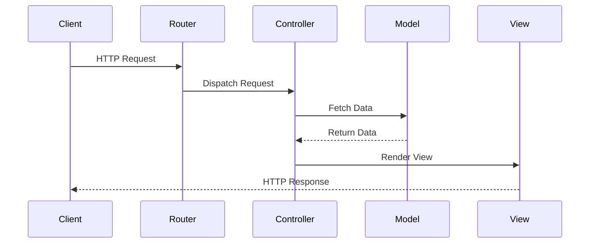

## 11.9 Routing and Controller Patterns

In modern PHP frameworks, routing and controller patterns play a crucial role in defining how web applications handle requests and responses. This section delves into the intricacies of routing and controller patterns, providing you with the knowledge to build robust and maintainable PHP applications.

### Defining Routes

Routing is the process of defining how an application responds to a client request to a particular endpoint, which is a URI (or path) and a specific HTTP request method (GET, POST, etc.). In PHP frameworks like Laravel, Symfony, and CodeIgniter, routing is a fundamental concept that allows developers to map URLs to specific controller actions.

#### Basic Routing

Basic routing involves mapping a URI to a closure or a controller method. This is the simplest form of routing and is often used for straightforward applications.

```php
// Example of basic routing in Laravel
Route::get('/welcome', function () {
    return view('welcome');
});
```

In this example, a GET request to the `/welcome` URI returns the `welcome` view.

#### Advanced Routing Techniques

Advanced routing techniques include route parameters, route grouping, and route naming. These techniques provide more flexibility and organization in handling routes.

##### Route Parameters

Route parameters allow you to capture segments of the URI and pass them to your controller or closure.

```php
// Route with a parameter
Route::get('/user/{id}', function ($id) {
    return 'User '.$id;
});
```

In this example, `{id}` is a route parameter that will capture the value from the URI and pass it to the closure.

##### Route Grouping

Route grouping allows you to share route attributes, such as middleware or namespaces, across a large number of routes without needing to define those attributes on each individual route.

```php
// Grouping routes with a common prefix
Route::prefix('admin')->group(function () {
    Route::get('/users', function () {
        // Matches The "/admin/users" URL
    });
    Route::get('/settings', function () {
        // Matches The "/admin/settings" URL
    });
});
```

##### Route Naming

Naming routes allows you to generate URLs or redirects for specific routes. This is particularly useful for maintaining consistency and flexibility in your application.

```php
// Naming a route
Route::get('/profile', function () {
    // ...
})->name('profile');

// Generating a URL to the named route
$url = route('profile');
```

### Controllers

Controllers are responsible for handling incoming requests and returning responses to the client. They act as a bridge between the model and the view, encapsulating the logic for a particular request.

#### Resource Controllers and RESTful Routing

Resource controllers provide a convenient way to create a controller that handles all HTTP requests for a particular resource. This is aligned with RESTful routing, which maps HTTP verbs to controller actions.

```php
// Defining a resource controller in Laravel
Route::resource('photos', 'PhotoController');
```

This single line of code creates multiple routes for handling CRUD operations on the `photos` resource.

#### Action Methods and Dependency Injection in Controllers

Action methods in controllers correspond to the HTTP verbs they handle. Dependency injection can be used to inject services or dependencies directly into controller methods, promoting loose coupling and testability.

```php
// Example of dependency injection in a controller
class UserController extends Controller
{
    public function show(Request $request, UserRepository $users, $id)
    {
        $user = $users->find($id);

        return view('user.profile', ['user' => $user]);
    }
}
```

In this example, the `UserRepository` is injected into the `show` method, allowing the controller to access user data without directly depending on the repository implementation.

### Controller Patterns

Controller patterns define how controllers are structured and how they interact with other components of the application. Two common patterns are the Front Controller pattern and the use of action classes or invokable controllers.

#### Front Controller Pattern

The Front Controller pattern is a design pattern where a single controller handles all requests for a web application. This pattern is commonly used in PHP frameworks to provide a centralized entry point for handling requests.

```php
// Example of a front controller in a PHP application
require_once 'vendor/autoload.php';

$request = $_SERVER['REQUEST_URI'];
$controller = new FrontController();
$response = $controller->handle($request);
echo $response;
```

The Front Controller pattern simplifies request handling by delegating the responsibility to a single controller, which then dispatches the request to the appropriate handler.

#### Using Action Classes and Invokable Controllers

Action classes and invokable controllers provide a way to encapsulate a single action or request handler in a class. This approach promotes single responsibility and makes it easier to test and maintain individual actions.

```php
// Example of an invokable controller in Laravel
class ShowProfileController extends Controller
{
    public function __invoke($id)
    {
        return view('user.profile', ['user' => User::findOrFail($id)]);
    }
}

// Defining a route for an invokable controller
Route::get('/user/{id}', ShowProfileController::class);
```

In this example, the `ShowProfileController` is an invokable controller, meaning it has a single `__invoke` method that handles the request.

### Visualizing Routing and Controller Patterns

To better understand the flow of routing and controller patterns, let's visualize the process using a sequence diagram.



This diagram illustrates the typical flow of a request in a PHP application using routing and controller patterns. The client sends an HTTP request, which is handled by the router. The router dispatches the request to the appropriate controller, which interacts with the model to fetch data. The controller then renders a view and sends the response back to the client.

### PHP Unique Features

PHP frameworks offer unique features that enhance routing and controller patterns. For example, Laravel's route model binding automatically injects model instances into your routes, simplifying the process of retrieving data.

```php
// Example of route model binding in Laravel
Route::get('/user/{user}', function (User $user) {
    return $user->email;
});
```

In this example, Laravel automatically resolves the `User` model instance based on the `{user}` parameter in the route.

### Differences and Similarities

Routing and controller patterns can vary across different PHP frameworks, but they share common principles. For instance, both Laravel and Symfony use the Front Controller pattern, but they differ in their routing syntax and configuration.

### Design Considerations

When implementing routing and controller patterns, consider the following:

- **Scalability:** Ensure your routing and controller architecture can handle increased traffic and complexity.
- **Maintainability:** Use patterns that promote clean and organized code, making it easier to maintain and extend.
- **Performance:** Optimize routing and controller logic to minimize latency and improve response times.

### Try It Yourself

To deepen your understanding of routing and controller patterns, try modifying the code examples provided. Experiment with adding new routes, creating resource controllers, and implementing invokable controllers. Observe how these changes affect the flow of requests and responses in your application.

### Knowledge Check

- What is the purpose of route parameters, and how do they enhance routing flexibility?
- How does the Front Controller pattern simplify request handling in PHP frameworks?
- What are the benefits of using invokable controllers in your application?

### Embrace the Journey

Remember, mastering routing and controller patterns is a journey. As you continue to explore and experiment, you'll gain a deeper understanding of how these patterns contribute to building robust and maintainable PHP applications. Keep learning, stay curious, and enjoy the process!

## Quiz: Routing and Controller Patterns



### What is the primary purpose of routing in a PHP framework?

- [x] To map URLs to specific controller actions
- [ ] To handle database connections
- [ ] To manage user authentication
- [ ] To define application configuration

> **Explanation:** Routing maps URLs to specific controller actions, allowing the application to respond to client requests appropriately.

### Which of the following is an example of a route parameter?

- [x] /user/{id}
- [ ] /user/profile
- [ ] /user?id=1
- [ ] /user#profile

> **Explanation:** /user/{id} is a route parameter that captures the value from the URI and passes it to the controller or closure.

### What is the benefit of using route grouping?

- [x] To share route attributes across multiple routes
- [ ] To increase application performance
- [ ] To simplify database queries
- [ ] To enhance user authentication

> **Explanation:** Route grouping allows you to share route attributes, such as middleware or namespaces, across multiple routes, improving organization and maintainability.

### How does the Front Controller pattern benefit a PHP application?

- [x] It provides a centralized entry point for handling requests
- [ ] It improves database performance
- [ ] It simplifies user authentication
- [ ] It enhances view rendering

> **Explanation:** The Front Controller pattern provides a centralized entry point for handling requests, simplifying request management and dispatching.

### What is an invokable controller?

- [x] A controller with a single __invoke method
- [ ] A controller that handles multiple actions
- [ ] A controller that manages database connections
- [ ] A controller that renders views

> **Explanation:** An invokable controller is a controller with a single __invoke method, designed to handle a specific action or request.

### Which PHP framework feature automatically injects model instances into routes?

- [x] Route model binding
- [ ] Middleware
- [ ] Service container
- [ ] Dependency injection

> **Explanation:** Route model binding automatically injects model instances into routes based on route parameters, simplifying data retrieval.

### What is the purpose of naming routes?

- [x] To generate URLs or redirects for specific routes
- [ ] To improve application security
- [ ] To enhance database queries
- [ ] To manage user sessions

> **Explanation:** Naming routes allows you to generate URLs or redirects for specific routes, maintaining consistency and flexibility in your application.

### How can dependency injection benefit controller methods?

- [x] By promoting loose coupling and testability
- [ ] By improving database performance
- [ ] By enhancing view rendering
- [ ] By simplifying user authentication

> **Explanation:** Dependency injection promotes loose coupling and testability by allowing services or dependencies to be injected directly into controller methods.

### What is the advantage of using resource controllers?

- [x] They provide a convenient way to handle all HTTP requests for a resource
- [ ] They improve database performance
- [ ] They simplify user authentication
- [ ] They enhance view rendering

> **Explanation:** Resource controllers provide a convenient way to handle all HTTP requests for a resource, aligning with RESTful routing principles.

### True or False: Route parameters can only be used with GET requests.

- [ ] True
- [x] False

> **Explanation:** Route parameters can be used with any HTTP request method, not just GET requests.


