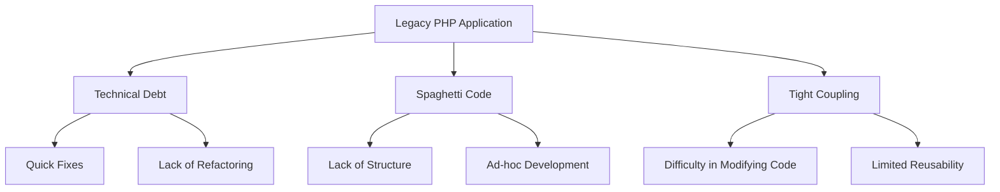

## 12.1 Challenges of Legacy PHP Applications

As PHP developers, we often encounter legacy applications that pose unique challenges. These applications, built with outdated practices and technologies, can be difficult to maintain and extend. In this section, we'll explore the common issues associated with legacy PHP applications, the risks they present, and strategies to overcome these challenges.

### Definition of Legacy Code

Legacy code is often defined as code that lacks automated tests, uses outdated practices, or is poorly documented. It can be a significant source of technical debt, making it difficult to maintain and evolve the application.

#### Characteristics of Legacy Code

- **Lack of Tests:** Legacy code often lacks automated tests, making it difficult to ensure changes don't introduce new bugs.
- **Outdated Practices:** Use of deprecated functions, old PHP versions, or obsolete libraries.
- **Poor Documentation:** Little to no documentation, making it hard to understand the code's purpose and logic.
- **Spaghetti Code:** Code that is tangled and difficult to follow, often resulting from quick fixes and lack of planning.
- **Tight Coupling:** Components are heavily dependent on each other, making changes risky and complex.

### Common Issues in Legacy PHP Applications

Legacy PHP applications often suffer from several common issues that can hinder development and maintenance.

#### Technical Debt

Technical debt refers to the implied cost of additional rework caused by choosing an easy solution now instead of a better approach that would take longer. In legacy PHP applications, technical debt can accumulate due to:

- **Quick Fixes:** Implementing temporary solutions that become permanent.
- **Lack of Refactoring:** Failing to improve code structure over time.
- **Ignoring Best Practices:** Not following coding standards or design patterns.

#### Spaghetti Code

Spaghetti code is a term used to describe code that is complex and tangled, making it difficult to understand and modify. It often results from:

- **Lack of Structure:** Code without clear organization or separation of concerns.
- **Ad-hoc Development:** Adding features without considering the overall architecture.
- **Poor Naming Conventions:** Variables and functions with unclear or misleading names.

#### Tight Coupling

Tight coupling occurs when components in a system are heavily dependent on each other. This can lead to:

- **Difficulty in Modifying Code:** Changes in one part of the system require changes in others.
- **Limited Reusability:** Components cannot be easily reused in other contexts.
- **Increased Risk of Bugs:** Changes can have unintended side effects.

### Risks of Legacy PHP Applications

Working with legacy PHP applications presents several risks that can impact the development process and the application's stability.

#### Introducing Bugs

Without automated tests, making changes to legacy code can easily introduce new bugs. This risk is compounded by:

- **Lack of Understanding:** Developers may not fully understand the existing codebase.
- **Complex Dependencies:** Changes in one area can affect other parts of the system.
- **Hidden Assumptions:** Legacy code may rely on undocumented assumptions or behaviors.

#### Difficulty in Adding New Features

Legacy applications can be challenging to extend due to:

- **Rigid Architecture:** The existing architecture may not support new features.
- **Limited Documentation:** Lack of documentation makes it hard to understand how to integrate new functionality.
- **Outdated Technologies:** Using old libraries or PHP versions can limit the ability to use modern features.

### Strategies for Overcoming Legacy Challenges

Despite the challenges, there are strategies that can help modernize legacy PHP applications and reduce technical debt.

#### Refactoring

Refactoring involves restructuring existing code without changing its external behavior. It can help improve code readability, reduce complexity, and make the codebase more maintainable.

- **Identify Problem Areas:** Use tools to identify code smells and areas that need improvement.
- **Incremental Changes:** Make small, incremental changes to avoid introducing new bugs.
- **Automated Tests:** Write tests to ensure that refactoring doesn't change the code's behavior.

#### Implementing Design Patterns

Design patterns provide proven solutions to common problems and can help improve the structure and maintainability of legacy code.

- **Singleton Pattern:** Use to manage global state or resources.
- **Factory Method Pattern:** Simplify object creation and decouple client code from specific classes.
- **Observer Pattern:** Implement event-driven architectures and decouple components.

#### Modernizing PHP Versions

Upgrading to a modern PHP version can provide performance improvements, security enhancements, and access to new language features.

- **Compatibility Checks:** Ensure that the codebase is compatible with the new PHP version.
- **Leverage New Features:** Use new language features to simplify code and improve performance.
- **Security Improvements:** Benefit from security enhancements in newer PHP versions.

#### Improving Documentation

Improving documentation can help developers understand the codebase and reduce the risk of introducing bugs.

- **Code Comments:** Add comments to explain complex logic or important decisions.
- **Documentation Tools:** Use tools to generate documentation from code comments.
- **Knowledge Sharing:** Encourage team members to share knowledge and document important information.

#### Introducing Automated Testing

Automated testing can help ensure that changes don't introduce new bugs and improve confidence in the codebase.

- **Unit Tests:** Test individual components in isolation.
- **Integration Tests:** Test interactions between components.
- **Continuous Integration:** Use CI tools to run tests automatically on code changes.

### Code Example: Refactoring Legacy Code

Let's look at a simple example of refactoring legacy PHP code. Consider the following legacy code snippet:

```php
<?php
// Legacy code with hardcoded values and poor structure
function calculateTotal($items) {
    $total = 0;
    foreach ($items as $item) {
        $total += $item['price'] * $item['quantity'];
    }
    return $total;
}

$items = [
    ['price' => 10, 'quantity' => 2],
    ['price' => 5, 'quantity' => 5],
];

echo "Total: " . calculateTotal($items);
?>
```

This code can be refactored to improve readability and maintainability:

```php
<?php
// Refactored code with improved structure and readability
class Item {
    private $price;
    private $quantity;

    public function __construct($price, $quantity) {
        $this->price = $price;
        $this->quantity = $quantity;
    }

    public function getTotalPrice() {
        return $this->price * $this->quantity;
    }
}

class ShoppingCart {
    private $items = [];

    public function addItem(Item $item) {
        $this->items[] = $item;
    }

    public function calculateTotal() {
        $total = 0;
        foreach ($this->items as $item) {
            $total += $item->getTotalPrice();
        }
        return $total;
    }
}

$cart = new ShoppingCart();
$cart->addItem(new Item(10, 2));
$cart->addItem(new Item(5, 5));

echo "Total: " . $cart->calculateTotal();
?>
```

### Visualizing Legacy Code Challenges

To better understand the challenges of legacy PHP applications, let's visualize the common issues using a flowchart.



### Knowledge Check

Let's pause and reflect on what we've learned so far:

- What are the key characteristics of legacy code?
- How does technical debt accumulate in legacy applications?
- What are the risks of working with legacy PHP applications?
- How can refactoring help improve legacy code?
- What role do design patterns play in modernizing legacy applications?

### Embrace the Journey

Remember, working with legacy PHP applications is an opportunity to learn and grow as a developer. By understanding the challenges and applying best practices, you can transform legacy code into a maintainable and robust system. Keep experimenting, stay curious, and enjoy the journey!

### References and Links

- [PHP: The Right Way](https://phptherightway.com/)
- [Refactoring: Improving the Design of Existing Code](https://martinfowler.com/books/refactoring.html)
- [Design Patterns: Elements of Reusable Object-Oriented Software](https://www.amazon.com/Design-Patterns-Elements-Reusable-Object-Oriented/dp/0201633612)

## Quiz: Challenges of Legacy PHP Applications



### What is a common characteristic of legacy code?

- [x] Lack of automated tests
- [ ] Use of modern PHP features
- [ ] Extensive documentation
- [ ] High performance

> **Explanation:** Legacy code often lacks automated tests, making it difficult to ensure changes don't introduce new bugs.

### What is technical debt?

- [x] The cost of additional rework due to choosing an easy solution now
- [ ] The financial cost of maintaining software
- [ ] The time spent on debugging code
- [ ] The effort required to learn a new programming language

> **Explanation:** Technical debt refers to the implied cost of additional rework caused by choosing an easy solution now instead of a better approach that would take longer.

### What is spaghetti code?

- [x] Code that is complex and tangled
- [ ] Code that is well-structured and organized
- [ ] Code that uses modern design patterns
- [ ] Code that is easy to read and maintain

> **Explanation:** Spaghetti code is complex and tangled, making it difficult to understand and modify.

### What is a risk of working with legacy PHP applications?

- [x] Introducing bugs when making changes
- [ ] Improved performance
- [ ] Easier to add new features
- [ ] Increased security

> **Explanation:** Without automated tests, making changes to legacy code can easily introduce new bugs.

### How can refactoring help legacy code?

- [x] Improve code readability
- [ ] Increase code complexity
- [x] Reduce technical debt
- [ ] Decrease performance

> **Explanation:** Refactoring can improve code readability and reduce technical debt by restructuring existing code without changing its external behavior.

### What is tight coupling?

- [x] Components are heavily dependent on each other
- [ ] Components are loosely connected
- [ ] Components are independent
- [ ] Components are well-documented

> **Explanation:** Tight coupling occurs when components in a system are heavily dependent on each other, making changes risky and complex.

### What is a benefit of using design patterns in legacy code?

- [x] Improve code structure
- [ ] Increase code complexity
- [x] Enhance maintainability
- [ ] Decrease performance

> **Explanation:** Design patterns provide proven solutions to common problems and can help improve the structure and maintainability of legacy code.

### What is a common issue in legacy PHP applications?

- [x] Spaghetti code
- [ ] Use of modern PHP features
- [ ] Extensive documentation
- [ ] High performance

> **Explanation:** Legacy PHP applications often suffer from spaghetti code, which is complex and tangled.

### What is a strategy for modernizing legacy PHP applications?

- [x] Upgrading to a modern PHP version
- [ ] Ignoring technical debt
- [ ] Avoiding refactoring
- [ ] Removing documentation

> **Explanation:** Upgrading to a modern PHP version can provide performance improvements, security enhancements, and access to new language features.

### True or False: Legacy code is always poorly written.

- [ ] True
- [x] False

> **Explanation:** Legacy code is not always poorly written; it may have been well-written for its time but has become outdated due to changes in technology and best practices.


