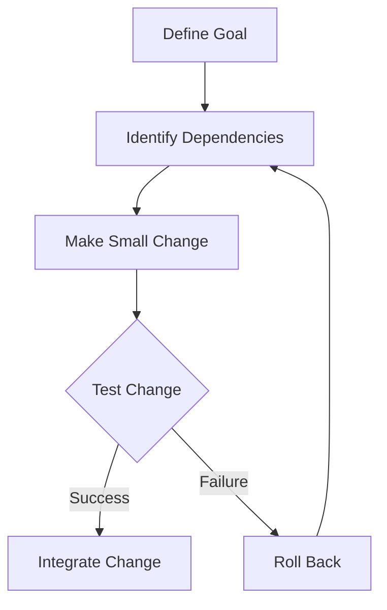

## 12.2 Techniques for Refactoring Legacy Code

Refactoring legacy code is a crucial process in maintaining and enhancing the quality of software applications. In this section, we will explore various techniques for refactoring legacy PHP code, focusing on preparation steps, structured approaches, and incremental strategies. By the end of this guide, you'll be equipped with the knowledge to tackle legacy codebases effectively, improving their robustness and maintainability.

### Preparation Steps

Before diving into refactoring, it's essential to prepare adequately. This involves assessing the codebase and identifying high-risk areas that require immediate attention.

#### Assessing the Codebase

1. **Code Review and Analysis**: Begin by conducting a thorough review of the existing codebase. Use tools like PHPStan or SonarQube to identify code smells, deprecated functions, and potential security vulnerabilities.

2. **Understanding the Business Logic**: Ensure you have a clear understanding of the business logic and requirements. This will help you avoid introducing bugs during the refactoring process.

3. **Documentation**: Gather any existing documentation. If documentation is lacking, consider creating a high-level overview of the system architecture and key components.

4. **Test Coverage Assessment**: Evaluate the current test coverage. Identify areas with little or no coverage and prioritize writing tests for these sections before refactoring.

#### Identifying High-Risk Areas

1. **Complex and Critical Code**: Focus on areas of the code that are complex or critical to the application's functionality. These are often the most error-prone and benefit the most from refactoring.

2. **Frequent Bug Reports**: Identify parts of the code that frequently cause bugs or require maintenance. These areas are prime candidates for refactoring.

3. **Performance Bottlenecks**: Look for sections of the code that are known to cause performance issues. Refactoring can often improve efficiency and speed.

### Refactoring Approaches

Once you've prepared, it's time to choose a refactoring approach. Here are some structured methods to consider:

#### The Mikado Method

The Mikado Method is a structured approach to refactoring that helps manage complex changes without breaking the system. It involves the following steps:

1. **Visualize the Goal**: Clearly define the end goal of your refactoring effort. This could be improving performance, enhancing readability, or reducing complexity.

2. **Create a Mikado Graph**: Use a graph to map out dependencies and the steps needed to achieve your goal. Each node represents a task, and edges represent dependencies between tasks.

3. **Iterative Process**: Start with a small change and attempt to integrate it. If it fails, roll back and identify the dependencies that need addressing first.

4. **Refactor in Small Steps**: Make incremental changes, testing each step to ensure stability.

5. **Document Progress**: Keep track of changes and decisions made during the process. This documentation can be invaluable for future maintenance.

#### Boy Scout Rule

The Boy Scout Rule is a simple yet effective principle: "Leave the code better than you found it." This approach encourages developers to make small improvements whenever they touch the code, gradually enhancing the overall quality.

1. **Focus on Readability**: Improve variable names, add comments, and simplify complex logic.

2. **Remove Dead Code**: Identify and eliminate unused code and redundant comments.

3. **Optimize Performance**: Look for opportunities to optimize algorithms and data structures.

### Incremental Refactoring

Incremental refactoring involves making small, manageable changes over time. This approach minimizes risk and allows for continuous improvement.

#### Making Small, Manageable Changes

1. **Refactor One Function at a Time**: Focus on refactoring individual functions or methods. This keeps changes isolated and easier to test.

2. **Use Feature Flags**: Implement feature flags to toggle new changes on and off. This allows you to test refactored code in production without affecting users.

3. **Continuous Integration**: Use continuous integration tools to automate testing and ensure that changes do not introduce new bugs.

#### Prioritizing Critical Areas

1. **Address High-Impact Areas First**: Prioritize refactoring efforts on areas that will have the most significant impact on performance, security, or maintainability.

2. **Balance Short-Term and Long-Term Goals**: While it's essential to address immediate issues, also consider long-term improvements that will benefit the codebase.

### Code Examples

Let's explore some code examples to illustrate these concepts.

#### Example 1: Refactoring a Complex Function

Before Refactoring:

```php
function calculateDiscount($order) {
    if ($order->customer->isPremium()) {
        if ($order->total > 1000) {
            return $order->total * 0.1;
        } else {
            return $order->total * 0.05;
        }
    } else {
        if ($order->total > 1000) {
            return $order->total * 0.07;
        } else {
            return $order->total * 0.02;
        }
    }
}
```

After Refactoring:

```php
function calculateDiscount($order) {
    $discountRate = getDiscountRate($order->customer, $order->total);
    return $order->total * $discountRate;
}

function getDiscountRate($customer, $total) {
    if ($customer->isPremium()) {
        return $total > 1000 ? 0.1 : 0.05;
    } else {
        return $total > 1000 ? 0.07 : 0.02;
    }
}
```

**Explanation**: The refactored code separates the logic for determining the discount rate into a separate function, improving readability and maintainability.

#### Example 2: Using Feature Flags

```php
function processOrder($order) {
    if (isFeatureEnabled('newDiscountCalculation')) {
        return calculateNewDiscount($order);
    } else {
        return calculateOldDiscount($order);
    }
}

function isFeatureEnabled($feature) {
    // Logic to check if the feature is enabled
    return in_array($feature, getEnabledFeatures());
}
```

**Explanation**: Feature flags allow you to toggle between old and new functionality, making it easier to test changes incrementally.

### Visualizing the Refactoring Process

Below is a Mermaid.js diagram illustrating the Mikado Method:



**Description**: This diagram visualizes the iterative process of the Mikado Method, showing how changes are made, tested, and integrated.

### References and Links

- [PHPStan](https://phpstan.org/): A static analysis tool for PHP.
- [SonarQube](https://www.sonarqube.org/): A platform for continuous inspection of code quality.
- [Refactoring Guru](https://refactoring.guru/): A comprehensive resource on refactoring techniques and patterns.

### Knowledge Check

1. What is the primary goal of refactoring legacy code?
2. How does the Mikado Method help manage complex refactoring tasks?
3. Why is it important to assess test coverage before refactoring?
4. Explain the Boy Scout Rule in the context of code refactoring.
5. How can feature flags assist in the refactoring process?

### Embrace the Journey

Refactoring legacy code can be challenging, but it's also an opportunity to improve your skills and enhance the quality of your applications. Remember, this is just the beginning. As you progress, you'll build more robust and maintainable codebases. Keep experimenting, stay curious, and enjoy the journey!

## Quiz: Techniques for Refactoring Legacy Code



### What is the primary goal of refactoring legacy code?

- [x] Improve code quality and maintainability
- [ ] Add new features
- [ ] Increase code complexity
- [ ] Remove all comments

> **Explanation:** The primary goal of refactoring legacy code is to improve its quality and maintainability without changing its external behavior.

### How does the Mikado Method help manage complex refactoring tasks?

- [x] By visualizing dependencies and making incremental changes
- [ ] By rewriting the entire codebase from scratch
- [ ] By ignoring dependencies
- [ ] By focusing only on performance improvements

> **Explanation:** The Mikado Method helps manage complex refactoring tasks by visualizing dependencies and making incremental changes, allowing for a structured approach.

### Why is it important to assess test coverage before refactoring?

- [x] To ensure changes do not introduce new bugs
- [ ] To increase the number of lines of code
- [ ] To remove all tests
- [ ] To focus only on performance

> **Explanation:** Assessing test coverage before refactoring ensures that changes do not introduce new bugs and that the code's functionality is preserved.

### Explain the Boy Scout Rule in the context of code refactoring.

- [x] Leave the code better than you found it
- [ ] Remove all comments
- [ ] Add as many features as possible
- [ ] Ignore code quality

> **Explanation:** The Boy Scout Rule encourages developers to leave the code better than they found it, making small improvements whenever they touch the code.

### How can feature flags assist in the refactoring process?

- [x] By allowing toggling between old and new functionality
- [ ] By removing all features
- [ ] By increasing code complexity
- [ ] By ignoring test coverage

> **Explanation:** Feature flags allow developers to toggle between old and new functionality, making it easier to test changes incrementally.

### What is the first step in the Mikado Method?

- [x] Define the goal
- [ ] Make a large change
- [ ] Remove all dependencies
- [ ] Ignore testing

> **Explanation:** The first step in the Mikado Method is to define the goal of the refactoring effort, providing a clear direction for the process.

### What should be prioritized during incremental refactoring?

- [x] High-impact areas
- [ ] Low-impact areas
- [ ] Areas with no bugs
- [ ] Areas with complete test coverage

> **Explanation:** During incremental refactoring, high-impact areas should be prioritized to maximize the benefits of the refactoring effort.

### What is a key benefit of using continuous integration in refactoring?

- [x] Automating testing to prevent new bugs
- [ ] Increasing code complexity
- [ ] Removing all tests
- [ ] Ignoring code quality

> **Explanation:** Continuous integration automates testing, helping to prevent new bugs and ensuring that changes do not negatively impact the codebase.

### What is the purpose of creating a Mikado Graph?

- [x] To map out dependencies and tasks
- [ ] To remove all dependencies
- [ ] To ignore testing
- [ ] To increase code complexity

> **Explanation:** A Mikado Graph maps out dependencies and tasks, providing a visual representation of the refactoring process and helping manage complex changes.

### True or False: Refactoring should always be done in large, sweeping changes.

- [ ] True
- [x] False

> **Explanation:** Refactoring should be done in small, manageable changes to minimize risk and ensure stability.


