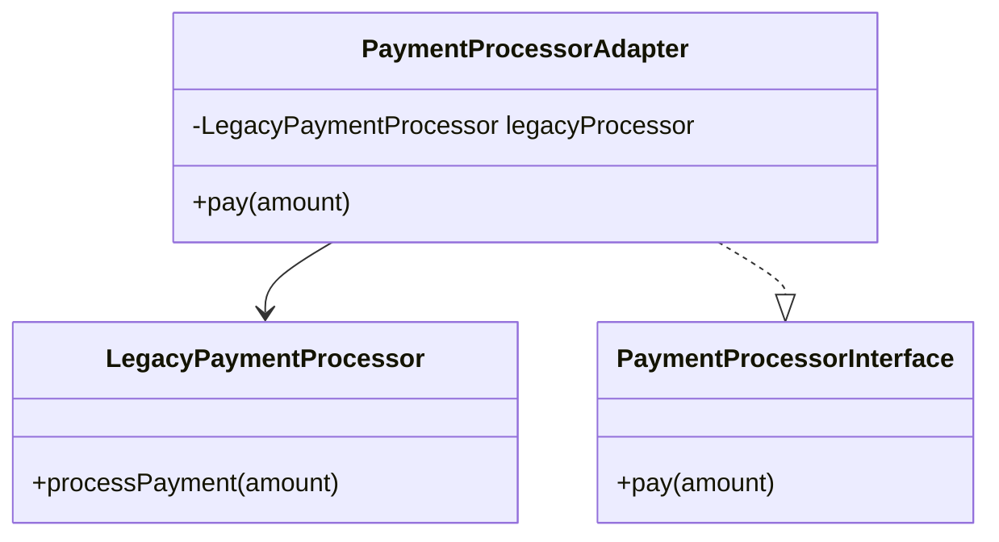

## 12.3 Introducing Design Patterns into Legacy Code

Working with legacy code can be a daunting task, especially when the codebase lacks structure and maintainability. Introducing design patterns into legacy PHP code can significantly improve its architecture, making it more robust, scalable, and easier to maintain. In this section, we will explore how to identify opportunities for design patterns in legacy code, implement them effectively, and avoid common pitfalls.

### Identifying Patterns in Legacy Code

Before introducing design patterns into legacy code, it's crucial to recognize where they can provide the most benefit. Here are some steps to help identify these opportunities:

1. **Code Smells**: Look for signs of poor design, such as duplicated code, large classes, and long methods. These are often indicators that a design pattern could improve the structure.

2. **Complex Dependencies**: Identify areas where the code has complex dependencies or tight coupling. Patterns like Dependency Injection can help decouple these components.

3. **Repetitive Logic**: Search for repetitive logic that could be abstracted into a reusable component. Patterns like Strategy or Template Method can be useful here.

4. **Inconsistent Interfaces**: Look for inconsistencies in how different parts of the code interact. Patterns like Adapter or Facade can help standardize these interactions.

5. **Scalability Issues**: Identify parts of the code that struggle to scale. Patterns like Singleton or Factory can help manage resources more efficiently.

### Implementation Strategies

Once you've identified areas where design patterns can be beneficial, the next step is to implement them without disrupting the existing functionality. Here are some strategies to consider:

#### Wrapping Legacy Code with New Interfaces

One effective way to introduce design patterns is by wrapping legacy code with new interfaces. This approach allows you to encapsulate the old code and provide a clean, modern interface for new code to interact with.

**Example: Using the Adapter Pattern**

The Adapter pattern can be particularly useful for wrapping legacy code. It allows you to create a new interface that the rest of your application can use, while still relying on the existing implementation.

```php
<?php

// Legacy code
class LegacyPaymentProcessor {
    public function processPayment($amount) {
        // Complex legacy logic
        echo "Processing payment of $amount using legacy system.\n";
    }
}

// New interface
interface PaymentProcessorInterface {
    public function pay($amount);
}

// Adapter class
class PaymentProcessorAdapter implements PaymentProcessorInterface {
    private $legacyProcessor;

    public function __construct(LegacyPaymentProcessor $legacyProcessor) {
        $this->legacyProcessor = $legacyProcessor;
    }

    public function pay($amount) {
        $this->legacyProcessor->processPayment($amount);
    }
}

// Usage
$legacyProcessor = new LegacyPaymentProcessor();
$adapter = new PaymentProcessorAdapter($legacyProcessor);
$adapter->pay(100);

?>
```

In this example, the `PaymentProcessorAdapter` class wraps the legacy `LegacyPaymentProcessor` class, providing a new interface that can be used throughout the application.

#### Using Facade Pattern to Isolate Legacy Components

The Facade pattern is another powerful tool for isolating legacy components. It provides a simplified interface to a complex subsystem, making it easier to interact with.

**Example: Implementing the Facade Pattern**

```php
<?php

// Legacy components
class LegacyOrderSystem {
    public function createOrder($productId, $quantity) {
        echo "Order created for product $productId with quantity $quantity.\n";
    }
}

class LegacyInventorySystem {
    public function checkStock($productId) {
        echo "Checking stock for product $productId.\n";
        return true;
    }
}

// Facade class
class OrderFacade {
    private $orderSystem;
    private $inventorySystem;

    public function __construct() {
        $this->orderSystem = new LegacyOrderSystem();
        $this->inventorySystem = new LegacyInventorySystem();
    }

    public function placeOrder($productId, $quantity) {
        if ($this->inventorySystem->checkStock($productId)) {
            $this->orderSystem->createOrder($productId, $quantity);
        } else {
            echo "Product $productId is out of stock.\n";
        }
    }
}

// Usage
$orderFacade = new OrderFacade();
$orderFacade->placeOrder(1, 5);

?>
```

In this example, the `OrderFacade` class provides a simple interface for placing orders, hiding the complexity of the legacy order and inventory systems.

#### Avoiding Big Rewrite

One of the biggest mistakes when working with legacy code is attempting a complete rewrite. This approach is risky, time-consuming, and often unnecessary. Instead, favor incremental refactoring, introducing design patterns gradually.

**Benefits of Incremental Refactoring**

- **Reduced Risk**: By making small, incremental changes, you reduce the risk of introducing new bugs.
- **Continuous Improvement**: Incremental refactoring allows you to continuously improve the codebase without disrupting ongoing development.
- **Easier Testing**: Smaller changes are easier to test, ensuring that existing functionality remains intact.

### Practical Considerations

When introducing design patterns into legacy code, there are several practical considerations to keep in mind:

1. **Testing**: Ensure that you have a comprehensive suite of tests before making changes. This will help catch any regressions introduced by the refactoring.

2. **Documentation**: Update documentation to reflect the new design patterns and interfaces. This will help other developers understand the changes and maintain the code in the future.

3. **Team Collaboration**: Involve the entire development team in the refactoring process. This will ensure that everyone is on the same page and can contribute to the improvement efforts.

4. **Performance**: Be mindful of the performance impact of introducing design patterns. Some patterns, like Singleton, can introduce overhead if not implemented carefully.

### PHP Unique Features

PHP offers several unique features that can aid in the introduction of design patterns into legacy code:

- **Traits**: Use traits to share common functionality across multiple classes without inheritance.
- **Namespaces**: Organize your code into namespaces to avoid naming conflicts and improve readability.
- **Anonymous Classes**: Use anonymous classes for simple, one-off implementations of interfaces or abstract classes.

### Differences and Similarities

When working with design patterns, it's important to understand the differences and similarities between them. For example, the Adapter and Facade patterns both provide a simplified interface to a complex system, but they serve different purposes. The Adapter pattern is used to make two incompatible interfaces compatible, while the Facade pattern provides a unified interface to a set of interfaces in a subsystem.

### Visualizing Design Patterns in Legacy Code

To better understand how design patterns can be introduced into legacy code, let's visualize the process using a class diagram.



In this diagram, we see how the `PaymentProcessorAdapter` class implements the `PaymentProcessorInterface` and wraps the `LegacyPaymentProcessor` class, providing a new interface for the application to use.

### Knowledge Check

Before we conclude, let's test your understanding of the concepts covered in this section:

1. What are some common code smells that indicate a design pattern might be beneficial?
2. How can the Adapter pattern be used to wrap legacy code?
3. What are the benefits of using the Facade pattern in legacy systems?
4. Why is it important to avoid a complete rewrite of legacy code?
5. How can PHP's unique features, like traits and namespaces, aid in refactoring?

### Embrace the Journey

Remember, refactoring legacy code is a journey, not a destination. By introducing design patterns incrementally, you can improve the structure and maintainability of your codebase without disrupting ongoing development. Keep experimenting, stay curious, and enjoy the process of transforming legacy code into a modern, robust application.

## Quiz: Introducing Design Patterns into Legacy Code



### What is a common sign that a design pattern could improve legacy code?

- [x] Code duplication
- [ ] High test coverage
- [ ] Recent updates
- [ ] Use of modern PHP features

> **Explanation:** Code duplication is a common sign that a design pattern could improve the structure and maintainability of legacy code.


### Which pattern is useful for wrapping legacy code with a new interface?

- [x] Adapter
- [ ] Singleton
- [ ] Observer
- [ ] Factory

> **Explanation:** The Adapter pattern is useful for wrapping legacy code with a new interface, allowing it to integrate with modern systems.


### What is the primary benefit of using the Facade pattern?

- [x] Simplifies interaction with complex subsystems
- [ ] Increases code duplication
- [ ] Enhances security
- [ ] Reduces memory usage

> **Explanation:** The Facade pattern simplifies interaction with complex subsystems by providing a unified interface.


### Why should you avoid a complete rewrite of legacy code?

- [x] It is risky and time-consuming
- [ ] It guarantees bug-free code
- [ ] It is the only way to improve performance
- [ ] It is cheaper than refactoring

> **Explanation:** A complete rewrite is risky and time-consuming, and incremental refactoring is often a more effective approach.


### How can PHP traits aid in refactoring legacy code?

- [x] By sharing common functionality across classes
- [ ] By enforcing strict typing
- [ ] By improving database performance
- [ ] By simplifying HTTP requests

> **Explanation:** PHP traits allow you to share common functionality across multiple classes without using inheritance.


### What is a key consideration when introducing design patterns into legacy code?

- [x] Comprehensive testing
- [ ] Ignoring team collaboration
- [ ] Avoiding documentation updates
- [ ] Prioritizing performance over maintainability

> **Explanation:** Comprehensive testing is crucial to ensure that changes do not introduce regressions.


### Which PHP feature can help organize code and avoid naming conflicts?

- [x] Namespaces
- [ ] Anonymous classes
- [ ] Magic methods
- [ ] Global variables

> **Explanation:** Namespaces help organize code and avoid naming conflicts, improving readability and maintainability.


### What is the role of the Adapter pattern in legacy code?

- [x] To make incompatible interfaces compatible
- [ ] To increase code complexity
- [ ] To enforce security policies
- [ ] To manage database connections

> **Explanation:** The Adapter pattern makes incompatible interfaces compatible, allowing legacy code to integrate with modern systems.


### Which design pattern provides a unified interface to a set of interfaces in a subsystem?

- [x] Facade
- [ ] Observer
- [ ] Strategy
- [ ] Singleton

> **Explanation:** The Facade pattern provides a unified interface to a set of interfaces in a subsystem, simplifying interactions.


### True or False: Incremental refactoring is a more effective approach than a complete rewrite for improving legacy code.

- [x] True
- [ ] False

> **Explanation:** Incremental refactoring is generally more effective than a complete rewrite, as it reduces risk and allows for continuous improvement.



By following these guidelines and strategies, you can effectively introduce design patterns into legacy PHP code, transforming it into a more maintainable and scalable system. Keep learning and experimenting, and you'll continue to improve your skills as a PHP developer.
