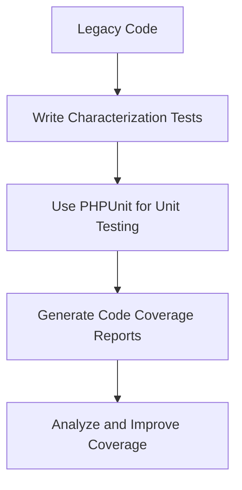

## 12.4 Automated Testing for Legacy Applications

In the world of software development, legacy applications often present unique challenges. These applications, which may have been developed years ago, are critical to business operations but often lack the modern practices and tools that make maintenance and enhancement easier. One of the most effective ways to manage and improve legacy applications is through automated testing. In this section, we'll explore the importance of testing legacy code, how to write effective tests, and the tools available to measure and improve test coverage.

### Importance of Testing Legacy Applications

Automated testing is crucial for legacy applications for several reasons:

- **Ensuring Existing Functionality Remains Intact:** Legacy systems often have complex interdependencies. Automated tests help ensure that changes or refactoring do not inadvertently break existing functionality.
- **Facilitating Refactoring and Modernization:** With a robust suite of tests, developers can confidently refactor code, knowing that any deviations from expected behavior will be quickly identified.
- **Improving Code Quality Over Time:** As tests are added, they can help identify areas of the codebase that are fragile or poorly understood, guiding efforts to improve code quality.
- **Reducing Manual Testing Efforts:** Automated tests can run frequently and consistently, reducing the need for time-consuming manual testing.

### Writing Tests for Legacy Code

Writing tests for legacy code can be daunting, especially if the codebase is large and poorly documented. However, with a systematic approach, it's possible to build a comprehensive test suite that provides confidence in the system's behavior.

#### Characterization Tests

Characterization tests are a powerful tool for understanding and documenting the current behavior of legacy code. These tests are designed to capture the existing functionality of the application, serving as a baseline for future changes.

- **Identify Key Functional Areas:** Start by identifying the most critical parts of the application. Focus on areas that are frequently changed or have a high impact on the system.
- **Write Tests to Capture Current Behavior:** Use characterization tests to document how the system currently behaves. These tests should not assume how the system should behave but rather capture what it actually does.
- **Use Assertions to Validate Outputs:** Ensure that your tests include assertions that validate the outputs of functions and methods. This helps to confirm that the system behaves as expected.

#### Using PHPUnit for Unit Testing

PHPUnit is a widely used testing framework for PHP applications. It provides a robust set of tools for writing and running tests, making it an excellent choice for testing legacy applications.

- **Install PHPUnit:** Begin by installing PHPUnit in your project. You can do this using Composer, a dependency manager for PHP.

  ```bash
  composer require --dev phpunit/phpunit
  ```

- **Create Test Cases:** Organize your tests into test cases, each focusing on a specific class or function. Use PHPUnit's `TestCase` class as a base for your tests.

  ```php
  <?php

  use PHPUnit\Framework\TestCase;

  class LegacyCodeTest extends TestCase
  {
      public function testFunctionality()
      {
          // Arrange
          $legacyCode = new LegacyCode();

          // Act
          $result = $legacyCode->someFunction();

          // Assert
          $this->assertEquals('expected result', $result);
      }
  }
  ```

- **Run Tests:** Use PHPUnit's command-line tool to run your tests and view the results.

  ```bash
  ./vendor/bin/phpunit tests
  ```

- **Link:** [PHPUnit](https://phpunit.de/)

### Test Coverage Tools

Test coverage tools are essential for understanding how much of your code is exercised by your tests. They help identify untested parts of the codebase, guiding efforts to improve test coverage.

#### Measuring Code Coverage

PHPUnit includes built-in support for generating code coverage reports. These reports provide detailed information about which lines of code are executed during testing.

- **Enable Code Coverage:** To generate a code coverage report, you need to enable the Xdebug extension in your PHP installation.

- **Generate Coverage Reports:** Use PHPUnit's command-line options to generate a coverage report.

  ```bash
  ./vendor/bin/phpunit --coverage-html coverage-report
  ```

- **Analyze Coverage Reports:** Review the generated coverage report to identify areas of the code that are not covered by tests. Focus on increasing coverage in critical areas of the application.

#### Tools for Improving Test Coverage

Several tools can help improve test coverage and ensure that your tests are comprehensive:

- **PHPUnit Code Coverage Reports:** As mentioned, PHPUnit's built-in coverage reports are a great starting point for understanding test coverage.
- **PHPStan and Psalm:** These static analysis tools can identify potential issues in your code, helping you write more effective tests.
- **Infection:** A mutation testing tool that helps ensure your tests are robust by introducing small changes to your code and checking if the tests catch the changes.

### Visualizing Test Coverage

Visualizing test coverage can help you understand the effectiveness of your tests and identify areas for improvement. Use tools like PHPUnit's HTML coverage reports to get a visual representation of your test coverage.



### Challenges and Solutions

Testing legacy applications comes with its own set of challenges. Here are some common issues and solutions:

- **Tightly Coupled Code:** Legacy code is often tightly coupled, making it difficult to isolate components for testing. Use techniques like dependency injection to decouple components and make them easier to test.
- **Lack of Documentation:** Without documentation, understanding the intended behavior of the code can be challenging. Use characterization tests to document current behavior and guide future changes.
- **Complex Dependencies:** Legacy applications may have complex dependencies that are difficult to replicate in a test environment. Use mocking and stubbing to simulate these dependencies and isolate the code under test.

### Knowledge Check

- **Why is automated testing important for legacy applications?**
- **What are characterization tests, and why are they useful?**
- **How can PHPUnit be used to test legacy code?**
- **What tools can be used to measure and improve test coverage?**

### Embrace the Journey

Remember, testing legacy applications is a journey, not a destination. As you build your test suite, you'll gain a deeper understanding of the system and its behavior. Keep experimenting, stay curious, and enjoy the process of transforming your legacy code into a robust, maintainable system.

### Try It Yourself

- **Experiment with PHPUnit:** Try writing tests for a small part of your legacy application. Use PHPUnit to run the tests and generate a coverage report.
- **Modify the Code:** Make small changes to the code and observe how the tests catch any deviations from expected behavior.
- **Explore Test Coverage Tools:** Use tools like PHPStan and Infection to improve your test suite and ensure your tests are comprehensive.

## Quiz: Automated Testing for Legacy Applications



### Why is automated testing important for legacy applications?

- [x] Ensures existing functionality remains intact
- [ ] Reduces the need for manual coding
- [ ] Increases the speed of the application
- [ ] Eliminates the need for documentation

> **Explanation:** Automated testing helps ensure that changes do not break existing functionality, which is crucial for maintaining legacy applications.

### What is the purpose of characterization tests?

- [x] To capture the current behavior of the system
- [ ] To improve the performance of the code
- [ ] To replace manual testing
- [ ] To document future requirements

> **Explanation:** Characterization tests document the current behavior of the system, providing a baseline for future changes.

### How can PHPUnit be used in legacy applications?

- [x] By writing unit tests to validate functionality
- [ ] By automatically refactoring code
- [ ] By generating documentation
- [ ] By optimizing database queries

> **Explanation:** PHPUnit is used to write unit tests that validate the functionality of legacy code.

### What is a key benefit of using test coverage tools?

- [x] Identifying untested parts of the codebase
- [ ] Increasing the speed of test execution
- [ ] Reducing the size of the codebase
- [ ] Automatically fixing bugs

> **Explanation:** Test coverage tools help identify parts of the code that are not covered by tests, guiding efforts to improve coverage.

### Which tool is used for mutation testing in PHP?

- [x] Infection
- [ ] PHPUnit
- [ ] PHPStan
- [ ] Xdebug

> **Explanation:** Infection is a mutation testing tool that helps ensure tests are robust by introducing small changes to the code.

### What is a common challenge when testing legacy code?

- [x] Tightly coupled code
- [ ] Lack of programming languages
- [ ] Excessive documentation
- [ ] Overuse of modern frameworks

> **Explanation:** Legacy code is often tightly coupled, making it difficult to isolate components for testing.

### How can complex dependencies in legacy applications be managed during testing?

- [x] By using mocking and stubbing
- [ ] By rewriting the entire codebase
- [ ] By ignoring them
- [ ] By using only real databases

> **Explanation:** Mocking and stubbing can simulate complex dependencies, allowing for isolated testing of the code.

### What is the first step in writing tests for legacy code?

- [x] Identifying key functional areas
- [ ] Refactoring the entire codebase
- [ ] Removing all dependencies
- [ ] Writing new features

> **Explanation:** Identifying key functional areas helps focus testing efforts on the most critical parts of the application.

### What is the role of PHPUnit's `TestCase` class?

- [x] It serves as a base for writing test cases
- [ ] It automatically generates test cases
- [ ] It optimizes code performance
- [ ] It manages database connections

> **Explanation:** PHPUnit's `TestCase` class is used as a base for writing test cases in PHP.

### True or False: Automated testing can completely eliminate the need for manual testing in legacy applications.

- [ ] True
- [x] False

> **Explanation:** While automated testing reduces the need for manual testing, it cannot completely eliminate it, especially for exploratory and usability testing.


