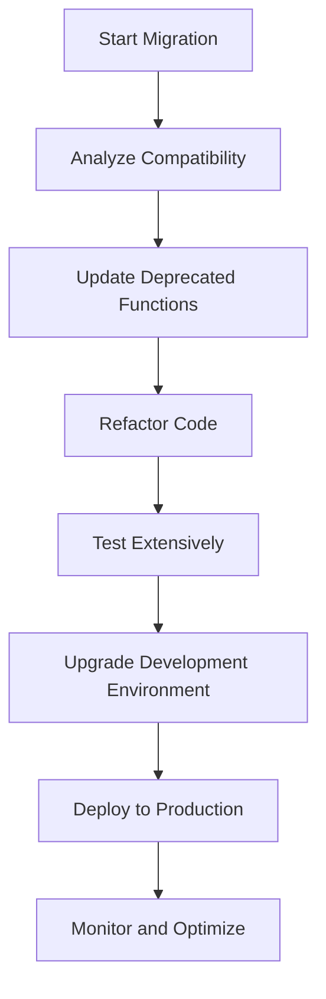

## 12.5 Modernizing PHP Versions

As PHP continues to evolve, it is crucial for developers to keep their applications up-to-date with the latest versions. Modernizing PHP versions not only brings performance improvements and new features but also ensures that your applications remain secure and maintainable. In this section, we will explore the benefits of upgrading PHP versions, outline the steps involved in the migration process, and provide tools and resources to assist you in this journey.

### Benefits of Upgrading PHP Versions

Upgrading to the latest PHP version offers numerous advantages that can significantly impact the performance, security, and functionality of your applications. Let's delve into these benefits:

- **Performance Improvements:** Each new PHP version typically includes optimizations that enhance the execution speed of your code. For instance, PHP 7 introduced the Zend Engine 3.0, which significantly improved performance over PHP 5.x. This means faster page loads and a better user experience.

- **New Features:** Modern PHP versions come with a host of new features that can simplify your code and enable you to implement more robust solutions. Features like scalar type declarations, return type declarations, and anonymous classes introduced in PHP 7, or attributes and union types in PHP 8, provide developers with powerful tools to write cleaner and more efficient code.

- **Security Fixes:** Older PHP versions may have vulnerabilities that are addressed in newer releases. By upgrading, you ensure that your application is protected against known security threats, reducing the risk of exploitation.

- **Community Support:** The PHP community actively supports the latest versions, providing updates, bug fixes, and security patches. Older versions eventually reach end-of-life, meaning they no longer receive updates, leaving your application vulnerable.

### Migration Steps

Migrating to a newer PHP version involves several steps to ensure a smooth transition. Here is a detailed guide to help you through the process:

#### 1. Analyzing Compatibility Issues

Before upgrading, it's essential to analyze your existing codebase for compatibility issues. This involves:

- **Reviewing Deprecated Functions:** Identify any deprecated functions or features that your application relies on. PHP's official documentation provides a list of deprecated features for each version.

- **Testing for Compatibility:** Use tools like PHP_CodeSniffer or PHPStan to scan your code for compatibility issues. These tools can highlight potential problems and suggest fixes.

- **Checking Third-Party Libraries:** Ensure that any third-party libraries or frameworks you use are compatible with the new PHP version. Check for updates or patches from the library maintainers.

#### 2. Updating Deprecated Functions and Features

Once you've identified compatibility issues, the next step is to update your code:

- **Replace Deprecated Functions:** Substitute deprecated functions with their modern equivalents. For example, replace `mysql_*` functions with `mysqli_*` or PDO.

- **Refactor Code:** Take this opportunity to refactor and clean up your code. Implement modern PHP features to improve readability and maintainability.

- **Test Extensively:** After making changes, thoroughly test your application to ensure that everything functions as expected. Automated tests can be particularly useful in catching regressions.

#### 3. Updating Your Development Environment

Ensure that your development environment is set up to support the new PHP version:

- **Upgrade PHP on Your Server:** Install the latest PHP version on your development and production servers. Follow the official installation guides for your operating system.

- **Update Configuration Files:** Review and update your PHP configuration files (`php.ini`) to reflect any changes or new settings introduced in the latest version.

- **Verify Extensions:** Ensure that all necessary PHP extensions are installed and compatible with the new version.

### Tools and Resources

Several tools and resources can assist you in the migration process:

- **PHP's Migration Guides:** The official PHP website provides comprehensive migration guides for each version. These guides outline changes, deprecated features, and new functionalities. [PHP Migration Guides](https://www.php.net/manual/en/migration70.php)

- **PHP_CodeSniffer:** A tool that helps you detect violations of a defined coding standard, including deprecated functions and features.

- **PHPStan:** A static analysis tool that can identify potential errors in your code, including compatibility issues with newer PHP versions.

- **Composer:** Use Composer to manage your dependencies and ensure that all libraries are compatible with the new PHP version.

- **Docker:** Consider using Docker to create a consistent development environment that matches your production setup. This can help prevent environment-specific issues during the migration.

### Visualizing the Migration Process

To better understand the migration process, let's visualize the steps involved using a flowchart:

**Description:** This flowchart outlines the key steps in the PHP version migration process, from analyzing compatibility issues to deploying the updated application to production.

### Try It Yourself

To gain hands-on experience with modernizing PHP versions, try the following exercise:

1. **Set Up a Test Environment:** Create a local development environment using Docker or a virtual machine with the latest PHP version installed.

2. **Analyze a Sample Project:** Choose a sample PHP project and use PHP_CodeSniffer to identify deprecated functions and features.

3. **Refactor the Code:** Update the code to replace deprecated functions and implement modern PHP features.

4. **Run Tests:** Write and execute automated tests to ensure that the refactored code works as expected.

5. **Deploy the Updated Project:** Deploy the updated project to a staging environment and monitor its performance.

### Knowledge Check

Before moving on, let's reinforce what we've learned:

- **What are the key benefits of upgrading PHP versions?**
- **What tools can help you identify compatibility issues in your code?**
- **Why is it important to update your development environment during migration?**

### Embrace the Journey

Remember, modernizing PHP versions is not just about keeping up with the latest trends. It's about ensuring that your applications are secure, efficient, and maintainable. As you embark on this journey, embrace the opportunity to learn and grow as a developer. Keep experimenting, stay curious, and enjoy the process!

## Quiz: Modernizing PHP Versions



### What is one of the primary benefits of upgrading to a newer PHP version?

- [x] Performance improvements
- [ ] Increased code complexity
- [ ] Reduced security
- [ ] Decreased community support

> **Explanation:** Upgrading to a newer PHP version often brings performance improvements due to optimizations in the language.

### Which tool can help you identify deprecated functions in your PHP code?

- [x] PHP_CodeSniffer
- [ ] MySQL
- [ ] Apache
- [ ] Nginx

> **Explanation:** PHP_CodeSniffer is a tool that helps detect deprecated functions and coding standard violations.

### What should you do after updating deprecated functions in your code?

- [x] Test extensively
- [ ] Ignore testing
- [ ] Delete old code
- [ ] Skip deployment

> **Explanation:** After updating deprecated functions, it's crucial to test extensively to ensure the application functions correctly.

### Why is it important to upgrade your development environment during PHP migration?

- [x] To ensure compatibility with the new PHP version
- [ ] To increase server load
- [ ] To reduce code readability
- [ ] To avoid using modern features

> **Explanation:** Upgrading the development environment ensures compatibility with the new PHP version and prevents environment-specific issues.

### Which of the following is a new feature introduced in PHP 8?

- [x] Attributes
- [ ] Magic quotes
- [ ] Register globals
- [ ] Safe mode

> **Explanation:** Attributes are a new feature introduced in PHP 8, allowing for metadata to be added to classes and functions.

### What is the purpose of using Docker in the PHP migration process?

- [x] To create a consistent development environment
- [ ] To increase code complexity
- [ ] To reduce application performance
- [ ] To avoid using modern PHP features

> **Explanation:** Docker helps create a consistent development environment, matching production settings and preventing environment-specific issues.

### How can Composer assist in the PHP migration process?

- [x] By managing dependencies
- [ ] By increasing code complexity
- [ ] By reducing server load
- [ ] By avoiding modern features

> **Explanation:** Composer manages dependencies, ensuring that libraries are compatible with the new PHP version.

### What is a common issue when not upgrading PHP versions?

- [x] Security vulnerabilities
- [ ] Increased performance
- [ ] Enhanced features
- [ ] Improved community support

> **Explanation:** Not upgrading PHP versions can lead to security vulnerabilities due to lack of updates and patches.

### Which PHP version introduced the Zend Engine 3.0?

- [x] PHP 7
- [ ] PHP 5
- [ ] PHP 6
- [ ] PHP 8

> **Explanation:** PHP 7 introduced the Zend Engine 3.0, which significantly improved performance over previous versions.

### True or False: Upgrading PHP versions can lead to decreased security.

- [ ] True
- [x] False

> **Explanation:** Upgrading PHP versions enhances security by addressing vulnerabilities and providing security patches.


