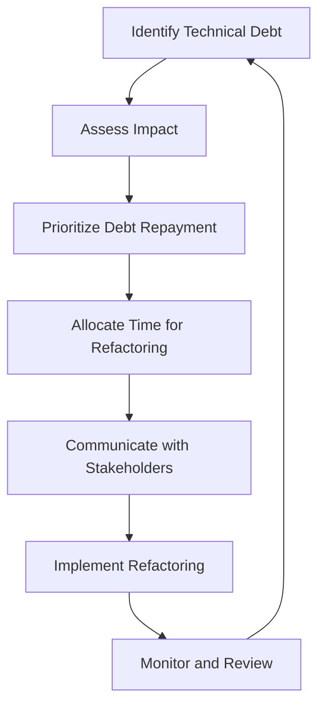

## 12.6 Dealing with Technical Debt

In the fast-paced world of software development, technical debt is an inevitable reality. It refers to the long-term cost incurred when developers take shortcuts to meet deadlines, often resulting in code that is difficult to maintain, extend, or refactor. In this section, we will explore the concept of technical debt, strategies to manage it effectively, and how to communicate its implications to stakeholders.

### Understanding Technical Debt

Technical debt is a metaphor introduced by Ward Cunningham to describe the eventual consequences of poor software design and implementation choices. It can be likened to financial debt, where the "interest" is the extra effort required to maintain and extend the system in the future.

#### Types of Technical Debt

1. **Deliberate Debt:** This occurs when developers consciously choose to take shortcuts to meet deadlines or reduce costs, with the intention of addressing the issues later.

2. **Accidental Debt:** This arises from lack of knowledge, oversight, or unforeseen changes in requirements that lead to suboptimal code.

3. **Bit Rot:** Over time, as software evolves, code can become outdated or inefficient due to changes in technology or business needs.

4. **Code Smells:** These are indicators of potential issues in the code, such as duplicated code, large classes, or long methods, which can contribute to technical debt.

### Strategies to Manage Technical Debt

Managing technical debt requires a proactive approach to identify, prioritize, and address issues before they become unmanageable.

#### Prioritizing Debt Repayment

1. **Debt Assessment:** Conduct regular code reviews and audits to identify areas of technical debt. Tools like SonarQube or PHPStan can help automate this process.

2. **Impact Analysis:** Evaluate the impact of technical debt on the system's performance, maintainability, and scalability. Focus on high-impact areas that affect critical functionality.

3. **Risk Management:** Prioritize debt repayment based on the risk it poses to the project. Address debt that could lead to system failures or security vulnerabilities first.

4. **Cost-Benefit Analysis:** Weigh the cost of repaying technical debt against the benefits of improved code quality and reduced maintenance effort.

#### Allocating Time for Refactoring

1. **Refactoring Sprints:** Dedicate specific sprints or iterations to refactoring and addressing technical debt. This ensures that debt repayment is part of the development cycle.

2. **Continuous Refactoring:** Encourage developers to refactor code as part of their daily workflow. This can prevent the accumulation of debt over time.

3. **Automated Testing:** Implement automated tests to ensure that refactoring does not introduce new bugs. Tools like PHPUnit can facilitate this process.

4. **Code Reviews:** Conduct regular code reviews to identify and address technical debt early. This also promotes knowledge sharing and adherence to coding standards.

### Communicating with Stakeholders

Effective communication with stakeholders is crucial to gain support for addressing technical debt.

#### Explaining the Importance of Addressing Technical Debt

1. **Visualizing Impact:** Use diagrams and charts to illustrate the impact of technical debt on project timelines, costs, and quality.

2. **Business Value:** Highlight the business value of addressing technical debt, such as improved system performance, reduced maintenance costs, and increased agility.

3. **Risk Mitigation:** Emphasize the risks associated with ignoring technical debt, such as system failures, security vulnerabilities, and increased technical complexity.

4. **Stakeholder Engagement:** Involve stakeholders in the debt management process by providing regular updates and seeking their input on prioritization.

### Code Examples

Let's explore a simple example of refactoring to manage technical debt in PHP. Consider a legacy code snippet that calculates the total price of items in a shopping cart:

```php
class ShoppingCart {
    private $items = [];

    public function addItem($item, $price) {
        $this->items[] = ['item' => $item, 'price' => $price];
    }

    public function calculateTotal() {
        $total = 0;
        foreach ($this->items as $item) {
            $total += $item['price'];
        }
        return $total;
    }
}

// Usage
$cart = new ShoppingCart();
$cart->addItem('Apple', 1.00);
$cart->addItem('Banana', 0.50);
echo $cart->calculateTotal(); // Outputs: 1.50
```

This code works, but it has some technical debt. The `calculateTotal` method is tightly coupled with the data structure of the items, making it difficult to extend or modify.

#### Refactoring Example

Let's refactor the code to reduce technical debt by introducing a `CartItem` class:

```php
class CartItem {
    private $name;
    private $price;

    public function __construct($name, $price) {
        $this->name = $name;
        $this->price = $price;
    }

    public function getPrice() {
        return $this->price;
    }
}

class ShoppingCart {
    private $items = [];

    public function addItem(CartItem $item) {
        $this->items[] = $item;
    }

    public function calculateTotal() {
        $total = 0;
        foreach ($this->items as $item) {
            $total += $item->getPrice();
        }
        return $total;
    }
}

// Usage
$cart = new ShoppingCart();
$cart->addItem(new CartItem('Apple', 1.00));
$cart->addItem(new CartItem('Banana', 0.50));
echo $cart->calculateTotal(); // Outputs: 1.50
```

In this refactored version, the `CartItem` class encapsulates the properties of an item, making the `ShoppingCart` class more flexible and easier to maintain.

### Visualizing Technical Debt

To better understand the impact of technical debt, let's visualize the process of managing it using a flowchart:



This flowchart illustrates the cyclical process of managing technical debt, from identification to implementation and review.

### Knowledge Check

- **Question:** What is technical debt, and why is it important to manage it?
- **Challenge:** Refactor a piece of legacy code in your project to reduce technical debt.

### Embrace the Journey

Remember, managing technical debt is an ongoing process that requires commitment and collaboration. By addressing technical debt proactively, we can improve code quality, reduce maintenance costs, and deliver better software solutions. Keep experimenting, stay curious, and enjoy the journey!

## Quiz: Dealing with Technical Debt



### What is technical debt?

- [x] The long-term cost of expedient decisions in software development.
- [ ] The amount of money spent on software licenses.
- [ ] The financial debt incurred by a company.
- [ ] The time spent on debugging code.

> **Explanation:** Technical debt refers to the long-term cost of expedient decisions made during software development, often leading to suboptimal code.

### Which of the following is a type of technical debt?

- [x] Deliberate debt
- [x] Accidental debt
- [ ] Financial debt
- [ ] Operational debt

> **Explanation:** Deliberate and accidental debts are types of technical debt, while financial and operational debts are not.

### What is the first step in managing technical debt?

- [x] Identify technical debt
- [ ] Implement refactoring
- [ ] Communicate with stakeholders
- [ ] Allocate time for refactoring

> **Explanation:** The first step in managing technical debt is to identify it through code reviews and audits.

### How can technical debt impact a project?

- [x] It can lead to increased maintenance costs.
- [x] It can cause system failures.
- [ ] It can reduce the number of developers needed.
- [ ] It can increase the speed of development.

> **Explanation:** Technical debt can lead to increased maintenance costs and system failures, but it does not reduce the number of developers needed or increase development speed.

### What is a code smell?

- [x] An indicator of potential issues in the code.
- [ ] A type of technical debt.
- [ ] A tool for code analysis.
- [ ] A programming language feature.

> **Explanation:** A code smell is an indicator of potential issues in the code that can contribute to technical debt.

### Why is it important to communicate technical debt to stakeholders?

- [x] To gain support for addressing it.
- [ ] To increase the project's budget.
- [ ] To reduce the number of developers.
- [ ] To delay project deadlines.

> **Explanation:** Communicating technical debt to stakeholders is important to gain their support for addressing it.

### Which tool can help automate the process of identifying technical debt?

- [x] SonarQube
- [x] PHPStan
- [ ] GitHub
- [ ] Docker

> **Explanation:** SonarQube and PHPStan are tools that can help automate the process of identifying technical debt.

### What is the benefit of continuous refactoring?

- [x] It prevents the accumulation of technical debt.
- [ ] It increases the project's budget.
- [ ] It reduces the number of developers needed.
- [ ] It delays project deadlines.

> **Explanation:** Continuous refactoring helps prevent the accumulation of technical debt over time.

### What is the purpose of automated testing in refactoring?

- [x] To ensure refactoring does not introduce new bugs.
- [ ] To increase the project's budget.
- [ ] To reduce the number of developers needed.
- [ ] To delay project deadlines.

> **Explanation:** Automated testing ensures that refactoring does not introduce new bugs into the codebase.

### True or False: Technical debt is only a concern for legacy code.

- [ ] True
- [x] False

> **Explanation:** Technical debt can occur in both legacy and new code, as it results from expedient decisions made during development.


