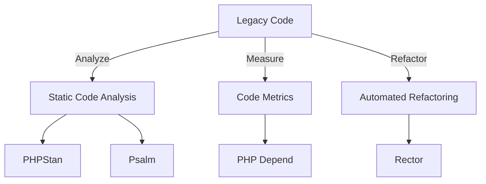

## 12.7 Tools for Analyzing and Improving Legacy Code

Working with legacy code can be a daunting task, especially when dealing with large, complex systems that have evolved over time. However, with the right tools and techniques, you can analyze and improve legacy PHP code, making it more maintainable and robust. In this section, we'll explore several tools that can help you identify code smells, measure code metrics, and automate refactoring processes.

### Static Code Analysis

Static code analysis is a method of debugging by examining the code without executing it. This approach helps identify potential issues, code smells, and areas for improvement. Let's delve into some popular tools for static code analysis in PHP.

#### PHPStan

[PHPStan](https://phpstan.org/) is a powerful static analysis tool for PHP that focuses on finding bugs in your code without running it. It provides a comprehensive analysis of your codebase, highlighting potential issues and suggesting improvements.

**Key Features of PHPStan:**

- **Type Safety:** PHPStan enforces strict type checks, helping you catch type-related errors early.
- **Custom Rules:** You can define custom rules to enforce coding standards specific to your project.
- **Integration:** PHPStan integrates seamlessly with CI/CD pipelines, ensuring continuous code quality checks.

**Example Usage:**

```bash
# Install PHPStan via Composer
composer require --dev phpstan/phpstan

# Run PHPStan analysis
vendor/bin/phpstan analyse src --level=max
```

In this example, PHPStan is configured to analyze the `src` directory at the maximum level of strictness, providing detailed insights into potential issues.

#### Psalm

[Psalm](https://psalm.dev/) is another static analysis tool for PHP that focuses on type safety and code quality. It offers a range of features to help you maintain a clean and error-free codebase.

**Key Features of Psalm:**

- **Type Inference:** Psalm infers types throughout your codebase, reducing the need for explicit type annotations.
- **Plugin System:** Extend Psalm's functionality with custom plugins tailored to your project's needs.
- **Error Suppression:** Temporarily suppress errors to focus on critical issues first.

**Example Usage:**

```bash
# Install Psalm via Composer
composer require --dev vimeo/psalm

# Initialize Psalm configuration
vendor/bin/psalm --init

# Run Psalm analysis
vendor/bin/psalm
```

Psalm's analysis provides a detailed report of potential issues, helping you prioritize and address them effectively.

### Code Metrics

Code metrics provide quantitative measures of various aspects of your code, such as complexity, maintainability, and test coverage. These metrics are invaluable for assessing the health of your codebase and identifying areas for improvement.

#### PHP Depend

[PHP Depend](https://pdepend.org/) is a tool that generates software metrics for PHP projects. It helps you understand the structure and quality of your code, providing insights into potential areas for refactoring.

**Key Features of PHP Depend:**

- **Complexity Analysis:** Measure cyclomatic complexity to identify complex and hard-to-maintain code.
- **Maintainability Index:** Assess the maintainability of your codebase with a comprehensive index.
- **Visualization:** Generate visual reports to better understand code dependencies and structure.

**Example Usage:**

```bash
# Install PHP Depend via Composer
composer require --dev pdepend/pdepend

# Run PHP Depend analysis
vendor/bin/pdepend --jdepend-xml=build/jdepend.xml src
```

PHP Depend generates an XML report with detailed metrics, which you can use to guide your refactoring efforts.

### Automated Refactoring Tools

Automated refactoring tools assist in transforming your codebase, making it more maintainable and aligned with modern coding standards. These tools can save significant time and effort, especially when dealing with large codebases.

#### Rector

[Rector](https://getrector.org/) is an automated refactoring tool for PHP that helps you modernize your codebase. It applies a series of transformations to your code, ensuring it adheres to best practices and modern standards.

**Key Features of Rector:**

- **Rule-Based Refactoring:** Apply predefined or custom rules to refactor your code automatically.
- **Upgrade PHP Versions:** Easily upgrade your codebase to newer PHP versions with minimal manual intervention.
- **Continuous Integration:** Integrate Rector into your CI/CD pipeline for ongoing code improvements.

**Example Usage:**

```bash
# Install Rector via Composer
composer require rector/rector --dev

# Run Rector with a specific set of rules
vendor/bin/rector process src --set php74
```

In this example, Rector is configured to apply transformations suitable for PHP 7.4, helping you modernize your codebase efficiently.

### Visualizing Code Dependencies

Understanding the dependencies within your codebase is crucial for effective refactoring. Visualizing these dependencies can provide insights into the structure and complexity of your code.



**Diagram Description:** This flowchart illustrates the process of analyzing and improving legacy code using static code analysis, code metrics, and automated refactoring tools.

### Try It Yourself

Experiment with the tools discussed in this section by setting up a sample PHP project. Use PHPStan and Psalm to analyze the code, PHP Depend to measure code metrics, and Rector to apply automated refactoring. Modify the code and observe how these tools help improve code quality and maintainability.

### Knowledge Check

- Explain the role of static code analysis in improving legacy code.
- Demonstrate how to use PHPStan to identify potential issues in a PHP codebase.
- Provide an example of how code metrics can guide refactoring efforts.
- Discuss the benefits of using automated refactoring tools like Rector.

### Embrace the Journey

Remember, improving legacy code is an ongoing process. As you become more familiar with these tools, you'll gain confidence in tackling even the most challenging codebases. Keep experimenting, stay curious, and enjoy the journey of transforming legacy code into maintainable, modern PHP applications.

## Quiz: Tools for Analyzing and Improving Legacy Code



### What is the primary purpose of static code analysis?

- [x] To identify potential issues in the code without executing it
- [ ] To execute the code and find runtime errors
- [ ] To compile the code into machine language
- [ ] To optimize the code for performance

> **Explanation:** Static code analysis examines the code without executing it to identify potential issues and code smells.

### Which tool is known for enforcing strict type checks in PHP?

- [x] PHPStan
- [ ] PHP Depend
- [ ] Rector
- [ ] Composer

> **Explanation:** PHPStan is known for its strict type checks, helping developers catch type-related errors early.

### What is the main advantage of using Rector for refactoring?

- [x] It automates code transformations based on predefined rules
- [ ] It provides real-time code execution
- [ ] It measures code complexity
- [ ] It compiles PHP code into machine language

> **Explanation:** Rector automates code transformations using predefined or custom rules, making refactoring more efficient.

### Which tool generates software metrics for PHP projects?

- [ ] PHPStan
- [ ] Psalm
- [x] PHP Depend
- [ ] Rector

> **Explanation:** PHP Depend generates software metrics, helping developers understand the structure and quality of their code.

### How can PHP Depend help in refactoring efforts?

- [x] By providing metrics like cyclomatic complexity and maintainability index
- [ ] By executing the code and finding runtime errors
- [ ] By compiling the code into machine language
- [ ] By optimizing the code for performance

> **Explanation:** PHP Depend provides metrics that help identify complex and hard-to-maintain code, guiding refactoring efforts.

### What is a key feature of Psalm?

- [x] Type inference throughout the codebase
- [ ] Real-time code execution
- [ ] Code compilation into machine language
- [ ] Performance optimization

> **Explanation:** Psalm infers types throughout the codebase, reducing the need for explicit type annotations.

### Which tool can be integrated into CI/CD pipelines for continuous code quality checks?

- [x] PHPStan
- [ ] PHP Depend
- [ ] Rector
- [ ] Composer

> **Explanation:** PHPStan integrates seamlessly with CI/CD pipelines, ensuring continuous code quality checks.

### What is the benefit of visualizing code dependencies?

- [x] It provides insights into the structure and complexity of the code
- [ ] It compiles the code into machine language
- [ ] It executes the code and finds runtime errors
- [ ] It optimizes the code for performance

> **Explanation:** Visualizing code dependencies helps understand the structure and complexity of the code, aiding in refactoring.

### What is the role of automated refactoring tools?

- [x] To assist in transforming the codebase for better maintainability
- [ ] To execute the code and find runtime errors
- [ ] To compile the code into machine language
- [ ] To optimize the code for performance

> **Explanation:** Automated refactoring tools assist in transforming the codebase, making it more maintainable and aligned with modern standards.

### True or False: PHPStan and Psalm are both static analysis tools for PHP.

- [x] True
- [ ] False

> **Explanation:** Both PHPStan and Psalm are static analysis tools that help identify potential issues and improve code quality in PHP.


