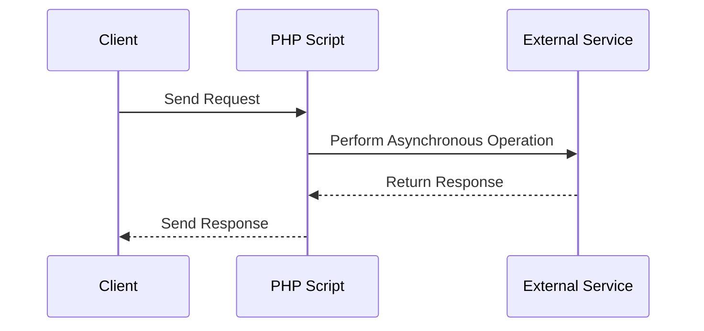

## 13.1 Introduction to Concurrency in PHP

Concurrency is a fundamental concept in modern software development, allowing applications to perform multiple tasks simultaneously, thereby improving performance and responsiveness. In this section, we will delve into the intricacies of concurrency in PHP, explore its significance, and understand how to implement asynchronous patterns effectively.

### Concurrent vs. Parallel Execution

Before we dive into concurrency in PHP, it's crucial to distinguish between two often-confused concepts: concurrency and parallelism.

- **Concurrency** refers to the ability of a system to handle multiple tasks at once. These tasks can be in progress simultaneously but do not necessarily run at the same time. Concurrency is about dealing with lots of things at once.
  
- **Parallel Execution**, on the other hand, involves executing multiple tasks simultaneously, typically on multiple processors or cores. Parallelism is about doing lots of things at the same time.

Understanding the distinction is vital because PHP, traditionally, is not designed for parallel execution due to its synchronous nature. However, it can achieve concurrency through various techniques, which we'll explore.

### Why Concurrency Matters

Concurrency is essential for improving the performance of I/O-bound applications. These applications spend a significant amount of time waiting for I/O operations, such as database queries, file reads/writes, or network requests. By leveraging concurrency, we can:

- **Enhance Responsiveness**: Concurrency allows applications to remain responsive by handling other tasks while waiting for I/O operations to complete.
- **Improve Throughput**: By executing multiple tasks concurrently, applications can process more requests in a given time frame.
- **Optimize Resource Utilization**: Concurrency enables better utilization of system resources, such as CPU and memory, by keeping them busy with other tasks during I/O waits.

### Traditional PHP Limitations

PHP is traditionally known for its synchronous execution model, where each script runs sequentially from start to finish. This model poses limitations for building highly concurrent applications:

- **Blocking I/O Operations**: PHP scripts typically block execution while waiting for I/O operations to complete, leading to inefficiencies.
- **Single-threaded Nature**: PHP's default execution model is single-threaded, meaning it can only execute one task at a time.
- **Lack of Built-in Asynchronous Support**: Unlike languages designed with concurrency in mind, PHP lacks built-in support for asynchronous programming.

Despite these limitations, PHP has evolved, and several libraries and extensions now enable developers to implement concurrency and asynchronous patterns effectively.

### Overcoming PHP's Synchronous Nature

To overcome PHP's synchronous nature and implement concurrency, we can leverage several techniques and tools:

1. **Asynchronous Libraries**: Libraries like ReactPHP and Amp provide event-driven, non-blocking I/O capabilities, allowing developers to write asynchronous code in PHP.

2. **Multithreading with Extensions**: Extensions like `pthreads` enable multithreading in PHP, allowing concurrent execution of tasks within a single process.

3. **Process Control Extensions**: Extensions such as `pcntl` allow forking processes, enabling parallel execution of tasks.

4. **Message Queues**: Using message queues like RabbitMQ or Redis, we can offload tasks to background workers, achieving concurrency through distributed processing.

5. **Promises and Futures**: Promises and futures provide a way to handle asynchronous operations, allowing code to continue executing while waiting for results.

Let's explore these techniques in detail, starting with asynchronous libraries.

### Asynchronous Libraries in PHP

Asynchronous libraries are crucial for implementing concurrency in PHP. They provide event-driven, non-blocking I/O capabilities, enabling developers to write code that can handle multiple tasks concurrently.

#### ReactPHP

ReactPHP is a popular library that brings asynchronous programming to PHP. It provides an event loop and a set of components for building non-blocking applications. Here's a simple example of using ReactPHP to perform an asynchronous HTTP request:

```php
<?php

require 'vendor/autoload.php';

use React\EventLoop\Factory;
use React\Http\Browser;

$loop = Factory::create();
$client = new Browser($loop);

$client->get('https://api.example.com/data')
    ->then(function (Psr\Http\Message\ResponseInterface $response) {
        echo 'Response: ' . $response->getBody();
    });

$loop->run();
```

In this example, we create an event loop using ReactPHP's `Factory::create()` method. We then use the `Browser` component to perform an asynchronous HTTP GET request. The `then` method allows us to specify a callback to handle the response once it's received.

#### Amp

Amp is another powerful library for asynchronous programming in PHP. It provides a coroutine-based approach, allowing developers to write asynchronous code that looks synchronous. Here's an example of using Amp to perform an asynchronous HTTP request:

```php
<?php

require 'vendor/autoload.php';

use Amp\Loop;
use Amp\Artax\Client;

Loop::run(function () {
    $client = new Client;
    $response = yield $client->request('https://api.example.com/data');
    echo 'Response: ' . yield $response->getBody();
});
```

In this example, we use Amp's `Loop::run()` method to start an event loop. The `yield` keyword is used to pause the execution of the coroutine until the asynchronous operation completes. This approach makes the code more readable and easier to maintain.

### Multithreading with Extensions

While PHP is not inherently multithreaded, extensions like `pthreads` enable multithreading in PHP, allowing concurrent execution of tasks within a single process.

#### Using `pthreads`

The `pthreads` extension allows developers to create and manage threads in PHP. Here's a simple example of using `pthreads` to perform concurrent tasks:

```php
<?php

class Task extends Thread
{
    public function run()
    {
        echo "Task running in thread " . $this->getThreadId() . "\n";
    }
}

$task1 = new Task();
$task2 = new Task();

$task1->start();
$task2->start();

$task1->join();
$task2->join();
```

In this example, we define a `Task` class that extends `Thread`. The `run` method contains the code to be executed concurrently. We create two instances of `Task`, start them, and wait for them to complete using the `join` method.

### Process Control Extensions

Process control extensions like `pcntl` allow forking processes, enabling parallel execution of tasks. This approach is useful for CPU-bound tasks that can benefit from parallelism.

#### Using `pcntl`

Here's an example of using `pcntl` to fork processes in PHP:

```php
<?php

$pid = pcntl_fork();

if ($pid == -1) {
    die('Could not fork');
} elseif ($pid) {
    // Parent process
    echo "Parent process\n";
} else {
    // Child process
    echo "Child process\n";
}
```

In this example, we use `pcntl_fork()` to create a child process. The parent process continues executing the code after the `fork`, while the child process executes the code in the `else` block.

### Message Queues

Message queues are a powerful tool for achieving concurrency through distributed processing. By offloading tasks to background workers, we can handle multiple tasks concurrently.

#### Using RabbitMQ

RabbitMQ is a popular message broker that allows us to send and receive messages between applications. Here's an example of using RabbitMQ with PHP:

```php
<?php

require 'vendor/autoload.php';

use PhpAmqpLib\Connection\AMQPStreamConnection;
use PhpAmqpLib\Message\AMQPMessage;

$connection = new AMQPStreamConnection('localhost', 5672, 'guest', 'guest');
$channel = $connection->channel();

$channel->queue_declare('task_queue', false, true, false, false);

$msg = new AMQPMessage('Hello World!', ['delivery_mode' => 2]);
$channel->basic_publish($msg, '', 'task_queue');

echo " [x] Sent 'Hello World!'\n";

$channel->close();
$connection->close();
```

In this example, we establish a connection to RabbitMQ, declare a queue, and publish a message to the queue. Background workers can consume messages from the queue, allowing for concurrent task processing.

### Promises and Futures

Promises and futures provide a way to handle asynchronous operations, allowing code to continue executing while waiting for results. They are commonly used in asynchronous programming to manage the completion of tasks.

#### Using Promises

Here's an example of using promises in PHP:

```php
<?php

require 'vendor/autoload.php';

use React\Promise\Promise;

function asyncOperation()
{
    return new Promise(function ($resolve, $reject) {
        // Simulate asynchronous operation
        sleep(1);
        $resolve('Operation completed');
    });
}

asyncOperation()->then(function ($result) {
    echo $result;
});
```

In this example, we define an `asyncOperation` function that returns a promise. The promise simulates an asynchronous operation using `sleep`. Once the operation is complete, the promise is resolved, and the `then` method is used to handle the result.

### Visualizing Concurrency in PHP

To better understand how concurrency works in PHP, let's visualize the flow of an asynchronous operation using a sequence diagram.



In this diagram, the client sends a request to the PHP script, which performs an asynchronous operation by communicating with an external service. Once the operation is complete, the response is returned to the client.

### Knowledge Check

- **Question**: What is the difference between concurrency and parallelism?
- **Question**: How can asynchronous libraries like ReactPHP and Amp improve PHP's concurrency capabilities?
- **Question**: What are the benefits of using message queues for concurrency in PHP?

### Try It Yourself

Experiment with the code examples provided in this section. Try modifying the asynchronous operations to perform different tasks, such as fetching data from an API or processing files concurrently. Observe how concurrency improves the performance and responsiveness of your PHP applications.

### Conclusion

Concurrency is a powerful tool for improving the performance and responsiveness of PHP applications, especially those that are I/O-bound. By leveraging asynchronous libraries, multithreading, process control extensions, message queues, and promises, we can overcome PHP's traditional limitations and build highly concurrent applications.

Remember, this is just the beginning. As you progress, you'll build more complex and interactive applications. Keep experimenting, stay curious, and enjoy the journey!

## Quiz: Introduction to Concurrency in PHP



### What is the primary difference between concurrency and parallelism?

- [x] Concurrency is about handling multiple tasks at once, while parallelism is about executing multiple tasks simultaneously.
- [ ] Concurrency is about executing tasks simultaneously, while parallelism is about handling multiple tasks at once.
- [ ] Concurrency and parallelism are the same concepts.
- [ ] Concurrency is only applicable to I/O-bound tasks.

> **Explanation:** Concurrency involves managing multiple tasks at once, whereas parallelism involves executing tasks simultaneously, often on multiple processors or cores.

### Which PHP library provides event-driven, non-blocking I/O capabilities?

- [x] ReactPHP
- [ ] Laravel
- [ ] Symfony
- [ ] CodeIgniter

> **Explanation:** ReactPHP is a library that provides event-driven, non-blocking I/O capabilities, enabling asynchronous programming in PHP.

### What is the purpose of using message queues in PHP?

- [x] To offload tasks to background workers for concurrent processing.
- [ ] To store data in a database.
- [ ] To handle user authentication.
- [ ] To render HTML templates.

> **Explanation:** Message queues allow tasks to be offloaded to background workers, enabling concurrent processing and improving application performance.

### Which PHP extension enables multithreading?

- [x] pthreads
- [ ] pcntl
- [ ] cURL
- [ ] PDO

> **Explanation:** The `pthreads` extension enables multithreading in PHP, allowing concurrent execution of tasks within a single process.

### What is a promise in asynchronous programming?

- [x] An object representing the eventual completion or failure of an asynchronous operation.
- [ ] A function that executes synchronously.
- [ ] A method for handling exceptions.
- [ ] A data structure for storing key-value pairs.

> **Explanation:** A promise is an object that represents the eventual completion or failure of an asynchronous operation, allowing code to continue executing while waiting for results.

### How does the `pcntl` extension help in concurrency?

- [x] It allows forking processes for parallel execution.
- [ ] It provides non-blocking I/O capabilities.
- [ ] It manages database connections.
- [ ] It handles HTTP requests.

> **Explanation:** The `pcntl` extension allows forking processes, enabling parallel execution of tasks and improving concurrency in PHP applications.

### What is the benefit of using Amp for asynchronous programming?

- [x] It provides a coroutine-based approach for writing asynchronous code that looks synchronous.
- [ ] It simplifies database interactions.
- [ ] It enhances security features.
- [ ] It improves HTML rendering.

> **Explanation:** Amp provides a coroutine-based approach, allowing developers to write asynchronous code that looks synchronous, making it more readable and maintainable.

### Which of the following is a traditional limitation of PHP regarding concurrency?

- [x] Synchronous execution model
- [ ] Lack of database support
- [ ] Inability to render HTML
- [ ] Limited string manipulation functions

> **Explanation:** PHP's traditional synchronous execution model is a limitation for building highly concurrent applications, as it blocks execution during I/O operations.

### What is the role of an event loop in asynchronous programming?

- [x] It manages the execution of asynchronous tasks and handles events.
- [ ] It processes database queries.
- [ ] It renders HTML templates.
- [ ] It manages user sessions.

> **Explanation:** An event loop manages the execution of asynchronous tasks and handles events, allowing applications to perform multiple tasks concurrently.

### True or False: PHP is inherently designed for parallel execution.

- [ ] True
- [x] False

> **Explanation:** False. PHP is traditionally designed for synchronous execution and is not inherently designed for parallel execution. However, concurrency can be achieved through various techniques and libraries.


