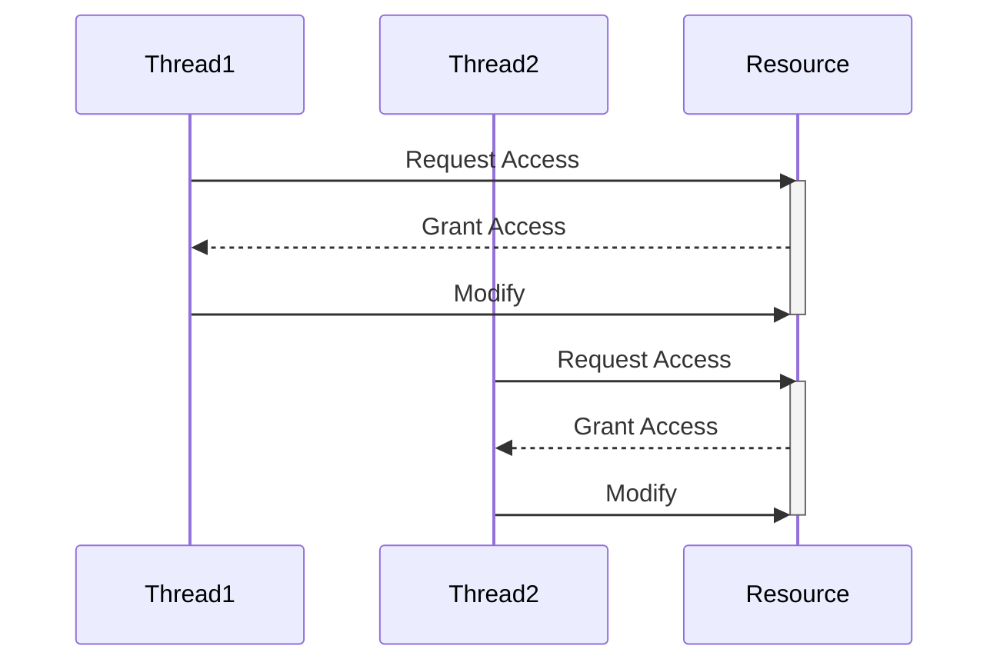

## 13.10 Handling Race Conditions

In the realm of concurrent programming, race conditions are a notorious challenge that can lead to unpredictable behavior and bugs in your applications. This section delves into the concept of race conditions, explores strategies to prevent them, and provides best practices for designing concurrent algorithms in PHP.

### Understanding Race Conditions

**Race conditions** occur when two or more threads or processes attempt to modify shared resources simultaneously, leading to unexpected results. In PHP, this can happen when scripts are executed concurrently, such as in web applications handling multiple requests at the same time.

#### Key Concepts

- **Shared Resources**: Variables or data structures that multiple threads or processes access simultaneously.
- **Critical Section**: A part of the code that accesses shared resources and must be executed atomically to prevent race conditions.
- **Synchronization**: Techniques used to control the access of multiple threads to shared resources.

### Prevention Strategies

Preventing race conditions involves ensuring that only one thread or process can access a critical section at a time. Here are some common strategies:

#### Locking Mechanisms

Locks are used to synchronize access to shared resources. PHP provides several mechanisms for implementing locks:

1. **Mutex (Mutual Exclusion)**: A mutex is a lock that ensures only one thread can access a resource at a time.

   ```php
   $mutex = new Mutex();
   $mutex->lock();
   // Critical section
   $mutex->unlock();
   ```

2. **Semaphores**: Semaphores are more flexible than mutexes and can allow a specific number of threads to access a resource simultaneously.

   ```php
   $semaphore = sem_get(ftok(__FILE__, 'a'), 1);
   sem_acquire($semaphore);
   // Critical section
   sem_release($semaphore);
   ```

3. **File Locking**: PHP's `flock()` function can be used to lock files, ensuring that only one process can write to a file at a time.

   ```php
   $file = fopen('file.txt', 'c');
   if (flock($file, LOCK_EX)) {
       // Critical section
       flock($file, LOCK_UN);
   }
   fclose($file);
   ```

#### Atomic Operations

Atomic operations are indivisible operations that complete without interruption. PHP does not natively support atomic operations, but you can use extensions like `swoole` or `pthreads` for atomic operations.

```php
$atomic = new Swoole\Atomic();
$atomic->add(1); // Atomic increment
```

### Best Practices

To effectively handle race conditions, consider the following best practices:

#### Minimizing Shared State

Reduce the amount of shared state in your application. The less shared state there is, the fewer opportunities for race conditions.

- **Immutable Data Structures**: Use immutable data structures that cannot be modified after creation.
- **Local Variables**: Prefer local variables over global ones to limit the scope of shared data.

#### Careful Design of Concurrent Algorithms

Design your algorithms to minimize the need for synchronization.

- **Lock-Free Algorithms**: Use algorithms that do not require locks, such as compare-and-swap (CAS).
- **Partitioning**: Divide data into independent partitions that can be processed concurrently without interference.

### Code Examples

Let's explore some practical examples of handling race conditions in PHP.

#### Example 1: Using Mutex for Synchronization

```php
<?php

class Counter {
    private $count = 0;
    private $mutex;

    public function __construct() {
        $this->mutex = new Mutex();
    }

    public function increment() {
        $this->mutex->lock();
        $this->count++;
        $this->mutex->unlock();
    }

    public function getCount() {
        return $this->count;
    }
}

$counter = new Counter();
$counter->increment();
echo $counter->getCount(); // Output: 1
```

#### Example 2: Semaphore for Limited Access

```php
<?php

$semaphore = sem_get(ftok(__FILE__, 'a'), 1);

function criticalSection() {
    global $semaphore;
    sem_acquire($semaphore);
    // Critical section
    sem_release($semaphore);
}

criticalSection();
```

### Visualizing Race Conditions

To better understand race conditions and their prevention, let's visualize the process using a sequence diagram.



### References and Links

- [PHP Manual: flock()](https://www.php.net/manual/en/function.flock.php)
- [PHP Manual: sem_get()](https://www.php.net/manual/en/function.sem-get.php)
- [Swoole Documentation](https://www.swoole.co.uk/docs)

### Knowledge Check

- What is a race condition, and why is it problematic?
- How can locks help prevent race conditions?
- What are atomic operations, and how do they differ from locks?

### Embrace the Journey

Handling race conditions is a crucial skill in concurrent programming. As you continue to develop your PHP applications, remember to apply these strategies and best practices to ensure robust and reliable code. Keep experimenting, stay curious, and enjoy the journey!

## Quiz: Handling Race Conditions



### What is a race condition?

- [x] A situation where multiple threads access shared resources simultaneously, leading to unpredictable results.
- [ ] A condition where a program runs slower than expected.
- [ ] A scenario where a program crashes due to an error.
- [ ] A situation where a program runs faster than expected.

> **Explanation:** A race condition occurs when multiple threads or processes access shared resources simultaneously, leading to unpredictable results.

### Which of the following is a locking mechanism in PHP?

- [x] Mutex
- [ ] Semaphore
- [ ] Atomic operation
- [ ] File lock

> **Explanation:** A mutex is a locking mechanism that ensures only one thread can access a resource at a time.

### What is the purpose of a critical section?

- [x] To ensure that a part of the code accessing shared resources is executed atomically.
- [ ] To speed up the execution of a program.
- [ ] To handle errors in a program.
- [ ] To optimize memory usage.

> **Explanation:** A critical section is a part of the code that accesses shared resources and must be executed atomically to prevent race conditions.

### How can atomic operations help prevent race conditions?

- [x] By ensuring operations are completed without interruption.
- [ ] By slowing down the execution of a program.
- [ ] By increasing the memory usage of a program.
- [ ] By handling errors in a program.

> **Explanation:** Atomic operations are indivisible operations that complete without interruption, helping to prevent race conditions.

### Which of the following is a best practice for minimizing shared state?

- [x] Use immutable data structures.
- [ ] Use global variables.
- [x] Prefer local variables over global ones.
- [ ] Increase the number of threads.

> **Explanation:** Using immutable data structures and preferring local variables over global ones are best practices for minimizing shared state.

### What is a semaphore used for in PHP?

- [x] To allow a specific number of threads to access a resource simultaneously.
- [ ] To speed up the execution of a program.
- [ ] To handle errors in a program.
- [ ] To optimize memory usage.

> **Explanation:** A semaphore is used to allow a specific number of threads to access a resource simultaneously.

### What is the purpose of partitioning in concurrent algorithms?

- [x] To divide data into independent partitions that can be processed concurrently without interference.
- [ ] To slow down the execution of a program.
- [ ] To increase the memory usage of a program.
- [ ] To handle errors in a program.

> **Explanation:** Partitioning divides data into independent partitions that can be processed concurrently without interference.

### How does file locking help prevent race conditions?

- [x] By ensuring only one process can write to a file at a time.
- [ ] By speeding up the execution of a program.
- [ ] By handling errors in a program.
- [ ] By optimizing memory usage.

> **Explanation:** File locking ensures that only one process can write to a file at a time, helping to prevent race conditions.

### What is a lock-free algorithm?

- [x] An algorithm that does not require locks.
- [ ] An algorithm that speeds up the execution of a program.
- [ ] An algorithm that increases the memory usage of a program.
- [ ] An algorithm that handles errors in a program.

> **Explanation:** A lock-free algorithm is one that does not require locks, reducing the need for synchronization.

### True or False: Race conditions can only occur in multi-threaded applications.

- [ ] True
- [x] False

> **Explanation:** Race conditions can occur in both multi-threaded and multi-process applications, as long as there is unsynchronized access to shared resources.




