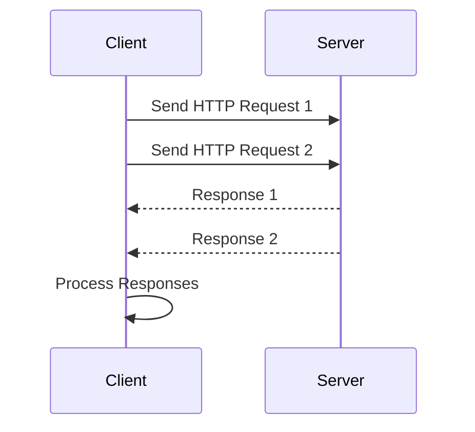

## 13.2 Asynchronous Programming with Promises

Asynchronous programming is a powerful paradigm that allows developers to write non-blocking code, enabling applications to perform multiple operations concurrently. In PHP, asynchronous programming can be achieved using promises, which are objects representing the eventual result of an asynchronous operation. This section will guide you through the concept of promises, how to implement them in PHP, and their practical use cases.

### Understanding Promises

**Promises Concept:**

A promise is an object that represents a value which may be available now, or in the future, or never. It allows you to associate handlers with an asynchronous action's eventual success value or failure reason. This makes it easier to work with asynchronous operations without getting bogged down in callback hell.

**Key Characteristics of Promises:**

- **Pending:** Initial state, neither fulfilled nor rejected.
- **Fulfilled:** Operation completed successfully.
- **Rejected:** Operation failed.

Promises provide a more readable and manageable way to handle asynchronous operations compared to traditional callback-based approaches.

### Implementing Promises in PHP

PHP does not natively support promises, but there are libraries that provide this functionality. One of the most popular libraries for implementing promises in PHP is **Guzzle Promises**.

#### Guzzle Promises

Guzzle is a PHP HTTP client that makes it easy to send HTTP requests and handle responses. Guzzle Promises is a part of the Guzzle library that provides promise-based asynchronous programming capabilities.

**Installation:**

To use Guzzle Promises, you need to install the Guzzle library via Composer:

```bash
composer require guzzlehttp/guzzle
```

**Basic Usage:**

Here's a simple example demonstrating how to use Guzzle Promises to make asynchronous HTTP requests:

```php
<?php

require 'vendor/autoload.php';

use GuzzleHttp\Client;
use GuzzleHttp\Promise;

$client = new Client();

// Create an array of promises
$promises = [
    'google' => $client->getAsync('https://www.google.com'),
    'github' => $client->getAsync('https://api.github.com'),
];

// Wait for the promises to resolve
$results = Promise\settle($promises)->wait();

// Process the results
foreach ($results as $key => $result) {
    if ($result['state'] === 'fulfilled') {
        echo "Request to $key was successful: " . $result['value']->getBody() . "\n";
    } else {
        echo "Request to $key failed: " . $result['reason'] . "\n";
    }
}
```

**Explanation:**

- We create a `Client` instance from Guzzle.
- We initiate asynchronous HTTP requests using `getAsync()`.
- We use `Promise\settle()` to wait for all promises to resolve.
- We iterate over the results and handle each promise's fulfillment or rejection.

### Use Cases for Promises

Promises are particularly useful in scenarios where you need to perform multiple asynchronous operations concurrently. Some common use cases include:

- **Asynchronous HTTP Requests:** Making multiple HTTP requests simultaneously without blocking the execution of your script.
- **File I/O Operations:** Reading and writing files asynchronously to improve performance.
- **Database Queries:** Executing database queries in parallel to reduce response time.
- **Event-Driven Applications:** Handling events asynchronously in real-time applications.

### Advanced Promise Patterns

#### Chaining Promises

Promises can be chained to perform a sequence of asynchronous operations. This is useful when you need to perform a series of dependent tasks.

```php
<?php

require 'vendor/autoload.php';

use GuzzleHttp\Client;

$client = new Client();

$client->getAsync('https://api.github.com')
    ->then(function ($response) {
        echo "First request successful: " . $response->getBody() . "\n";
        return $client->getAsync('https://www.google.com');
    })
    ->then(function ($response) {
        echo "Second request successful: " . $response->getBody() . "\n";
    })
    ->otherwise(function ($exception) {
        echo "An error occurred: " . $exception->getMessage() . "\n";
    })
    ->wait();
```

**Explanation:**

- We chain `then()` methods to handle the fulfillment of each promise.
- We use `otherwise()` to handle any errors that occur during the chain.

#### Combining Promises

You can combine multiple promises using `Promise\all()` to wait for all promises to fulfill or `Promise\race()` to wait for the first promise to settle.

```php
<?php

require 'vendor/autoload.php';

use GuzzleHttp\Client;
use GuzzleHttp\Promise;

$client = new Client();

$promises = [
    $client->getAsync('https://api.github.com'),
    $client->getAsync('https://www.google.com'),
];

Promise\all($promises)
    ->then(function ($responses) {
        foreach ($responses as $response) {
            echo "Response received: " . $response->getBody() . "\n";
        }
    })
    ->otherwise(function ($exception) {
        echo "An error occurred: " . $exception->getMessage() . "\n";
    })
    ->wait();
```

**Explanation:**

- `Promise\all()` waits for all promises to fulfill and returns an array of results.
- `Promise\race()` returns the result of the first settled promise.

### Visualizing Promises

To better understand how promises work, let's visualize the flow of asynchronous operations using a sequence diagram.



**Diagram Explanation:**

- The client sends multiple HTTP requests to the server.
- The server processes the requests and sends responses back to the client.
- The client processes the responses asynchronously.

### Best Practices for Using Promises

- **Error Handling:** Always handle errors using `otherwise()` to prevent unhandled promise rejections.
- **Resource Management:** Be mindful of resource usage when making multiple asynchronous requests.
- **Testing:** Test asynchronous code thoroughly to ensure it behaves as expected.
- **Documentation:** Document your code to make it easier for others to understand the flow of asynchronous operations.

### Try It Yourself

Experiment with the code examples provided in this section. Try modifying the URLs in the HTTP requests or chaining additional promises to see how the flow of operations changes. This hands-on approach will help reinforce your understanding of promises in PHP.

### Further Reading

For more information on promises and asynchronous programming in PHP, consider exploring the following resources:

- [Guzzle Promises Documentation](https://github.com/guzzle/promises)
- [PHP: Asynchronous Programming](https://www.php.net/manual/en/book.swoole.php)
- [MDN Web Docs: Promises](https://developer.mozilla.org/en-US/docs/Web/JavaScript/Guide/Using_promises)

### Summary

In this section, we explored the concept of promises in PHP and how they enable asynchronous programming. We learned how to implement promises using the Guzzle library and examined various use cases and advanced patterns. By understanding and utilizing promises, you can write more efficient and responsive PHP applications.

## Quiz: Asynchronous Programming with Promises



### What is a promise in asynchronous programming?

- [x] An object representing the eventual result of an asynchronous operation
- [ ] A function that executes immediately
- [ ] A synchronous operation
- [ ] A type of database query

> **Explanation:** A promise is an object that represents the eventual result of an asynchronous operation, allowing you to handle success or failure.

### Which library in PHP supports promises?

- [x] Guzzle
- [ ] Laravel
- [ ] Symfony
- [ ] Zend

> **Explanation:** Guzzle is a PHP HTTP client that provides promise-based asynchronous programming capabilities.

### What is the initial state of a promise?

- [x] Pending
- [ ] Fulfilled
- [ ] Rejected
- [ ] Completed

> **Explanation:** The initial state of a promise is "pending," meaning it is neither fulfilled nor rejected.

### How do you handle errors in promises?

- [x] Using the `otherwise()` method
- [ ] Using the `catch()` method
- [ ] Using the `finally()` method
- [ ] Using the `try-catch` block

> **Explanation:** Errors in promises are handled using the `otherwise()` method in Guzzle Promises.

### What does `Promise\all()` do?

- [x] Waits for all promises to fulfill
- [ ] Waits for the first promise to fulfill
- [ ] Cancels all promises
- [ ] Rejects all promises

> **Explanation:** `Promise\all()` waits for all promises to fulfill and returns an array of results.

### Which method is used to chain promises?

- [x] `then()`
- [ ] `catch()`
- [ ] `finally()`
- [ ] `wait()`

> **Explanation:** The `then()` method is used to chain promises and handle the fulfillment of each promise.

### What is a common use case for promises?

- [x] Asynchronous HTTP requests
- [ ] Synchronous database queries
- [ ] Blocking file I/O
- [ ] Immediate function execution

> **Explanation:** Promises are commonly used for asynchronous HTTP requests to handle multiple operations concurrently.

### What is the purpose of `Promise\race()`?

- [x] Waits for the first promise to settle
- [ ] Waits for all promises to settle
- [ ] Cancels all promises
- [ ] Rejects all promises

> **Explanation:** `Promise\race()` waits for the first promise to settle, whether it is fulfilled or rejected.

### Can promises be used for file I/O operations?

- [x] True
- [ ] False

> **Explanation:** Promises can be used for asynchronous file I/O operations to improve performance.

### What should you always do when using promises?

- [x] Handle errors
- [ ] Ignore errors
- [ ] Use synchronous code
- [ ] Avoid chaining

> **Explanation:** Always handle errors when using promises to prevent unhandled promise rejections.



Remember, mastering asynchronous programming with promises in PHP will greatly enhance your ability to write efficient and responsive applications. Keep experimenting, stay curious, and enjoy the journey!
