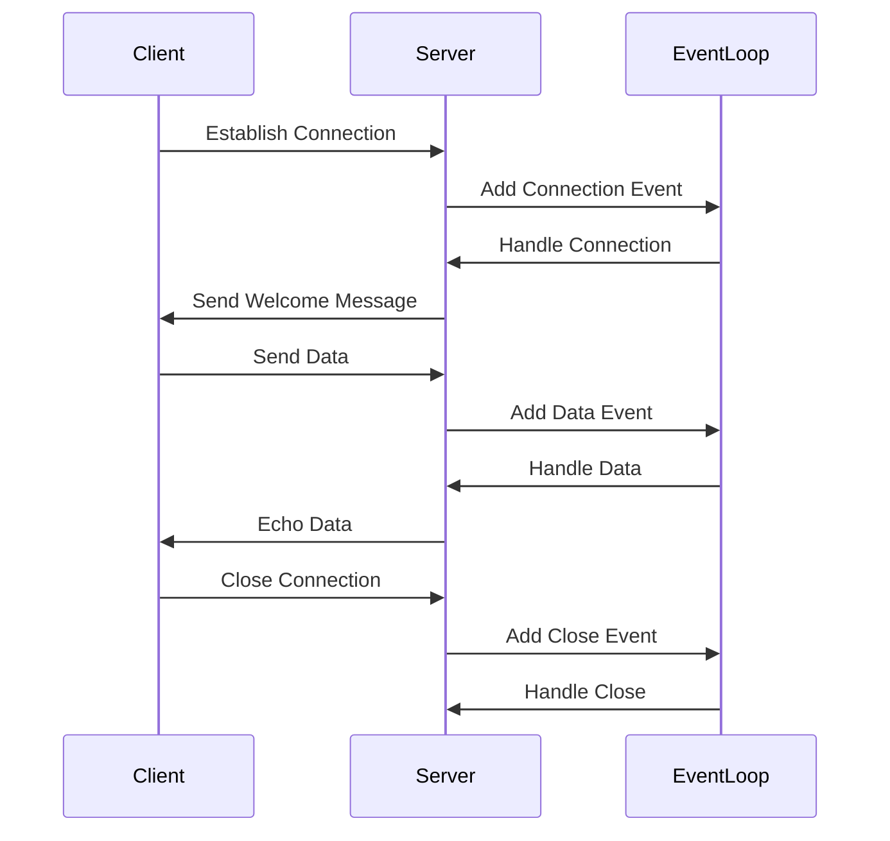

## 13.3 Event Loops and ReactPHP

In the world of PHP, traditionally known for its synchronous execution model, the concept of asynchronous programming has emerged as a powerful paradigm shift. At the heart of this shift lies the event loop, a core mechanism that enables non-blocking I/O operations. In this section, we will delve into the intricacies of event loops and explore ReactPHP, a library that brings event-driven, non-blocking I/O capabilities to PHP. By the end of this guide, you'll be equipped to build efficient, real-time applications using these concepts.

### Understanding the Event Loop Mechanism

The event loop is a fundamental concept in asynchronous programming. It allows a program to perform non-blocking operations by continuously checking for and executing events. This mechanism is crucial for building applications that require high concurrency and low latency, such as web servers, chat applications, and real-time data processing systems.

#### How the Event Loop Works

The event loop operates by maintaining a queue of events or tasks that need to be executed. It continuously iterates over this queue, executing tasks as they become ready. Here's a simplified breakdown of the event loop process:

1. **Initialization**: The event loop starts by initializing and setting up the necessary resources, such as network sockets and timers.

2. **Event Queue**: It maintains a queue of events, which can include I/O operations, timers, and user-defined callbacks.

3. **Event Handling**: The loop continuously checks the queue for events that are ready to be processed. When an event is ready, the corresponding callback function is executed.

4. **Non-blocking I/O**: The event loop allows I/O operations to be performed asynchronously, meaning the program can continue executing other tasks while waiting for I/O operations to complete.

5. **Termination**: The event loop continues running until there are no more events to process or the program is explicitly terminated.

#### Benefits of Using an Event Loop

- **Concurrency**: Handle multiple tasks simultaneously without blocking the main execution thread.
- **Efficiency**: Reduce resource consumption by avoiding the need for multiple threads or processes.
- **Scalability**: Build applications that can handle a large number of concurrent connections.

### Introducing ReactPHP

ReactPHP is a popular library that brings the power of event-driven, non-blocking I/O to PHP. It provides a set of components for building asynchronous applications, including networking, timers, and streams. ReactPHP is designed to be lightweight and flexible, making it an ideal choice for developers looking to leverage the benefits of asynchronous programming in PHP.

#### Key Features of ReactPHP

- **Event Loop**: The core of ReactPHP, responsible for managing and executing events.
- **Streams**: Handle data streams efficiently, supporting both reading and writing operations.
- **Timers**: Schedule tasks to be executed at specific intervals or after a delay.
- **Networking**: Build TCP/UDP servers and clients with ease.
- **Promises**: Manage asynchronous operations using promises, a common pattern in modern programming.

#### Getting Started with ReactPHP

To start using ReactPHP, you'll need to install it via Composer, the dependency manager for PHP. Here's how you can set it up:

```bash
composer require react/react
```

Once installed, you can begin building asynchronous applications using ReactPHP's components.

### Building Asynchronous Applications with ReactPHP

Let's explore how to build various types of asynchronous applications using ReactPHP. We'll cover creating servers, clients, and real-time applications.

#### Creating a Simple TCP Server

A TCP server is a fundamental component of many networked applications. With ReactPHP, creating a TCP server is straightforward. Here's a basic example:

```php
<?php

require 'vendor/autoload.php';

use React\EventLoop\Factory;
use React\Socket\Server;

$loop = Factory::create();
$socket = new Server('127.0.0.1:8080', $loop);

$socket->on('connection', function ($connection) {
    echo "New connection established\n";
    $connection->write("Welcome to the ReactPHP server!\n");

    $connection->on('data', function ($data) use ($connection) {
        echo "Received data: $data\n";
        $connection->write("You said: $data");
    });
});

$loop->run();
```

**Explanation:**

- **Event Loop**: We create an event loop using `Factory::create()`.
- **Socket Server**: A TCP server is created on `127.0.0.1:8080`.
- **Connection Handling**: When a new connection is established, a message is sent to the client.
- **Data Handling**: Incoming data from the client is echoed back.

#### Building a Real-Time Chat Application

Real-time chat applications are a common use case for asynchronous programming. With ReactPHP, you can build a simple chat server that handles multiple clients concurrently.

```php
<?php

require 'vendor/autoload.php';

use React\EventLoop\Factory;
use React\Socket\Server;
use React\Socket\ConnectionInterface;

$loop = Factory::create();
$socket = new Server('127.0.0.1:8080', $loop);
$clients = [];

$socket->on('connection', function (ConnectionInterface $connection) use (&$clients) {
    $clients[] = $connection;
    echo "New client connected\n";

    $connection->on('data', function ($data) use ($connection, &$clients) {
        foreach ($clients as $client) {
            if ($client !== $connection) {
                $client->write($data);
            }
        }
    });

    $connection->on('close', function () use ($connection, &$clients) {
        echo "Client disconnected\n";
        $clients = array_filter($clients, function ($client) use ($connection) {
            return $client !== $connection;
        });
    });
});

$loop->run();
```

**Explanation:**

- **Client Management**: We maintain a list of connected clients.
- **Broadcasting**: Incoming messages are broadcast to all clients except the sender.
- **Connection Lifecycle**: Handle client disconnections gracefully.

### Visualizing the Event Loop with ReactPHP

To better understand how the event loop operates within ReactPHP, let's visualize the process using a Mermaid.js diagram.



**Diagram Explanation:**

- **Connection Establishment**: The client establishes a connection with the server.
- **Event Handling**: The event loop handles connection, data, and close events.
- **Data Flow**: Data is sent from the client to the server and echoed back.

### Advanced Concepts in ReactPHP

ReactPHP offers several advanced features that can enhance your applications. Let's explore some of these concepts.

#### Promises and Deferreds

Promises are a common pattern for managing asynchronous operations. In ReactPHP, promises are used to handle the results of asynchronous tasks.

```php
<?php

require 'vendor/autoload.php';

use React\Promise\Deferred;

function asyncOperation() {
    $deferred = new Deferred();

    // Simulate an asynchronous task
    $timer = React\EventLoop\Factory::create()->addTimer(2, function () use ($deferred) {
        $deferred->resolve("Task completed!");
    });

    return $deferred->promise();
}

asyncOperation()->then(function ($result) {
    echo $result . "\n";
});
```

**Explanation:**

- **Deferred**: A deferred object is used to create a promise.
- **Timer**: Simulate an asynchronous task with a timer.
- **Promise Resolution**: The promise is resolved when the task completes.

#### Integrating with Other Libraries

ReactPHP can be integrated with other libraries to extend its functionality. For example, you can use `React\Http` for building HTTP servers or `React\Dns` for DNS resolution.

### Building Robust Applications with ReactPHP

When building applications with ReactPHP, consider the following best practices:

- **Error Handling**: Implement robust error handling to manage exceptions and failures.
- **Resource Management**: Ensure resources such as sockets and timers are properly managed and released.
- **Testing**: Write unit tests for your asynchronous code to ensure reliability.

### Try It Yourself

Now that you've learned about event loops and ReactPHP, it's time to experiment. Try modifying the code examples to add new features or handle additional events. For instance, you could:

- Add authentication to the chat server.
- Implement a simple HTTP server using `React\Http`.
- Create a timer-based task scheduler.

### Further Reading and Resources

To deepen your understanding of event loops and ReactPHP, consider exploring the following resources:

- [ReactPHP Documentation](https://reactphp.org/)
- [Asynchronous Programming in PHP](https://www.php.net/manual/en/book.sockets.php)
- [Event Loops Explained](https://developer.mozilla.org/en-US/docs/Web/JavaScript/EventLoop)

### Summary

In this section, we've explored the power of event loops and ReactPHP for building asynchronous applications in PHP. By leveraging non-blocking I/O and event-driven programming, you can create efficient, real-time applications that handle multiple tasks concurrently. Remember, this is just the beginning. As you progress, you'll discover even more possibilities with asynchronous programming in PHP. Keep experimenting, stay curious, and enjoy the journey!

## Quiz: Event Loops and ReactPHP



### What is the primary purpose of an event loop in asynchronous programming?

- [x] To handle multiple tasks concurrently without blocking the main execution thread
- [ ] To execute tasks sequentially in a single thread
- [ ] To manage database connections
- [ ] To perform synchronous I/O operations

> **Explanation:** The event loop allows for handling multiple tasks concurrently without blocking the main execution thread, enabling asynchronous programming.

### Which library in PHP provides event-driven, non-blocking I/O capabilities?

- [ ] Symfony
- [x] ReactPHP
- [ ] Laravel
- [ ] CodeIgniter

> **Explanation:** ReactPHP is a library that provides event-driven, non-blocking I/O capabilities in PHP.

### In ReactPHP, what is the role of the `Factory::create()` method?

- [ ] To create a new HTTP server
- [x] To initialize a new event loop
- [ ] To establish a database connection
- [ ] To start a new thread

> **Explanation:** The `Factory::create()` method is used to initialize a new event loop in ReactPHP.

### What is a promise in the context of ReactPHP?

- [ ] A method for synchronous execution
- [x] A pattern for managing asynchronous operations
- [ ] A way to handle exceptions
- [ ] A type of database connection

> **Explanation:** A promise is a pattern for managing asynchronous operations, allowing you to handle results or errors when they occur.

### How does ReactPHP handle incoming data from a client in a TCP server?

- [ ] By blocking the main thread until data is received
- [x] By using event-driven callbacks to process data
- [ ] By creating a new thread for each client
- [ ] By storing data in a database

> **Explanation:** ReactPHP uses event-driven callbacks to process incoming data from clients in a non-blocking manner.

### What is the benefit of using non-blocking I/O in PHP applications?

- [x] Improved efficiency and scalability
- [ ] Increased memory usage
- [ ] Slower response times
- [ ] More complex code

> **Explanation:** Non-blocking I/O improves efficiency and scalability by allowing applications to handle multiple tasks concurrently without waiting for I/O operations to complete.

### Which of the following is a common use case for ReactPHP?

- [ ] Building static websites
- [x] Developing real-time chat applications
- [ ] Creating desktop applications
- [ ] Writing database queries

> **Explanation:** ReactPHP is commonly used for developing real-time chat applications due to its ability to handle multiple connections concurrently.

### What is the purpose of the `Deferred` object in ReactPHP?

- [ ] To create a new event loop
- [ ] To manage database transactions
- [x] To create and resolve promises
- [ ] To handle HTTP requests

> **Explanation:** The `Deferred` object is used to create and resolve promises, allowing you to manage asynchronous operations.

### How can you install ReactPHP in a PHP project?

- [ ] By downloading it from the official website
- [x] By using Composer to require the package
- [ ] By including it in the PHP configuration file
- [ ] By writing custom code

> **Explanation:** ReactPHP can be installed in a PHP project by using Composer to require the package.

### True or False: ReactPHP can only be used for building web servers.

- [ ] True
- [x] False

> **Explanation:** False. ReactPHP can be used for a variety of applications, including web servers, real-time applications, and more, due to its event-driven, non-blocking I/O capabilities.


