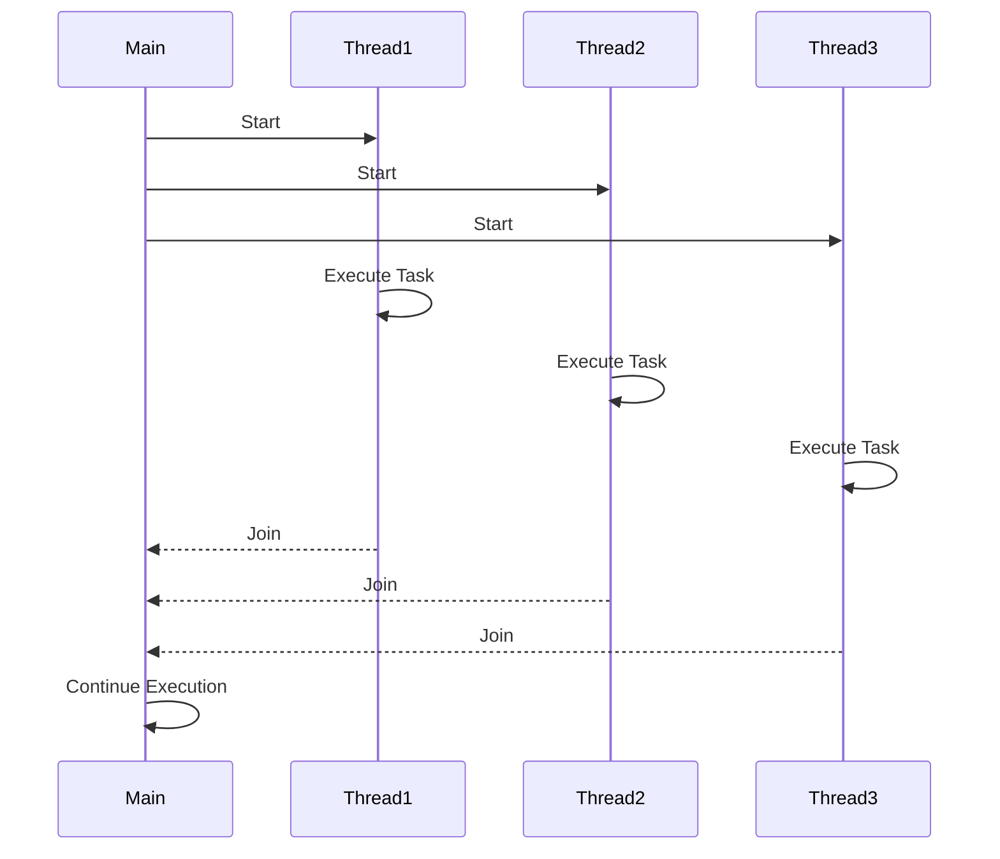

## 13.4 Multithreading with pthreads

In the world of PHP, concurrency and parallel processing can significantly enhance the performance of applications, especially those that are CPU-intensive. While PHP is traditionally known for its single-threaded nature, the `pthreads` extension opens the door to multithreading, allowing developers to execute multiple threads simultaneously. This section will delve into the intricacies of using `pthreads` in PHP, providing you with the knowledge to harness the power of multithreading effectively.

### Understanding Multithreading

**Multithreading** is a programming paradigm that allows multiple threads to exist within the context of a single process. These threads share the process's resources but execute independently. This can lead to more efficient use of CPU resources, as threads can run concurrently, performing different tasks simultaneously.

#### Key Concepts

- **Thread**: The smallest sequence of programmed instructions that can be managed independently by a scheduler.
- **Concurrency**: The ability to run multiple tasks or threads in overlapping time periods.
- **Parallelism**: The simultaneous execution of multiple threads or tasks.
- **Thread Safety**: Ensuring that shared data is accessed by only one thread at a time to prevent data corruption.

### The pthreads Extension

The `pthreads` extension is a PECL extension that provides an object-oriented API for multithreading in PHP. It allows you to create, manage, and synchronize threads, making it possible to write concurrent applications in PHP.

#### Installation

To use `pthreads`, you must install the extension. Note that `pthreads` is only available for PHP CLI (Command Line Interface) and not for web server environments like Apache or Nginx.

```bash
# Install pthreads via PECL
pecl install pthreads
```

Ensure that your `php.ini` file is configured to load the `pthreads` extension:

```ini
extension=pthreads.so
```

#### Usage Considerations

- **CLI Only**: `pthreads` is designed for CLI applications, not web server environments.
- **Thread Safety**: Be cautious with shared resources. Use synchronization mechanisms like mutexes to prevent race conditions.
- **Resource Management**: Threads consume system resources. Monitor and manage resources to avoid exhaustion.

### Implementing Multithreading with pthreads

Let's explore how to implement multithreading in PHP using the `pthreads` extension. We'll cover creating threads, managing them, and synchronizing shared resources.

#### Creating Threads

To create a thread in PHP, extend the `Thread` class provided by the `pthreads` extension. Override the `run` method to define the thread's behavior.

```php
<?php

class MyThread extends Thread
{
    public function run()
    {
        // Thread logic goes here
        echo "Hello from thread " . Thread::getCurrentThreadId() . "\n";
    }
}

// Create and start a thread
$thread = new MyThread();
$thread->start();
$thread->join(); // Wait for the thread to finish
?>
```

#### Managing Threads

You can manage threads using methods like `start()`, `join()`, and `isRunning()`. These methods control the lifecycle of a thread.

- **start()**: Begins execution of the thread.
- **join()**: Waits for the thread to finish execution.
- **isRunning()**: Checks if the thread is currently running.

#### Synchronizing Threads

When multiple threads access shared resources, synchronization is crucial to prevent data corruption. Use mutexes to lock resources during access.

```php
<?php

class Counter
{
    private $count = 0;
    private $mutex;

    public function __construct()
    {
        $this->mutex = new Mutex();
    }

    public function increment()
    {
        Mutex::lock($this->mutex);
        $this->count++;
        Mutex::unlock($this->mutex);
    }

    public function getCount()
    {
        return $this->count;
    }
}

class CounterThread extends Thread
{
    private $counter;

    public function __construct($counter)
    {
        $this->counter = $counter;
    }

    public function run()
    {
        for ($i = 0; $i < 1000; $i++) {
            $this->counter->increment();
        }
    }
}

$counter = new Counter();
$threads = [];

for ($i = 0; $i < 10; $i++) {
    $threads[$i] = new CounterThread($counter);
    $threads[$i]->start();
}

foreach ($threads as $thread) {
    $thread->join();
}

echo "Final count: " . $counter->getCount() . "\n";
?>
```

### Practical Applications

Multithreading can be particularly beneficial in scenarios where tasks are CPU-bound, such as:

- **Image Processing**: Performing operations on large images.
- **Data Analysis**: Processing large datasets concurrently.
- **Simulations**: Running multiple simulations in parallel.

#### Example: Image Processing

Consider an application that processes a batch of images. Using multithreading, you can process multiple images simultaneously, reducing the overall processing time.

```php
<?php

class ImageProcessor extends Thread
{
    private $imagePath;

    public function __construct($imagePath)
    {
        $this->imagePath = $imagePath;
    }

    public function run()
    {
        // Simulate image processing
        echo "Processing image: " . $this->imagePath . "\n";
        sleep(2); // Simulate time-consuming task
        echo "Finished processing: " . $this->imagePath . "\n";
    }
}

$imagePaths = ['image1.jpg', 'image2.jpg', 'image3.jpg'];
$threads = [];

foreach ($imagePaths as $path) {
    $thread = new ImageProcessor($path);
    $thread->start();
    $threads[] = $thread;
}

foreach ($threads as $thread) {
    $thread->join();
}

echo "All images processed.\n";
?>
```

### Visualizing Multithreading

To better understand how threads interact and execute concurrently, let's visualize the process using a sequence diagram.



### Challenges and Considerations

While multithreading offers significant benefits, it also introduces challenges:

- **Complexity**: Multithreaded applications are inherently more complex to design and debug.
- **Race Conditions**: Occur when multiple threads access shared resources without proper synchronization.
- **Deadlocks**: Happen when two or more threads are blocked forever, waiting for each other.

### Try It Yourself

Experiment with the provided code examples by modifying the number of threads or the tasks they perform. Observe how changes affect execution time and resource usage.

### Further Reading

For more information on multithreading and the `pthreads` extension, consider the following resources:

- [pthreads Documentation](https://www.php.net/manual/en/book.pthreads.php)
- [Concurrency in PHP](https://www.php.net/manual/en/intro.pthreads.php)
- [Thread Safety in PHP](https://www.php.net/manual/en/internals2.opcodes.threadsafety.php)

### Summary

Multithreading with `pthreads` in PHP provides a powerful tool for executing concurrent tasks, especially in CLI applications. By understanding the principles of thread management and synchronization, you can build efficient and responsive applications. Remember to consider the challenges and complexities associated with multithreading, and always test your applications thoroughly.

## Quiz: Multithreading with pthreads



### What is the primary purpose of the pthreads extension in PHP?

- [x] To enable multithreading in PHP applications.
- [ ] To improve database connectivity.
- [ ] To enhance web server performance.
- [ ] To simplify file handling.

> **Explanation:** The pthreads extension is specifically designed to enable multithreading in PHP applications, allowing concurrent execution of tasks.

### Which environment is pthreads available for in PHP?

- [x] CLI (Command Line Interface) only.
- [ ] Web server environments.
- [ ] Both CLI and web server environments.
- [ ] None of the above.

> **Explanation:** pthreads is available only for PHP CLI applications and not for web server environments.

### What is a key consideration when using multithreading in PHP?

- [x] Thread safety and synchronization.
- [ ] Database optimization.
- [ ] Network latency.
- [ ] File system access.

> **Explanation:** Thread safety and synchronization are crucial when using multithreading to prevent data corruption and race conditions.

### How do you start a thread in PHP using pthreads?

- [x] By calling the `start()` method on a Thread object.
- [ ] By calling the `run()` method directly.
- [ ] By using the `execute()` function.
- [ ] By initializing a new ThreadPool.

> **Explanation:** The `start()` method is used to begin execution of a thread in PHP using pthreads.

### What is the purpose of the `join()` method in pthreads?

- [x] To wait for a thread to finish execution.
- [ ] To terminate a thread immediately.
- [ ] To synchronize two threads.
- [ ] To start a new thread.

> **Explanation:** The `join()` method is used to wait for a thread to complete its execution before continuing.

### Which of the following is a common issue in multithreaded applications?

- [x] Race conditions.
- [ ] Slow database queries.
- [ ] High memory usage.
- [ ] Network timeouts.

> **Explanation:** Race conditions occur when multiple threads access shared resources without proper synchronization, leading to unpredictable results.

### What is a mutex used for in pthreads?

- [x] To lock resources and prevent concurrent access.
- [ ] To increase thread execution speed.
- [ ] To manage memory allocation.
- [ ] To handle network requests.

> **Explanation:** A mutex is used to lock resources, ensuring that only one thread can access them at a time, preventing race conditions.

### Which of the following tasks is suitable for multithreading in PHP?

- [x] CPU-intensive tasks like image processing.
- [ ] Simple database queries.
- [ ] Static file serving.
- [ ] Basic arithmetic operations.

> **Explanation:** CPU-intensive tasks, such as image processing, benefit from multithreading as they can be executed concurrently to improve performance.

### What is a potential drawback of using multithreading?

- [x] Increased complexity and potential for bugs.
- [ ] Reduced execution speed.
- [ ] Limited scalability.
- [ ] Decreased resource utilization.

> **Explanation:** Multithreading introduces complexity and potential for bugs, such as race conditions and deadlocks, which require careful management.

### True or False: pthreads can be used in PHP web applications.

- [ ] True
- [x] False

> **Explanation:** False. pthreads is designed for CLI applications and is not suitable for use in PHP web applications.



Remember, this is just the beginning. As you progress, you'll build more complex and interactive PHP applications. Keep experimenting, stay curious, and enjoy the journey!
