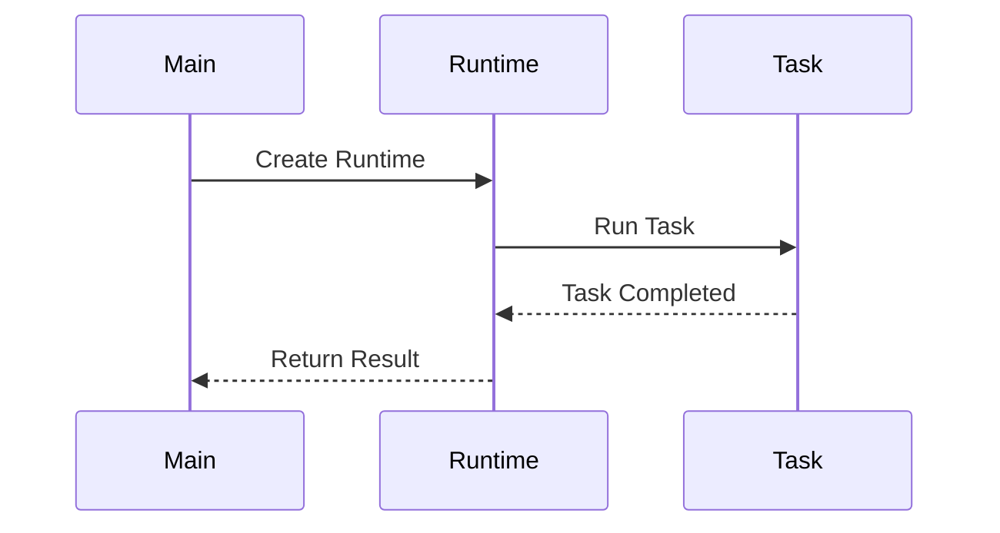

## 13.5 Parallel Processing Techniques

In the realm of PHP development, parallel processing is a powerful technique that allows developers to execute multiple tasks simultaneously, thereby improving the performance and responsiveness of applications. This section delves into various parallel processing techniques available in PHP, including the modern parallel extension, forking processes, and utilizing task workers. By mastering these techniques, you can significantly enhance the efficiency of your PHP applications.

### Understanding Parallel Processing

Parallel processing involves executing multiple processes or threads concurrently, allowing a program to perform multiple tasks simultaneously. This is particularly useful in scenarios where tasks are independent and can be executed in parallel, such as processing large datasets, handling multiple requests, or performing computationally intensive operations.

#### Key Concepts

- **Concurrency vs. Parallelism:** Concurrency involves managing multiple tasks at the same time, while parallelism involves executing multiple tasks simultaneously. In PHP, parallel processing is a form of parallelism.
- **Processes and Threads:** A process is an independent program in execution, while a thread is a smaller unit of a process. PHP primarily deals with processes rather than threads.

### Parallel Extension

The parallel extension is a modern approach to parallel processing in PHP. It provides a high-level API for executing tasks in parallel, making it easier to manage concurrency without dealing with low-level process management.

#### Features of the Parallel Extension

- **Thread-Safe:** The parallel extension is designed to be thread-safe, ensuring that tasks can be executed concurrently without data corruption.
- **Task Scheduling:** It allows you to schedule tasks for execution in parallel, managing the lifecycle of tasks efficiently.
- **Ease of Use:** The API is straightforward, making it accessible even for developers new to parallel processing.

#### Installing the Parallel Extension

To use the parallel extension, you need to install it via PECL:

```bash
pecl install parallel
```

Ensure that your PHP installation is compatible with the extension.

#### Basic Usage

Here's a simple example demonstrating how to use the parallel extension to execute tasks concurrently:

```php
<?php

use parallel\Runtime;

// Create a new runtime
$runtime = new Runtime();

// Schedule a task for execution
$future = $runtime->run(function() {
    // Simulate a time-consuming task
    sleep(2);
    return "Task completed!";
});

// Do other work while the task is running
echo "Doing other work...\n";

// Retrieve the result of the task
$result = $future->value();

echo $result; // Output: Task completed!

?>
```

In this example, we create a new runtime and schedule a task for execution. The `run` method accepts a closure representing the task to be executed. While the task is running, we can perform other operations. Finally, we retrieve the result of the task using the `value` method.

### Forking Processes

Forking is a traditional method of parallel processing in PHP, involving the creation of child processes using the `pcntl_fork()` function. Each child process runs independently, allowing tasks to be executed concurrently.

#### How Forking Works

- **Parent and Child Processes:** When a process is forked, a new child process is created. The child process is a duplicate of the parent process but runs independently.
- **Process Control:** The `pcntl` extension provides functions for managing processes, including forking, signaling, and waiting for process termination.

#### Example of Forking

Here's an example demonstrating how to fork processes in PHP:

```php
<?php

// Check if the pcntl extension is available
if (!function_exists('pcntl_fork')) {
    die('PCNTL extension is not available');
}

// Fork the process
$pid = pcntl_fork();

if ($pid == -1) {
    // Forking failed
    die('Could not fork process');
} elseif ($pid) {
    // Parent process
    echo "Parent process: PID = " . getmypid() . "\n";
    pcntl_wait($status); // Wait for child process to finish
} else {
    // Child process
    echo "Child process: PID = " . getmypid() . "\n";
    sleep(2); // Simulate a task
    exit(0); // Terminate the child process
}

?>
```

In this example, we check if the `pcntl` extension is available and then fork the process. The `pcntl_fork()` function returns the process ID of the child process to the parent and `0` to the child process. We use `pcntl_wait()` to wait for the child process to finish.

### Task Workers

Task workers are a pattern for distributing tasks across multiple processes, allowing for efficient parallel processing. This approach is commonly used in scenarios where tasks can be processed independently, such as in job queues or batch processing.

#### Implementing Task Workers

Task workers can be implemented using various libraries and frameworks, such as RabbitMQ, Gearman, or Beanstalkd. These tools provide mechanisms for managing task queues and distributing tasks to worker processes.

#### Example with Gearman

Here's an example demonstrating how to implement task workers using Gearman:

```php
<?php

// Create a Gearman client
$client = new GearmanClient();
$client->addServer();

// Define a task
$task = function($job) {
    $workload = $job->workload();
    echo "Processing task: $workload\n";
    sleep(2); // Simulate task processing
    return "Task $workload completed!";
};

// Add the task to the Gearman server
$client->doBackground('task_worker', 'Task 1');
$client->doBackground('task_worker', 'Task 2');

// Create a Gearman worker
$worker = new GearmanWorker();
$worker->addServer();
$worker->addFunction('task_worker', $task);

// Process tasks
while ($worker->work());

?>
```

In this example, we create a Gearman client and worker. The client adds tasks to the Gearman server, and the worker processes the tasks. The `doBackground` method is used to execute tasks in the background, allowing for parallel processing.

### Visualizing Parallel Processing

To better understand the flow of parallel processing, let's visualize the process using a sequence diagram:



This diagram illustrates the interaction between the main process, the runtime, and the task. The main process creates a runtime, which runs the task. Once the task is completed, the result is returned to the main process.

### Design Considerations

When implementing parallel processing in PHP, consider the following:

- **Resource Management:** Ensure that resources such as memory and CPU are managed efficiently to prevent resource exhaustion.
- **Data Consistency:** Be mindful of data consistency and synchronization when accessing shared resources.
- **Error Handling:** Implement robust error handling to manage failures in parallel tasks.

### PHP Unique Features

PHP's unique features, such as the `pcntl` and `parallel` extensions, provide powerful tools for parallel processing. These extensions allow developers to implement concurrency in a way that is both efficient and easy to manage.

### Differences and Similarities

Parallel processing techniques can be confused with asynchronous programming. While both involve executing tasks concurrently, parallel processing focuses on executing tasks simultaneously, whereas asynchronous programming involves managing tasks that may not run at the same time.

### Try It Yourself

Experiment with the examples provided by modifying the tasks or adding additional tasks to see how parallel processing can improve performance. Consider using different libraries or frameworks to implement task workers and explore their features.

### Knowledge Check

- What is the difference between concurrency and parallelism?
- How does the parallel extension simplify parallel processing in PHP?
- What are the key functions provided by the `pcntl` extension for process management?

### Embrace the Journey

Remember, mastering parallel processing in PHP is a journey. As you explore these techniques, you'll discover new ways to optimize your applications for performance and efficiency. Keep experimenting, stay curious, and enjoy the journey!

## Quiz: Parallel Processing Techniques



### What is the primary purpose of parallel processing in PHP?

- [x] To execute multiple tasks simultaneously
- [ ] To execute tasks sequentially
- [ ] To reduce code complexity
- [ ] To improve code readability

> **Explanation:** Parallel processing allows multiple tasks to be executed simultaneously, improving performance.

### Which PHP extension provides a high-level API for parallel processing?

- [x] parallel
- [ ] pcntl
- [ ] pthreads
- [ ] gearman

> **Explanation:** The parallel extension provides a high-level API for executing tasks in parallel.

### What function is used to fork processes in PHP?

- [x] pcntl_fork()
- [ ] fork_process()
- [ ] create_child()
- [ ] parallel_fork()

> **Explanation:** The `pcntl_fork()` function is used to create child processes in PHP.

### What is a key feature of the parallel extension?

- [x] Thread-safe execution
- [ ] Low-level process management
- [ ] Sequential task execution
- [ ] Single-threaded operation

> **Explanation:** The parallel extension is designed to be thread-safe, allowing concurrent execution without data corruption.

### Which tool can be used for implementing task workers in PHP?

- [x] Gearman
- [ ] Apache
- [ ] MySQL
- [ ] Redis

> **Explanation:** Gearman is a tool that can be used to implement task workers for distributing tasks across multiple processes.

### What is the role of a Gearman worker?

- [x] To process tasks added to the Gearman server
- [ ] To add tasks to the Gearman server
- [ ] To manage database connections
- [ ] To handle HTTP requests

> **Explanation:** A Gearman worker processes tasks that are added to the Gearman server by clients.

### What is the difference between concurrency and parallelism?

- [x] Concurrency involves managing multiple tasks at the same time, while parallelism involves executing tasks simultaneously.
- [ ] Concurrency involves executing tasks simultaneously, while parallelism involves managing multiple tasks at the same time.
- [ ] Concurrency and parallelism are the same.
- [ ] Concurrency is faster than parallelism.

> **Explanation:** Concurrency involves managing multiple tasks at the same time, while parallelism involves executing tasks simultaneously.

### What is a potential challenge when implementing parallel processing?

- [x] Resource management
- [ ] Code readability
- [ ] Syntax errors
- [ ] Variable naming

> **Explanation:** Resource management is a challenge in parallel processing, as it requires efficient use of memory and CPU.

### How can you ensure data consistency in parallel processing?

- [x] By implementing synchronization mechanisms
- [ ] By using global variables
- [ ] By avoiding error handling
- [ ] By using single-threaded execution

> **Explanation:** Synchronization mechanisms help ensure data consistency when accessing shared resources in parallel processing.

### True or False: The parallel extension is not thread-safe.

- [ ] True
- [x] False

> **Explanation:** The parallel extension is designed to be thread-safe, allowing concurrent execution without data corruption.


