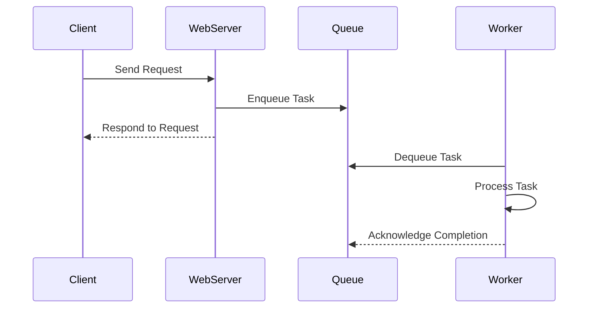

## 13.6 Message Queues and Background Workers

In the realm of PHP development, managing tasks efficiently is crucial for building scalable and responsive applications. One of the most effective ways to achieve this is by utilizing message queues and background workers. These tools allow us to offload tasks to be processed asynchronously, thereby decoupling processes and enhancing the overall performance of our applications.

### Decoupling Processes

Decoupling processes is a fundamental concept in software architecture that involves separating different parts of an application to improve scalability, maintainability, and performance. By offloading tasks to be processed asynchronously, we can ensure that our applications remain responsive to user interactions even when performing resource-intensive operations.

#### Key Benefits of Decoupling

- **Improved Performance:** By handling time-consuming tasks in the background, the main application can continue to serve user requests without delay.
- **Scalability:** Asynchronous processing allows applications to handle more tasks concurrently, making it easier to scale.
- **Fault Tolerance:** Decoupled systems can isolate failures, ensuring that a failure in one part of the system does not affect the entire application.

### Queue Systems

Message queues are a critical component of asynchronous processing. They act as buffers that hold tasks until they can be processed by background workers. Let's explore some popular queue systems used in PHP development.

#### RabbitMQ

RabbitMQ is a robust, open-source message broker that supports multiple messaging protocols. It is known for its reliability, scalability, and flexibility.

- **Features:**
  - Supports multiple messaging protocols.
  - Offers high availability and clustering.
  - Provides advanced routing capabilities.

- **Installation and Setup:**
  To get started with RabbitMQ, you need to install it on your server. You can follow the [official RabbitMQ installation guide](https://www.rabbitmq.com/download.html) for detailed instructions.

- **Basic Usage Example:**

```php
<?php
require_once __DIR__ . '/vendor/autoload.php';

use PhpAmqpLib\Connection\AMQPStreamConnection;
use PhpAmqpLib\Message\AMQPMessage;

// Establish connection
$connection = new AMQPStreamConnection('localhost', 5672, 'guest', 'guest');
$channel = $connection->channel();

// Declare a queue
$channel->queue_declare('task_queue', false, true, false, false);

// Create a message
$data = "Hello, RabbitMQ!";
$msg = new AMQPMessage($data, ['delivery_mode' => AMQPMessage::DELIVERY_MODE_PERSISTENT]);

// Publish the message
$channel->basic_publish($msg, '', 'task_queue');

echo " [x] Sent '$data'\n";

// Close the channel and connection
$channel->close();
$connection->close();
?>
```

In this example, we establish a connection to RabbitMQ, declare a queue, create a message, and publish it to the queue.

#### Beanstalkd

Beanstalkd is a simple, fast work queue that is ideal for managing background jobs. It is designed to be lightweight and easy to use.

- **Features:**
  - Fast and lightweight.
  - Supports job priorities and delayed jobs.
  - Simple protocol for easy integration.

- **Installation and Setup:**
  You can install Beanstalkd using package managers like `apt` or `brew`. For detailed instructions, visit the [Beanstalkd GitHub page](https://beanstalkd.github.io/).

- **Basic Usage Example:**

```php
<?php
require 'vendor/autoload.php';

use Pheanstalk\Pheanstalk;

// Connect to Beanstalkd
$pheanstalk = Pheanstalk::create('127.0.0.1');

// Put a job in the queue
$pheanstalk->useTube('example_tube')->put('Hello, Beanstalkd!');

// Reserve a job from the queue
$job = $pheanstalk->watch('example_tube')->ignore('default')->reserve();

// Process the job
echo "Received job: " . $job->getData() . "\n";

// Delete the job
$pheanstalk->delete($job);
?>
```

This example demonstrates how to connect to Beanstalkd, put a job in the queue, reserve it, and process it.

### Framework Integrations

Many PHP frameworks provide built-in support for message queues and background workers, making it easier to integrate these patterns into your applications.

#### Laravel Queues

Laravel, one of the most popular PHP frameworks, offers a robust queue system that supports various backends, including Redis, Beanstalkd, and Amazon SQS.

- **Features:**
  - Supports multiple queue backends.
  - Provides a unified API for queue management.
  - Offers job chaining, rate limiting, and more.

- **Basic Usage Example:**

To use queues in Laravel, you need to configure your queue connection in the `config/queue.php` file. Here's an example of how to dispatch a job to a queue:

```php
<?php

namespace App\Jobs;

use Illuminate\Bus\Queueable;
use Illuminate\Contracts\Queue\ShouldQueue;
use Illuminate\Foundation\Bus\Dispatchable;
use Illuminate\Queue\InteractsWithQueue;
use Illuminate\Queue\SerializesModels;

class ProcessPodcast implements ShouldQueue
{
    use Dispatchable, InteractsWithQueue, Queueable, SerializesModels;

    protected $podcast;

    public function __construct($podcast)
    {
        $this->podcast = $podcast;
    }

    public function handle()
    {
        // Process the podcast
        echo "Processing podcast: " . $this->podcast . "\n";
    }
}

// Dispatch the job
ProcessPodcast::dispatch('My Podcast');
?>
```

In this example, we define a job class that implements the `ShouldQueue` interface, allowing it to be dispatched to a queue.

### Use Cases

Message queues and background workers are versatile tools that can be applied to a wide range of use cases. Here are some common scenarios where they are particularly useful:

- **Sending Emails:** Offload email sending to a background worker to avoid blocking the main application thread.
- **Processing File Uploads:** Handle file uploads asynchronously to improve user experience.
- **Generating Reports:** Perform complex report generation in the background to keep the application responsive.

### Visualizing Message Queues and Background Workers

To better understand how message queues and background workers operate, let's visualize the process using a sequence diagram.



**Description:** This diagram illustrates the flow of a task from the client to the web server, where it is enqueued. A background worker then dequeues and processes the task, acknowledging its completion.

### PHP Unique Features

PHP offers several unique features that make it well-suited for implementing message queues and background workers:

- **Simplicity:** PHP's straightforward syntax and extensive library support make it easy to integrate with various queue systems.
- **Framework Support:** Popular PHP frameworks like Laravel provide built-in support for queues, simplifying the implementation process.
- **Community Resources:** The PHP community offers a wealth of resources, including libraries and tutorials, to help developers get started with message queues.

### Design Considerations

When implementing message queues and background workers in PHP, consider the following:

- **Choosing the Right Queue System:** Evaluate the features and limitations of different queue systems to select the one that best fits your needs.
- **Error Handling:** Implement robust error handling to manage failures in task processing.
- **Scalability:** Design your system to handle increased load by adding more workers or scaling your queue infrastructure.

### Differences and Similarities

Message queues and background workers are often confused with other concurrency patterns. Here are some distinctions:

- **Message Queues vs. Event Streams:** Message queues focus on task processing, while event streams handle real-time data processing.
- **Background Workers vs. Cron Jobs:** Background workers process tasks continuously, whereas cron jobs execute tasks at scheduled intervals.

### Try It Yourself

To deepen your understanding of message queues and background workers, try modifying the code examples provided. Experiment with different queue systems and explore how they handle various use cases.

### References and Links

- [RabbitMQ Messaging](https://www.rabbitmq.com/)
- [Beanstalkd](https://beanstalkd.github.io/)
- [Laravel Queues](https://laravel.com/docs/queues)

### Knowledge Check

- What are the benefits of using message queues and background workers?
- How does RabbitMQ differ from Beanstalkd?
- What are some common use cases for message queues in PHP?

### Embrace the Journey

Remember, mastering message queues and background workers is just the beginning. As you continue to explore PHP development, you'll discover new ways to optimize your applications and enhance their performance. Keep experimenting, stay curious, and enjoy the journey!

## Quiz: Message Queues and Background Workers



### What is the primary benefit of using message queues in PHP applications?

- [x] Decoupling processes for better scalability
- [ ] Reducing code complexity
- [ ] Enhancing database performance
- [ ] Improving frontend design

> **Explanation:** Message queues help decouple processes, allowing tasks to be processed asynchronously, which enhances scalability.

### Which of the following is a feature of RabbitMQ?

- [x] Supports multiple messaging protocols
- [ ] Built-in database support
- [ ] Integrated frontend framework
- [ ] Native support for PHP

> **Explanation:** RabbitMQ supports multiple messaging protocols, making it versatile for various applications.

### What is the role of a background worker in a message queue system?

- [x] To process tasks asynchronously
- [ ] To manage database connections
- [ ] To handle user authentication
- [ ] To render frontend components

> **Explanation:** Background workers process tasks asynchronously, allowing the main application to remain responsive.

### Which PHP framework provides built-in support for queues?

- [x] Laravel
- [ ] Symfony
- [ ] CodeIgniter
- [ ] Zend Framework

> **Explanation:** Laravel provides built-in support for queues, making it easier to implement asynchronous processing.

### What is a common use case for message queues?

- [x] Sending emails
- [ ] Rendering HTML
- [ ] Managing user sessions
- [ ] Styling CSS

> **Explanation:** Sending emails is a common use case for message queues, as it can be offloaded to a background worker.

### How does Beanstalkd differ from RabbitMQ?

- [x] Beanstalkd is simpler and faster
- [ ] RabbitMQ is open-source
- [ ] Beanstalkd supports multiple protocols
- [ ] RabbitMQ is designed for small applications

> **Explanation:** Beanstalkd is designed to be simple and fast, making it ideal for lightweight applications.

### What is the purpose of the `ShouldQueue` interface in Laravel?

- [x] To indicate that a job should be queued
- [ ] To manage database migrations
- [ ] To handle HTTP requests
- [ ] To render views

> **Explanation:** The `ShouldQueue` interface in Laravel indicates that a job should be dispatched to a queue.

### Which of the following is NOT a benefit of decoupling processes?

- [ ] Improved performance
- [ ] Scalability
- [ ] Fault tolerance
- [x] Increased code complexity

> **Explanation:** Decoupling processes generally reduces code complexity by separating concerns.

### What is a key consideration when implementing message queues?

- [x] Error handling
- [ ] Database schema design
- [ ] Frontend styling
- [ ] User interface design

> **Explanation:** Implementing robust error handling is crucial for managing failures in task processing.

### True or False: Background workers can only process tasks at scheduled intervals.

- [ ] True
- [x] False

> **Explanation:** Background workers process tasks continuously, unlike cron jobs, which execute tasks at scheduled intervals.




