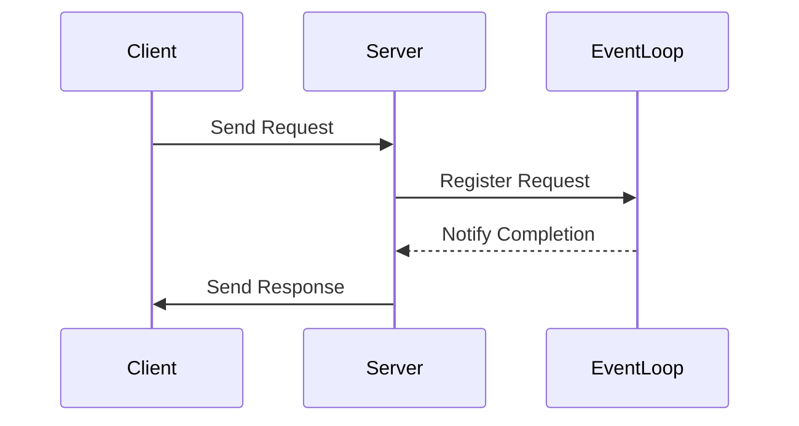

## 13.7 Non-Blocking I/O in PHP

In the realm of PHP development, the concept of Non-Blocking I/O (Input/Output) is pivotal for creating responsive and efficient applications. Traditional blocking I/O operations can hinder performance by waiting for operations to complete before proceeding. Non-blocking I/O, on the other hand, allows PHP applications to perform other tasks while waiting for I/O operations to finish, significantly improving responsiveness and throughput.

### Understanding Asynchronous Streams

Asynchronous streams are a core component of non-blocking I/O. They enable reading and writing operations to occur without halting the execution of a program. This is particularly useful in scenarios involving file handling, network communication, or any I/O-bound operations where latency can be a bottleneck.

#### Key Concepts of Asynchronous Streams

- **Event Loop**: The backbone of asynchronous programming, managing the execution of asynchronous tasks.
- **Promises**: Objects representing the eventual completion or failure of an asynchronous operation.
- **Callbacks**: Functions executed once an asynchronous operation completes.

#### Benefits of Asynchronous Streams

- **Improved Responsiveness**: Applications remain responsive to user interactions while performing I/O operations.
- **Enhanced Throughput**: Multiple I/O operations can be handled concurrently, increasing overall efficiency.
- **Resource Efficiency**: Reduced CPU idle time as the application can perform other tasks while waiting for I/O operations.

### Implementing Non-Blocking I/O with ReactPHP

ReactPHP is a popular library for implementing non-blocking I/O in PHP. It provides an event-driven, non-blocking I/O model that allows PHP applications to handle asynchronous operations efficiently.

#### Setting Up ReactPHP

To get started with ReactPHP, you need to install it using Composer, PHP's dependency manager:

```bash
composer require react/react
```

#### Using ReactPHP Streams

ReactPHP provides a `Stream` component that facilitates non-blocking I/O operations. Let's explore how to use it for file and network I/O.

##### File I/O with ReactPHP

Here's an example of reading a file asynchronously using ReactPHP:

```php
<?php

require 'vendor/autoload.php';

use React\EventLoop\Factory;
use React\Stream\ReadableResourceStream;

$loop = Factory::create();
$stream = new ReadableResourceStream(fopen('example.txt', 'r'), $loop);

$stream->on('data', function ($chunk) {
    echo "Data chunk: " . $chunk;
});

$stream->on('end', function () {
    echo "File reading completed.";
});

$loop->run();
```

**Explanation:**

- **Event Loop**: Created using `Factory::create()`, it manages the execution of asynchronous tasks.
- **ReadableResourceStream**: Represents a readable stream for the file.
- **Event Listeners**: `on('data', ...)` and `on('end', ...)` handle data chunks and the end of the file, respectively.

##### Network I/O with ReactPHP

ReactPHP also excels at handling network I/O. Here's an example of creating a simple HTTP server:

```php
<?php

require 'vendor/autoload.php';

use React\EventLoop\Factory;
use React\Socket\Server;
use React\Http\Response;
use Psr\Http\Message\ServerRequestInterface;

$loop = Factory::create();
$socket = new Server('127.0.0.1:8080', $loop);

$server = new React\Http\Server(function (ServerRequestInterface $request) {
    return new Response(
        200,
        ['Content-Type' => 'text/plain'],
        "Hello, World!\n"
    );
});

$server->listen($socket);
echo "Server running at http://127.0.0.1:8080\n";

$loop->run();
```

**Explanation:**

- **Socket Server**: Listens for incoming connections on a specified address and port.
- **HTTP Server**: Handles HTTP requests and sends responses.
- **Event Loop**: Manages the server's asynchronous operations.

### Benefits of Using ReactPHP

- **Scalability**: Handle thousands of concurrent connections with minimal resource usage.
- **Flexibility**: Easily integrate with other libraries and frameworks.
- **Community Support**: A vibrant community and extensive documentation.

### Visualizing Non-Blocking I/O with ReactPHP

To better understand how non-blocking I/O works with ReactPHP, let's visualize the process using a sequence diagram:



**Diagram Explanation:**

- **Client**: Initiates a request to the server.
- **Server**: Registers the request with the event loop.
- **Event Loop**: Notifies the server upon request completion.
- **Server**: Sends the response back to the client.

### Try It Yourself

Experiment with the provided code examples by modifying them to suit your needs. For instance, try reading a different file or changing the HTTP server's response message. This hands-on approach will deepen your understanding of non-blocking I/O in PHP.

### Knowledge Check

- **Question**: What is the primary benefit of using non-blocking I/O in PHP?
- **Challenge**: Modify the HTTP server example to handle POST requests and respond with the received data.

### Further Reading

For more information on non-blocking I/O and ReactPHP, consider exploring the following resources:

- [ReactPHP Official Documentation](https://reactphp.org/)
- [PHP: Streams - Manual](https://www.php.net/manual/en/book.stream.php)

### Embrace the Journey

Remember, mastering non-blocking I/O in PHP is a journey. As you continue to explore and experiment, you'll unlock new possibilities for building efficient and responsive applications. Stay curious, keep learning, and enjoy the process!

## Quiz: Non-Blocking I/O in PHP



### What is the primary benefit of non-blocking I/O in PHP?

- [x] Improved application responsiveness
- [ ] Increased memory usage
- [ ] Simplified code structure
- [ ] Reduced code complexity

> **Explanation:** Non-blocking I/O allows applications to remain responsive while performing I/O operations, improving overall user experience.

### Which library is commonly used for non-blocking I/O in PHP?

- [x] ReactPHP
- [ ] Laravel
- [ ] Symfony
- [ ] CodeIgniter

> **Explanation:** ReactPHP is a popular library for implementing non-blocking I/O in PHP.

### What is the role of the event loop in non-blocking I/O?

- [x] Manages the execution of asynchronous tasks
- [ ] Handles database connections
- [ ] Simplifies code structure
- [ ] Increases memory usage

> **Explanation:** The event loop is responsible for managing the execution of asynchronous tasks in non-blocking I/O.

### What does a Promise represent in asynchronous programming?

- [x] The eventual completion or failure of an asynchronous operation
- [ ] A synchronous operation
- [ ] A database connection
- [ ] A network request

> **Explanation:** A Promise represents the eventual completion or failure of an asynchronous operation.

### How does ReactPHP handle file I/O?

- [x] Using ReadableResourceStream
- [ ] Through synchronous file operations
- [ ] By blocking the event loop
- [ ] Using database connections

> **Explanation:** ReactPHP uses ReadableResourceStream for non-blocking file I/O operations.

### What is the purpose of callbacks in asynchronous programming?

- [x] Functions executed once an asynchronous operation completes
- [ ] To increase memory usage
- [ ] To simplify code structure
- [ ] To handle database connections

> **Explanation:** Callbacks are functions executed once an asynchronous operation completes.

### What is the primary advantage of using ReactPHP for network I/O?

- [x] Scalability and handling of concurrent connections
- [ ] Increased memory usage
- [ ] Simplified code structure
- [ ] Reduced code complexity

> **Explanation:** ReactPHP allows handling thousands of concurrent connections with minimal resource usage.

### How can you modify the HTTP server example to handle POST requests?

- [x] By adding a condition to check the request method
- [ ] By changing the server port
- [ ] By using a different library
- [ ] By increasing memory usage

> **Explanation:** You can modify the HTTP server example to handle POST requests by adding a condition to check the request method.

### What is the role of the event loop in the provided sequence diagram?

- [x] Notifies the server upon request completion
- [ ] Handles database connections
- [ ] Simplifies code structure
- [ ] Increases memory usage

> **Explanation:** In the sequence diagram, the event loop notifies the server upon request completion.

### True or False: Non-blocking I/O can improve application responsiveness.

- [x] True
- [ ] False

> **Explanation:** Non-blocking I/O allows applications to remain responsive while performing I/O operations, improving overall user experience.


