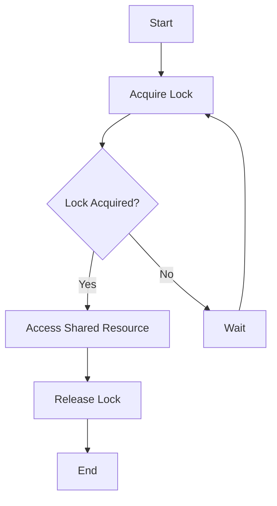

## 13.8 Synchronization and Locking Mechanisms

In the realm of PHP development, especially when dealing with concurrent processes, managing shared resources effectively is crucial to prevent data corruption and ensure data integrity. This section delves into synchronization and locking mechanisms, providing you with the tools and knowledge to handle concurrency in PHP applications.

### Managing Shared Resources

When multiple processes or threads access shared resources simultaneously, there's a risk of data corruption. This is because concurrent operations might interfere with each other, leading to inconsistent or incorrect data states. To mitigate this, we employ synchronization techniques that control access to shared resources, ensuring that only one process can modify the resource at a time.

### Synchronization Techniques

#### Mutexes (Mutual Exclusion Locks)

A mutex, or mutual exclusion lock, is a synchronization primitive used to prevent multiple threads from accessing a shared resource simultaneously. It ensures that only one thread can access the resource at any given time, thus preventing race conditions.

**Key Concepts:**
- **Locking:** A thread must acquire a lock before accessing the shared resource.
- **Unlocking:** Once the thread is done, it releases the lock, allowing other threads to access the resource.
- **Blocking:** If a thread tries to acquire a lock that is already held by another thread, it will be blocked until the lock is released.

**Example:**

```php
<?php
// Using pecl/sync extension for mutex
$mutex = new SyncMutex("MyMutex");

if ($mutex->lock()) {
    // Critical section
    echo "Mutex locked, accessing shared resource.\n";
    // Simulate work
    sleep(2);
    $mutex->unlock();
    echo "Mutex unlocked, resource released.\n";
} else {
    echo "Failed to acquire mutex lock.\n";
}
?>
```

In this example, we use the `pecl/sync` extension to create a mutex. The `lock()` method attempts to acquire the lock, and the `unlock()` method releases it. The critical section of code that accesses the shared resource is executed only when the lock is successfully acquired.

#### Semaphores

Semaphores are another synchronization primitive that can be used to control access to shared resources. Unlike mutexes, semaphores can allow multiple threads to access a resource simultaneously, up to a specified limit.

**Key Concepts:**
- **Counting Semaphore:** Maintains a count that represents the number of threads that can access the resource concurrently.
- **Binary Semaphore:** Similar to a mutex, allows only one thread to access the resource at a time.

**Example:**

```php
<?php
// Using pecl/sync extension for semaphore
$semaphore = new SyncSemaphore("MySemaphore", 2);

if ($semaphore->lock()) {
    // Critical section
    echo "Semaphore acquired, accessing shared resource.\n";
    // Simulate work
    sleep(2);
    $semaphore->unlock();
    echo "Semaphore released, resource available.\n";
} else {
    echo "Failed to acquire semaphore.\n";
}
?>
```

Here, we use a semaphore with a count of 2, allowing up to two threads to access the resource concurrently. The `lock()` method decrements the semaphore count, and the `unlock()` method increments it.

### PHP Extensions for Synchronization

PHP provides several extensions to facilitate synchronization and locking mechanisms. One of the most notable is the `pecl/sync` extension, which offers synchronization objects like mutexes and semaphores.

#### pecl/sync Extension

The `pecl/sync` extension provides a set of synchronization objects that can be used to manage access to shared resources in concurrent environments. It includes classes for mutexes, semaphores, and more.

**Installation:**

To use the `pecl/sync` extension, you need to install it via PECL:

```bash
pecl install sync
```

**Documentation:**

For detailed documentation on the `pecl/sync` extension, visit the [Sync Extension](https://www.php.net/manual/en/book.sync.php) page.

### Visualizing Synchronization Mechanisms

To better understand how synchronization mechanisms work, let's visualize the process using a flowchart.



**Description:**

- **Start:** The process begins.
- **Acquire Lock:** The thread attempts to acquire a lock on the shared resource.
- **Lock Acquired?:** Checks if the lock is successfully acquired.
  - **Yes:** If the lock is acquired, the thread accesses the shared resource.
  - **No:** If the lock is not acquired, the thread waits and retries.
- **Access Shared Resource:** The thread performs operations on the shared resource.
- **Release Lock:** Once done, the thread releases the lock.
- **End:** The process ends.

### Key Participants in Synchronization

- **Threads/Processes:** The entities that require access to shared resources.
- **Locks (Mutexes/Semaphores):** The synchronization primitives that control access.
- **Shared Resources:** The data or resources that need to be protected from concurrent access.

### Applicability

Synchronization and locking mechanisms are applicable in scenarios where:

- Multiple threads or processes need to access shared resources.
- Data integrity and consistency are critical.
- Race conditions and data corruption need to be prevented.

### Design Considerations

When implementing synchronization mechanisms, consider the following:

- **Deadlocks:** Ensure that locks are acquired and released in a consistent order to prevent deadlocks.
- **Performance:** Excessive locking can lead to performance bottlenecks. Use locks judiciously.
- **Granularity:** Choose the appropriate level of granularity for locking. Fine-grained locks offer better concurrency but are more complex to manage.

### PHP Unique Features

PHP's `pecl/sync` extension provides a straightforward way to implement synchronization mechanisms. It offers a high-level API for creating and managing mutexes and semaphores, making it easier to handle concurrency in PHP applications.

### Differences and Similarities

Mutexes and semaphores are both synchronization primitives, but they serve different purposes:

- **Mutexes:** Allow only one thread to access a resource at a time.
- **Semaphores:** Allow multiple threads to access a resource concurrently, up to a specified limit.

### Try It Yourself

Experiment with the code examples provided by modifying the number of threads or the semaphore count. Observe how the behavior changes and how it affects access to shared resources.

### Knowledge Check

- What is the primary purpose of a mutex?
- How does a semaphore differ from a mutex?
- What are some potential pitfalls of using synchronization mechanisms?

### Embrace the Journey

Remember, mastering synchronization and locking mechanisms is a journey. As you progress, you'll gain a deeper understanding of concurrency and how to manage shared resources effectively. Keep experimenting, stay curious, and enjoy the journey!

## Quiz: Synchronization and Locking Mechanisms



### What is the primary purpose of a mutex?

- [x] To ensure that only one thread can access a shared resource at a time.
- [ ] To allow multiple threads to access a shared resource simultaneously.
- [ ] To increase the speed of thread execution.
- [ ] To manage memory allocation for threads.

> **Explanation:** A mutex ensures mutual exclusion, allowing only one thread to access a shared resource at a time.

### How does a semaphore differ from a mutex?

- [x] A semaphore allows multiple threads to access a resource concurrently, up to a limit.
- [ ] A semaphore is used for memory management.
- [ ] A semaphore is a type of mutex.
- [ ] A semaphore is used to speed up thread execution.

> **Explanation:** A semaphore can allow multiple threads to access a resource concurrently, unlike a mutex which allows only one.

### What is a potential pitfall of using synchronization mechanisms?

- [x] Deadlocks can occur if locks are not managed properly.
- [ ] They always improve performance.
- [ ] They eliminate the need for error handling.
- [ ] They make code easier to read.

> **Explanation:** Improper management of locks can lead to deadlocks, where threads are stuck waiting for each other indefinitely.

### Which PHP extension provides synchronization objects like mutexes and semaphores?

- [x] pecl/sync
- [ ] pecl/mutex
- [ ] pecl/thread
- [ ] pecl/concurrency

> **Explanation:** The pecl/sync extension provides synchronization objects such as mutexes and semaphores.

### What is a counting semaphore?

- [x] A semaphore that maintains a count of how many threads can access a resource concurrently.
- [ ] A semaphore that allows only one thread to access a resource.
- [ ] A semaphore used for counting memory usage.
- [ ] A semaphore that speeds up thread execution.

> **Explanation:** A counting semaphore maintains a count that represents the number of threads that can access the resource concurrently.

### What is the risk of excessive locking?

- [x] Performance bottlenecks can occur.
- [ ] Increased memory usage.
- [ ] Faster execution of threads.
- [ ] Improved code readability.

> **Explanation:** Excessive locking can lead to performance bottlenecks, as threads may spend too much time waiting for locks.

### What is the purpose of the `unlock()` method in a mutex?

- [x] To release the lock and allow other threads to access the resource.
- [ ] To acquire the lock for the current thread.
- [ ] To increase the semaphore count.
- [ ] To terminate the current thread.

> **Explanation:** The `unlock()` method releases the lock, allowing other threads to access the resource.

### What is a binary semaphore?

- [x] A semaphore that allows only one thread to access a resource at a time.
- [ ] A semaphore that allows multiple threads to access a resource.
- [ ] A semaphore used for memory management.
- [ ] A semaphore that speeds up thread execution.

> **Explanation:** A binary semaphore is similar to a mutex, allowing only one thread to access a resource at a time.

### How can deadlocks be prevented?

- [x] By acquiring and releasing locks in a consistent order.
- [ ] By using more threads.
- [ ] By increasing semaphore counts.
- [ ] By avoiding the use of mutexes.

> **Explanation:** Acquiring and releasing locks in a consistent order can help prevent deadlocks.

### True or False: Semaphores can only be used for thread synchronization.

- [ ] True
- [x] False

> **Explanation:** Semaphores can be used for both thread and process synchronization.


