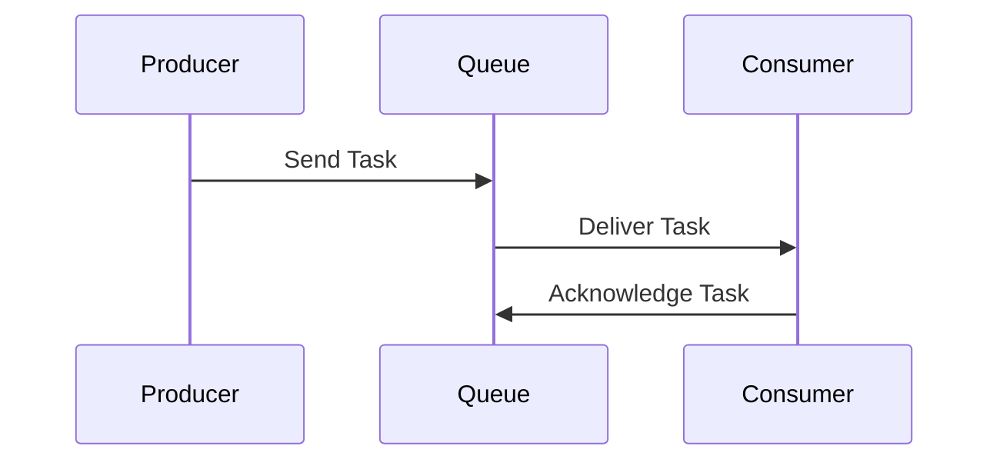

## 13.9 Scheduling and Task Queues

In the realm of PHP development, managing tasks efficiently is crucial for building robust and scalable applications. Scheduling and task queues are essential components that enable developers to handle asynchronous operations, manage concurrency, and optimize performance. This section delves into the concepts, tools, and best practices for implementing scheduling and task queues in PHP.

### Introduction to Scheduling and Task Queues

Scheduling and task queues are mechanisms that allow developers to execute tasks at specific times or manage a queue of tasks to be processed asynchronously. These patterns are vital for applications that require background processing, such as sending emails, generating reports, or processing data.

**Key Concepts:**

- **Job Scheduling:** The process of executing tasks at predetermined times or intervals.
- **Task Queues:** A system for managing and processing tasks asynchronously, often used to offload work from the main application thread.

### Job Scheduling in PHP

Job scheduling involves running tasks at scheduled times, which can be achieved using various tools and techniques. In PHP, job scheduling is commonly implemented using cron jobs or specialized libraries and frameworks.

#### Cron Jobs

Cron jobs are a time-based job scheduler in UNIX-like operating systems. They allow you to schedule scripts or commands to run at specific intervals. Cron jobs are ideal for tasks that need to run periodically, such as daily backups or weekly reports.

**Setting Up a Cron Job:**

1. **Edit the Crontab File:**
   Use the `crontab -e` command to edit the cron table.

2. **Define the Schedule:**
   Specify the timing and command to execute. For example, to run a PHP script every day at midnight:

   ```bash
   0 0 * * * /usr/bin/php /path/to/script.php
   ```

3. **Save and Exit:**
   Save the changes to activate the cron job.

#### Laravel Task Scheduling

Laravel, a popular PHP framework, offers a powerful task scheduling feature that provides a fluent and expressive way to define scheduled tasks within your application.

**Using Laravel Scheduler:**

1. **Define Scheduled Tasks:**
   In the `app/Console/Kernel.php` file, use the `schedule` method to define tasks:

   ```php
   protected function schedule(Schedule $schedule)
   {
       $schedule->command('emails:send')->daily();
   }
   ```

2. **Run the Scheduler:**
   Use the `schedule:run` Artisan command to execute the scheduled tasks:

   ```bash
   php artisan schedule:run
   ```

3. **Configure Cron Job:**
   Set up a cron job to run the Laravel scheduler every minute:

   ```bash
   * * * * * php /path/to/artisan schedule:run >> /dev/null 2>&1
   ```

### Task Queues in PHP

Task queues are used to manage and process tasks asynchronously, allowing applications to handle long-running operations without blocking the main execution flow. This is particularly useful for tasks such as sending emails, processing images, or handling large datasets.

#### Implementing Task Queues

There are several libraries and frameworks available for implementing task queues in PHP, each with its own features and capabilities.

**Popular Task Queue Libraries:**

- **RabbitMQ:** A message broker that supports multiple messaging protocols.
- **Beanstalkd:** A simple, fast work queue.
- **Redis Queue:** A queueing system built on top of Redis.

#### Using RabbitMQ with PHP

RabbitMQ is a robust message broker that facilitates communication between different parts of an application. It supports various messaging protocols and is widely used for implementing task queues.

**Setting Up RabbitMQ:**

1. **Install RabbitMQ:**
   Follow the official [RabbitMQ installation guide](https://www.rabbitmq.com/download.html) to set up RabbitMQ on your server.

2. **Install PHP AMQP Library:**
   Use Composer to install the PHP AMQP library:

   ```bash
   composer require php-amqplib/php-amqplib
   ```

3. **Create a Producer:**
   The producer sends messages to the queue.

   ```php
   <?php
   require_once __DIR__ . '/vendor/autoload.php';

   use PhpAmqpLib\Connection\AMQPStreamConnection;
   use PhpAmqpLib\Message\AMQPMessage;

   $connection = new AMQPStreamConnection('localhost', 5672, 'guest', 'guest');
   $channel = $connection->channel();

   $channel->queue_declare('task_queue', false, true, false, false);

   $data = implode(' ', array_slice($argv, 1));
   if (empty($data)) $data = "Hello World!";

   $msg = new AMQPMessage(
       $data,
       array('delivery_mode' => AMQPMessage::DELIVERY_MODE_PERSISTENT)
   );

   $channel->basic_publish($msg, '', 'task_queue');

   echo " [x] Sent ", $data, "\n";

   $channel->close();
   $connection->close();
   ```

4. **Create a Consumer:**
   The consumer processes messages from the queue.

   ```php
   <?php
   require_once __DIR__ . '/vendor/autoload.php';

   use PhpAmqpLib\Connection\AMQPStreamConnection;

   $connection = new AMQPStreamConnection('localhost', 5672, 'guest', 'guest');
   $channel = $connection->channel();

   $channel->queue_declare('task_queue', false, true, false, false);

   echo " [*] Waiting for messages. To exit press CTRL+C\n";

   $callback = function($msg) {
       echo ' [x] Received ', $msg->body, "\n";
       sleep(substr_count($msg->body, '.'));
       echo " [x] Done\n";
       $msg->ack();
   };

   $channel->basic_qos(null, 1, null);
   $channel->basic_consume('task_queue', '', false, false, false, false, $callback);

   while($channel->is_consuming()) {
       $channel->wait();
   }

   $channel->close();
   $connection->close();
   ```

### Visualizing Task Queues

To better understand how task queues work, let's visualize the process using a sequence diagram.



**Diagram Explanation:**

- **Producer:** Sends tasks to the queue.
- **Queue:** Holds tasks until they are processed by a consumer.
- **Consumer:** Retrieves tasks from the queue and processes them.

### Best Practices for Scheduling and Task Queues

Implementing scheduling and task queues effectively requires adherence to best practices to ensure reliability and performance.

1. **Idempotency:** Ensure that tasks can be safely retried without causing unintended side effects.
2. **Error Handling:** Implement robust error handling and logging to track and resolve issues.
3. **Scalability:** Design your system to handle increased load by scaling horizontally.
4. **Monitoring:** Use monitoring tools to track the performance and health of your task queues.
5. **Security:** Secure your message broker and task queue infrastructure to prevent unauthorized access.

### PHP Unique Features

PHP offers several unique features that can be leveraged when implementing scheduling and task queues:

- **PHP CLI:** Run PHP scripts from the command line for task execution.
- **Composer:** Manage dependencies and libraries for task queue implementations.
- **PHP Extensions:** Utilize extensions like `pcntl` for process control and `pthreads` for multithreading.

### Differences and Similarities

When working with scheduling and task queues, it's important to understand the differences and similarities between various tools and patterns:

- **Cron Jobs vs. Task Queues:** Cron jobs are time-based, while task queues are event-driven.
- **Laravel Scheduler vs. RabbitMQ:** Laravel Scheduler is integrated with the Laravel framework, whereas RabbitMQ is a standalone message broker.

### Try It Yourself

Experiment with the provided code examples by modifying the task data or scheduling intervals. Try integrating different message brokers or task queue libraries to explore their features and capabilities.

### Knowledge Check

- What is the primary difference between cron jobs and task queues?
- How does Laravel's task scheduling feature enhance job scheduling in PHP?
- What are some best practices for implementing task queues?

### Embrace the Journey

Remember, mastering scheduling and task queues is a journey. As you progress, you'll build more efficient and scalable applications. Keep experimenting, stay curious, and enjoy the journey!

## Quiz: Scheduling and Task Queues



### What is the primary purpose of job scheduling in PHP?

- [x] To execute tasks at predetermined times or intervals.
- [ ] To manage user authentication.
- [ ] To handle database connections.
- [ ] To render HTML templates.

> **Explanation:** Job scheduling is used to execute tasks at specific times or intervals, such as daily backups or weekly reports.

### Which tool is commonly used for job scheduling in UNIX-like systems?

- [x] Cron jobs
- [ ] RabbitMQ
- [ ] Redis
- [ ] Laravel

> **Explanation:** Cron jobs are a time-based job scheduler commonly used in UNIX-like systems for scheduling tasks.

### What is the main advantage of using task queues?

- [x] They allow asynchronous processing of tasks.
- [ ] They improve database performance.
- [ ] They enhance user interface design.
- [ ] They simplify HTML rendering.

> **Explanation:** Task queues enable asynchronous processing, allowing applications to handle long-running operations without blocking the main execution flow.

### Which PHP framework offers a built-in task scheduling feature?

- [x] Laravel
- [ ] Symfony
- [ ] CodeIgniter
- [ ] Zend

> **Explanation:** Laravel provides a built-in task scheduling feature that allows developers to define scheduled tasks within the application.

### What is a key feature of RabbitMQ?

- [x] It is a message broker that supports multiple messaging protocols.
- [ ] It is a database management system.
- [ ] It is a web server.
- [ ] It is a CSS framework.

> **Explanation:** RabbitMQ is a message broker that facilitates communication between different parts of an application and supports various messaging protocols.

### What is the purpose of the `schedule:run` Artisan command in Laravel?

- [x] To execute scheduled tasks defined in the Laravel application.
- [ ] To start the Laravel server.
- [ ] To clear the application cache.
- [ ] To migrate the database.

> **Explanation:** The `schedule:run` Artisan command is used to execute the scheduled tasks defined in the Laravel application.

### Which of the following is a best practice for implementing task queues?

- [x] Ensure tasks are idempotent.
- [ ] Use global variables extensively.
- [ ] Avoid error handling.
- [ ] Disable logging.

> **Explanation:** Ensuring tasks are idempotent is a best practice for implementing task queues, as it allows tasks to be safely retried without causing unintended side effects.

### What is the role of a consumer in a task queue system?

- [x] To retrieve and process tasks from the queue.
- [ ] To send tasks to the queue.
- [ ] To manage user sessions.
- [ ] To render HTML templates.

> **Explanation:** In a task queue system, the consumer retrieves tasks from the queue and processes them.

### How can you secure your task queue infrastructure?

- [x] By implementing access controls and encryption.
- [ ] By using plain text communication.
- [ ] By disabling authentication.
- [ ] By allowing public access.

> **Explanation:** Securing task queue infrastructure involves implementing access controls and encryption to prevent unauthorized access.

### True or False: Task queues are event-driven, while cron jobs are time-based.

- [x] True
- [ ] False

> **Explanation:** Task queues are event-driven, meaning they process tasks based on events, while cron jobs are time-based, executing tasks at specific intervals.


