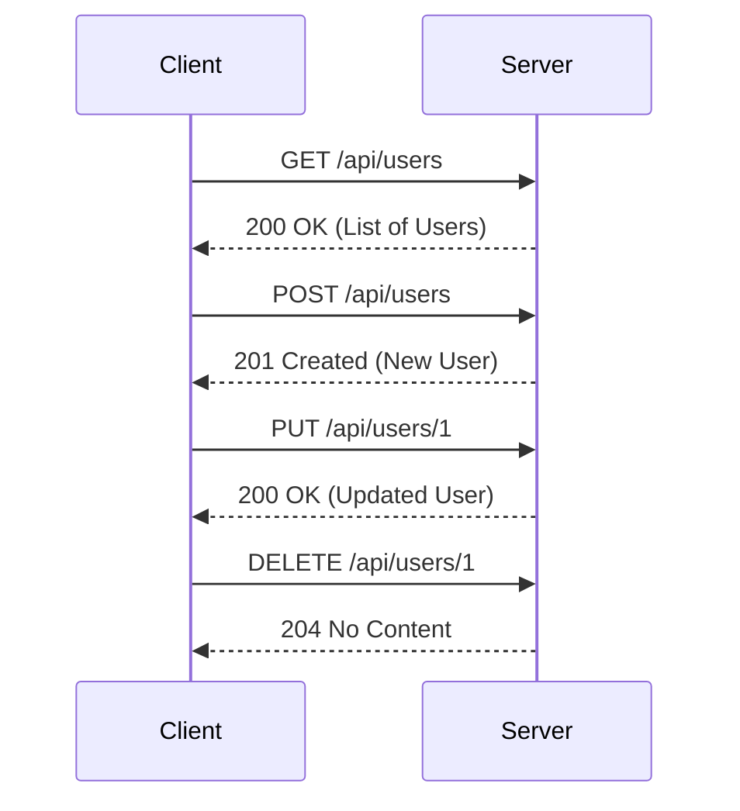

## 14.1 RESTful API Design Patterns

In this section, we delve into the world of RESTful API design patterns, focusing on how to effectively implement them in PHP. REST, or Representational State Transfer, is an architectural style that provides a set of guidelines for creating scalable web services. By understanding and applying RESTful principles, we can build APIs that are not only efficient but also easy to use and maintain.

### Principles of REST

RESTful APIs are built on a set of principles that ensure they are stateless, cacheable, and follow a client-server architecture. Let's explore these principles in detail:

#### Statelessness

In a RESTful API, each request from a client must contain all the information needed to understand and process the request. This means that the server does not store any session information about the client. Statelessness simplifies the server design and improves scalability.

#### Cacheability

Responses from a RESTful API should be explicitly marked as cacheable or non-cacheable. This allows clients to cache responses and reuse them for subsequent requests, reducing the load on the server and improving performance.

#### Client-Server Architecture

RESTful APIs follow a client-server architecture, where the client and server are separate entities that communicate over a network. This separation allows for independent evolution of the client and server, as long as the interface remains consistent.

#### Uniform Interface

A uniform interface between the client and server simplifies the architecture and improves the visibility of interactions. This is achieved through the use of standard HTTP methods and status codes.

#### Layered System

A RESTful API can be composed of multiple layers, with each layer having a specific responsibility. This layered approach improves scalability and security by allowing components to be added or removed without affecting the overall system.

#### Code on Demand (Optional)

REST allows for the optional execution of code on the client side, such as JavaScript. This can enhance the functionality of the client but is not a mandatory part of REST.

### Resource-Oriented Design

In RESTful APIs, resources are the key abstraction. Resources are identified by URIs (Uniform Resource Identifiers) and are manipulated using standard HTTP methods. Let's explore how to design resource-oriented APIs:

#### Using Nouns for Endpoints

Endpoints in a RESTful API should represent resources, not actions. This means using nouns rather than verbs in your URIs. For example, use `/users` instead of `/getUsers`.

```php
// Example of a RESTful endpoint using nouns
GET /api/users
POST /api/users
PUT /api/users/{id}
DELETE /api/users/{id}
```

#### Hierarchical Resource Structure

Design your API endpoints to reflect the hierarchical structure of resources. For example, if a user has posts, you might have endpoints like `/users/{id}/posts`.

```php
// Example of hierarchical resource structure
GET /api/users/{userId}/posts
POST /api/users/{userId}/posts
```

#### Resource Representation

Resources can be represented in various formats, such as JSON or XML. JSON is the most commonly used format due to its simplicity and ease of use with JavaScript.

```php
// Example of a JSON representation of a user resource
{
  "id": 1,
  "name": "John Doe",
  "email": "john.doe@example.com"
}
```

### HTTP Methods

RESTful APIs use standard HTTP methods to perform operations on resources. Each method has a specific purpose:

#### GET

The GET method is used to retrieve a representation of a resource. It is a safe and idempotent operation, meaning it does not modify the resource and can be repeated without side effects.

```php
// Example of a GET request in PHP
$response = file_get_contents('https://api.example.com/users');
$users = json_decode($response, true);
```

#### POST

The POST method is used to create a new resource. It is not idempotent, meaning repeated requests may result in multiple resources being created.

```php
// Example of a POST request in PHP
$data = ['name' => 'Jane Doe', 'email' => 'jane.doe@example.com'];
$options = [
  'http' => [
    'header'  => "Content-type: application/json\r\n",
    'method'  => 'POST',
    'content' => json_encode($data),
  ],
];
$context  = stream_context_create($options);
$result = file_get_contents('https://api.example.com/users', false, $context);
```

#### PUT

The PUT method is used to update an existing resource. It is idempotent, meaning repeated requests will have the same effect as a single request.

```php
// Example of a PUT request in PHP
$data = ['name' => 'John Smith'];
$options = [
  'http' => [
    'header'  => "Content-type: application/json\r\n",
    'method'  => 'PUT',
    'content' => json_encode($data),
  ],
];
$context  = stream_context_create($options);
$result = file_get_contents('https://api.example.com/users/1', false, $context);
```

#### DELETE

The DELETE method is used to remove a resource. It is idempotent, meaning repeated requests will have the same effect as a single request.

```php
// Example of a DELETE request in PHP
$options = [
  'http' => [
    'method' => 'DELETE',
  ],
];
$context = stream_context_create($options);
$result = file_get_contents('https://api.example.com/users/1', false, $context);
```

#### PATCH

The PATCH method is used to apply partial modifications to a resource. It is useful for updating specific fields without affecting the entire resource.

```php
// Example of a PATCH request in PHP
$data = ['email' => 'new.email@example.com'];
$options = [
  'http' => [
    'header'  => "Content-type: application/json\r\n",
    'method'  => 'PATCH',
    'content' => json_encode($data),
  ],
];
$context  = stream_context_create($options);
$result = file_get_contents('https://api.example.com/users/1', false, $context);
```

### Best Practices for RESTful API Design

To ensure your RESTful API is robust and maintainable, follow these best practices:

#### Consistent Naming Conventions

Use consistent naming conventions for your endpoints, parameters, and data fields. This improves readability and reduces confusion.

#### Versioning

Implement versioning in your API to manage changes and ensure backward compatibility. This can be done using the URI or HTTP headers.

```php
// Example of versioning in the URI
GET /api/v1/users
GET /api/v2/users
```

#### Documentation

Provide comprehensive documentation for your API, including endpoint descriptions, request and response formats, and examples. Tools like Swagger/OpenAPI can help automate this process.

#### Error Handling

Implement consistent error handling and return meaningful HTTP status codes and error messages. This helps clients understand and handle errors effectively.

```php
// Example of error handling in PHP
http_response_code(404);
echo json_encode(['error' => 'Resource not found']);
```

#### Security

Ensure your API is secure by implementing authentication and authorization mechanisms, such as OAuth2 or JWT. Use HTTPS to encrypt data in transit.

#### Rate Limiting

Implement rate limiting to prevent abuse and ensure fair usage of your API. This can be done using techniques like token buckets or leaky buckets.

#### Caching

Use caching to improve performance and reduce server load. HTTP headers like `Cache-Control` and `ETag` can help manage caching behavior.

### Visualizing RESTful API Design

To better understand the flow of a RESTful API, let's visualize the interaction between a client and server using a sequence diagram:



This diagram illustrates the typical interactions between a client and server in a RESTful API, using standard HTTP methods and status codes.

### Try It Yourself

To deepen your understanding of RESTful API design patterns, try modifying the code examples provided. Experiment with different HTTP methods, endpoints, and data formats. Consider implementing additional features, such as authentication or caching, to enhance your API.

### Knowledge Check

- What are the key principles of RESTful APIs?
- How do you design resource-oriented endpoints?
- What are the differences between HTTP methods like GET, POST, PUT, DELETE, and PATCH?
- Why is versioning important in API design?
- How can you ensure the security of your RESTful API?

### Embrace the Journey

Remember, mastering RESTful API design patterns is a journey. As you continue to build and refine your APIs, you'll gain valuable insights and skills. Stay curious, keep experimenting, and enjoy the process of creating efficient and user-friendly web services.

## Quiz: RESTful API Design Patterns



### What is a key principle of RESTful APIs?

- [x] Statelessness
- [ ] Stateful interactions
- [ ] Session management
- [ ] Client-side storage

> **Explanation:** RESTful APIs are stateless, meaning each request contains all the information needed to process it.

### Which HTTP method is used to retrieve a resource?

- [x] GET
- [ ] POST
- [ ] PUT
- [ ] DELETE

> **Explanation:** The GET method is used to retrieve a representation of a resource.

### What is the purpose of the POST method in RESTful APIs?

- [x] To create a new resource
- [ ] To update an existing resource
- [ ] To delete a resource
- [ ] To retrieve a resource

> **Explanation:** The POST method is used to create a new resource.

### How can you implement versioning in a RESTful API?

- [x] Using the URI
- [ ] Using cookies
- [ ] Using query parameters
- [ ] Using session variables

> **Explanation:** Versioning can be implemented in the URI, such as `/api/v1/resource`.

### What is a best practice for naming RESTful API endpoints?

- [x] Use nouns
- [ ] Use verbs
- [ ] Use adjectives
- [ ] Use adverbs

> **Explanation:** Endpoints should represent resources, so using nouns is a best practice.

### Which HTTP method is idempotent?

- [x] PUT
- [ ] POST
- [ ] PATCH
- [ ] CONNECT

> **Explanation:** The PUT method is idempotent, meaning repeated requests have the same effect.

### What is the purpose of the DELETE method?

- [x] To remove a resource
- [ ] To create a resource
- [ ] To update a resource
- [ ] To retrieve a resource

> **Explanation:** The DELETE method is used to remove a resource.

### How can you secure a RESTful API?

- [x] Use HTTPS
- [ ] Use HTTP
- [ ] Use FTP
- [ ] Use Telnet

> **Explanation:** HTTPS encrypts data in transit, securing the API.

### What is the role of caching in RESTful APIs?

- [x] To improve performance
- [ ] To increase server load
- [ ] To decrease response time
- [ ] To store session data

> **Explanation:** Caching improves performance by reducing server load and response time.

### True or False: RESTful APIs should use verbs for endpoint names.

- [ ] True
- [x] False

> **Explanation:** RESTful APIs should use nouns for endpoint names to represent resources.


