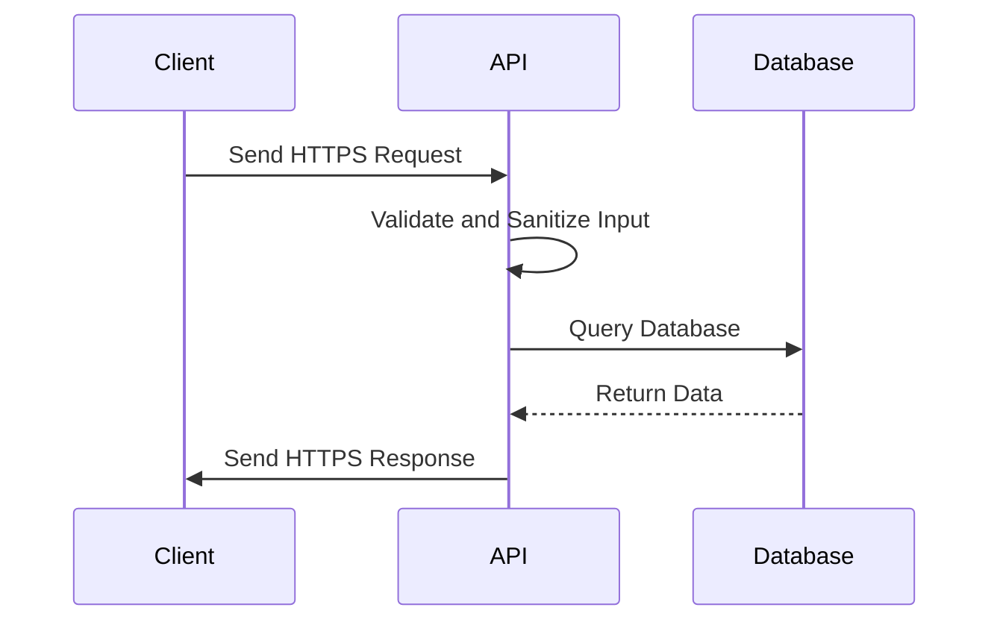

## 14.10 Testing and Securing APIs

In today's interconnected digital landscape, APIs (Application Programming Interfaces) serve as the backbone of communication between different software systems. Ensuring that these APIs are both functional and secure is paramount for maintaining the integrity and reliability of applications. In this section, we will delve into the best practices for testing and securing APIs in PHP, providing you with the knowledge and tools necessary to build robust and secure web services.

### API Testing

API testing is a critical aspect of the development process, ensuring that your APIs function as expected and meet the requirements of your application. It involves various types of testing, including functional, integration, and performance testing.

#### Functional Testing

Functional testing focuses on verifying that the API performs its intended functions correctly. This involves testing each endpoint to ensure it returns the expected results for a given input.

- **Define Test Cases:** Start by defining test cases for each API endpoint. Consider different scenarios, including valid and invalid inputs, edge cases, and error conditions.
- **Automate Tests:** Use tools like PHPUnit to automate your functional tests. Automated tests can be run frequently to catch regressions early in the development process.

```php
use PHPUnit\Framework\TestCase;

class ApiTest extends TestCase
{
    public function testGetUser()
    {
        $response = $this->get('/api/user/1');
        $this->assertEquals(200, $response->getStatusCode());
        $this->assertJson($response->getBody()->getContents());
    }

    private function get($url)
    {
        // Simulate a GET request to the API
        // This is a placeholder for actual HTTP client code
    }
}
```

#### Integration Testing

Integration testing ensures that different parts of your application work together as expected. For APIs, this means testing how different endpoints interact with each other and with external systems.

- **Mock External Services:** Use mocking frameworks to simulate interactions with external services. This allows you to test your API's behavior without relying on external dependencies.
- **Test Data Consistency:** Ensure that data remains consistent across different API calls, especially when dealing with complex transactions.

```php
use PHPUnit\Framework\TestCase;
use GuzzleHttp\Client;
use GuzzleHttp\Handler\MockHandler;
use GuzzleHttp\Psr7\Response;
use GuzzleHttp\HandlerStack;

class ApiIntegrationTest extends TestCase
{
    public function testUserCreationAndRetrieval()
    {
        $mock = new MockHandler([
            new Response(201, [], '{"id": 1, "name": "John Doe"}'),
            new Response(200, [], '{"id": 1, "name": "John Doe"}')
        ]);

        $handlerStack = HandlerStack::create($mock);
        $client = new Client(['handler' => $handlerStack]);

        // Simulate POST request to create a user
        $response = $client->post('/api/user', ['json' => ['name' => 'John Doe']]);
        $this->assertEquals(201, $response->getStatusCode());

        // Simulate GET request to retrieve the user
        $response = $client->get('/api/user/1');
        $this->assertEquals(200, $response->getStatusCode());
    }
}
```

#### Tools for API Testing

Several tools can aid in the testing of APIs, each offering unique features to streamline the process.

- **Postman:** A popular tool for manual testing of APIs. It allows you to send requests to your API and inspect the responses. Postman also supports automated testing through its scripting capabilities.
- **PHPUnit:** A widely used testing framework in the PHP ecosystem. It supports both unit and integration testing, making it a versatile choice for API testing.
- **Guzzle:** A PHP HTTP client that can be used to send requests to your API during testing. It integrates well with PHPUnit for automated tests.

### Security Measures

Securing your APIs is crucial to protect sensitive data and prevent unauthorized access. Implementing robust security measures can help mitigate common vulnerabilities and ensure the integrity of your web services.

#### Input Validation and Sanitization

Input validation and sanitization are fundamental security practices that help prevent attacks such as SQL injection and cross-site scripting (XSS).

- **Validate Inputs:** Ensure that all inputs to your API are validated against expected formats and constraints. Use PHP's filter functions or validation libraries to enforce these checks.
- **Sanitize Inputs:** Remove or escape any potentially harmful characters from user inputs before processing them. This helps prevent malicious code from being executed.

```php
function validateAndSanitizeInput($input)
{
    // Validate email
    if (!filter_var($input['email'], FILTER_VALIDATE_EMAIL)) {
        throw new InvalidArgumentException('Invalid email address');
    }

    // Sanitize string
    $input['name'] = filter_var($input['name'], FILTER_SANITIZE_STRING);

    return $input;
}
```

#### Using HTTPS/TLS Encryption

Encrypting data in transit is essential to protect sensitive information from being intercepted by malicious actors. HTTPS, which uses TLS (Transport Layer Security), is the standard protocol for secure communication over the internet.

- **Obtain an SSL Certificate:** Acquire an SSL certificate from a trusted certificate authority (CA) and configure your server to use HTTPS.
- **Enforce HTTPS:** Redirect all HTTP traffic to HTTPS to ensure that all data is encrypted during transmission.

#### Authentication and Authorization

Implementing robust authentication and authorization mechanisms is critical for controlling access to your APIs.

- **Use OAuth2 or JWT:** These are widely used standards for API authentication. OAuth2 provides a framework for token-based authentication, while JWT (JSON Web Tokens) are self-contained tokens that can be used for stateless authentication.
- **Role-Based Access Control (RBAC):** Implement RBAC to restrict access to API endpoints based on user roles and permissions.

```php
function authenticateRequest($token)
{
    // Verify JWT token
    $decoded = JWT::decode($token, $secretKey, ['HS256']);
    if (!$decoded) {
        throw new UnauthorizedException('Invalid token');
    }

    return $decoded;
}
```

#### Vulnerability Assessment

Regular vulnerability assessments are essential to identify and address potential security weaknesses in your APIs.

- **Conduct Security Audits:** Perform regular security audits to evaluate the security posture of your APIs. This can involve code reviews, penetration testing, and vulnerability scanning.
- **Use Tools like OWASP ZAP:** OWASP ZAP is an open-source tool for finding vulnerabilities in web applications. It can be used to scan your APIs for common security issues.

### Try It Yourself

To reinforce your understanding of API testing and security, try modifying the code examples provided. Experiment with different test cases, input validation rules, and authentication mechanisms. This hands-on practice will help solidify your knowledge and prepare you for real-world scenarios.

### Visualizing API Security Workflow

To better understand the workflow of securing an API, let's visualize the process using a sequence diagram.



**Description:** This diagram illustrates the typical workflow of an API request. The client sends a request over HTTPS, the API validates and sanitizes the input, queries the database, and returns the response to the client.

### Knowledge Check

- Explain the importance of input validation and sanitization in API security.
- Describe how HTTPS/TLS encryption protects data in transit.
- Discuss the differences between OAuth2 and JWT for API authentication.

### Embrace the Journey

Remember, mastering API testing and security is a continuous journey. As you progress, you'll encounter new challenges and opportunities to apply your skills. Stay curious, keep experimenting, and embrace the learning process. The knowledge you gain will empower you to build secure and reliable APIs that stand the test of time.

## Quiz: Testing and Securing APIs



### What is the primary purpose of functional testing in API development?

- [x] To verify that the API performs its intended functions correctly.
- [ ] To test the performance of the API under load.
- [ ] To ensure the API is secure from vulnerabilities.
- [ ] To check the API's compatibility with different browsers.

> **Explanation:** Functional testing focuses on ensuring that the API performs its intended functions correctly, handling various inputs and scenarios.

### Which tool is commonly used for manual testing of APIs?

- [x] Postman
- [ ] PHPUnit
- [ ] Guzzle
- [ ] OWASP ZAP

> **Explanation:** Postman is a popular tool for manual testing of APIs, allowing developers to send requests and inspect responses.

### What is the role of input validation in API security?

- [x] To ensure inputs conform to expected formats and constraints.
- [ ] To encrypt data in transit.
- [ ] To authenticate users accessing the API.
- [ ] To log API requests and responses.

> **Explanation:** Input validation ensures that inputs conform to expected formats and constraints, preventing malicious data from being processed.

### How does HTTPS/TLS encryption protect API data?

- [x] By encrypting data in transit to prevent interception.
- [ ] By validating user inputs.
- [ ] By providing role-based access control.
- [ ] By scanning for vulnerabilities.

> **Explanation:** HTTPS/TLS encryption protects data by encrypting it during transmission, preventing interception by malicious actors.

### What is the difference between OAuth2 and JWT?

- [x] OAuth2 is a framework for token-based authentication, while JWT is a self-contained token format.
- [ ] OAuth2 encrypts data, while JWT provides role-based access control.
- [ ] OAuth2 is used for input validation, while JWT is used for data sanitization.
- [ ] OAuth2 is a testing tool, while JWT is a security audit tool.

> **Explanation:** OAuth2 is a framework for token-based authentication, while JWT is a self-contained token format used for stateless authentication.

### Which tool can be used for vulnerability assessment of APIs?

- [x] OWASP ZAP
- [ ] PHPUnit
- [ ] Postman
- [ ] Guzzle

> **Explanation:** OWASP ZAP is an open-source tool used for finding vulnerabilities in web applications, including APIs.

### What is the purpose of role-based access control (RBAC) in API security?

- [x] To restrict access to API endpoints based on user roles and permissions.
- [ ] To encrypt data in transit.
- [ ] To validate and sanitize inputs.
- [ ] To automate API testing.

> **Explanation:** RBAC restricts access to API endpoints based on user roles and permissions, ensuring only authorized users can access certain functionalities.

### Why is it important to automate API tests?

- [x] To catch regressions early in the development process.
- [ ] To manually inspect API responses.
- [ ] To encrypt data in transit.
- [ ] To provide role-based access control.

> **Explanation:** Automating API tests helps catch regressions early in the development process, ensuring the API continues to function as expected.

### What is the benefit of using mocking frameworks in integration testing?

- [x] To simulate interactions with external services without relying on them.
- [ ] To encrypt data in transit.
- [ ] To validate user inputs.
- [ ] To log API requests and responses.

> **Explanation:** Mocking frameworks simulate interactions with external services, allowing integration tests to run without relying on actual external dependencies.

### True or False: Regular security audits are unnecessary if input validation is implemented.

- [ ] True
- [x] False

> **Explanation:** Regular security audits are essential even if input validation is implemented, as they help identify and address potential security weaknesses beyond input validation.


