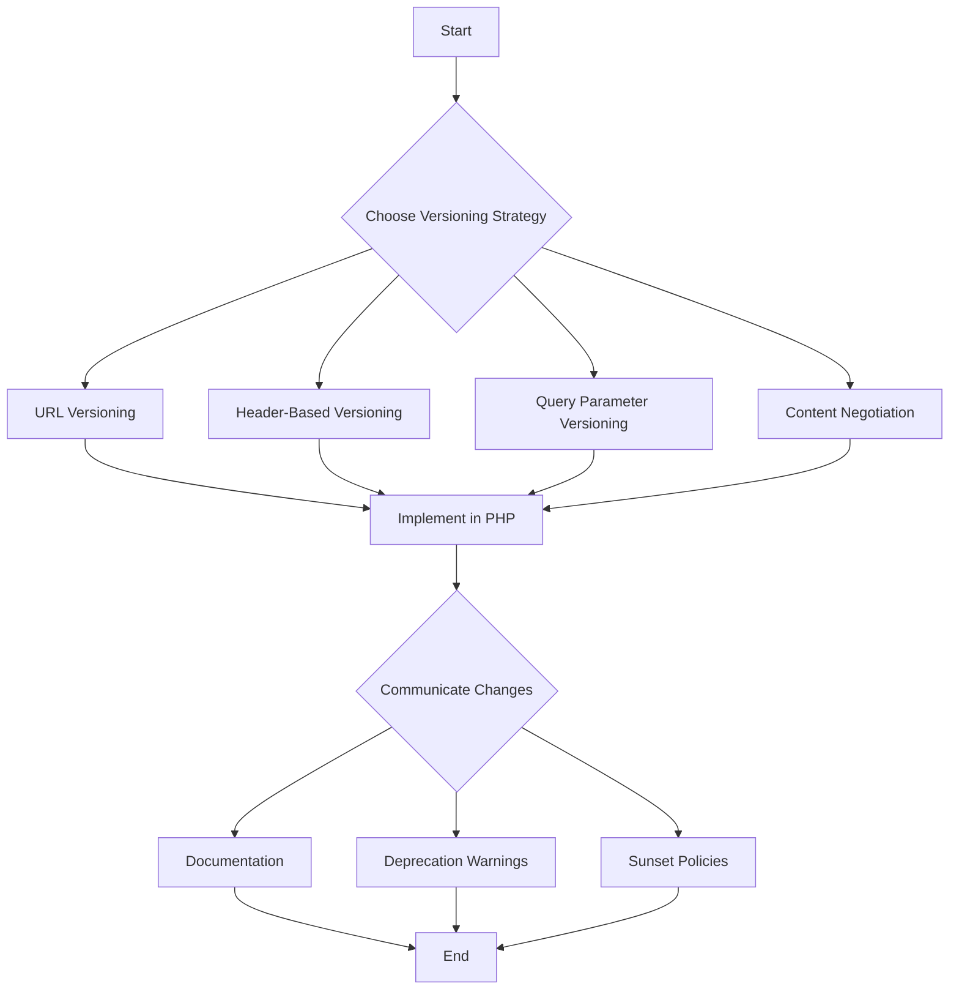

## 14.2 API Versioning Strategies

In the ever-evolving landscape of software development, APIs (Application Programming Interfaces) play a crucial role in enabling communication between different software systems. As APIs evolve, changes are inevitable, and managing these changes without disrupting existing clients is a significant challenge. This is where API versioning comes into play. In this section, we will explore various API versioning strategies, focusing on their implementation in PHP, and provide guidance on choosing the right approach for your projects.

### Why Version APIs?

Before diving into the strategies, let's first understand why versioning APIs is essential:

- **Managing Changes**: APIs are subject to changes due to new features, bug fixes, or improvements. Versioning helps manage these changes systematically.
- **Backward Compatibility**: It ensures that existing clients continue to function without disruption when new versions are released.
- **Deprecation and Sunset Policies**: Versioning allows for a structured approach to deprecating old features and introducing new ones.
- **Client Flexibility**: Clients can choose to upgrade to newer versions at their convenience, reducing the risk of breaking changes.

### Versioning Techniques

There are several techniques for versioning APIs, each with its own advantages and trade-offs. Let's explore the most common strategies:

#### 1. URL Versioning

URL versioning is one of the most straightforward and widely used methods. It involves embedding the version number directly in the URL path. For example:

```
GET /api/v1/users
GET /api/v2/users
```

**Advantages:**

- **Simplicity**: Easy to implement and understand.
- **Visibility**: The version is clearly visible in the URL, making it easy for developers to identify the API version being used.

**Disadvantages:**

- **URL Changes**: Requires changes in the URL structure, which might not be ideal for some applications.
- **Limited Flexibility**: Can become cumbersome if multiple versions need to be supported simultaneously.

**Implementation in PHP:**

Here's a simple example of how URL versioning can be implemented in a PHP application using a basic routing mechanism:

```php
<?php

$requestUri = $_SERVER['REQUEST_URI'];
$version = null;

if (preg_match('/\/api\/v(\d+)\//', $requestUri, $matches)) {
    $version = $matches[1];
}

switch ($version) {
    case '1':
        // Handle version 1
        echo "API Version 1";
        break;
    case '2':
        // Handle version 2
        echo "API Version 2";
        break;
    default:
        // Handle default or unsupported version
        echo "Unsupported API Version";
        break;
}
?>
```

**Try It Yourself**: Modify the code to add a new version, say `v3`, and handle it appropriately. Experiment with different URL structures to see how they affect the routing logic.

#### 2. Header-Based Versioning

Header-based versioning involves specifying the API version in the HTTP headers rather than the URL. For example:

```
GET /api/users
Headers: 
    Accept: application/vnd.example.v1+json
```

**Advantages:**

- **Clean URLs**: Keeps the URL structure clean and consistent.
- **Flexibility**: Allows for more granular versioning, such as versioning based on content type.

**Disadvantages:**

- **Hidden Versioning**: The version is not visible in the URL, which can make debugging more challenging.
- **Complexity**: Requires clients to set headers correctly, which might be more complex than URL-based versioning.

**Implementation in PHP:**

Below is an example of how header-based versioning can be implemented in PHP:

```php
<?php

$headers = getallheaders();
$version = null;

if (isset($headers['Accept'])) {
    if (preg_match('/application\/vnd\.example\.v(\d+)\+json/', $headers['Accept'], $matches)) {
        $version = $matches[1];
    }
}

switch ($version) {
    case '1':
        // Handle version 1
        echo "API Version 1";
        break;
    case '2':
        // Handle version 2
        echo "API Version 2";
        break;
    default:
        // Handle default or unsupported version
        echo "Unsupported API Version";
        break;
}
?>
```

**Try It Yourself**: Experiment by changing the `Accept` header in your HTTP requests to see how the server responds to different versions.

#### 3. Query Parameter Versioning

Another approach is to include the version number as a query parameter in the URL. For example:

```
GET /api/users?version=1
GET /api/users?version=2
```

**Advantages:**

- **Simplicity**: Easy to implement and understand.
- **Backward Compatibility**: Allows for backward compatibility without changing the URL structure.

**Disadvantages:**

- **Visibility**: The version is not as prominently visible as in URL versioning.
- **Potential Conflicts**: Query parameters might conflict with other parameters used in the API.

**Implementation in PHP:**

Here's how you can implement query parameter versioning in PHP:

```php
<?php

$version = isset($_GET['version']) ? $_GET['version'] : null;

switch ($version) {
    case '1':
        // Handle version 1
        echo "API Version 1";
        break;
    case '2':
        // Handle version 2
        echo "API Version 2";
        break;
    default:
        // Handle default or unsupported version
        echo "Unsupported API Version";
        break;
}
?>
```

**Try It Yourself**: Add additional query parameters to the URL and see how they interact with the versioning logic.

#### 4. Content Negotiation

Content negotiation is a more advanced technique where the client specifies the desired version through the `Accept` header, and the server responds with the appropriate version. This approach is similar to header-based versioning but focuses on content types.

**Advantages:**

- **Granularity**: Allows for fine-grained control over the API versioning process.
- **Flexibility**: Supports multiple content types and versions simultaneously.

**Disadvantages:**

- **Complexity**: More complex to implement and requires careful management of content types and headers.
- **Hidden Versioning**: Similar to header-based versioning, the version is not visible in the URL.

**Implementation in PHP:**

Here's a basic example of content negotiation in PHP:

```php
<?php

$headers = getallheaders();
$version = null;

if (isset($headers['Accept'])) {
    if (strpos($headers['Accept'], 'application/json') !== false) {
        // Default to version 1 for JSON
        $version = '1';
    } elseif (strpos($headers['Accept'], 'application/xml') !== false) {
        // Default to version 2 for XML
        $version = '2';
    }
}

switch ($version) {
    case '1':
        // Handle JSON version
        echo "API Version 1 - JSON";
        break;
    case '2':
        // Handle XML version
        echo "API Version 2 - XML";
        break;
    default:
        // Handle default or unsupported version
        echo "Unsupported API Version";
        break;
}
?>
```

**Try It Yourself**: Modify the `Accept` header to request different content types and observe how the server handles the requests.

### Deprecation Policies

Versioning is not just about introducing new versions; it's also about managing the lifecycle of existing versions. Deprecation policies play a crucial role in this process.

#### Communicating Changes

It's essential to communicate changes to API consumers effectively. Here are some best practices:

- **Documentation**: Maintain comprehensive documentation that outlines version changes, deprecations, and migration paths.
- **Deprecation Warnings**: Provide clear warnings in API responses when a deprecated version is being used.
- **Sunset Policies**: Define sunset policies that specify when a version will no longer be supported.

#### Implementing Deprecation in PHP

Here's a simple example of how you might implement deprecation warnings in a PHP API:

```php
<?php

$version = isset($_GET['version']) ? $_GET['version'] : null;

switch ($version) {
    case '1':
        // Handle version 1 with deprecation warning
        header('X-Deprecation-Notice: Version 1 is deprecated and will be removed on 2025-01-01');
        echo "API Version 1";
        break;
    case '2':
        // Handle version 2
        echo "API Version 2";
        break;
    default:
        // Handle default or unsupported version
        echo "Unsupported API Version";
        break;
}
?>
```

**Try It Yourself**: Set a future deprecation date and observe how the warning is communicated to clients.

### Choosing the Right Strategy

Selecting the right versioning strategy depends on several factors, including the complexity of your API, the needs of your clients, and your development team's capabilities. Here are some considerations:

- **Simplicity vs. Flexibility**: Simpler strategies like URL versioning are easier to implement but may lack flexibility. More complex strategies like content negotiation offer greater flexibility but require more effort to implement.
- **Client Requirements**: Consider the needs and capabilities of your clients. If they prefer clean URLs, URL versioning might be the best choice. If they need fine-grained control over content types, consider content negotiation.
- **Long-Term Maintenance**: Think about the long-term maintenance of your API. Choose a strategy that aligns with your team's ability to manage and support multiple versions over time.

### Visualizing API Versioning Strategies

To better understand the flow of API versioning strategies, let's visualize the decision-making process using a flowchart:



**Description**: This flowchart illustrates the decision-making process for selecting an API versioning strategy, implementing it in PHP, and communicating changes to API consumers.

### Conclusion

API versioning is a critical aspect of API design and development. By choosing the right versioning strategy, you can ensure that your APIs remain robust, flexible, and backward-compatible. Whether you opt for URL versioning, header-based versioning, query parameter versioning, or content negotiation, the key is to communicate changes effectively and maintain comprehensive documentation.

Remember, this is just the beginning. As you progress, you'll build more complex and interactive APIs. Keep experimenting, stay curious, and enjoy the journey!

## Quiz: API Versioning Strategies



### Which of the following is a common reason for versioning APIs?

- [x] Managing changes without breaking clients
- [ ] Improving API performance
- [ ] Reducing server load
- [ ] Increasing API security

> **Explanation:** Versioning APIs helps manage changes without breaking existing clients, ensuring backward compatibility.

### What is a key advantage of URL versioning?

- [x] Simplicity and visibility
- [ ] Hidden versioning
- [ ] Granularity
- [ ] Flexibility

> **Explanation:** URL versioning is simple to implement and makes the version clearly visible in the URL.

### Which versioning strategy involves specifying the version in the HTTP headers?

- [ ] URL versioning
- [x] Header-based versioning
- [ ] Query parameter versioning
- [ ] Content negotiation

> **Explanation:** Header-based versioning involves specifying the API version in the HTTP headers.

### What is a disadvantage of header-based versioning?

- [ ] Clean URLs
- [x] Hidden versioning
- [ ] Simplicity
- [ ] Visibility

> **Explanation:** The version is not visible in the URL, which can make debugging more challenging.

### Which versioning strategy uses the `Accept` header for specifying the desired version?

- [ ] URL versioning
- [ ] Query parameter versioning
- [x] Content negotiation
- [ ] Header-based versioning

> **Explanation:** Content negotiation uses the `Accept` header to specify the desired version and content type.

### What should be included in API responses to communicate deprecation?

- [x] Deprecation warnings
- [ ] Performance metrics
- [ ] Security alerts
- [ ] Error codes

> **Explanation:** Deprecation warnings should be included in API responses to inform clients about deprecated features.

### Which versioning strategy might conflict with other parameters used in the API?

- [ ] URL versioning
- [ ] Header-based versioning
- [x] Query parameter versioning
- [ ] Content negotiation

> **Explanation:** Query parameter versioning might conflict with other parameters used in the API.

### What is a key consideration when choosing an API versioning strategy?

- [x] Client requirements
- [ ] Server location
- [ ] Database type
- [ ] Programming language

> **Explanation:** Client requirements are a key consideration when choosing an API versioning strategy.

### Which of the following is a best practice for communicating API changes?

- [x] Maintaining comprehensive documentation
- [ ] Increasing server capacity
- [ ] Reducing API endpoints
- [ ] Using complex algorithms

> **Explanation:** Maintaining comprehensive documentation is a best practice for communicating API changes.

### True or False: Content negotiation allows for fine-grained control over the API versioning process.

- [x] True
- [ ] False

> **Explanation:** Content negotiation allows for fine-grained control over the API versioning process by supporting multiple content types and versions.


