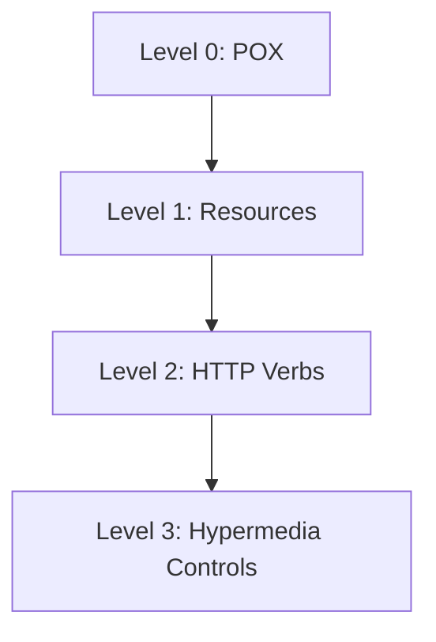

## 14.3 HATEOAS and REST Maturity Model

In the realm of API design, understanding HATEOAS (Hypermedia as the Engine of Application State) and the REST Maturity Model is crucial for creating scalable, maintainable, and user-friendly APIs. This section will guide you through these concepts, providing insights into their implementation in PHP, and how they can elevate your API design to new heights.

### Understanding HATEOAS

HATEOAS is a constraint of the REST application architecture that distinguishes RESTful systems from other network-based architectures. It allows a client to interact with a RESTful service entirely through hypermedia provided dynamically by application servers.

#### What is HATEOAS?

HATEOAS stands for Hypermedia as the Engine of Application State. It is a concept within RESTful web services where the client interacts with the server entirely through hypermedia links provided in the server's responses. This means that the client does not need to know the structure or the details of the API beforehand; it can discover available actions and resources dynamically.

**Key Characteristics of HATEOAS:**

- **Dynamic Navigation:** Clients navigate the API dynamically using links provided in the responses.
- **Decoupled Client and Server:** The client does not need to hard-code URIs or understand the API structure.
- **Self-Descriptive Messages:** Each response contains enough information for the client to understand how to use it.

#### Implementing Hypermedia Controls

To implement HATEOAS in your PHP application, you need to include hypermedia controls in your API responses. These controls are typically links that guide the client on what actions can be taken next.

**Example of a HATEOAS Response in PHP:**

```php
<?php

header('Content-Type: application/json');

$response = [
    'data' => [
        'id' => 1,
        'name' => 'John Doe',
        'email' => 'john.doe@example.com'
    ],
    'links' => [
        'self' => '/users/1',
        'edit' => '/users/1/edit',
        'delete' => '/users/1/delete',
        'friends' => '/users/1/friends'
    ]
];

echo json_encode($response);
```

In this example, the response includes a `links` section, which provides URIs for related actions such as editing or deleting the user, or viewing their friends. This allows the client to navigate the API without prior knowledge of its structure.

### REST Maturity Model

The REST Maturity Model, also known as the Richardson Maturity Model, is a way to evaluate the maturity of a RESTful API. It consists of four levels, from Level 0 to Level 3, each representing a step towards a fully RESTful API.

#### Level 0: The Swamp of POX

At Level 0, APIs are essentially RPC (Remote Procedure Call) over HTTP. They use HTTP as a transport protocol but do not leverage its full capabilities. This level is often referred to as "Plain Old XML" (POX) or "HTTP Tunneling."

**Characteristics:**

- Uses HTTP as a transport layer.
- Typically involves a single URI with POST requests.
- Does not utilize HTTP methods or status codes effectively.

**Example:**

```php
<?php

// A simple RPC-style API endpoint
if ($_SERVER['REQUEST_METHOD'] === 'POST') {
    $action = $_POST['action'];
    if ($action === 'getUser') {
        // Return user data
    }
}
```

#### Level 1: Resources

Level 1 introduces the concept of resources. Instead of a single endpoint, the API exposes multiple URIs, each representing a resource.

**Characteristics:**

- Multiple URIs for different resources.
- Still relies heavily on POST requests.
- Begins to separate data into distinct resources.

**Example:**

```php
<?php

// Separate endpoints for different resources
if ($_SERVER['REQUEST_METHOD'] === 'GET' && $_SERVER['REQUEST_URI'] === '/users') {
    // Return list of users
} elseif ($_SERVER['REQUEST_METHOD'] === 'GET' && $_SERVER['REQUEST_URI'] === '/users/1') {
    // Return specific user
}
```

#### Level 2: HTTP Verbs

At Level 2, the API starts to use HTTP methods (verbs) such as GET, POST, PUT, and DELETE to perform actions on resources. This level leverages the full potential of HTTP.

**Characteristics:**

- Uses HTTP methods to perform actions.
- Utilizes HTTP status codes for responses.
- Resources are accessed and manipulated using appropriate HTTP verbs.

**Example:**

```php
<?php

// Using HTTP methods to interact with resources
switch ($_SERVER['REQUEST_METHOD']) {
    case 'GET':
        // Retrieve resource
        break;
    case 'POST':
        // Create resource
        break;
    case 'PUT':
        // Update resource
        break;
    case 'DELETE':
        // Delete resource
        break;
}
```

#### Level 3: Hypermedia Controls

Level 3 is the pinnacle of RESTful API design, where HATEOAS is fully implemented. The API provides hypermedia links in responses, allowing clients to navigate the API dynamically.

**Characteristics:**

- Includes hypermedia links in responses.
- Clients discover actions and resources dynamically.
- Fully leverages REST principles.

**Example:**

```php
<?php

// A fully RESTful API with hypermedia controls
$response = [
    'data' => [
        'id' => 1,
        'name' => 'John Doe'
    ],
    'links' => [
        'self' => '/users/1',
        'edit' => '/users/1/edit',
        'delete' => '/users/1/delete'
    ]
];

header('Content-Type: application/json');
echo json_encode($response);
```

### Visualizing the REST Maturity Model

To better understand the progression through the REST Maturity Model, let's visualize it using a diagram.



**Diagram Explanation:**

- **Level 0:** Represents the initial stage where HTTP is used merely as a transport protocol.
- **Level 1:** Introduces resources, allowing for more structured API design.
- **Level 2:** Utilizes HTTP methods, enhancing interaction with resources.
- **Level 3:** Implements hypermedia controls, achieving full RESTful maturity.

### Implementing HATEOAS in PHP

Implementing HATEOAS in PHP involves designing your API to include hypermedia links in responses. This can be achieved using various PHP frameworks or libraries that support RESTful API development.

#### Using Laravel for HATEOAS

Laravel, a popular PHP framework, provides tools to easily implement HATEOAS in your API.

**Example:**

```php
<?php

use Illuminate\Http\Request;
use Illuminate\Support\Facades\Route;

Route::get('/users/{id}', function ($id) {
    $user = User::find($id);

    return response()->json([
        'data' => $user,
        'links' => [
            'self' => route('users.show', ['id' => $user->id]),
            'edit' => route('users.edit', ['id' => $user->id]),
            'delete' => route('users.destroy', ['id' => $user->id])
        ]
    ]);
});
```

In this example, Laravel's routing and response capabilities are used to generate hypermedia links dynamically.

### Key Considerations for HATEOAS and REST Maturity

When implementing HATEOAS and striving for higher REST maturity levels, consider the following:

- **Client Simplicity:** HATEOAS simplifies client development by providing all necessary information in responses.
- **Decoupling:** A decoupled client-server relationship allows for independent evolution of the client and server.
- **Discoverability:** Hypermedia controls enhance discoverability, enabling clients to explore the API without prior knowledge.
- **Consistency:** Ensure consistent use of HTTP methods and status codes across your API.

### PHP Unique Features for HATEOAS

PHP offers several features that facilitate the implementation of HATEOAS:

- **Framework Support:** PHP frameworks like Laravel and Symfony provide built-in support for RESTful API development.
- **JSON Handling:** PHP's native JSON functions make it easy to construct and parse JSON responses.
- **Routing Capabilities:** PHP frameworks offer robust routing capabilities, essential for resource-based API design.

### Differences and Similarities with Other Patterns

HATEOAS is often compared to other API design patterns, such as GraphQL. While both aim to improve client-server interactions, they differ in approach:

- **HATEOAS:** Focuses on dynamic navigation through hypermedia links.
- **GraphQL:** Provides a flexible query language for clients to request specific data.

### Try It Yourself

To solidify your understanding of HATEOAS and the REST Maturity Model, try implementing a simple API in PHP that includes hypermedia controls. Experiment with different frameworks and libraries to see how they support RESTful design.

### Knowledge Check

- What is HATEOAS, and how does it benefit API design?
- Describe the four levels of the REST Maturity Model.
- How can PHP frameworks assist in implementing HATEOAS?

### Embrace the Journey

Remember, mastering HATEOAS and the REST Maturity Model is a journey. As you continue to explore these concepts, you'll discover new ways to enhance your API design. Keep experimenting, stay curious, and enjoy the process!

## Quiz: HATEOAS and REST Maturity Model



### What does HATEOAS stand for?

- [x] Hypermedia as the Engine of Application State
- [ ] Hypertext Application Transfer Engine
- [ ] Hypermedia Application Transfer Engine
- [ ] Hypertext as the Engine of Application State

> **Explanation:** HATEOAS stands for Hypermedia as the Engine of Application State, a key concept in RESTful API design.

### Which level of the REST Maturity Model introduces hypermedia controls?

- [ ] Level 0
- [ ] Level 1
- [ ] Level 2
- [x] Level 3

> **Explanation:** Level 3 of the REST Maturity Model introduces hypermedia controls, allowing clients to navigate the API dynamically.

### What is a key benefit of implementing HATEOAS in an API?

- [x] It allows clients to discover available actions dynamically.
- [ ] It reduces server load by caching responses.
- [ ] It simplifies database interactions.
- [ ] It enhances data encryption.

> **Explanation:** HATEOAS allows clients to discover available actions dynamically through hypermedia links in responses.

### Which PHP framework is commonly used to implement HATEOAS?

- [x] Laravel
- [ ] Django
- [ ] Flask
- [ ] Express

> **Explanation:** Laravel is a popular PHP framework that provides tools to implement HATEOAS in APIs.

### What is the primary focus of HATEOAS in API design?

- [x] Dynamic navigation through hypermedia links
- [ ] Data encryption and security
- [ ] Database optimization
- [ ] User authentication

> **Explanation:** HATEOAS focuses on dynamic navigation through hypermedia links, enhancing client-server interactions.

### How does Level 2 of the REST Maturity Model differ from Level 1?

- [x] It uses HTTP methods to perform actions on resources.
- [ ] It introduces hypermedia controls.
- [ ] It uses a single URI for all requests.
- [ ] It relies on XML for data exchange.

> **Explanation:** Level 2 of the REST Maturity Model uses HTTP methods to perform actions on resources, unlike Level 1.

### Which of the following is a characteristic of Level 0 in the REST Maturity Model?

- [x] Uses HTTP as a transport layer without leveraging its full capabilities.
- [ ] Includes hypermedia links in responses.
- [ ] Utilizes HTTP methods for resource manipulation.
- [ ] Separates data into distinct resources.

> **Explanation:** Level 0 uses HTTP as a transport layer without leveraging its full capabilities, often referred to as POX.

### What is a common feature of PHP frameworks that aids in implementing HATEOAS?

- [x] Robust routing capabilities
- [ ] Built-in data encryption
- [ ] Automatic database indexing
- [ ] Real-time data synchronization

> **Explanation:** PHP frameworks offer robust routing capabilities, essential for resource-based API design.

### What is the primary goal of the REST Maturity Model?

- [x] To evaluate and improve the maturity of a RESTful API
- [ ] To enhance data encryption techniques
- [ ] To optimize database queries
- [ ] To simplify user authentication

> **Explanation:** The REST Maturity Model aims to evaluate and improve the maturity of a RESTful API.

### True or False: HATEOAS requires clients to have prior knowledge of the API structure.

- [ ] True
- [x] False

> **Explanation:** False. HATEOAS allows clients to discover the API structure dynamically through hypermedia links.



By understanding and implementing HATEOAS and the REST Maturity Model, you can create APIs that are not only robust and scalable but also intuitive and easy to use. Keep exploring these concepts, and you'll find new ways to enhance your API design in PHP.
