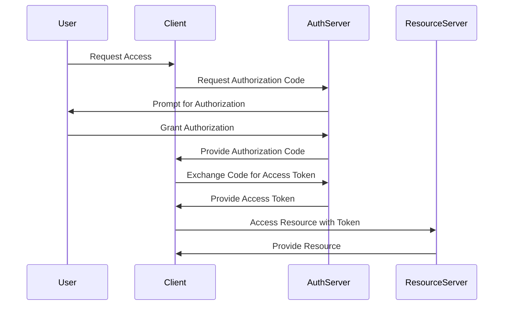

## 14.4 Authentication Patterns (OAuth2, JWT)

In the realm of modern web development, securing APIs and web services is paramount. Authentication patterns like OAuth2 and JWT (JSON Web Tokens) have become essential tools for developers. This section delves into these authentication mechanisms, exploring their concepts, implementations, and best practices in PHP.

### Understanding OAuth2 Authentication

OAuth2 is a protocol that allows third-party applications to grant limited access to a user's resources without exposing their credentials. It is widely used for delegated authentication and authorization, providing a secure way to access user data.

#### Key Concepts of OAuth2

- **Resource Owner**: The user who owns the data.
- **Client**: The application requesting access to the user's data.
- **Authorization Server**: The server that authenticates the resource owner and issues access tokens.
- **Resource Server**: The server hosting the protected resources.

#### OAuth2 Grant Types

OAuth2 supports several grant types, each suited for different scenarios:

1. **Authorization Code Grant**: Used for server-side applications. It involves exchanging an authorization code for an access token.
2. **Implicit Grant**: Suitable for client-side applications where the access token is returned directly.
3. **Resource Owner Password Credentials Grant**: Used when the user trusts the client with their credentials.
4. **Client Credentials Grant**: Used for machine-to-machine communication.

#### Implementing OAuth2 in PHP

To implement OAuth2 in PHP, you can use libraries like [The PHP League's OAuth2 Server](https://oauth2.thephpleague.com/). This library provides a robust framework for creating an OAuth2 server.

```php
// Example of setting up an OAuth2 server using The PHP League's library

use League\OAuth2\Server\AuthorizationServer;
use League\OAuth2\Server\Grant\AuthCodeGrant;
use League\OAuth2\Server\Repositories\ClientRepositoryInterface;
use League\OAuth2\Server\Repositories\AccessTokenRepositoryInterface;
use League\OAuth2\Server\Repositories\AuthCodeRepositoryInterface;
use League\OAuth2\Server\Repositories\ScopeRepositoryInterface;
use League\OAuth2\Server\Repositories\RefreshTokenRepositoryInterface;

// Initialize the authorization server
$server = new AuthorizationServer(
    $clientRepository,          // instance of ClientRepositoryInterface
    $accessTokenRepository,     // instance of AccessTokenRepositoryInterface
    $scopeRepository,           // instance of ScopeRepositoryInterface
    'file://path/to/private.key', // path to private key
    'encryption-key'            // encryption key
);

// Enable the authorization code grant on the server
$server->enableGrantType(
    new AuthCodeGrant(
        $authCodeRepository,    // instance of AuthCodeRepositoryInterface
        $refreshTokenRepository // instance of RefreshTokenRepositoryInterface
    ),
    new \DateInterval('PT10M')  // access token expiration time
);
```

**Try It Yourself**: Modify the code to implement different grant types and experiment with token expiration times.

### JSON Web Tokens (JWT)

JWTs are a compact, URL-safe means of representing claims to be transferred between two parties. They are used for token-based stateless authentication, allowing secure information exchange.

#### Structure of a JWT

A JWT consists of three parts:

1. **Header**: Contains the type of token and the signing algorithm.
2. **Payload**: Contains the claims. Claims are statements about an entity (typically, the user) and additional data.
3. **Signature**: Used to verify the token's integrity.

```json
// Example of a JWT structure
{
  "header": {
    "alg": "HS256",
    "typ": "JWT"
  },
  "payload": {
    "sub": "1234567890",
    "name": "John Doe",
    "iat": 1516239022
  },
  "signature": "SflKxwRJSMeKKF2QT4fwpMeJf36POk6yJV_adQssw5c"
}
```

#### Implementing JWT in PHP

To implement JWT in PHP, you can use the [lcobucci/jwt](https://github.com/lcobucci/jwt) library. This library provides a simple way to create and verify JWTs.

```php
// Example of creating and verifying a JWT using lcobucci/jwt

use Lcobucci\JWT\Builder;
use Lcobucci\JWT\Parser;
use Lcobucci\JWT\ValidationData;

// Creating a JWT
$token = (new Builder())
    ->issuedBy('http://example.com') // Configures the issuer (iss claim)
    ->permittedFor('http://example.org') // Configures the audience (aud claim)
    ->identifiedBy('4f1g23a12aa', true) // Configures the id (jti claim), replicating as a header item
    ->issuedAt(time()) // Configures the time that the token was issue (iat claim)
    ->canOnlyBeUsedAfter(time() + 60) // Configures the time that the token can be used (nbf claim)
    ->expiresAt(time() + 3600) // Configures the expiration time of the token (exp claim)
    ->withClaim('uid', 1) // Configures a new claim, called "uid"
    ->getToken(); // Retrieves the generated token

// Verifying a JWT
$token = (new Parser())->parse((string) $token); // Parses from a string
$data = new ValidationData(); // It will use the current time to validate (iat, nbf and exp)
$data->setIssuer('http://example.com');
$data->setAudience('http://example.org');
$data->setId('4f1g23a12aa');

if ($token->validate($data)) {
    echo "Token is valid!";
} else {
    echo "Token is invalid!";
}
```

**Try It Yourself**: Experiment with different claims and validation rules to see how they affect the token's validity.

### Visualizing OAuth2 and JWT Workflow

To better understand how OAuth2 and JWT work together, let's visualize the authentication flow using a sequence diagram.



**Diagram Description**: This sequence diagram illustrates the OAuth2 authorization code flow, where the client requests access to a resource on behalf of the user, and the resource server verifies the access token.

### Best Practices for OAuth2 and JWT

- **Secure Storage**: Always store tokens securely. Avoid storing them in local storage or cookies without proper security measures.
- **Token Expiration**: Implement token expiration and refresh mechanisms to enhance security.
- **HTTPS**: Always use HTTPS to protect tokens in transit.
- **Scope Limitation**: Limit the scope of access tokens to the minimum required for the application.
- **Signature Verification**: Always verify the signature of JWTs to ensure their integrity.

### PHP Unique Features

PHP offers several unique features that facilitate the implementation of OAuth2 and JWT:

- **Composer**: Use Composer to manage dependencies and easily integrate libraries like `lcobucci/jwt`.
- **PSR Standards**: Follow PSR standards for consistent and maintainable code.
- **PHP 8 Features**: Utilize PHP 8 features like attributes and named arguments to enhance code readability and maintainability.

### Differences and Similarities

OAuth2 and JWT are often used together but serve different purposes:

- **OAuth2**: Primarily a protocol for authorization, allowing third-party applications to access user data.
- **JWT**: A token format used for authentication and information exchange.

Both can be used to secure APIs, but OAuth2 provides a more comprehensive framework for authorization, while JWT is a lightweight solution for authentication.

### Knowledge Check

- **Question**: What is the primary purpose of OAuth2?
- **Question**: How does JWT ensure the integrity of the token?
- **Question**: What are the key components of a JWT?

### Embrace the Journey

Remember, mastering authentication patterns like OAuth2 and JWT is a journey. As you continue to explore these concepts, you'll gain a deeper understanding of securing APIs and web services. Keep experimenting, stay curious, and enjoy the journey!

## Quiz: Authentication Patterns (OAuth2, JWT)



### What is the primary purpose of OAuth2?

- [x] Delegated authentication and authorization
- [ ] Data encryption
- [ ] Session management
- [ ] Database access

> **Explanation:** OAuth2 is primarily used for delegated authentication and authorization, allowing third-party applications to access user data without exposing credentials.

### Which part of a JWT contains the claims?

- [ ] Header
- [x] Payload
- [ ] Signature
- [ ] Footer

> **Explanation:** The payload of a JWT contains the claims, which are statements about an entity and additional data.

### What is a key feature of JWTs?

- [x] Stateless authentication
- [ ] Stateful session management
- [ ] Data encryption
- [ ] Database access

> **Explanation:** JWTs are used for stateless authentication, allowing secure information exchange without maintaining session state.

### How does OAuth2 enhance security?

- [x] By using access tokens with limited scope and expiration
- [ ] By encrypting all data
- [ ] By using session cookies
- [ ] By storing passwords

> **Explanation:** OAuth2 enhances security by using access tokens with limited scope and expiration, reducing the risk of unauthorized access.

### What library can be used to implement JWT in PHP?

- [x] lcobucci/jwt
- [ ] Guzzle
- [ ] Symfony
- [ ] Laravel

> **Explanation:** The `lcobucci/jwt` library is commonly used to implement JWT in PHP, providing tools for creating and verifying tokens.

### What is the role of the Authorization Server in OAuth2?

- [x] To authenticate the resource owner and issue access tokens
- [ ] To store user data
- [ ] To manage database connections
- [ ] To encrypt data

> **Explanation:** The Authorization Server in OAuth2 is responsible for authenticating the resource owner and issuing access tokens to clients.

### What is a common use case for the Client Credentials Grant in OAuth2?

- [x] Machine-to-machine communication
- [ ] User login
- [ ] Data encryption
- [ ] Session management

> **Explanation:** The Client Credentials Grant is used for machine-to-machine communication, where the client requests access to resources on its own behalf.

### How can you verify the integrity of a JWT?

- [x] By verifying the signature
- [ ] By checking the payload
- [ ] By inspecting the header
- [ ] By decrypting the token

> **Explanation:** The integrity of a JWT is verified by checking its signature, ensuring that the token has not been tampered with.

### What is a key benefit of using HTTPS with OAuth2 and JWT?

- [x] Protecting tokens in transit
- [ ] Encrypting database data
- [ ] Managing user sessions
- [ ] Storing user credentials

> **Explanation:** Using HTTPS with OAuth2 and JWT protects tokens in transit, preventing interception and unauthorized access.

### True or False: JWTs are always encrypted.

- [ ] True
- [x] False

> **Explanation:** JWTs are not always encrypted. They are encoded and signed, but encryption is optional and not inherent to the JWT specification.




