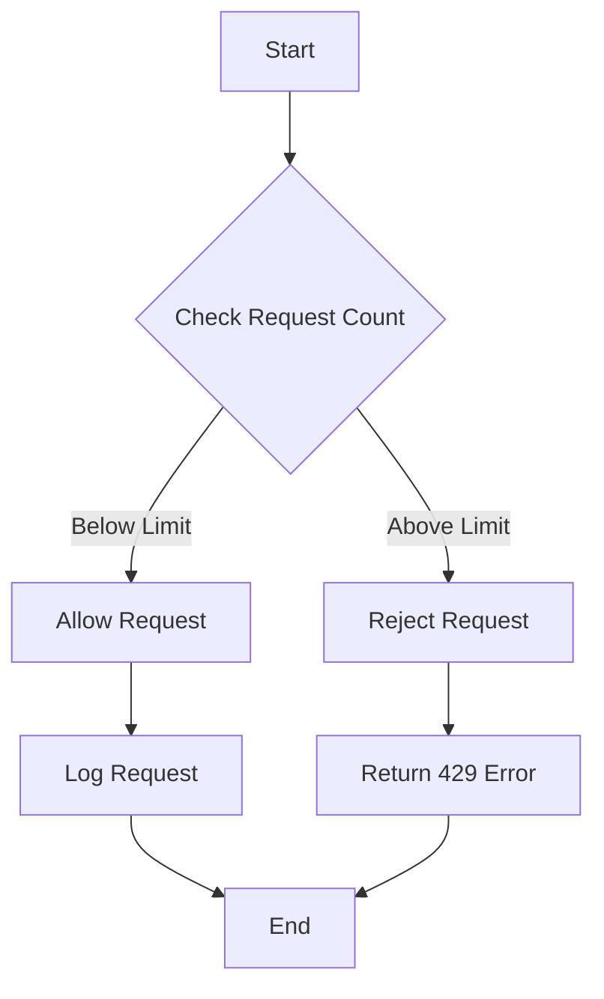

## 14.5 Rate Limiting and Throttling

In the world of APIs and web services, protecting resources from abuse and ensuring fair usage is crucial. Rate limiting and throttling are two essential techniques used to achieve these goals. In this section, we will delve into the concepts of rate limiting and throttling, explore various implementation methods, and examine tools and best practices for managing API usage effectively in PHP.

### Understanding Rate Limiting and Throttling

**Rate Limiting** is a technique used to control the amount of incoming and outgoing traffic to or from a network. It is primarily used to prevent abuse by limiting the number of requests a client can make to an API within a specified timeframe. This ensures that resources are not overwhelmed by too many requests, which could lead to service degradation or denial of service.

**Throttling**, on the other hand, is a broader concept that encompasses rate limiting but also includes controlling the speed of data transfer. Throttling can be used to manage bandwidth usage and ensure that no single client consumes more than their fair share of resources.

### Why Rate Limiting and Throttling are Important

1. **Preventing Abuse**: By limiting the number of requests a client can make, you can prevent malicious users from overwhelming your API with excessive requests.
2. **Ensuring Fair Usage**: Rate limiting ensures that all users have equal access to resources, preventing any single user from monopolizing the API.
3. **Protecting Resources**: By controlling the flow of requests, you can protect your backend systems from being overloaded, ensuring they remain responsive and available.
4. **Improving Performance**: Throttling can help manage bandwidth and improve the overall performance of your API by preventing bottlenecks.

### Implementation Methods

There are several methods to implement rate limiting and throttling in PHP APIs. Let's explore some of the most common approaches:

#### IP-Based Rate Limiting

IP-based rate limiting is one of the simplest methods to implement. It involves tracking the number of requests made by each IP address and limiting them based on predefined thresholds.

```php
<?php

class RateLimiter {
    private $requests = [];
    private $limit = 100; // Maximum requests per hour
    private $timeWindow = 3600; // Time window in seconds

    public function isAllowed($ip) {
        $currentTime = time();
        if (!isset($this->requests[$ip])) {
            $this->requests[$ip] = [];
        }

        // Remove expired requests
        $this->requests[$ip] = array_filter($this->requests[$ip], function($timestamp) use ($currentTime) {
            return ($currentTime - $timestamp) < $this->timeWindow;
        });

        // Check if the limit is exceeded
        if (count($this->requests[$ip]) >= $this->limit) {
            return false;
        }

        // Record the new request
        $this->requests[$ip][] = $currentTime;
        return true;
    }
}

// Usage
$rateLimiter = new RateLimiter();
$ip = $_SERVER['REMOTE_ADDR'];

if ($rateLimiter->isAllowed($ip)) {
    echo "Request allowed.";
} else {
    echo "Rate limit exceeded. Try again later.";
}
?>
```

**Explanation**: This code snippet demonstrates a basic IP-based rate limiter. It tracks requests from each IP address and allows or denies access based on the number of requests within a specified time window.

#### API Keys with Quotas

Another common method is to use API keys with quotas. This involves assigning each client an API key and tracking their usage against a predefined quota.

```php
<?php

class ApiKeyRateLimiter {
    private $apiKeys = [
        'key1' => ['limit' => 100, 'requests' => []],
        'key2' => ['limit' => 200, 'requests' => []],
    ];
    private $timeWindow = 3600; // Time window in seconds

    public function isAllowed($apiKey) {
        $currentTime = time();
        if (!isset($this->apiKeys[$apiKey])) {
            return false; // Invalid API key
        }

        // Remove expired requests
        $this->apiKeys[$apiKey]['requests'] = array_filter($this->apiKeys[$apiKey]['requests'], function($timestamp) use ($currentTime) {
            return ($currentTime - $timestamp) < $this->timeWindow;
        });

        // Check if the limit is exceeded
        if (count($this->apiKeys[$apiKey]['requests']) >= $this->apiKeys[$apiKey]['limit']) {
            return false;
        }

        // Record the new request
        $this->apiKeys[$apiKey]['requests'][] = $currentTime;
        return true;
    }
}

// Usage
$apiKey = $_GET['api_key'];
$rateLimiter = new ApiKeyRateLimiter();

if ($rateLimiter->isAllowed($apiKey)) {
    echo "Request allowed.";
} else {
    echo "API quota exceeded. Try again later.";
}
?>
```

**Explanation**: This example demonstrates how to implement rate limiting using API keys. Each key has an associated quota, and requests are tracked to ensure they do not exceed their limits.

### Tools for Rate Limiting and Throttling

Several tools and libraries can help implement rate limiting and throttling in PHP applications. Let's explore some popular options:

#### Framework Middleware

Many PHP frameworks offer built-in middleware for rate limiting. Middleware provides a convenient way to apply rate limiting logic to specific routes or controllers.

#### Laravel Throttle Middleware

Laravel, a popular PHP framework, provides a built-in throttle middleware that makes it easy to implement rate limiting.

```php
// In routes/web.php or routes/api.php

Route::middleware('throttle:60,1')->group(function () {
    Route::get('/user', function () {
        // Your route logic here
    });
});
```

**Explanation**: The `throttle` middleware in Laravel limits the number of requests to 60 per minute for the specified routes. You can customize the rate limit and time window as needed.

For more information, refer to the [Laravel Rate Limiting documentation](https://laravel.com/docs/routing#rate-limiting).

### Best Practices for Rate Limiting and Throttling

1. **Define Clear Policies**: Clearly define rate limiting policies and communicate them to your users. This includes specifying the limits, time windows, and any penalties for exceeding limits.

2. **Use Appropriate Limits**: Set limits that balance resource protection with user experience. Consider the needs of different user types and adjust limits accordingly.

3. **Provide Feedback**: When a user exceeds their rate limit, provide clear feedback, such as an HTTP 429 status code and a message indicating when they can try again.

4. **Monitor and Adjust**: Regularly monitor API usage and adjust rate limits as needed. Use analytics to identify patterns and optimize your rate limiting strategy.

5. **Implement Graceful Degradation**: Ensure that your API can handle rate limiting gracefully. This includes providing alternative responses or fallback mechanisms when limits are reached.

### Visualizing Rate Limiting

To better understand how rate limiting works, let's visualize the process using a flowchart.



**Description**: This flowchart illustrates the decision-making process in a rate limiter. It checks the request count, allows or rejects the request based on the limit, and logs the request if allowed.

### Knowledge Check

Let's reinforce our understanding with a few questions:

- What is the primary purpose of rate limiting?
- How does IP-based rate limiting differ from API key-based rate limiting?
- Why is it important to provide feedback when a rate limit is exceeded?

### Try It Yourself

Experiment with the code examples provided in this section. Try modifying the rate limits, time windows, and request tracking methods to see how they affect the behavior of the rate limiter. Consider implementing additional features, such as dynamic rate limits based on user roles or IP reputation.

### Conclusion

Rate limiting and throttling are essential techniques for managing API usage and protecting resources. By implementing these strategies effectively, you can prevent abuse, ensure fair usage, and maintain the performance and availability of your APIs. Remember to define clear policies, use appropriate limits, and monitor usage to optimize your rate limiting strategy.

## Quiz: Rate Limiting and Throttling



### What is the primary purpose of rate limiting?

- [x] To prevent abuse and ensure fair usage of resources
- [ ] To increase the speed of data transfer
- [ ] To reduce server costs
- [ ] To improve user interface design

> **Explanation:** Rate limiting is primarily used to prevent abuse and ensure fair usage of resources by controlling the number of requests a client can make within a specified timeframe.

### How does IP-based rate limiting differ from API key-based rate limiting?

- [x] IP-based limits requests per IP address, while API key-based limits requests per API key
- [ ] IP-based is more secure than API key-based
- [ ] API key-based is faster than IP-based
- [ ] IP-based is easier to implement than API key-based

> **Explanation:** IP-based rate limiting tracks requests per IP address, while API key-based rate limiting tracks requests per API key, allowing for more granular control.

### Which HTTP status code is commonly used to indicate that a rate limit has been exceeded?

- [ ] 200
- [ ] 404
- [x] 429
- [ ] 500

> **Explanation:** The HTTP status code 429 is used to indicate that a client has sent too many requests in a given amount of time, exceeding the rate limit.

### What is a common tool for implementing rate limiting in Laravel?

- [ ] Symfony Rate Limiter
- [x] Laravel Throttle Middleware
- [ ] PHP Rate Limiter
- [ ] Zend Rate Limiter

> **Explanation:** Laravel Throttle Middleware is a built-in tool in Laravel for implementing rate limiting on routes and controllers.

### Why is it important to provide feedback when a rate limit is exceeded?

- [x] To inform users when they can try again
- [ ] To increase server load
- [ ] To confuse users
- [ ] To improve API performance

> **Explanation:** Providing feedback when a rate limit is exceeded helps inform users when they can try again, improving the user experience.

### What is throttling primarily used for?

- [x] Controlling the speed of data transfer
- [ ] Increasing server capacity
- [ ] Enhancing user interface design
- [ ] Reducing code complexity

> **Explanation:** Throttling is used to control the speed of data transfer, managing bandwidth usage and ensuring fair resource distribution.

### Which of the following is a best practice for rate limiting?

- [x] Define clear policies and communicate them to users
- [ ] Set the same limits for all users
- [ ] Ignore user feedback
- [ ] Never adjust rate limits

> **Explanation:** Defining clear policies and communicating them to users is a best practice for rate limiting, ensuring transparency and understanding.

### What should you do if a user exceeds their rate limit?

- [x] Return an HTTP 429 status code and a message
- [ ] Ignore the request
- [ ] Increase the user's limit
- [ ] Block the user permanently

> **Explanation:** When a user exceeds their rate limit, it's important to return an HTTP 429 status code and a message indicating when they can try again.

### What is one benefit of using API keys with quotas for rate limiting?

- [x] Allows for more granular control over user access
- [ ] Increases server costs
- [ ] Reduces security
- [ ] Simplifies user authentication

> **Explanation:** Using API keys with quotas allows for more granular control over user access, enabling different limits for different users.

### True or False: Rate limiting can help improve the performance of an API.

- [x] True
- [ ] False

> **Explanation:** True. Rate limiting can help improve the performance of an API by preventing bottlenecks and ensuring resources are not overwhelmed.



Remember, this is just the beginning. As you progress, you'll build more complex and interactive APIs. Keep experimenting, stay curious, and enjoy the journey!
