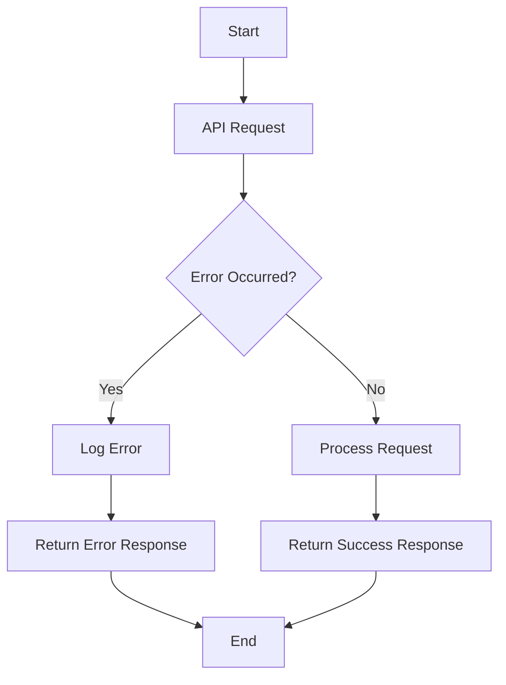

## 14.6 Error Handling in APIs

In the world of API development, error handling is a critical aspect that can significantly impact the user experience and the robustness of your application. Proper error handling ensures that your API communicates effectively with its consumers, providing them with the necessary information to understand and resolve issues. In this section, we will explore the best practices for error handling in APIs, focusing on PHP implementations, and delve into standardized formats like RFC 7807 for consistent error representation.

### Consistent Error Responses

Consistency in error responses is vital for API consumers to handle errors effectively. By using standardized formats and codes, you can ensure that your API's error messages are predictable and easy to parse. Let's explore how to achieve this consistency.

#### Using Standardized Formats and Codes

1. **HTTP Status Codes**: Use appropriate HTTP status codes to indicate the nature of the error. For instance, use `400` for client errors and `500` for server errors. Here's a quick reference:

   - `200 OK`: Successful request.
   - `400 Bad Request`: The request could not be understood by the server.
   - `401 Unauthorized`: Authentication is required.
   - `403 Forbidden`: The server understood the request but refuses to authorize it.
   - `404 Not Found`: The requested resource could not be found.
   - `500 Internal Server Error`: A generic error message for server issues.

2. **Error Codes**: Define a set of application-specific error codes that provide more granular information about the error. These codes should be documented and consistent across your API.

3. **Error Messages**: Provide clear and concise error messages that describe the issue. Avoid technical jargon and ensure that the message is understandable by the API consumer.

#### Example: Standardized Error Response

```json
{
  "status": 400,
  "error": "invalid_request",
  "message": "The 'email' field is required."
}
```

In this example, the error response includes an HTTP status code, an application-specific error code, and a human-readable message.

### Error Representation

To further standardize error responses, you can use the RFC 7807 Problem Details format. This format provides a structured way to represent errors in HTTP APIs.

#### RFC 7807 Problem Details

RFC 7807 defines a standard format for representing error details in HTTP APIs. It uses a JSON object with specific fields to convey error information. Here's a breakdown of the fields:

- **type**: A URI reference that identifies the problem type.
- **title**: A short, human-readable summary of the problem.
- **status**: The HTTP status code.
- **detail**: A human-readable explanation specific to this occurrence of the problem.
- **instance**: A URI reference that identifies the specific occurrence of the problem.

#### Example: RFC 7807 Problem Details

```json
{
  "type": "https://example.com/probs/out-of-credit",
  "title": "You do not have enough credit.",
  "status": 403,
  "detail": "Your current balance is 30, but that costs 50.",
  "instance": "/account/12345/transactions/abc"
}
```

This example provides a comprehensive error response using the RFC 7807 format, making it easier for API consumers to understand and handle errors.

### Best Practices for Error Handling

Implementing best practices for error handling in APIs can enhance the user experience and improve the maintainability of your code. Here are some key practices to consider:

#### Providing Meaningful Messages

- **Clarity**: Ensure that error messages are clear and concise. Avoid technical jargon and provide actionable information.
- **Localization**: Consider localizing error messages to support international users.
- **Context**: Include relevant context in the error message to help users understand the issue.

#### Avoiding Exposure of Sensitive Information

- **Security**: Never expose sensitive information such as stack traces, database queries, or internal server details in error messages.
- **Validation**: Validate and sanitize all input data to prevent injection attacks and other security vulnerabilities.

### Implementing Error Handling in PHP

Now that we've covered the theory, let's see how to implement these error handling practices in a PHP API.

#### Setting Up Error Handling

In PHP, you can set up error handling using try-catch blocks and custom error handlers. Here's a basic example:

```php
try {
    // Simulate an operation that may fail
    if (!$operationSuccessful) {
        throw new Exception("Operation failed due to invalid input.");
    }
} catch (Exception $e) {
    // Handle the exception and return a standardized error response
    http_response_code(400);
    echo json_encode([
        "status" => 400,
        "error" => "invalid_request",
        "message" => $e->getMessage()
    ]);
}
```

#### Using Middleware for Error Handling

In a more complex application, you might use middleware to handle errors consistently across your API. Here's an example using a fictional middleware framework:

```php
class ErrorHandlingMiddleware
{
    public function handle($request, $next)
    {
        try {
            return $next($request);
        } catch (Exception $e) {
            return $this->handleException($e);
        }
    }

    private function handleException(Exception $e)
    {
        http_response_code(500);
        return json_encode([
            "status" => 500,
            "error" => "internal_server_error",
            "message" => "An unexpected error occurred."
        ]);
    }
}
```

### Visualizing Error Handling Flow

To better understand the error handling process, let's visualize it using a flowchart.



This flowchart illustrates the decision-making process in error handling, showing how errors are logged and responses are returned.

### References and Links

For further reading on error handling in APIs, consider the following resources:

- [RFC 7807: Problem Details for HTTP APIs](https://tools.ietf.org/html/rfc7807)
- [MDN Web Docs: HTTP Response Status Codes](https://developer.mozilla.org/en-US/docs/Web/HTTP/Status)
- [OWASP: Secure Coding Practices](https://owasp.org/www-project-secure-coding-practices/)

### Knowledge Check

To reinforce your understanding of error handling in APIs, consider the following questions:

1. What are the benefits of using standardized error formats like RFC 7807?
2. How can you ensure that error messages are both meaningful and secure?
3. What role does middleware play in error handling for PHP APIs?

### Embrace the Journey

Remember, mastering error handling in APIs is a journey. As you continue to develop your skills, you'll build more robust and user-friendly APIs. Keep experimenting, stay curious, and enjoy the process!

### Quiz: Error Handling in APIs



### What is the primary purpose of using standardized error formats like RFC 7807?

- [x] To provide a consistent structure for error responses
- [ ] To increase the complexity of error handling
- [ ] To replace HTTP status codes
- [ ] To expose internal server details

> **Explanation:** Standardized error formats like RFC 7807 provide a consistent structure for error responses, making them easier to parse and understand.

### Which HTTP status code indicates a client error?

- [x] 400
- [ ] 200
- [ ] 500
- [ ] 301

> **Explanation:** The HTTP status code 400 indicates a client error, meaning the request could not be understood by the server.

### What should you avoid including in error messages to ensure security?

- [x] Sensitive information
- [ ] Error codes
- [ ] HTTP status codes
- [ ] User-friendly messages

> **Explanation:** To ensure security, avoid including sensitive information such as stack traces or internal server details in error messages.

### How can middleware be used in error handling for PHP APIs?

- [x] To handle errors consistently across the application
- [ ] To replace try-catch blocks
- [ ] To increase the complexity of error handling
- [ ] To expose internal server details

> **Explanation:** Middleware can be used to handle errors consistently across the application, providing a centralized approach to error handling.

### What is the role of the "detail" field in RFC 7807 error responses?

- [x] To provide a human-readable explanation specific to the error
- [ ] To indicate the HTTP status code
- [ ] To identify the problem type
- [ ] To expose internal server details

> **Explanation:** The "detail" field in RFC 7807 error responses provides a human-readable explanation specific to the error occurrence.

### Which of the following is a best practice for error handling in APIs?

- [x] Providing meaningful messages
- [ ] Exposing internal server details
- [ ] Using technical jargon
- [ ] Ignoring input validation

> **Explanation:** Providing meaningful messages is a best practice for error handling in APIs, as it helps users understand and resolve issues.

### What is the purpose of using HTTP status codes in error responses?

- [x] To indicate the nature of the error
- [ ] To replace error messages
- [ ] To expose internal server details
- [ ] To increase the complexity of error handling

> **Explanation:** HTTP status codes indicate the nature of the error, helping API consumers understand the type of issue encountered.

### How can you ensure that error messages are understandable by API consumers?

- [x] Avoid technical jargon
- [ ] Include stack traces
- [ ] Use complex language
- [ ] Expose internal server details

> **Explanation:** To ensure that error messages are understandable by API consumers, avoid technical jargon and provide clear, concise explanations.

### What is the benefit of using application-specific error codes?

- [x] To provide more granular information about the error
- [ ] To replace HTTP status codes
- [ ] To expose internal server details
- [ ] To increase the complexity of error handling

> **Explanation:** Application-specific error codes provide more granular information about the error, helping API consumers understand the issue better.

### True or False: Error messages should include detailed technical information for debugging purposes.

- [ ] True
- [x] False

> **Explanation:** Error messages should not include detailed technical information, as this can expose sensitive information and pose security risks.


