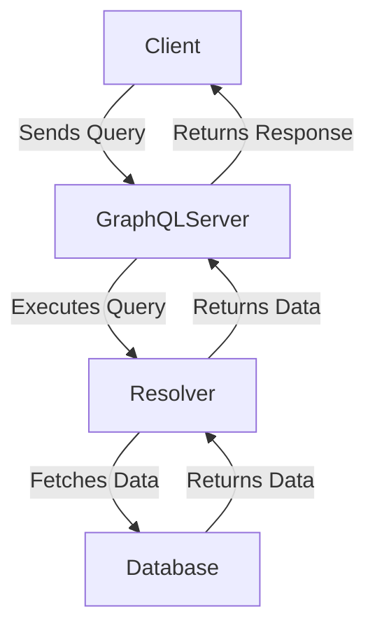

## 14.7 GraphQL Implementation in PHP

In this section, we will delve into the implementation of GraphQL in PHP, exploring its concepts, benefits, and practical examples. By the end of this guide, you will have a solid understanding of how to create flexible and efficient APIs using GraphQL in PHP.

### What is GraphQL?

GraphQL is a query language for APIs and a runtime for executing those queries by using a type system you define for your data. It was developed by Facebook in 2012 and released as an open-source project in 2015. Unlike REST, which exposes multiple endpoints for different resources, GraphQL exposes a single endpoint that allows clients to request exactly the data they need.

#### Key Concepts of GraphQL

- **Schema**: Defines the types and structure of data that can be queried.
- **Queries**: Allow clients to request specific data.
- **Mutations**: Enable clients to modify data.
- **Resolvers**: Functions that handle the fetching of data for each field in a query.
- **Types**: Define the shape of data, including scalars, objects, lists, and more.

### Benefits of Using GraphQL

- **Flexibility**: Clients can request exactly the data they need, reducing over-fetching and under-fetching.
- **Single Endpoint**: Simplifies API architecture by consolidating multiple endpoints into one.
- **Strongly Typed**: Ensures data consistency and validation through a defined schema.
- **Introspection**: Allows clients to query the schema for available types and operations.

### Implementing GraphQL in PHP

To implement GraphQL in PHP, we can use the `webonyx/graphql-php` library, which provides a reference implementation of GraphQL in PHP. This library allows us to define schemas, create resolvers, and handle queries and mutations.

#### Setting Up the Environment

Before we start, ensure you have PHP and Composer installed on your system. Then, create a new PHP project and install the `webonyx/graphql-php` library:

```bash
composer require webonyx/graphql-php
```

#### Creating a Simple GraphQL Server

Let's create a simple GraphQL server that handles queries for a list of books. We'll define a schema, create resolvers, and set up a server to handle requests.

##### Step 1: Define the Schema

Create a file named `schema.php` and define the schema for our GraphQL server:

```php
<?php

use GraphQL\Type\Definition\ObjectType;
use GraphQL\Type\Definition\Type;
use GraphQL\Type\Schema;

$bookType = new ObjectType([
    'name' => 'Book',
    'fields' => [
        'id' => Type::nonNull(Type::id()),
        'title' => Type::string(),
        'author' => Type::string(),
    ],
]);

$queryType = new ObjectType([
    'name' => 'Query',
    'fields' => [
        'books' => [
            'type' => Type::listOf($bookType),
            'resolve' => function() {
                return [
                    ['id' => 1, 'title' => '1984', 'author' => 'George Orwell'],
                    ['id' => 2, 'title' => 'Brave New World', 'author' => 'Aldous Huxley'],
                ];
            },
        ],
    ],
]);

$schema = new Schema([
    'query' => $queryType,
]);
```

##### Step 2: Set Up the Server

Create a file named `server.php` to handle incoming GraphQL requests:

```php
<?php

require 'vendor/autoload.php';
require 'schema.php';

use GraphQL\GraphQL;
use GraphQL\Error\FormattedError;

try {
    $rawInput = file_get_contents('php://input');
    $input = json_decode($rawInput, true);
    $query = $input['query'];
    $variableValues = isset($input['variables']) ? $input['variables'] : null;

    $result = GraphQL::executeQuery($schema, $query, null, null, $variableValues);
    $output = $result->toArray();
} catch (\Exception $e) {
    $output = [
        'errors' => [
            FormattedError::createFromException($e)
        ]
    ];
}

header('Content-Type: application/json');
echo json_encode($output);
```

##### Step 3: Test the Server

You can test your GraphQL server using a tool like GraphiQL, a graphical interactive in-browser GraphQL IDE. To set up GraphiQL, you can use a simple HTML file:

```html
<!DOCTYPE html>
<html>
<head>
    <title>GraphiQL</title>
    <link href="https://unpkg.com/graphiql/graphiql.min.css" rel="stylesheet" />
    <script src="https://unpkg.com/react/umd/react.production.min.js"></script>
    <script src="https://unpkg.com/react-dom/umd/react-dom.production.min.js"></script>
    <script src="https://unpkg.com/graphiql/graphiql.min.js"></script>
</head>
<body style="margin: 0;">
    <div id="graphiql" style="height: 100vh;"></div>
    <script>
        const graphQLFetcher = graphQLParams =>
            fetch('/server.php', {
                method: 'post',
                headers: { 'Content-Type': 'application/json' },
                body: JSON.stringify(graphQLParams),
            })
            .then(response => response.json())
            .catch(() => response.text());

        ReactDOM.render(
            React.createElement(GraphiQL, { fetcher: graphQLFetcher }),
            document.getElementById('graphiql'),
        );
    </script>
</body>
</html>
```

Open this HTML file in your browser and use GraphiQL to test queries like:

```graphql
{
  books {
    id
    title
    author
  }
}
```

### Advanced GraphQL Features

#### Mutations

Mutations in GraphQL are used to modify data. Let's add a mutation to add a new book to our list.

Update the `schema.php` file to include a mutation type:

```php
$mutationType = new ObjectType([
    'name' => 'Mutation',
    'fields' => [
        'addBook' => [
            'type' => $bookType,
            'args' => [
                'title' => Type::nonNull(Type::string()),
                'author' => Type::nonNull(Type::string()),
            ],
            'resolve' => function($root, $args) {
                $newBook = [
                    'id' => rand(3, 1000), // Generate a random ID for simplicity
                    'title' => $args['title'],
                    'author' => $args['author'],
                ];
                // Here you would typically save the new book to a database
                return $newBook;
            },
        ],
    ],
]);

$schema = new Schema([
    'query' => $queryType,
    'mutation' => $mutationType,
]);
```

Now, you can test the mutation using GraphiQL:

```graphql
mutation {
  addBook(title: "The Great Gatsby", author: "F. Scott Fitzgerald") {
    id
    title
    author
  }
}
```

#### Subscriptions

Subscriptions allow clients to receive real-time updates. Implementing subscriptions in PHP requires additional setup, often involving WebSockets. While `webonyx/graphql-php` does not natively support subscriptions, you can use libraries like Ratchet for WebSocket support.

### Visualizing GraphQL Architecture

To better understand the flow of data in a GraphQL server, let's visualize the architecture using a Mermaid.js diagram:



**Diagram Explanation:** This diagram illustrates the flow of a GraphQL query from the client to the server, where the query is executed by resolvers that fetch data from a database. The data is then returned to the client as a response.

### PHP Unique Features

PHP offers several unique features that can enhance your GraphQL implementation:

- **Dynamic Typing**: PHP's dynamic typing can simplify the handling of different data types in GraphQL.
- **Rich Ecosystem**: PHP's ecosystem includes numerous libraries and frameworks that can be integrated with GraphQL.
- **Ease of Use**: PHP's syntax and language features make it easy to implement GraphQL servers quickly.

### Differences and Similarities with REST

While both GraphQL and REST are used for API development, they have key differences:

- **Endpoints**: REST uses multiple endpoints, while GraphQL uses a single endpoint.
- **Data Fetching**: REST can lead to over-fetching or under-fetching, whereas GraphQL allows clients to specify exactly what data they need.
- **Versioning**: REST often requires versioning, while GraphQL can evolve without breaking changes.

### Design Considerations

When implementing GraphQL in PHP, consider the following:

- **Performance**: GraphQL can lead to complex queries that impact performance. Optimize resolvers and use caching strategies.
- **Security**: Validate and sanitize inputs to prevent injection attacks. Implement authentication and authorization.
- **Scalability**: Design your GraphQL server to handle increased load and scale horizontally if needed.

### Try It Yourself

Experiment with the provided code examples by:

- Adding more fields to the `Book` type.
- Implementing additional queries and mutations.
- Integrating a database to persist data.

### References and Links

- [webonyx/graphql-php](https://github.com/webonyx/graphql-php)
- [GraphQL Official Website](https://graphql.org/)
- [GraphiQL](https://github.com/graphql/graphiql)

### Knowledge Check

- What is the main advantage of using GraphQL over REST?
- How does GraphQL handle data fetching differently from REST?
- What are resolvers in GraphQL?

### Embrace the Journey

Remember, implementing GraphQL in PHP is just the beginning. As you progress, you'll build more complex and efficient APIs. Keep experimenting, stay curious, and enjoy the journey!

## Quiz: GraphQL Implementation in PHP



### What is the primary advantage of using GraphQL over REST?

- [x] Clients can request exactly the data they need
- [ ] It uses multiple endpoints for different resources
- [ ] It requires less setup than REST
- [ ] It is easier to implement than REST

> **Explanation:** GraphQL allows clients to request exactly the data they need, reducing over-fetching and under-fetching.

### Which library is commonly used for implementing GraphQL in PHP?

- [x] webonyx/graphql-php
- [ ] Laravel
- [ ] Symfony
- [ ] ReactPHP

> **Explanation:** The `webonyx/graphql-php` library is a popular choice for implementing GraphQL in PHP.

### What is a resolver in GraphQL?

- [x] A function that fetches data for a field in a query
- [ ] A type definition in the schema
- [ ] A query that modifies data
- [ ] A tool for testing GraphQL queries

> **Explanation:** Resolvers are functions that handle the fetching of data for each field in a query.

### How does GraphQL handle multiple endpoints?

- [x] It uses a single endpoint for all queries
- [ ] It requires a separate endpoint for each resource
- [ ] It uses multiple endpoints for different operations
- [ ] It does not support multiple endpoints

> **Explanation:** GraphQL uses a single endpoint for all queries, simplifying API architecture.

### What is the purpose of mutations in GraphQL?

- [x] To modify data
- [ ] To fetch data
- [ ] To define the schema
- [ ] To handle errors

> **Explanation:** Mutations in GraphQL are used to modify data.

### Which tool is commonly used for testing GraphQL queries?

- [x] GraphiQL
- [ ] Postman
- [ ] cURL
- [ ] Swagger

> **Explanation:** GraphiQL is a graphical interactive in-browser GraphQL IDE used for testing queries.

### What is the role of the schema in GraphQL?

- [x] It defines the types and structure of data that can be queried
- [ ] It handles the execution of queries
- [ ] It stores the data
- [ ] It manages authentication

> **Explanation:** The schema in GraphQL defines the types and structure of data that can be queried.

### How can you optimize performance in a GraphQL server?

- [x] Optimize resolvers and use caching strategies
- [ ] Use multiple endpoints
- [ ] Avoid using resolvers
- [ ] Use a single type for all data

> **Explanation:** Optimizing resolvers and using caching strategies can improve performance in a GraphQL server.

### What is introspection in GraphQL?

- [x] A feature that allows clients to query the schema for available types and operations
- [ ] A method for modifying data
- [ ] A way to handle errors
- [ ] A tool for testing queries

> **Explanation:** Introspection allows clients to query the schema for available types and operations.

### True or False: GraphQL requires versioning like REST.

- [ ] True
- [x] False

> **Explanation:** GraphQL can evolve without breaking changes, eliminating the need for versioning like REST.


