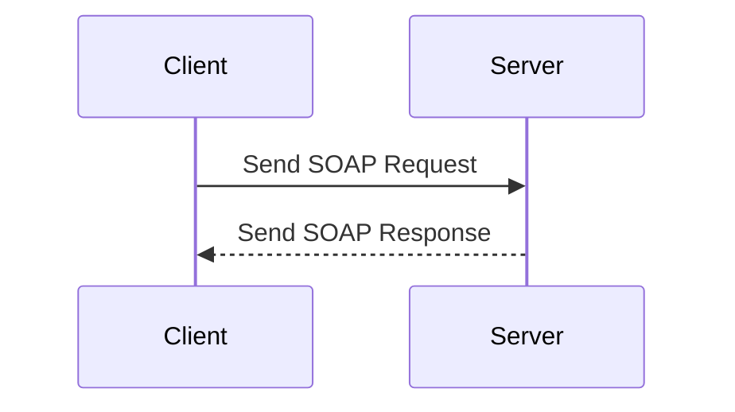

## 14.8 SOAP Web Services in PHP

In this section, we delve into the world of SOAP (Simple Object Access Protocol) Web Services in PHP. SOAP is a protocol that allows programs running on different operating systems to communicate with each other. It is particularly useful in scenarios where you need to integrate with legacy systems or when a more rigid and structured communication protocol is required. Let's explore how PHP can be used to both consume and create SOAP services.

### SOAP Protocol

SOAP is a protocol specification for exchanging structured information in the implementation of web services. It relies on XML as its message format and usually relies on other application layer protocols, most notably HTTP and SMTP, for message negotiation and transmission.

#### Key Features of SOAP

- **XML-Based**: SOAP messages are formatted in XML, which makes them platform-independent and language-agnostic.
- **Extensibility**: SOAP's use of XML allows for extensibility, meaning you can add additional features as needed.
- **Neutrality**: SOAP can operate over any protocol, such as HTTP, SMTP, TCP, or even JMS.
- **Independence**: SOAP is designed to be independent of the underlying operating system and programming language.

#### SOAP Message Structure

A SOAP message is an XML document that consists of the following elements:

1. **Envelope**: The root element that defines the XML document as a SOAP message.
2. **Header**: An optional element that contains application-specific information (like authentication, transaction management, etc.) about the SOAP message.
3. **Body**: A mandatory element that contains the actual SOAP message intended for the recipient.
4. **Fault**: An optional element that provides information about errors that occurred while processing the message.

Here's a basic structure of a SOAP message:

```xml
<soap:Envelope xmlns:soap="http://www.w3.org/2003/05/soap-envelope">
  <soap:Header>
    <!-- Optional header information -->
  </soap:Header>
  <soap:Body>
    <m:GetPrice xmlns:m="https://www.example.org/stock">
      <m:StockName>IBM</m:StockName>
    </m:GetPrice>
  </soap:Body>
</soap:Envelope>
```

### PHP's SOAP Extension

PHP provides a built-in SOAP extension that allows developers to create and consume SOAP web services. This extension is part of the PHP core, so you don't need to install any additional packages to use it.

#### Consuming SOAP Services

To consume a SOAP service in PHP, you typically use the `SoapClient` class. This class allows you to send requests to a SOAP server and receive responses.

##### Example: Consuming a SOAP Service

Let's consider a simple example where we consume a SOAP service to get the stock price of a company.

```php
<?php
// Create a new SoapClient instance
$client = new SoapClient("https://www.example.org/stock.wsdl");

// Call the SOAP method
$result = $client->GetPrice(['StockName' => 'IBM']);

// Print the result
echo "The stock price of IBM is: " . $result->Price;
?>
```

In this example, we create a new `SoapClient` instance by passing the WSDL (Web Services Description Language) URL. We then call the `GetPrice` method with the required parameters and print the result.

#### Creating SOAP Services

To create a SOAP service in PHP, you use the `SoapServer` class. This class allows you to expose PHP functions as SOAP web services.

##### Example: Creating a SOAP Service

Here's an example of how to create a simple SOAP service that returns the stock price of a company.

```php
<?php
// Define the function that will be exposed as a SOAP service
function GetPrice($params) {
    $stockName = $params->StockName;
    // Dummy data for demonstration
    $prices = [
        'IBM' => 145.30,
        'AAPL' => 273.50,
        'GOOG' => 1345.20
    ];
    return ['Price' => $prices[$stockName] ?? 0];
}

// Create a new SoapServer instance
$server = new SoapServer("https://www.example.org/stock.wsdl");

// Add the function to the SOAP server
$server->addFunction("GetPrice");

// Handle the SOAP request
$server->handle();
?>
```

In this example, we define a function `GetPrice` that takes a parameter and returns the stock price. We then create a `SoapServer` instance, add the function to the server, and handle incoming requests.

### Use Cases for SOAP in PHP

SOAP is particularly useful in scenarios where you need to integrate with legacy systems or when a more rigid and structured communication protocol is required. Here are some common use cases:

- **Enterprise Applications**: Many enterprise applications use SOAP for communication due to its robustness and security features.
- **Financial Services**: SOAP is often used in financial services for transactions and data exchange due to its support for WS-Security.
- **Telecommunications**: SOAP is used in telecommunications for operations like billing and customer management.

### Visualizing SOAP Communication

To better understand how SOAP communication works, let's visualize the process using a sequence diagram.



In this diagram, the client sends a SOAP request to the server, and the server responds with a SOAP response. This simple interaction forms the basis of SOAP communication.

### Design Considerations

When working with SOAP in PHP, there are several design considerations to keep in mind:

- **WSDL**: The WSDL file is crucial for defining the web service's interface. Ensure that it is well-defined and up-to-date.
- **Error Handling**: Implement robust error handling to manage SOAP faults and exceptions.
- **Security**: Use WS-Security for secure communication, especially when dealing with sensitive data.
- **Performance**: SOAP can be verbose due to its XML format. Consider using compression techniques to improve performance.

### PHP Unique Features

PHP's SOAP extension provides several unique features that make it easy to work with SOAP web services:

- **Automatic WSDL Parsing**: PHP can automatically parse WSDL files to generate the necessary SOAP client and server code.
- **Flexible Data Handling**: PHP's dynamic typing and associative arrays make it easy to handle complex SOAP data structures.
- **Built-in Error Handling**: PHP's SOAP extension provides built-in error handling mechanisms to manage SOAP faults.

### Differences and Similarities with REST

SOAP and REST are both web service communication protocols, but they have some key differences:

- **Protocol**: SOAP is a protocol, while REST is an architectural style.
- **Format**: SOAP uses XML, while REST can use XML, JSON, or other formats.
- **Statefulness**: SOAP is typically stateful, while REST is stateless.
- **Complexity**: SOAP is more complex due to its use of XML and additional standards like WS-Security.

### Try It Yourself

To get hands-on experience with SOAP web services in PHP, try modifying the code examples provided. For instance, you can:

- Add more functions to the SOAP server.
- Experiment with different SOAP methods and parameters.
- Implement error handling for SOAP faults.

### Knowledge Check

- What is the main advantage of using SOAP over REST?
- How does PHP's `SoapClient` class help in consuming SOAP services?
- What is the role of WSDL in SOAP web services?

### Embrace the Journey

Remember, working with SOAP web services in PHP is just one aspect of web development. As you continue to learn and grow, you'll encounter many other protocols and technologies. Keep experimenting, stay curious, and enjoy the journey!

### References and Links

- [PHP SOAP Extension](https://www.php.net/manual/en/book.soap.php)
- [W3C SOAP Specifications](https://www.w3.org/TR/soap/)
- [WS-Security](https://www.oasis-open.org/committees/tc_home.php?wg_abbrev=wss)

## Quiz: SOAP Web Services in PHP



### What is the primary format used by SOAP for message exchange?

- [x] XML
- [ ] JSON
- [ ] YAML
- [ ] CSV

> **Explanation:** SOAP uses XML as its message format, which makes it platform-independent and language-agnostic.

### Which PHP class is used to consume SOAP services?

- [x] SoapClient
- [ ] SoapServer
- [ ] SoapRequest
- [ ] SoapResponse

> **Explanation:** The `SoapClient` class in PHP is used to consume SOAP services by sending requests and receiving responses.

### What is the purpose of the WSDL file in SOAP?

- [x] To define the web service's interface
- [ ] To store SOAP messages
- [ ] To encrypt SOAP messages
- [ ] To log SOAP transactions

> **Explanation:** The WSDL (Web Services Description Language) file defines the web service's interface, including the methods and parameters.

### Which of the following is a key feature of SOAP?

- [x] Extensibility
- [ ] Statelessness
- [ ] JSON support
- [ ] Simplicity

> **Explanation:** SOAP's use of XML allows for extensibility, meaning additional features can be added as needed.

### How does PHP handle SOAP faults?

- [x] Through built-in error handling mechanisms
- [ ] By ignoring them
- [ ] By converting them to JSON
- [ ] By logging them to a file

> **Explanation:** PHP's SOAP extension provides built-in error handling mechanisms to manage SOAP faults.

### What is a common use case for SOAP in PHP?

- [x] Integrating with legacy systems
- [ ] Building simple web pages
- [ ] Creating static websites
- [ ] Designing RESTful APIs

> **Explanation:** SOAP is often used for integrating with legacy systems due to its robustness and support for complex operations.

### Which protocol is SOAP independent of?

- [x] HTTP
- [ ] SMTP
- [ ] TCP
- [ ] All of the above

> **Explanation:** SOAP is designed to be independent of the underlying protocol, meaning it can operate over HTTP, SMTP, TCP, etc.

### What is the role of the `SoapServer` class in PHP?

- [x] To create SOAP services
- [ ] To consume SOAP services
- [ ] To log SOAP messages
- [ ] To encrypt SOAP messages

> **Explanation:** The `SoapServer` class in PHP is used to create SOAP services by exposing PHP functions as web services.

### What is a SOAP Fault?

- [x] An error that occurs during SOAP message processing
- [ ] A successful SOAP response
- [ ] A type of SOAP header
- [ ] A SOAP message format

> **Explanation:** A SOAP Fault is an error that occurs during the processing of a SOAP message, providing information about what went wrong.

### True or False: SOAP is typically stateless.

- [ ] True
- [x] False

> **Explanation:** SOAP is typically stateful, meaning it maintains state information between requests and responses.


