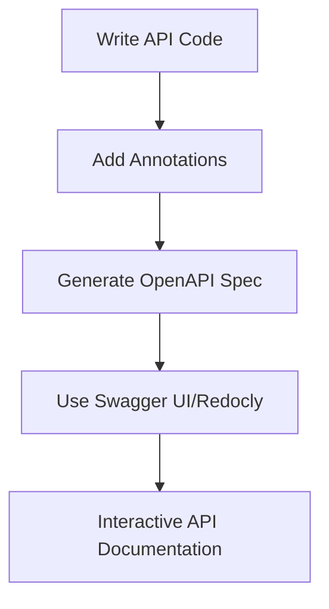

## 14.9 API Documentation and Swagger/OpenAPI

In the realm of software development, APIs (Application Programming Interfaces) serve as the backbone for enabling communication between different software systems. As APIs become more prevalent, the need for clear and comprehensive documentation becomes paramount. This section delves into the importance of API documentation, the role of the OpenAPI Specification, and tools like Swagger UI and Redocly in PHP development. We will also explore how to automate documentation generation to enhance API usability and adoption.

### Importance of API Documentation

API documentation is crucial for several reasons:

- **Facilitates API Adoption and Usability:** Well-documented APIs are easier for developers to understand and integrate into their applications. This reduces the learning curve and accelerates the adoption process.
- **Improves Developer Experience:** Comprehensive documentation provides developers with the necessary information to effectively use the API, including endpoints, request/response formats, authentication methods, and error handling.
- **Enhances Maintenance and Support:** Clear documentation helps in maintaining the API over time and provides a reference for troubleshooting and support.
- **Promotes Consistency and Standardization:** Documentation ensures that all stakeholders have a consistent understanding of the API's functionality and behavior.

### OpenAPI Specification

The OpenAPI Specification (OAS) is a standard for describing RESTful APIs. It provides a language-agnostic interface for defining the structure of an API, including its endpoints, request/response formats, and authentication methods. The specification is widely adopted and supported by numerous tools and frameworks.

#### Key Features of OpenAPI Specification

- **Standardized Format:** OpenAPI uses a standardized format (JSON or YAML) to describe APIs, making it easy to share and understand.
- **Comprehensive Descriptions:** It allows for detailed descriptions of API operations, parameters, request/response bodies, and error codes.
- **Tooling Support:** OpenAPI is supported by a wide range of tools for generating documentation, client SDKs, and server stubs.
- **Versioning and Extensibility:** The specification supports versioning and can be extended with custom properties to meet specific needs.

#### Example OpenAPI Specification

Below is a simple example of an OpenAPI specification in YAML format for a hypothetical API:

```yaml
openapi: 3.0.0
info:
  title: Sample API
  description: A sample API to demonstrate OpenAPI specification
  version: 1.0.0
servers:
  - url: https://api.example.com/v1
paths:
  /users:
    get:
      summary: Retrieve a list of users
      responses:
        '200':
          description: A list of users
          content:
            application/json:
              schema:
                type: array
                items:
                  type: object
                  properties:
                    id:
                      type: integer
                    name:
                      type: string
```

### Tools for API Documentation

Several tools leverage the OpenAPI Specification to generate interactive and user-friendly API documentation. Two of the most popular tools are Swagger UI and Redocly.

#### Swagger UI

Swagger UI is an open-source tool that automatically generates interactive API documentation from an OpenAPI Specification. It provides a web-based interface where developers can explore API endpoints, view request/response formats, and even test API calls directly from the documentation.

- **Interactive Interface:** Swagger UI allows developers to interact with the API directly from the documentation, making it easier to understand and test.
- **Customization:** The tool can be customized to match the branding and style of your organization.
- **Easy Integration:** Swagger UI can be easily integrated into existing web applications or hosted as a standalone service.

#### Redocly

Redocly is another tool for generating API documentation from OpenAPI specifications. It offers a clean and modern interface with advanced features for customization and interactivity.

- **Responsive Design:** Redocly provides a responsive design that works well on both desktop and mobile devices.
- **Advanced Customization:** It offers extensive customization options, including theming and layout adjustments.
- **SEO Optimization:** Redocly is optimized for search engines, making it easier for developers to find and access the documentation.

### Automating Documentation Generation

Automating the generation of API documentation can save time and ensure consistency. By using code annotations and tools like Swagger UI and Redocly, developers can automatically generate up-to-date documentation as the API evolves.

#### Using Code Annotations

Code annotations are comments or metadata added to the source code to describe the behavior and structure of the API. These annotations can be used to generate documentation automatically.

- **PHP Annotations:** In PHP, annotations can be added using docblocks, which are comments that start with `/**` and end with `*/`. These annotations can describe endpoints, parameters, and response formats.
- **Integration with Tools:** Tools like Swagger-PHP can parse these annotations and generate an OpenAPI specification, which can then be used to create documentation.

#### Example of Code Annotations in PHP

```php
/**
 * @OA\Get(
 *     path="/users",
 *     summary="Retrieve a list of users",
 *     @OA\Response(
 *         response=200,
 *         description="A list of users",
 *         @OA\JsonContent(
 *             type="array",
 *             @OA\Items(
 *                 type="object",
 *                 @OA\Property(property="id", type="integer"),
 *                 @OA\Property(property="name", type="string")
 *             )
 *         )
 *     )
 * )
 */
function getUsers() {
    // Implementation of the API endpoint
}
```

### Visualizing API Documentation Workflow

To better understand the workflow of generating API documentation using OpenAPI and tools like Swagger UI, let's visualize the process:



**Description:** This diagram illustrates the workflow of generating API documentation. It starts with writing the API code and adding annotations. These annotations are used to generate an OpenAPI specification, which is then utilized by tools like Swagger UI or Redocly to create interactive API documentation.

### Best Practices for API Documentation

- **Keep Documentation Up-to-Date:** Regularly update the documentation to reflect changes in the API.
- **Provide Examples:** Include examples of requests and responses to help developers understand how to use the API.
- **Use Clear and Concise Language:** Avoid jargon and use simple language to describe API operations.
- **Organize Documentation Logically:** Structure the documentation in a way that is easy to navigate and understand.
- **Include Error Handling Information:** Document common errors and how to handle them.

### Knowledge Check

To reinforce your understanding of API documentation and the OpenAPI Specification, consider the following questions:

1. What is the primary purpose of API documentation?
2. How does the OpenAPI Specification help in standardizing API descriptions?
3. What are the benefits of using tools like Swagger UI and Redocly?
4. How can code annotations be used to automate documentation generation?
5. What are some best practices for maintaining API documentation?

### Embrace the Journey

Remember, mastering API documentation is an ongoing journey. As you continue to develop and document APIs, you'll gain valuable insights and skills that will enhance your development process. Keep experimenting with different tools and techniques, stay curious, and enjoy the journey!

## Quiz: API Documentation and Swagger/OpenAPI



### What is the primary purpose of API documentation?

- [x] To facilitate API adoption and usability
- [ ] To increase the complexity of the API
- [ ] To restrict access to the API
- [ ] To reduce the number of API users

> **Explanation:** API documentation is primarily meant to facilitate API adoption and usability by providing clear and comprehensive information about the API's functionality.

### Which specification is widely used for describing RESTful APIs?

- [x] OpenAPI Specification
- [ ] XML Schema Definition
- [ ] JSON Schema
- [ ] WSDL

> **Explanation:** The OpenAPI Specification is a widely used standard for describing RESTful APIs.

### What tool provides an interactive interface for exploring API endpoints?

- [x] Swagger UI
- [ ] Postman
- [ ] GitHub
- [ ] Jenkins

> **Explanation:** Swagger UI provides an interactive interface for exploring API endpoints and testing API calls directly from the documentation.

### What format does the OpenAPI Specification use to describe APIs?

- [x] JSON or YAML
- [ ] XML
- [ ] HTML
- [ ] CSV

> **Explanation:** The OpenAPI Specification uses JSON or YAML format to describe APIs.

### How can code annotations be used in PHP?

- [x] To generate OpenAPI specifications
- [ ] To execute PHP scripts
- [ ] To compile PHP code
- [ ] To encrypt PHP files

> **Explanation:** In PHP, code annotations can be used to generate OpenAPI specifications, which can then be used to create API documentation.

### What is a key benefit of using Redocly for API documentation?

- [x] Responsive design and advanced customization
- [ ] Limited support for OpenAPI
- [ ] Requires manual updates
- [ ] Only works with XML

> **Explanation:** Redocly offers a responsive design and advanced customization options for API documentation.

### What should be included in API documentation to help developers understand usage?

- [x] Examples of requests and responses
- [ ] Only error codes
- [ ] Source code of the API
- [ ] Marketing materials

> **Explanation:** Including examples of requests and responses in API documentation helps developers understand how to use the API.

### What is a best practice for maintaining API documentation?

- [x] Keep documentation up-to-date
- [ ] Use complex language
- [ ] Exclude error handling information
- [ ] Limit access to documentation

> **Explanation:** Keeping documentation up-to-date is a best practice for maintaining API documentation.

### What is the role of the OpenAPI Specification in API documentation?

- [x] To provide a standardized format for describing APIs
- [ ] To execute API calls
- [ ] To encrypt API data
- [ ] To compile API code

> **Explanation:** The OpenAPI Specification provides a standardized format for describing APIs, making it easier to share and understand.

### True or False: Swagger UI can be customized to match an organization's branding.

- [x] True
- [ ] False

> **Explanation:** Swagger UI can be customized to match an organization's branding and style.


