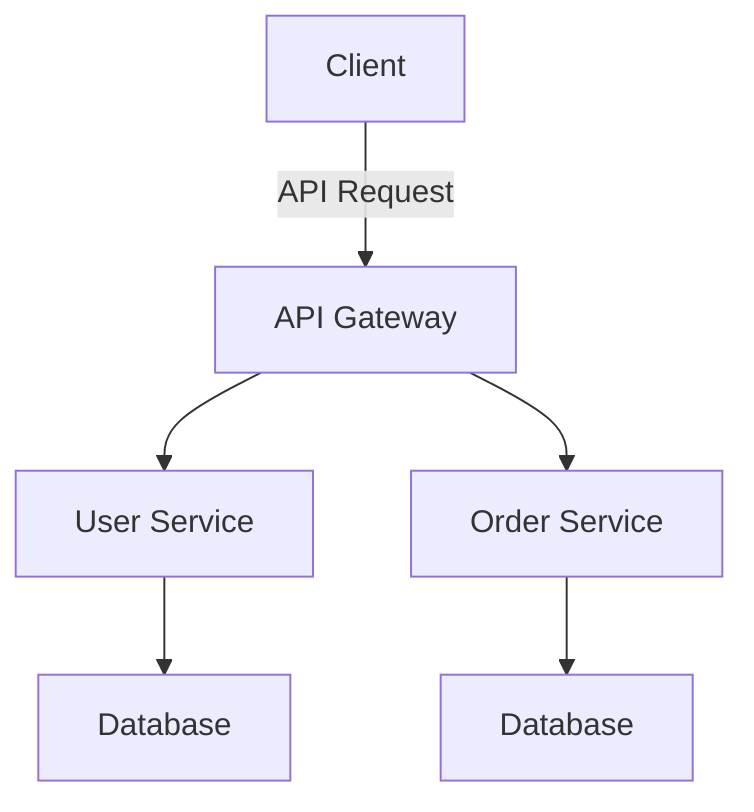

## 15.1 Introduction to Microservices in PHP

Microservices architecture has become a popular approach for building scalable and flexible applications. In this section, we will explore the fundamentals of microservices in PHP, including their advantages, challenges, and the design patterns that can help you effectively implement them.

### Understanding Microservices Architecture

Microservices architecture is an approach to software development where applications are structured as a collection of loosely coupled, independently deployable services. Each service is responsible for a specific business capability and can be developed, deployed, and scaled independently.

#### Key Characteristics of Microservices

- **Decentralization**: Microservices promote decentralized governance and data management, allowing teams to choose the best tools and technologies for their specific service.
- **Independence**: Each microservice can be developed, deployed, and scaled independently, enabling faster development cycles and more flexible scaling strategies.
- **Resilience**: By isolating failures to individual services, microservices can improve the overall resilience of an application.
- **Technology Diversity**: Teams can use different technologies and programming languages for different services, allowing them to choose the best tool for each job.

#### Microservices vs. Monolithic Architecture

In contrast to microservices, a monolithic architecture is a traditional approach where an application is built as a single, unified unit. While monolithic architectures can be simpler to develop and deploy initially, they often become difficult to scale and maintain as the application grows.

### Advantages of Microservices

Microservices offer several advantages over traditional monolithic architectures:

- **Scalability**: Microservices can be scaled independently, allowing you to allocate resources to the parts of your application that need them most.
- **Flexibility**: With microservices, you can update and deploy individual services without affecting the entire application, enabling faster release cycles.
- **Resilience**: By isolating failures to individual services, microservices can improve the overall resilience of an application.
- **Improved Development Speed**: Teams can work on different services simultaneously, reducing development time and increasing productivity.

### Challenges of Microservices

Despite their advantages, microservices also present several challenges:

- **Complexity**: Managing multiple services can be complex, requiring robust communication, monitoring, and orchestration strategies.
- **Data Consistency**: Ensuring data consistency across services can be challenging, especially in distributed systems.
- **Communication Overhead**: Microservices require efficient communication mechanisms, such as RESTful APIs or message queues, to coordinate between services.
- **Deployment and Monitoring**: Deploying and monitoring multiple services can be more complex than managing a single monolithic application.

### Implementing Microservices in PHP

PHP, traditionally known for building monolithic web applications, has evolved to support microservices architecture. With modern PHP features and frameworks, developers can build robust microservices applications.

#### PHP Frameworks for Microservices

Several PHP frameworks and libraries can facilitate the development of microservices:

- **Laravel**: Known for its elegant syntax and powerful features, Laravel can be used to build microservices with its support for RESTful APIs, queues, and event broadcasting.
- **Symfony**: With its modular architecture and extensive components, Symfony is well-suited for building microservices.
- **Lumen**: A lightweight micro-framework by Laravel, Lumen is designed for building fast microservices and APIs.

#### Key PHP Features for Microservices

Modern PHP versions (PHP 7 and beyond) offer several features that are beneficial for microservices development:

- **Namespaces and Autoloading**: Organize code and manage dependencies efficiently.
- **Composer**: Manage dependencies and packages easily.
- **PSR Standards**: Follow coding standards and best practices for interoperability.
- **Asynchronous Processing**: Use libraries like ReactPHP for non-blocking I/O operations.

### Microservices Design Patterns

Design patterns are essential for building robust and maintainable microservices. Here are some common design patterns used in microservices architecture:

#### 1. API Gateway Pattern

The API Gateway acts as a single entry point for all client requests, routing them to the appropriate microservices. It can handle cross-cutting concerns such as authentication, logging, and rate limiting.

```php
// Example of a simple API Gateway using PHP
class ApiGateway {
    public function handleRequest($request) {
        // Route request to the appropriate microservice
        switch ($request->getService()) {
            case 'user':
                return $this->forwardToUserService($request);
            case 'order':
                return $this->forwardToOrderService($request);
            default:
                throw new Exception('Service not found');
        }
    }

    private function forwardToUserService($request) {
        // Forward request to User Service
    }

    private function forwardToOrderService($request) {
        // Forward request to Order Service
    }
}
```

#### 2. Circuit Breaker Pattern

The Circuit Breaker pattern prevents a service from repeatedly trying to execute an operation that is likely to fail, allowing the system to recover gracefully.

```php
// Example of a Circuit Breaker implementation in PHP
class CircuitBreaker {
    private $failureCount = 0;
    private $threshold = 5;
    private $timeout = 60; // seconds
    private $lastFailureTime;

    public function call($operation) {
        if ($this->isOpen()) {
            throw new Exception('Circuit is open');
        }

        try {
            $result = $operation();
            $this->reset();
            return $result;
        } catch (Exception $e) {
            $this->recordFailure();
            throw $e;
        }
    }

    private function isOpen() {
        return $this->failureCount >= $this->threshold &&
               (time() - $this->lastFailureTime) < $this->timeout;
    }

    private function recordFailure() {
        $this->failureCount++;
        $this->lastFailureTime = time();
    }

    private function reset() {
        $this->failureCount = 0;
    }
}
```

#### 3. Service Discovery Pattern

Service Discovery allows microservices to dynamically discover and communicate with each other, often using a registry to keep track of available services.

```php
// Example of a simple Service Discovery implementation in PHP
class ServiceRegistry {
    private $services = [];

    public function register($serviceName, $serviceUrl) {
        $this->services[$serviceName] = $serviceUrl;
    }

    public function getServiceUrl($serviceName) {
        if (!isset($this->services[$serviceName])) {
            throw new Exception('Service not found');
        }
        return $this->services[$serviceName];
    }
}
```

### Visualizing Microservices Architecture

To better understand how microservices architecture works, let's visualize a typical setup using a Mermaid.js diagram.



**Figure 1**: A typical microservices architecture with an API Gateway routing requests to different services.

### Best Practices for Microservices in PHP

- **Design for Failure**: Implement patterns like Circuit Breaker and Retry to handle failures gracefully.
- **Automate Testing and Deployment**: Use CI/CD pipelines to automate testing and deployment processes.
- **Monitor and Log**: Implement robust monitoring and logging to track service health and performance.
- **Secure Communication**: Use HTTPS and secure tokens for communication between services.

### Try It Yourself

To get hands-on experience with microservices in PHP, try building a simple application with multiple services. Start with a basic API Gateway and a couple of services, then gradually add more complexity by implementing patterns like Circuit Breaker and Service Discovery.

### Knowledge Check

- What are the key characteristics of microservices architecture?
- How does microservices architecture differ from monolithic architecture?
- What are the advantages and challenges of microservices?
- How can PHP frameworks like Laravel and Symfony be used for microservices development?
- What are some common design patterns used in microservices architecture?

### Embrace the Journey

Remember, transitioning to microservices is a journey. Start small, experiment, and gradually adopt more complex patterns and practices. Stay curious, keep learning, and enjoy the process of building scalable and flexible applications with PHP.

## Quiz: Introduction to Microservices in PHP



### What is a key characteristic of microservices architecture?

- [x] Decentralization
- [ ] Centralized data management
- [ ] Single deployment unit
- [ ] Monolithic structure

> **Explanation:** Microservices architecture promotes decentralized governance and data management, allowing teams to choose the best tools and technologies for their specific service.

### What is an advantage of microservices over monolithic architecture?

- [x] Scalability
- [ ] Simplicity
- [ ] Single codebase
- [ ] Unified deployment

> **Explanation:** Microservices can be scaled independently, allowing you to allocate resources to the parts of your application that need them most.

### Which PHP framework is known for its elegant syntax and powerful features, suitable for microservices?

- [x] Laravel
- [ ] CodeIgniter
- [ ] Zend Framework
- [ ] CakePHP

> **Explanation:** Laravel is known for its elegant syntax and powerful features, making it suitable for building microservices with support for RESTful APIs, queues, and event broadcasting.

### What is the role of an API Gateway in microservices architecture?

- [x] Acts as a single entry point for client requests
- [ ] Stores data for all services
- [ ] Manages user authentication
- [ ] Handles database queries

> **Explanation:** The API Gateway acts as a single entry point for all client requests, routing them to the appropriate microservices and handling cross-cutting concerns such as authentication, logging, and rate limiting.

### What is the purpose of the Circuit Breaker pattern?

- [x] Prevents a service from repeatedly trying to execute an operation that is likely to fail
- [ ] Manages service discovery
- [ ] Handles database transactions
- [ ] Optimizes API requests

> **Explanation:** The Circuit Breaker pattern prevents a service from repeatedly trying to execute an operation that is likely to fail, allowing the system to recover gracefully.

### Which PHP feature is beneficial for organizing code and managing dependencies in microservices?

- [x] Namespaces and Autoloading
- [ ] Global variables
- [ ] Inline functions
- [ ] Static methods

> **Explanation:** Namespaces and Autoloading in PHP help organize code and manage dependencies efficiently, which is beneficial for microservices development.

### What is a challenge of microservices architecture?

- [x] Complexity in communication
- [ ] Unified codebase
- [ ] Simplified deployment
- [ ] Centralized data management

> **Explanation:** Managing multiple services can be complex, requiring robust communication, monitoring, and orchestration strategies.

### Which design pattern allows microservices to dynamically discover and communicate with each other?

- [x] Service Discovery Pattern
- [ ] Singleton Pattern
- [ ] Factory Pattern
- [ ] Observer Pattern

> **Explanation:** Service Discovery allows microservices to dynamically discover and communicate with each other, often using a registry to keep track of available services.

### What is a best practice for microservices in PHP?

- [x] Design for Failure
- [ ] Use global variables
- [ ] Avoid testing
- [ ] Centralize all services

> **Explanation:** Designing for failure by implementing patterns like Circuit Breaker and Retry helps handle failures gracefully in microservices architecture.

### True or False: Microservices architecture allows for technology diversity, enabling teams to use different technologies for different services.

- [x] True
- [ ] False

> **Explanation:** Microservices architecture allows for technology diversity, enabling teams to use different technologies and programming languages for different services, allowing them to choose the best tool for each job.


