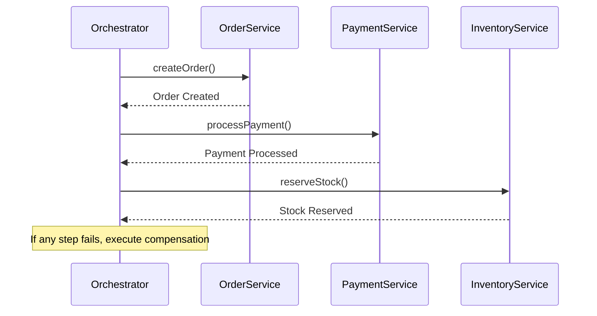

## 15.10 Handling Transactions Across Microservices

In the world of microservices, handling transactions becomes a complex task due to the distributed nature of the architecture. Unlike monolithic applications where transactions are often managed within a single database, microservices involve multiple services, each potentially with its own database. This section will delve into the challenges of distributed transactions, explore the Saga pattern as a solution, and discuss various consistency models to ensure data integrity across services.

### Distributed Transactions Challenges

Distributed transactions in microservices present unique challenges, primarily due to the need to maintain ACID (Atomicity, Consistency, Isolation, Durability) properties across multiple services. Let's explore these challenges in detail:

- **Atomicity**: Ensuring that a series of operations across different services are completed successfully or none at all is difficult. If one service fails, rolling back changes across all services is non-trivial.
- **Consistency**: Maintaining a consistent state across distributed services is challenging, especially when each service might have its own database and consistency requirements.
- **Isolation**: Ensuring that transactions are isolated from each other to prevent concurrent transactions from interfering is complex in a distributed setup.
- **Durability**: Guaranteeing that once a transaction is committed, it remains so, even in the event of a system failure, requires robust mechanisms across services.

### The Saga Pattern

The Saga pattern is a design pattern that addresses the challenges of managing long-lived transactions in a distributed system. It breaks down a transaction into a series of smaller, independent transactions that are coordinated to achieve a final outcome. Each step in a Saga is a local transaction that updates the database and publishes an event or message.

#### Key Concepts of the Saga Pattern

- **Local Transactions**: Each service performs its own transaction independently.
- **Compensating Transactions**: If a step fails, compensating transactions are executed to undo the changes made by previous steps.
- **Coordination**: Sagas can be coordinated using two main approaches: choreography and orchestration.

#### Choreography vs. Orchestration

- **Choreography**: In this approach, each service listens for events and decides when to act and what to do next. It is a decentralized approach where services communicate through events.
  
  **Advantages**:
  - Reduces coupling between services.
  - Easier to scale as each service manages its own state.

  **Disadvantages**:
  - Can become complex with many services and events.
  - Harder to track the overall progress of a transaction.

- **Orchestration**: This approach uses a central controller to manage the Saga. The orchestrator tells each service what to do and tracks the progress of the transaction.
  
  **Advantages**:
  - Easier to manage and track the flow of the transaction.
  - Centralized error handling and compensation logic.

  **Disadvantages**:
  - Introduces a single point of failure.
  - Can lead to tighter coupling between services.

#### Implementing the Saga Pattern in PHP

Let's look at a simple example of implementing the Saga pattern in PHP using orchestration. We'll simulate a transaction involving three services: Order Service, Payment Service, and Inventory Service.

```php
<?php

class SagaOrchestrator {
    public function executeSaga() {
        try {
            $this->orderService->createOrder();
            $this->paymentService->processPayment();
            $this->inventoryService->reserveStock();
        } catch (Exception $e) {
            $this->compensate();
        }
    }

    private function compensate() {
        $this->inventoryService->releaseStock();
        $this->paymentService->refundPayment();
        $this->orderService->cancelOrder();
    }
}

class OrderService {
    public function createOrder() {
        // Logic to create an order
        echo "Order created.\n";
    }

    public function cancelOrder() {
        // Logic to cancel an order
        echo "Order canceled.\n";
    }
}

class PaymentService {
    public function processPayment() {
        // Logic to process payment
        echo "Payment processed.\n";
    }

    public function refundPayment() {
        // Logic to refund payment
        echo "Payment refunded.\n";
    }
}

class InventoryService {
    public function reserveStock() {
        // Logic to reserve stock
        echo "Stock reserved.\n";
    }

    public function releaseStock() {
        // Logic to release stock
        echo "Stock released.\n";
    }
}

// Usage
$sagaOrchestrator = new SagaOrchestrator();
$sagaOrchestrator->executeSaga();
```

In this example, the `SagaOrchestrator` class coordinates the transaction by calling methods on the `OrderService`, `PaymentService`, and `InventoryService`. If any step fails, the `compensate` method is called to undo the changes.

### Consistency Models

In distributed systems, achieving strong consistency can be challenging. Instead, many systems opt for eventual consistency, where the system guarantees that, given enough time, all nodes will converge to the same state.

#### Eventual Consistency

- **Definition**: Eventual consistency is a consistency model used in distributed systems to achieve high availability. It ensures that, eventually, all updates will propagate to all nodes, and all nodes will have the same data.
- **Use Cases**: Suitable for applications where immediate consistency is not critical, such as social media feeds or shopping carts.

#### Strong Consistency

- **Definition**: Strong consistency ensures that all nodes see the same data at the same time. Any read operation will return the most recent write.
- **Use Cases**: Required for applications where data accuracy is critical, such as financial transactions or inventory management.

#### Implementing Consistency in PHP

To implement eventual consistency in PHP, you can use message queues to propagate changes across services. Here's a simple example using RabbitMQ:

```php
<?php

use PhpAmqpLib\Connection\AMQPStreamConnection;
use PhpAmqpLib\Message\AMQPMessage;

class EventPublisher {
    private $connection;
    private $channel;

    public function __construct() {
        $this->connection = new AMQPStreamConnection('localhost', 5672, 'guest', 'guest');
        $this->channel = $this->connection->channel();
        $this->channel->queue_declare('event_queue', false, false, false, false);
    }

    public function publishEvent($event) {
        $msg = new AMQPMessage($event);
        $this->channel->basic_publish($msg, '', 'event_queue');
        echo " [x] Sent '$event'\n";
    }

    public function __destruct() {
        $this->channel->close();
        $this->connection->close();
    }
}

// Usage
$eventPublisher = new EventPublisher();
$eventPublisher->publishEvent('OrderCreated');
```

In this example, the `EventPublisher` class publishes events to a RabbitMQ queue. Other services can listen to this queue and update their state accordingly, achieving eventual consistency.

### Techniques for Handling Transactions

Handling transactions across microservices requires careful consideration of various techniques and patterns. Here are some additional techniques to consider:

- **Two-Phase Commit (2PC)**: A protocol that ensures all participants in a transaction agree to commit or rollback the transaction. While it provides strong consistency, it can be complex and slow in distributed systems.
- **Event Sourcing**: Captures all changes to an application state as a sequence of events. This allows for reconstructing the state by replaying events, providing a clear audit trail and supporting eventual consistency.
- **CQRS (Command Query Responsibility Segregation)**: Separates the read and write operations in a system, allowing for different models and databases for each. This can improve performance and scalability.

### Visualizing Transaction Coordination

To better understand the coordination of transactions across microservices, let's visualize the process using a sequence diagram.



This diagram illustrates the orchestration approach, where the orchestrator coordinates the transaction by calling each service in sequence. If any step fails, compensating actions are executed to maintain consistency.

### PHP Unique Features

PHP offers several unique features that can be leveraged when implementing transaction handling across microservices:

- **Composer**: PHP's dependency manager can be used to manage libraries and packages that facilitate communication and coordination between microservices.
- **PSR Standards**: Adhering to PHP-FIG's PSR standards ensures consistent coding practices and interoperability between different PHP components.
- **PHP Extensions**: Extensions like `php-amqplib` for RabbitMQ or `guzzlehttp/guzzle` for HTTP communication can be used to implement messaging and service communication.

### Differences and Similarities

When working with distributed transactions, it's important to understand the differences and similarities between various patterns and techniques:

- **Saga vs. 2PC**: The Saga pattern is more suitable for long-lived transactions and eventual consistency, while 2PC provides strong consistency but can be slower and more complex.
- **Event Sourcing vs. CQRS**: Event sourcing focuses on capturing changes as events, while CQRS separates read and write operations. Both can be used together to achieve scalability and consistency.

### Design Considerations

When implementing transaction handling across microservices, consider the following:

- **Latency**: Distributed transactions can introduce latency. Optimize communication and processing to minimize delays.
- **Failure Handling**: Implement robust error handling and compensation logic to handle failures gracefully.
- **Scalability**: Design your system to scale horizontally by distributing load across services and using asynchronous communication.

### Try It Yourself

Experiment with the code examples provided in this section. Try modifying the Saga pattern implementation to add additional services or change the order of operations. Explore different consistency models by implementing eventual consistency using message queues or strong consistency using a two-phase commit protocol.

### Knowledge Check

- What are the key challenges of handling distributed transactions in microservices?
- How does the Saga pattern help manage long-lived transactions?
- What are the differences between choreography and orchestration in the Saga pattern?
- How can eventual consistency be achieved in a distributed system?
- What are the advantages and disadvantages of using the two-phase commit protocol?

### Embrace the Journey

Handling transactions across microservices is a complex but rewarding challenge. By understanding the patterns and techniques available, you can design robust and scalable systems that maintain data integrity across services. Remember, this is just the beginning. As you continue to explore and experiment, you'll gain deeper insights into the world of microservices and distributed systems. Keep learning, stay curious, and enjoy the journey!

## Quiz: Handling Transactions Across Microservices



### What is a key challenge of distributed transactions in microservices?

- [x] Maintaining ACID properties across services
- [ ] Ensuring high availability
- [ ] Implementing RESTful APIs
- [ ] Using a single database

> **Explanation:** Distributed transactions must maintain ACID properties across multiple services, which is challenging due to the distributed nature of microservices.

### What is the primary purpose of the Saga pattern?

- [x] Managing long-lived transactions with compensating actions
- [ ] Ensuring strong consistency
- [ ] Reducing latency
- [ ] Implementing RESTful APIs

> **Explanation:** The Saga pattern manages long-lived transactions by breaking them into smaller, independent transactions with compensating actions for failure handling.

### Which approach in the Saga pattern uses a central controller?

- [x] Orchestration
- [ ] Choreography
- [ ] Event Sourcing
- [ ] CQRS

> **Explanation:** Orchestration uses a central controller to manage the flow of the transaction, coordinating between services.

### What is eventual consistency?

- [x] A model where all nodes will eventually have the same data
- [ ] A model where all nodes have the same data immediately
- [ ] A model that ensures strong consistency
- [ ] A model that reduces latency

> **Explanation:** Eventual consistency is a model where, given enough time, all nodes will converge to the same state, ensuring data consistency eventually.

### Which technique separates read and write operations in a system?

- [x] CQRS
- [ ] Saga
- [ ] Two-Phase Commit
- [ ] Event Sourcing

> **Explanation:** CQRS (Command Query Responsibility Segregation) separates read and write operations, allowing for different models and databases for each.

### What is a disadvantage of the choreography approach in the Saga pattern?

- [x] Complexity with many services and events
- [ ] Single point of failure
- [ ] Tighter coupling between services
- [ ] Centralized error handling

> **Explanation:** Choreography can become complex with many services and events, making it harder to track the overall progress of a transaction.

### What is a benefit of using orchestration in the Saga pattern?

- [x] Easier to manage and track the flow of the transaction
- [ ] Reduces coupling between services
- [ ] Easier to scale
- [ ] Decentralized error handling

> **Explanation:** Orchestration provides a centralized approach, making it easier to manage and track the flow of the transaction.

### What is a key feature of PHP that can be leveraged in microservices?

- [x] Composer for dependency management
- [ ] Strong typing
- [ ] Built-in support for distributed transactions
- [ ] Automatic scaling

> **Explanation:** Composer is PHP's dependency manager, which can be used to manage libraries and packages that facilitate communication and coordination between microservices.

### Which pattern captures all changes to an application state as a sequence of events?

- [x] Event Sourcing
- [ ] Saga
- [ ] CQRS
- [ ] Two-Phase Commit

> **Explanation:** Event Sourcing captures all changes to an application state as a sequence of events, allowing for reconstructing the state by replaying events.

### True or False: Strong consistency ensures that all nodes see the same data at the same time.

- [x] True
- [ ] False

> **Explanation:** Strong consistency ensures that all nodes see the same data at the same time, providing immediate consistency across the system.


