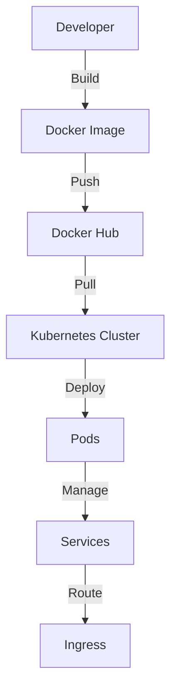

## 15.11 Containerization with Docker and Kubernetes

In the modern software development landscape, containerization has become a cornerstone for deploying and managing applications efficiently. Docker and Kubernetes are two pivotal technologies that have revolutionized how we build, ship, and run applications. In this section, we'll delve into the essentials of containerization with Docker and Kubernetes, specifically tailored for PHP applications.

### Docker Basics

Docker is a platform designed to simplify the process of building, deploying, and running applications by using containers. Containers allow developers to package an application with all its dependencies into a standardized unit for software development. This ensures that the application runs seamlessly in any environment, from a developer's laptop to a production server.

#### Key Concepts of Docker

- **Images**: A Docker image is a lightweight, standalone, executable package that includes everything needed to run a piece of software, including the code, runtime, libraries, and environment variables.
- **Containers**: A container is a runtime instance of a Docker image. It is a lightweight and portable encapsulation of an environment in which to run applications.
- **Dockerfile**: A text document that contains all the commands to assemble an image. It allows you to automate the image creation process.
- **Docker Hub**: A cloud-based registry service that allows you to link to code repositories, build your images, and test them.

#### Containerizing PHP Applications

To containerize a PHP application, you need to create a Dockerfile that specifies the environment and dependencies required to run your application. Here's a simple example of a Dockerfile for a PHP application:

```dockerfile
# Use the official PHP image as a parent image
FROM php:8.0-apache

# Set the working directory
WORKDIR /var/www/html

# Copy the current directory contents into the container at /var/www/html
COPY . /var/www/html

# Install any needed packages specified in composer.json
RUN apt-get update && apt-get install -y \
    libpng-dev \
    libjpeg-dev \
    && docker-php-ext-configure gd --with-jpeg \
    && docker-php-ext-install gd

# Expose port 80
EXPOSE 80

# Run the application
CMD ["apache2-foreground"]
```

This Dockerfile uses the official PHP image with Apache, sets the working directory, copies the application code into the container, installs necessary PHP extensions, and exposes port 80 for web traffic.

### Docker Compose

Docker Compose is a tool for defining and running multi-container Docker applications. With Compose, you use a YAML file to configure your application's services, networks, and volumes. Then, with a single command, you create and start all the services from your configuration.

#### Defining Multi-Container Applications

For a PHP application that requires a database, you might use Docker Compose to define both the PHP application and the database service. Here's an example `docker-compose.yml` file:

```yaml
version: '3.8'

services:
  web:
    build: .
    ports:
      - "80:80"
    volumes:
      - .:/var/www/html
    networks:
      - app-network

  db:
    image: mysql:5.7
    restart: always
    environment:
      MYSQL_ROOT_PASSWORD: example
      MYSQL_DATABASE: exampledb
    networks:
      - app-network

networks:
  app-network:
    driver: bridge
```

This configuration defines two services: `web` for the PHP application and `db` for the MySQL database. Both services are connected through a custom network called `app-network`.

### Kubernetes Features

Kubernetes is an open-source platform designed to automate deploying, scaling, and operating application containers. It provides a robust framework for running distributed systems resiliently.

#### Key Features of Kubernetes

- **Scaling**: Automatically scale your application up or down based on demand.
- **Self-Healing**: Automatically restarts containers that fail, replaces and reschedules containers when nodes die, and kills containers that don't respond to your user-defined health check.
- **Load Balancing**: Distributes network traffic to ensure that no single application instance is overwhelmed.

### Deployment in Kubernetes

Deploying PHP applications in Kubernetes involves creating Kubernetes objects such as Deployments, Services, and Ingress Controllers.

#### Deployments

A Deployment in Kubernetes is responsible for creating and managing a set of identical pods. It ensures that the desired number of pods are running at all times.

Here's an example of a Kubernetes Deployment for a PHP application:

```yaml
apiVersion: apps/v1
kind: Deployment
metadata:
  name: php-app
spec:
  replicas: 3
  selector:
    matchLabels:
      app: php-app
  template:
    metadata:
      labels:
        app: php-app
    spec:
      containers:
      - name: php-container
        image: php:8.0-apache
        ports:
        - containerPort: 80
```

This Deployment creates three replicas of a PHP application, ensuring high availability.

#### Services

A Service in Kubernetes is an abstraction that defines a logical set of pods and a policy by which to access them. Services enable communication between different parts of your application.

```yaml
apiVersion: v1
kind: Service
metadata:
  name: php-service
spec:
  selector:
    app: php-app
  ports:
    - protocol: TCP
      port: 80
      targetPort: 80
  type: LoadBalancer
```

This Service exposes the PHP application to external traffic, using a load balancer to distribute requests.

#### Ingress Controllers

Ingress Controllers manage external access to the services in a Kubernetes cluster, typically HTTP. They provide load balancing, SSL termination, and name-based virtual hosting.

```yaml
apiVersion: networking.k8s.io/v1
kind: Ingress
metadata:
  name: php-ingress
spec:
  rules:
  - host: php-app.example.com
    http:
      paths:
      - path: /
        pathType: Prefix
        backend:
          service:
            name: php-service
            port:
              number: 80
```

This Ingress resource routes traffic from `php-app.example.com` to the `php-service`.

### Visualizing Docker and Kubernetes Architecture

To better understand how Docker and Kubernetes work together, let's visualize the architecture using a Mermaid.js diagram.



**Diagram Description**: This diagram illustrates the workflow from building a Docker image to deploying it in a Kubernetes cluster. The developer builds the image, pushes it to Docker Hub, and then pulls it into the Kubernetes cluster for deployment. The cluster manages the pods, services, and ingress for routing traffic.

### Try It Yourself

Experiment with the provided Docker and Kubernetes configurations. Try modifying the number of replicas in the Kubernetes Deployment or changing the PHP version in the Dockerfile. Observe how these changes affect the deployment and behavior of your application.

### Knowledge Check

- What is the purpose of a Dockerfile?
- How does Docker Compose facilitate multi-container applications?
- Explain the role of a Kubernetes Deployment.
- What are the benefits of using an Ingress Controller?

### Embrace the Journey

Containerization with Docker and Kubernetes is a powerful approach to managing PHP applications. As you continue to explore these technologies, remember that this is just the beginning. Keep experimenting, stay curious, and enjoy the journey!

## Quiz: Containerization with Docker and Kubernetes



### What is the primary purpose of Docker?

- [x] To containerize applications for consistent environments
- [ ] To replace virtual machines
- [ ] To manage databases
- [ ] To provide cloud storage

> **Explanation:** Docker is primarily used to containerize applications, ensuring they run consistently across different environments.

### What does a Dockerfile do?

- [x] Defines the steps to create a Docker image
- [ ] Manages Docker containers
- [ ] Configures network settings
- [ ] Provides security for applications

> **Explanation:** A Dockerfile contains the instructions needed to build a Docker image.

### What is the role of Docker Compose?

- [x] To define and run multi-container applications
- [ ] To build Docker images
- [ ] To manage Kubernetes clusters
- [ ] To provide security for Docker containers

> **Explanation:** Docker Compose is used to define and run applications with multiple containers.

### What is a Kubernetes Deployment?

- [x] A resource that manages a set of identical pods
- [ ] A tool for building Docker images
- [ ] A service for managing databases
- [ ] A network configuration tool

> **Explanation:** A Kubernetes Deployment manages a set of identical pods, ensuring they run as specified.

### What is the function of a Kubernetes Service?

- [x] To enable communication between different parts of an application
- [ ] To build Docker images
- [ ] To manage Kubernetes nodes
- [ ] To provide security for applications

> **Explanation:** A Kubernetes Service enables communication between different parts of an application.

### What does an Ingress Controller do?

- [x] Manages external access to services in a Kubernetes cluster
- [ ] Builds Docker images
- [ ] Manages Kubernetes nodes
- [ ] Provides security for Docker containers

> **Explanation:** An Ingress Controller manages external access to services, typically HTTP, in a Kubernetes cluster.

### How does Kubernetes achieve self-healing?

- [x] By automatically restarting failed containers
- [ ] By providing security patches
- [ ] By managing databases
- [ ] By scaling applications

> **Explanation:** Kubernetes achieves self-healing by automatically restarting containers that fail.

### What is the benefit of using Docker Hub?

- [x] It serves as a registry for Docker images
- [ ] It manages Kubernetes clusters
- [ ] It provides cloud storage
- [ ] It builds Docker images

> **Explanation:** Docker Hub is a cloud-based registry service for storing and sharing Docker images.

### What is the purpose of exposing a port in a Dockerfile?

- [x] To allow external access to the application
- [ ] To secure the application
- [ ] To manage databases
- [ ] To build Docker images

> **Explanation:** Exposing a port in a Dockerfile allows external access to the application running in the container.

### True or False: Kubernetes can automatically scale applications based on demand.

- [x] True
- [ ] False

> **Explanation:** Kubernetes can automatically scale applications up or down based on demand, ensuring efficient resource utilization.


