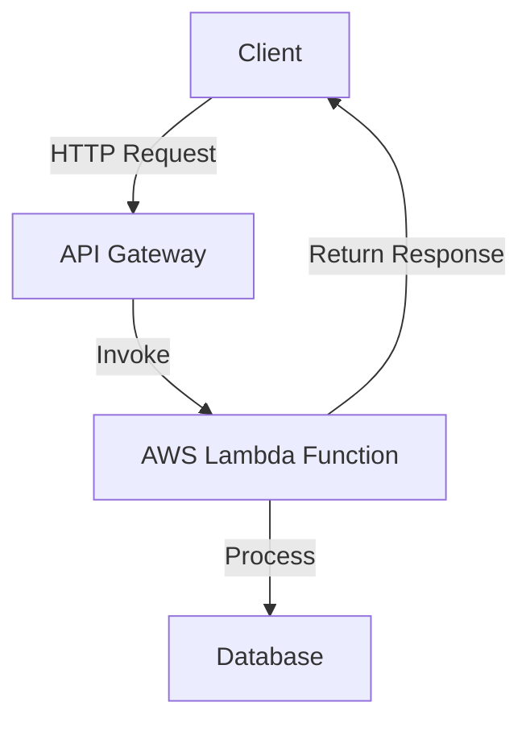

## 15.12 Serverless Microservices

The advent of serverless architecture has transformed the landscape of software development, offering a paradigm shift in how applications are built and deployed. In this section, we delve into the concept of serverless microservices, particularly in the context of PHP development. We will explore the architecture, benefits, and practical implementation strategies, providing you with the knowledge to leverage serverless microservices in your PHP projects.

### Understanding Serverless Architecture

**Serverless Architecture** is a cloud computing execution model where the cloud provider dynamically manages the allocation and provisioning of servers. In this model, developers can focus on writing code without worrying about the underlying infrastructure. This approach is particularly beneficial for microservices, where applications are composed of small, independent services that communicate with each other.

#### Key Characteristics of Serverless Architecture

- **No Server Management:** Developers do not need to manage or provision servers. The cloud provider handles all infrastructure concerns.
- **Event-Driven Execution:** Functions are triggered by events, such as HTTP requests, database changes, or message queue updates.
- **Scalability:** Serverless applications automatically scale with the demand, ensuring optimal performance without manual intervention.
- **Cost Efficiency:** You only pay for the compute time you consume, which can lead to significant cost savings.

### Function as a Service (FaaS)

**Function as a Service (FaaS)** is a key component of serverless architecture. It allows developers to deploy individual functions that are executed in response to specific events. Popular FaaS platforms include AWS Lambda, Google Cloud Functions, and Azure Functions.

#### AWS Lambda

AWS Lambda is a leading FaaS platform that enables developers to run code without provisioning or managing servers. It supports multiple programming languages, including PHP, through custom runtimes.

- **Link:** [AWS Lambda](https://aws.amazon.com/lambda/)

### Benefits of Serverless Microservices

Implementing serverless microservices in PHP offers several advantages:

- **Reduced Operational Overhead:** Developers can focus on writing code rather than managing infrastructure.
- **Automatic Scaling:** Serverless platforms automatically scale applications based on demand, ensuring high availability and performance.
- **Cost Efficiency:** Pay-as-you-go pricing models reduce costs by charging only for the compute time used.
- **Faster Time to Market:** Simplified deployment processes enable quicker iteration and release cycles.

### Implementing Serverless Microservices in PHP

To implement serverless microservices in PHP, follow these steps:

1. **Design Your Microservices:**
   - Break down your application into small, independent services.
   - Define clear interfaces and communication protocols between services.

2. **Choose a Serverless Platform:**
   - Select a FaaS provider that supports PHP, such as AWS Lambda with a custom runtime.

3. **Develop Your Functions:**
   - Write PHP functions that perform specific tasks or respond to events.
   - Ensure each function is stateless and idempotent.

4. **Deploy Your Functions:**
   - Use the serverless platform's deployment tools to upload and configure your functions.
   - Set up triggers and event sources for each function.

5. **Monitor and Optimize:**
   - Utilize monitoring tools to track performance and usage.
   - Optimize functions for efficiency and cost-effectiveness.

### Code Example: PHP Function on AWS Lambda

Below is a simple example of a PHP function deployed on AWS Lambda using a custom runtime.

```php
<?php

// index.php

// Entry point for the Lambda function
function handler($event, $context) {
    // Extract data from the event
    $name = $event['name'] ?? 'World';

    // Return a greeting message
    return [
        'statusCode' => 200,
        'body' => json_encode(['message' => "Hello, $name!"])
    ];
}
```

#### Deployment Steps

1. **Create a Custom Runtime:**
   - Package your PHP runtime and dependencies using AWS Lambda Layers.

2. **Deploy the Function:**
   - Use the AWS CLI or AWS Management Console to create a Lambda function with the custom runtime.

3. **Configure Triggers:**
   - Set up API Gateway or other event sources to trigger the function.

### Visualizing Serverless Microservices Architecture

To better understand the architecture of serverless microservices, consider the following diagram:



**Diagram Description:** This diagram illustrates a typical serverless microservices architecture. The client sends an HTTP request to the API Gateway, which invokes an AWS Lambda function. The function processes the request, interacts with a database if necessary, and returns a response to the client.

### Design Considerations for Serverless Microservices

When designing serverless microservices, consider the following:

- **Statelessness:** Ensure that each function is stateless to facilitate scaling and reliability.
- **Idempotency:** Functions should be idempotent to handle retries gracefully.
- **Cold Start Latency:** Be aware of potential latency during cold starts and optimize accordingly.
- **Security:** Implement robust security measures, such as authentication and authorization, to protect your services.

### PHP Unique Features in Serverless Microservices

PHP offers several unique features that can be leveraged in serverless microservices:

- **Simplicity and Ease of Use:** PHP's straightforward syntax and extensive library support make it easy to develop serverless functions.
- **Community Support:** The PHP community provides numerous resources and tools for serverless development.
- **Integration with Web Technologies:** PHP's strong integration with web technologies makes it ideal for building serverless APIs and web services.

### Differences and Similarities with Traditional Microservices

While serverless microservices share many similarities with traditional microservices, there are key differences:

- **Infrastructure Management:** Serverless microservices eliminate the need for server management, while traditional microservices require infrastructure provisioning.
- **Scalability:** Serverless platforms automatically scale functions, whereas traditional microservices may require manual scaling.
- **Cost Model:** Serverless microservices use a pay-as-you-go model, while traditional microservices may incur fixed infrastructure costs.

### Try It Yourself: Experiment with Serverless Microservices

To deepen your understanding of serverless microservices, try the following exercises:

1. **Modify the Code Example:**
   - Add additional functionality to the PHP function, such as interacting with a database or external API.

2. **Deploy a New Function:**
   - Create and deploy a new serverless function using a different event source, such as a message queue or file upload.

3. **Optimize for Performance:**
   - Experiment with different optimization techniques to reduce cold start latency and improve execution speed.

### Knowledge Check

- **What are the key benefits of serverless microservices?**
- **How does FaaS differ from traditional server hosting?**
- **What are some design considerations for serverless microservices?**

### Embrace the Journey

Remember, this is just the beginning. As you explore serverless microservices, you'll discover new ways to build scalable, efficient applications. Keep experimenting, stay curious, and enjoy the journey!

## Quiz: Serverless Microservices



### What is a key characteristic of serverless architecture?

- [x] No server management required
- [ ] Manual scaling
- [ ] Fixed infrastructure costs
- [ ] Stateful functions

> **Explanation:** Serverless architecture eliminates the need for server management, allowing developers to focus on writing code.

### Which of the following is a popular FaaS platform?

- [x] AWS Lambda
- [ ] Apache Tomcat
- [ ] Microsoft IIS
- [ ] Nginx

> **Explanation:** AWS Lambda is a widely used Function as a Service (FaaS) platform that supports serverless applications.

### What is a benefit of serverless microservices?

- [x] Reduced operational overhead
- [ ] Increased server management
- [ ] Fixed pricing model
- [ ] Manual scaling

> **Explanation:** Serverless microservices reduce operational overhead by eliminating the need for server management.

### What is an important design consideration for serverless functions?

- [x] Statelessness
- [ ] Stateful execution
- [ ] Manual scaling
- [ ] Fixed infrastructure

> **Explanation:** Serverless functions should be stateless to facilitate scaling and reliability.

### How does serverless architecture handle scaling?

- [x] Automatic scaling
- [ ] Manual scaling
- [ ] Fixed scaling
- [ ] No scaling

> **Explanation:** Serverless architecture automatically scales applications based on demand.

### What is a potential drawback of serverless functions?

- [x] Cold start latency
- [ ] High fixed costs
- [ ] Manual scaling
- [ ] Complex server management

> **Explanation:** Cold start latency can be a drawback of serverless functions, as there may be a delay when a function is invoked for the first time.

### What is a unique feature of PHP in serverless microservices?

- [x] Simplicity and ease of use
- [ ] Complex syntax
- [ ] Lack of community support
- [ ] Limited web integration

> **Explanation:** PHP's simplicity and ease of use make it an ideal choice for developing serverless microservices.

### What is the cost model for serverless microservices?

- [x] Pay-as-you-go
- [ ] Fixed monthly fee
- [ ] Annual subscription
- [ ] Free

> **Explanation:** Serverless microservices use a pay-as-you-go model, charging only for the compute time used.

### What is a common use case for serverless microservices?

- [x] Event-driven applications
- [ ] Monolithic applications
- [ ] Desktop applications
- [ ] Batch processing

> **Explanation:** Serverless microservices are well-suited for event-driven applications, where functions are triggered by specific events.

### True or False: Serverless microservices require manual server provisioning.

- [ ] True
- [x] False

> **Explanation:** False. Serverless microservices do not require manual server provisioning, as the cloud provider manages the infrastructure.


