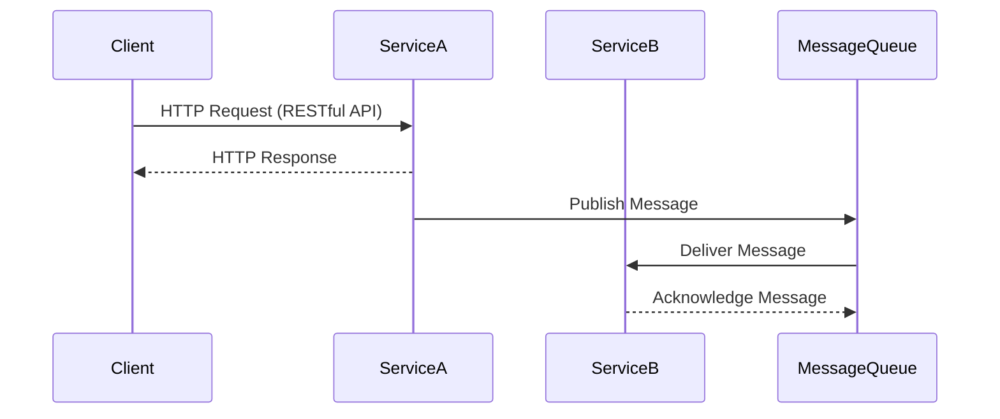

## 15.2 Microservices Communication Patterns

In the world of microservices, communication patterns play a crucial role in ensuring that services can interact efficiently and effectively. As PHP developers, understanding these patterns is essential for building scalable and robust applications. In this section, we will explore the various communication patterns used in microservices, focusing on both synchronous and asynchronous methods. We will also delve into the protocols and tools that facilitate these communications, such as RESTful APIs, gRPC, and RabbitMQ.

### Synchronous Communication

Synchronous communication involves a direct interaction between services, where a request is sent, and a response is expected immediately. This pattern is often used when real-time data exchange is necessary.

#### Request-Response Using RESTful APIs

RESTful APIs are a popular choice for synchronous communication in microservices. They use HTTP protocols to enable communication between services, making them easy to implement and widely supported.

**Key Features of RESTful APIs:**

- **Statelessness:** Each request from a client contains all the information needed to process the request, ensuring that the server does not store any client context.
- **Resource-Based:** RESTful APIs are centered around resources, which are identified by URIs.
- **HTTP Methods:** Use standard HTTP methods like GET, POST, PUT, DELETE to perform operations on resources.

**Example of a RESTful API in PHP:**

```php
<?php
// Sample RESTful API endpoint using PHP
header("Content-Type: application/json");

$requestMethod = $_SERVER["REQUEST_METHOD"];
switch ($requestMethod) {
    case 'GET':
        // Handle GET request
        echo json_encode(["message" => "GET request received"]);
        break;
    case 'POST':
        // Handle POST request
        $input = json_decode(file_get_contents('php://input'), true);
        echo json_encode(["message" => "POST request received", "data" => $input]);
        break;
    default:
        // Handle unsupported request methods
        http_response_code(405);
        echo json_encode(["message" => "Method not allowed"]);
        break;
}
?>
```

**Try It Yourself:**

- Modify the code to handle PUT and DELETE requests.
- Implement authentication to secure the API.

**Advantages of RESTful APIs:**

- **Simplicity:** Easy to understand and implement.
- **Scalability:** Can handle a large number of requests.
- **Interoperability:** Compatible with various platforms and languages.

**Considerations:**

- RESTful APIs can become complex when dealing with large-scale systems.
- Network latency can affect performance.

### Asynchronous Communication

Asynchronous communication allows services to interact without waiting for an immediate response, making it suitable for scenarios where real-time data exchange is not critical.

#### Messaging Systems and Event Buses

Messaging systems and event buses enable asynchronous communication by allowing services to publish and subscribe to messages or events.

**Key Concepts:**

- **Publisher-Subscriber Model:** Services publish messages to a channel, and subscribers receive messages from that channel.
- **Decoupling:** Services are decoupled, meaning they do not need to know about each other's existence.

**Example Using RabbitMQ:**

RabbitMQ is a widely-used messaging broker that supports various messaging protocols.

```php
<?php
require_once __DIR__ . '/vendor/autoload.php';

use PhpAmqpLib\Connection\AMQPStreamConnection;
use PhpAmqpLib\Message\AMQPMessage;

// Establish connection to RabbitMQ
$connection = new AMQPStreamConnection('localhost', 5672, 'guest', 'guest');
$channel = $connection->channel();

// Declare a queue
$channel->queue_declare('task_queue', false, true, false, false);

// Create a message
$data = json_encode(['task' => 'process_data']);
$msg = new AMQPMessage($data, ['delivery_mode' => AMQPMessage::DELIVERY_MODE_PERSISTENT]);

// Publish the message to the queue
$channel->basic_publish($msg, '', 'task_queue');

echo " [x] Sent 'process_data' task\n";

// Close the channel and connection
$channel->close();
$connection->close();
?>
```

**Try It Yourself:**

- Create a consumer script to process messages from the queue.
- Experiment with different message delivery modes.

**Advantages of Messaging Systems:**

- **Scalability:** Can handle a large volume of messages.
- **Reliability:** Messages can be persisted and retried in case of failures.
- **Flexibility:** Supports various communication patterns like point-to-point and publish-subscribe.

**Considerations:**

- Requires additional infrastructure and management.
- Message delivery can be delayed.

### Protocols and Tools

Several protocols and tools facilitate communication in microservices. Let's explore some of the most popular ones.

#### gRPC: High-Performance RPC Framework

gRPC is a modern, high-performance RPC framework that uses HTTP/2 for transport, Protocol Buffers for serialization, and provides features like authentication, load balancing, and more.

**Key Features of gRPC:**

- **Language Agnostic:** Supports multiple programming languages.
- **Efficient:** Uses Protocol Buffers for compact and fast serialization.
- **Bi-Directional Streaming:** Supports streaming requests and responses.

**Example of gRPC in PHP:**

To use gRPC in PHP, you need to install the gRPC PHP extension and the Protocol Buffers compiler.

```proto
// Define a service in a .proto file
syntax = "proto3";

service Greeter {
  rpc SayHello (HelloRequest) returns (HelloReply) {}
}

message HelloRequest {
  string name = 1;
}

message HelloReply {
  string message = 1;
}
```

Generate PHP classes from the .proto file and implement the service:

```php
<?php
require 'vendor/autoload.php';

use Grpc\GreeterClient;
use HelloRequest;

// Create a client
$client = new GreeterClient('localhost:50051', [
    'credentials' => Grpc\ChannelCredentials::createInsecure(),
]);

// Create a request
$request = new HelloRequest();
$request->setName('World');

// Call the service
list($reply, $status) = $client->SayHello($request)->wait();

echo $reply->getMessage();
?>
```

**Try It Yourself:**

- Implement a server to handle the `SayHello` request.
- Experiment with bi-directional streaming.

**Advantages of gRPC:**

- **Performance:** Efficient serialization and transport.
- **Streaming:** Supports real-time data exchange.
- **Interoperability:** Works across different languages and platforms.

**Considerations:**

- Requires additional setup and tooling.
- Not as widely adopted as RESTful APIs.

### Visualizing Microservices Communication

To better understand how these communication patterns work, let's visualize them using Mermaid.js diagrams.



**Diagram Explanation:**

- The client sends an HTTP request to Service A using a RESTful API.
- Service A processes the request and responds to the client.
- Service A publishes a message to a message queue.
- The message queue delivers the message to Service B.
- Service B acknowledges the message receipt.

### Knowledge Check

- Explain the difference between synchronous and asynchronous communication.
- Describe how RESTful APIs facilitate synchronous communication.
- Discuss the advantages of using messaging systems for asynchronous communication.
- Identify the key features of gRPC and its use cases.

### Embrace the Journey

Remember, mastering microservices communication patterns is a journey. As you explore these patterns, you'll gain insights into building scalable and resilient systems. Keep experimenting, stay curious, and enjoy the process of learning and growing as a PHP developer.

### References and Links

- [gRPC](https://grpc.io/)
- [RabbitMQ Messaging](https://www.rabbitmq.com/)
- [RESTful API Design](https://restfulapi.net/)

## Quiz: Microservices Communication Patterns



### What is a key feature of RESTful APIs?

- [x] Statelessness
- [ ] Stateful communication
- [ ] Asynchronous messaging
- [ ] Bi-directional streaming

> **Explanation:** RESTful APIs are stateless, meaning each request contains all the information needed to process it.

### Which protocol does gRPC use for transport?

- [x] HTTP/2
- [ ] HTTP/1.1
- [ ] WebSocket
- [ ] FTP

> **Explanation:** gRPC uses HTTP/2 for transport, which allows for efficient communication.

### What is the main advantage of asynchronous communication?

- [x] Services do not wait for an immediate response
- [ ] Real-time data exchange
- [ ] Simplicity
- [ ] Statelessness

> **Explanation:** Asynchronous communication allows services to interact without waiting for an immediate response.

### Which tool is commonly used for messaging in microservices?

- [x] RabbitMQ
- [ ] MySQL
- [ ] Apache Kafka
- [ ] Redis

> **Explanation:** RabbitMQ is a popular messaging broker used in microservices for asynchronous communication.

### What serialization format does gRPC use?

- [x] Protocol Buffers
- [ ] JSON
- [ ] XML
- [ ] YAML

> **Explanation:** gRPC uses Protocol Buffers for efficient serialization.

### What is a benefit of using messaging systems?

- [x] Decoupling of services
- [ ] Immediate response
- [ ] Stateful communication
- [ ] Complex setup

> **Explanation:** Messaging systems decouple services, allowing them to communicate without knowing each other's existence.

### Which HTTP method is used to retrieve data in RESTful APIs?

- [x] GET
- [ ] POST
- [ ] PUT
- [ ] DELETE

> **Explanation:** The GET method is used to retrieve data in RESTful APIs.

### What is a disadvantage of RESTful APIs?

- [x] Network latency can affect performance
- [ ] Requires additional infrastructure
- [ ] Complex setup
- [ ] Limited language support

> **Explanation:** Network latency can impact the performance of RESTful APIs.

### Which communication pattern is suitable for real-time data exchange?

- [x] Synchronous communication
- [ ] Asynchronous communication
- [ ] Stateless communication
- [ ] Stateful communication

> **Explanation:** Synchronous communication is suitable for real-time data exchange.

### True or False: gRPC supports bi-directional streaming.

- [x] True
- [ ] False

> **Explanation:** gRPC supports bi-directional streaming, allowing for real-time data exchange.


